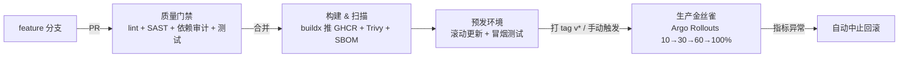

# Python 服务上 Kubernetes:一套带金丝雀自动回滚的 CI/CD 流水线实战

> 从代码提交到生产发布,全程无人值守;出故障时,系统会在几分钟内自己把流量切回上一个稳定版本。

如果你的团队还在"人肉上线、祈祷回滚",这篇文章给你一套可以直接落地的方案:**GitHub Actions + Kubernetes + Python**,生产环境用 **金丝雀发布 + Prometheus 指标自动回滚**。文末附完整文件清单和踩坑清单。

---

## 一、为什么需要一套正经的流水线

先对齐三个原则,后面所有设计都围绕它们:

1. **质量门禁前置** —— 坏代码在 PR 阶段就被拦下,根本走不到构建;
2. **制品可追溯** —— 每一行进生产的代码都有不可变镜像(`sha-<commit>`)+ SBOM 物料清单;
3. **发布可反悔** —— 发布不是"全量赌一把",而是"渐进放量,指标不达标自动回滚"。

一句话:**部署像呼吸一样自然,零停机、全自动、可信赖**。

---

## 二、技术选型

| 环节 | 选型 | 为什么 |
|---|---|---|
| CI 平台 | GitHub Actions | 仓库在哪用哪;与 GitHub 原生集成,PR 门禁、Environment 审批开箱即用,marketplace 生态全 |
| 目标环境 | Kubernetes | 弹性伸缩、滚动/金丝雀等发布策略是平台能力,不需要自己造轮子 |
| 应用语言 | Python | FastAPI/Flask 等;文中按 ASGI + gunicorn 示例 |
| 部署策略 | 金丝雀(Canary) | 渐进切流 + 指标自动回滚,爆炸半径最小(对比见第五节) |
| 发布工具 | Argo Rollouts | K8s 金丝雀的事实标准,自带 AnalysisTemplate 自动分析回滚 |
| 镜像仓库 | GHCR | 与 Actions 同生态,免额外配置 |
| 扫描 | Bandit / pip-audit / Trivy | 分别管 SAST、依赖 CVE、镜像漏洞,三层安全网 |

---

## 三、总体架构



四个阶段,一次合并到生产最快只需几分钟,其中最后一步还带人工审批闸。

---

## 四、四阶段流水线拆解

### 阶段一:质量门禁 —— PR 的守门员

流水线里第一个 job,PR 和 push 都会跑。代码检查 + 三层安全扫描 + 测试一起上:

```bash
# 代码风格与静态检查
ruff check .

# SAST:只报 HIGH/CRITICAL 级别,命中即构建失败
bandit -r app -ll -ii

# 依赖漏洞审计:存在高危 CVE 直接阻断
pip-audit -r requirements.txt --fail-on high

# 测试与覆盖率
pytest --cov=app --cov-report=xml
```

配合 **main 分支保护规则**里的 *Required status checks*,把 `lint-test` 设为必过项——门禁失败,合并按钮就是灰的。这是整条链路上性价比最高的一道闸。

### 阶段二:构建 + 镜像扫描 —— 产物必须是"一次构建,处处可信"

采用**多阶段构建**:builder 阶段装依赖,最终镜像只保留运行所需,并且用非 root 用户运行——镜像体积小一半,被攻破后的提权面也小一半。

```dockerfile
FROM python:3.12-slim AS base
ENV PYTHONUNBUFFERED=1 PYTHONDONTWRITEBYTECODE=1 PIP_NO_CACHE_DIR=1
WORKDIR /app

# builder 阶段:装依赖、导出锁文件
FROM base AS builder
COPY pyproject.toml poetry.lock ./
RUN poetry export -f requirements.txt --without-hashes -o requirements.txt
COPY . .
RUN pip install --no-cache-dir --user -r requirements.txt

# runtime 阶段:瘦身 + 非 root
FROM base AS runtime
RUN groupadd -r app && useradd -r -g app app
COPY --from=builder /root/.local /root/.local
COPY --from=builder /app /app
USER app
EXPOSE 8000
HEALTHCHECK --interval=10s --timeout=3s --start-period=20s --retries=3 \
  CMD python -c "import urllib.request; urllib.request.urlopen('http://localhost:8000/health')" || exit 1

CMD ["gunicorn", "app.main:app", "-k", "uvicorn.workers.UvicornWorker", "-b", "0.0.0.0:8000"]
```

关键点:

- **镜像 tag 用 `sha-<commit>`**,不可变、可追溯。永远不要在 CI 里给生产打 `latest`;
- 开启 buildx 的 **GHA 缓存**,同一仓库二次构建分钟级变秒级;
- `provenance: true` + `sbom: true`,让镜像自带"出身证明"和物料清单,供应链攻击的排查就靠它;
- **Trivy 扫描镜像**,SARIF 结果直接上传到 GitHub code scanning 面板,CRITICAL/HIGH 漏洞一票否决。

### 阶段三:预发环境 —— 自动部署 + 冒烟

main 合并后自动部署到 `staging` 命名空间,滚动更新,然后打一发冒烟测试:

```bash
kubectl -n app-staging set image deployment/app app=ghcr.io/<org>/<repo>:sha-${{ github.sha }}
kubectl -n app-staging rollout status deployment/app --timeout=180s
curl -sf https://staging.example.com/health || exit 1   # 冒烟失败 = 流水线失败
```

### 阶段四:生产金丝雀 —— 本文主角

生产不直接全量。发布动作交给 **Argo Rollouts**,它是 K8s 的 Rollout 资源,天然支持**按权重逐步切流 + 每步跑指标分析**:

```yaml
apiVersion: argoproj.io/v1alpha1
kind: Rollout
metadata:
  name: app
  namespace: app-prod
spec:
  replicas: 6
  selector:
    matchLabels:
      app: app
  template:
    spec:
      containers:
        - name: app
          image: ghcr.io/ORG/REPO:placeholder   # CI 里用 set image 覆盖
          ports: [{ containerPort: 8000 }]
          readinessProbe:
            httpGet: { path: /health, port: 8000 }
            initialDelaySeconds: 5
            periodSeconds: 5
          resources:
            requests: { cpu: 100m, memory: 128Mi }
            limits:   { cpu: 500m,  memory: 256Mi }
  strategy:
    canary:
      canaryService: app-canary
      stableService: app
      analysis:
        templates:
          - templateName: success-rate
        startingStep: 1        # 每步放量前都先验证指标
      steps:
        - setWeight: 10
        - pause: { duration: 2m }   # 10% 流量观察 2 分钟
        - setWeight: 30
        - pause: { duration: 5m }
        - setWeight: 60
        - pause: { duration: 5m }
        - setWeight: 100
```

放量节奏:**10% → 30% → 60% → 100%**,每档停留几分钟观察。真正让这套体系"自动"的,是下面的分析模板:

```yaml
apiVersion: argoproj.io/v1alpha1
kind: AnalysisTemplate
metadata:
  name: success-rate
  namespace: app-prod
spec:
  metrics:
    - name: error-rate
      interval: 1m
      successCondition: result < 0.01        # 错误率 ≥1% 即判定失败
      provider:
        prometheus:
          address: http://prometheus.monitoring:9090
          query: |
            1 - sum(rate(http_requests_total{status!~"5..",app="app"}[1m]))
              / sum(rate(http_requests_total{app="app"}[1m]))
```

Argo Rollouts 每分钟拉一次 Prometheus 算错误率,一旦超标:**立即中止发布,流量自动全部切回 stable 版本**——不需要任何人在凌晨三点爬起来点按钮。

---

## 五、部署策略对比:为什么不是蓝绿/滚动

| 策略 | 优点 | 缺点 | 结论 |
|---|---|---|---|
| 滚动更新 | 零额外组件 | 无流量控制,故障波及全量 | 只配当 MVP 兜底 |
| 蓝绿 | 回切秒级 | 需要 2 倍副本,算力成本翻倍 | 预算充足且追求极速回切时可选 |
| **金丝雀** ✅ | 渐进放量,故障影响面 10% 起步;指标自动回滚;无需双倍算力 | 需要 Argo Rollouts + 指标体系 | **中小团队性价比最优** |

金丝雀的本质是:**用 10% 的流量买一次全量事故的保险**,而保费只是一套 AnalysisTemplate。

---

## 六、监控:自动化的眼睛

自动回滚的前提是**有可信的指标**。你的应用需要暴露:

- `http_requests_total{status, app}` —— 算错误率(金丝雀分析的数据源);
- `http_request_duration_seconds_bucket` —— 算 P99 延迟。

Python 侧用 `prometheus_client` 或框架中间件即可暴露 `/metrics`,K8s 里用 ServiceMonitor 让 Prometheus 自动抓取。配套告警规则(示例见文末文件):

- **HighErrorRate**:5xx 占比 >5% 持续 2 分钟 → critical;
- **HighLatencyP99**:P99 >500ms 持续 5 分钟 → warning;
- **RolloutStuck**:金丝雀副本长时间未就绪 → 提醒人工介入。

Alertmanager 再接 Slack/飞书/自定义 Webhook——**发布异常的第一通知人不是值班工程师,而是告警系统自己**。

---

## 七、落地清单 & 踩坑提醒

照着做,能少踩一半坑:

- [ ] **Secrets**:`KUBE_CONFIG_STAGING`、`KUBE_CONFIG_PROD`(kubeconfig,最小权限、按命名空间隔离);
- [ ] **GitHub Environment**:staging / production 各建一个;production 勾选 *required reviewers* —— 这就是"人工审批闸";
- [ ] **分支保护**:main 上勾选 *Require status checks*,把门禁 job 设为必过;
- [ ] **集群侧**:装 Argo Rollouts controller、Prometheus + ServiceMonitor;
- [ ] **探针**:readinessProbe 必须有(金丝雀切流依赖它就绪状态),liveness 按需;
- [ ] **资源配额**:requests/limits 必须写,否则节点资源被某个 Pod 吃穿,告警会先于你发现问题;
- [ ] **别用 `latest` 打生产**——不可变 tag 是回滚的命根子;
- [ ] **发布窗口内盯一眼 Rollouts Dashboard**(`kubectl argo-rollouts dashboard`),第一二次发布尤其值得看。

---

## 八、还能继续进化

- **数据库迁移 job**:部署前先跑 Alembic migrate,迁移失败就不部署,杜绝"代码先跑、表结构没跟上";
- **Argo CD 接管 GitOps**:把 kubectl 手工下发换成"Git 是唯一事实来源",回滚 = revert commit;
- **cosign 镜像签名**:CI 里用 GitHub OIDC 签名,集群准入控制器校验签名,供应链安全闭环;
- **e2e 测试**:预发环境跑一轮 Playwright / API 契约测试再放生产。

---

## 结语

这套流水线的核心哲学就一句话:**把"发布会不会出事"的赌博,变成"出事也能最小代价自动收场"的工程**。

质量门禁保证坏代码进不来,不可变制品保证出问题查得到,金丝雀 + 自动回滚保证真出问题也影响不了几个人——剩下的时间,交给业务。

> 完整可用的文件(workflow / Dockerfile / rollout.yaml / 告警规则)已随文整理,按第七节清单填好密钥即可跑通。

---

*如果你正在做类似的流水线,欢迎交流选型细节;也欢迎分享你的踩坑经历。*
