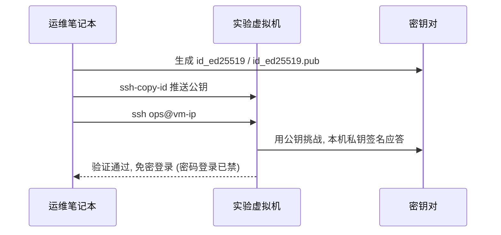

# 第 1 章 进入 Linux 世界与环境构建

> **定位**：从「完全陌生」到「拥有一台安全、可恢复、可复现的 Linux 实验机」。
> 这是后面 8 章所有实验的地基——你今天搭好的这台机器，会在第 2 章被文本处理工具练手、第 4 章被 LVM 扩容、第 5 章被脚本批量巡检、第 7 章被 K8s 接管。
>
> | 项 | 值 |
> |---|---|
> | 章 | 第 1 章 |
> | 周次 | 第 1 周 |
> | 建议学时 | 8～10 小时（讲解 3h / 实验 4h / 复盘 3h） |
> | 核心作品 | 一台带快照、非 root 运维账户、SSH 密钥登录、时间同步、基础防火墙的实验机 |
> | 完成标准 | 你能从零重建这台机器，且能在 5 分钟内把它恢复到已知好状态 |
>
> **学习目标**
> 1. 说清楚 Linux 在整套技术栈里处在哪一层、解决什么问题；
> 2. 在隔离环境里用 Multipass 或 Rocky Linux 9 创建一台实验机；
> 3. 配置非 root 的 sudo 账户 + SSH 密钥登录，关闭密码登录；
> 4. 建立「改之前先留退路」的运维反射——快照、验证、回滚、备份。

> [!WARNING]
> 本章所有写盘、改 SSH、动防火墙的命令，只在你**自己可控的实验虚拟机**里执行。涉及 `/etc/ssh/sshd_config`、`firewalld`/`ufw`、`rm -rf` 的操作，执行前在脑中回答三件事：**改了哪层状态？怎么证明生效？怎么还原？** 生产环境应先备份、评审并准备回滚方案。

---

## 1. 原理讲解（Principles）

### 1.1 Linux 并不神秘

Linux 不是一个「神秘黑箱」，而是一组**分层协作的软件**。理解分层，你就不会再死记命令，而是知道「这条命令在动哪一层」。

- **硬件（Hardware）**：CPU、内存、磁盘、网卡。
- **内核（Kernel）**：真正和硬件对话的薄层，管 CPU 调度、内存、磁盘 I/O、网络栈。你平时几乎不直接写内核，但你跑的每个进程都在它上面。
- **系统调用（Syscall）**：应用请求内核干活的统一接口（`open`/`read`/`fork`…）。
- **Shell / 服务**：你和内核之间的「操作台」。Shell 给你命令行，systemd 帮你把服务管起来。
- **发行版（Distro）**：把内核 + 工具链 + 包管理器 + 默认值打包好的「成品」。Ubuntu、Rocky、Debian 内核几乎一样，**差别在包管理器、默认配置和生命周期**。

### 1.2 为什么是「实验机 + 快照」而不是「直接上手」

Ops 的核心能力不是「记住最多命令」，而是**在压力下仍能：界定影响 → 用证据判断 → 缩小变更 → 随时回滚 → 恢复后留下更可靠的系统**。

一个可随时重置的快照，让你敢做破坏性实验——这是后面故障演练（第 4 章起）能成立的前提。

### 1.3 包管理器：发行版最大的差异点

| 发行版 | 包管理器 | 服务管理 | 典型场景 |
|---|---|---|---|
| Rocky / RHEL / CentOS | `dnf`/`yum` | `systemd` (firewalld) | 企业服务器、本课程主线 |
| Ubuntu / Debian | `apt` | `systemd` (ufw) | 云、桌面、快速实验 |
| Alpine | `apk` | `openrc` | 容器镜像（极小） |

> 心智模型：包管理器是「软件的安装/升级/卸载接口」。**先分清你用的是哪个，再决定用 `dnf` 还是 `apt`**——这是新手第一个常见坑。

### 1.4 发行版选型建议（本课程）

- **主线**：Rocky Linux 9（RHEL 的免费 1:1 克隆，企业里最常见，文档与 RHEL 通用）。
- **快速实验**：Ubuntu 22.04 LTS + Multipass（10 分钟出机，适合对照学习）。
- **容器场景**：Alpine（后面第 7 章构建安全镜像时会用到）。

### 1.5 本章在全局中的位置

```text
应用软件 / 容器 / K8s
        ↑
   systemd 服务、网络、存储（LVM）   ← 第 3、4 章
        ↑
   你这台实验机（本章产出）          ← 第 1、2 章：地基
        ↑
       Linux 内核
        ↑
      物理机 / 虚拟机 / 云主机
```

---

## 2. 架构（Architecture）

### 2.1 实验机的逻辑架构

```text
┌─────────────────────────────────────────────────────────┐
│  宿主机（你的 Windows / macOS 笔记本）                    │
│                                                           │
│   ┌─────────────────────────────────────────────────┐   │
│   │  实验虚拟机（Rocky 9 / Ubuntu 22.04 LTS）         │   │
│   │                                                   │   │
│   │  ┌──────────┐   ┌──────────────────────────────┐ │   │
│   │  │ 运维账户  │   │ sshd (22/tcp)                │ │   │
│   │  │ ops  sudo │──▶│  仅允许密钥, 禁止密码         │ │   │
│   │  └──────────┘   └──────────────┬───────────────┘ │   │
│   │                                 │ 仅匹配 ~/.ssh/    │   │
│   │  ┌──────────┐            ┌──────▼──────┐          │   │
│   │  │ 你的公钥  │            │  authorized_ │          │   │
│   │  │ (本机)    │            │  keys 文件    │          │   │
│   │  └──────────┘            └─────────────┘          │   │
│   │                                                   │   │
│   │  firewalld/ufw：默认拒绝入站, 仅放行 22            │   │
│   │  chrony/systemd-timesyncd：时间同步               │   │
│   │  snapshot：可恢复到「已知好」状态                  │   │
│   └─────────────────────────────────────────────────┘   │
└─────────────────────────────────────────────────────────┘
```

### 2.2 登录与控制流（mermaid）



> 参考：[Linux Journey — 可视化的核心概念教程](https://linuxjourney.com/) ｜ [Red Hat RHEL9 架构文档](https://access.redhat.com/documentation/en-us/red_hat_enterprise_linux/9)

---

## 3. 部署（Deployment）—— 实验环境

三种路线，**任选其一作为主线**（路线 A 最快，路线 B 最贴近生产，路线 C 适合已有云账号）。

### 路线 A：Multipass 快速出机（Ubuntu 22.04 LTS）

适合：想立刻上手、本地快速试错、做对照实验。

```powershell
# 宿主机上（Windows PowerShell / macOS / Linux 均可）
# 1) 安装 Multipass（已装可跳过）：https://multipass.run/
# 2) 起一台 2C/4G 的实验机
multipass launch 22.04 --name linux-ops-01 --cpus 2 --memory 4G --disk 20G

# 3) 进入机器
multipass shell linux-ops-01

# 4) 查看分配到的 IP（后面 SSH 要用）
multipass info linux-ops-01
```

### 路线 B：Rocky Linux 9 最小化安装（推荐主线）

适合：想和课程主线（Rocky 9）完全一致、贴近企业环境。

```text
安装介质 : Rocky-9.x-x86_64-minimal.iso
虚拟化   : VirtualBox / VMware / 云厂商均可
分区     : 自动分区即可（第 4 章会教 LVM 手动扩）
网络     : 安装时开启网卡, 设静态或 DHCP 均可
软件选择 : "Minimal Install"（最小安装, 后面按需装）
用户     : 先设 root 密码, 同时创建一个普通用户并勾选 "Make this user administrator"
```

### 路线 C：云厂商快速起机（可选）

适合：已有 AWS / 阿里云 / 腾讯云账号，想体验真实云环境（注意费用，用完及时释放）。

```bash
# 以通用 CLI 思路为例（具体命令依云厂商而定）：
# 1) 创建一台 2C4G 的 Rocky 9 / Ubuntu 22.04 实例，开放 22 端口的安全组
# 2) 用云提供的密钥对或密码首次登录
# 3) 后续步骤与路线 A/B 完全一致（配置 ops 账户、密钥登录等）
# ⚠ 云上务必配置安全组最小开放 + 实例关机/释放策略，避免忘记产生费用
```

### 3.1 实验机资源规划（建议）

| 用途 | CPU | 内存 | 磁盘 | 数量 |
|---|---|---|---|---|
| 第 1～4 章（单机实验） | 2 | 4 GiB | 20 GiB | 1 |
| 第 5 章（多机巡检） | 2 | 4 GiB | 20 GiB | 2～3 |
| 第 7～9 章（K8s 高可用） | 2～4 | 8～16 GiB | 40 GiB | 3+ |

### 3.2 验证机已就绪（快速 sanity check）

```bash
# 以下命令在实验机内执行
cat /etc/os-release | head -n 3   # 确认发行版与版本
uname -r                           # 确认内核版本
nproc && free -h                  # 确认 CPU 核数与内存
```

> 参考：[Multipass 官方文档](https://documentation.ubuntu.com/multipass/latest/) ｜ [Rocky Linux 文档](https://docs.rockylinux.org/)

---

## 4. 配置（Configuration）

### 4.1 创建非 root 运维账户并授权 sudo

永远别长期用 root 干活。建一个 `ops` 账户，平时用它，需要时 `sudo`。

```bash
# 在实验机内, 以 root 或安装时建的 admin 用户执行
useradd -m -s /bin/bash ops          # 创建家目录 + bash
passwd ops                           # 设一个强密码（后面会禁密码登录, 仅作兜底）
usermod -aG wheel ops                # 加入 wheel 组 (Rocky/CentOS 的 sudo 组)
# Ubuntu 上组名是 sudo:  usermod -aG sudo ops

# 验证 ops 能否提权（另开一个终端 ssh 进来试, 别把自己锁外面）
su - ops
sudo -l                             # 应列出 ops 可执行的命令
```

### 4.2 用 drop-in 文件做 sudo 最小授权（推荐，而非改 /etc/sudoers 主体）

```bash
# 直接改 /etc/sudoers 风险高（写错会全员失权）。用 /etc/sudoers.d/ 下放置独立文件：
echo "ops ALL=(ALL) NOPASSWD:ALL" | sudo tee /etc/sudoers.d/ops
sudo chmod 440 /etc/sudoers.d/ops      # 权限必须 0440, 否则 sudo 拒绝加载
sudo visudo -c                         # 校验语法, 通过才生效
# 更安全的最小授权示例（只允许特定命令, 去掉 NOPASSWD 更稳妥）：
# ops ALL=(ALL) /usr/bin/systemctl restart nginx, /usr/bin/journalctl
```

### 4.3 配置 SSH 密钥登录（禁用密码）

```bash
# --- 在【你的笔记本/宿主机】上生成密钥对（只需一次）---
ssh-keygen -t ed25519 -C "ops@linux-ops-01" -f ~/.ssh/id_ed25519
# 一路回车即可; 生成的 id_ed25519(私钥, 绝不外传) 和 id_ed25519.pub(公钥)

# --- 把公钥推送到实验机 ---
ssh-copy-id ops@<虚拟机IP>           # 输入一次 ops 密码即可

# --- 在【实验机】上收紧 sshd 配置（更细的加固）---
sudo sed -i 's/^#\?PasswordAuthentication yes/PasswordAuthentication no/' /etc/ssh/sshd_config
sudo sed -i 's/^#\?PermitRootLogin yes/PermitRootLogin no/' /etc/ssh/sshd_config
echo "PubkeyAuthentication yes" | sudo tee -a /etc/ssh/sshd_config
echo "AllowUsers ops"         | sudo tee -a /etc/ssh/sshd_config   # 仅允许指定用户
echo "MaxAuthTries 3"         | sudo tee -a /etc/ssh/sshd_config   # 限制试错次数
echo "LoginGraceTime 30"      | sudo tee -a /etc/ssh/sshd_config   # 登录宽限时间
sudo sshd -t && sudo systemctl restart sshd   # 先语法检查再重启, 防锁死
```

> [!CAUTION] 避坑：改 `sshd_config` **务必先 `sshd -t` 校验**，且**保持当前会话不断开**再做重启。一旦配置写错又断了连接，你就再也进不去了（除非有控制台/VNC 救场）。这正是第 7 章「故障」要演练的。

### 4.4 默认 umask 与 Shell 环境

```bash
# 让新建文件默认 022 权限（owner 可写, 组/其他只读），避免误赋过宽权限
echo "umask 022" | sudo tee -a /etc/profile.d/umask.sh
# 给 ops 一些实用别名（写入 ~/.bashrc）
cat >> ~/.bashrc <<'EOF'
alias ll='ls -lh --time-style=long-iso'
alias grep='grep --color=auto'
alias df='df -h'
EOF
source ~/.bashrc
```

### 4.5 时间同步（NTP）

日志、证书、TLS 全都依赖正确时间。时间歪了，故障会非常诡异。

```bash
# Rocky 9 用 chrony; Ubuntu 用 systemd-timesyncd
# --- Rocky / RHEL 系 ---
sudo dnf install -y chrony && sudo systemctl enable --now chronyd
chronyc tracking                    # 看同步状态, 关注 Leap status: Normal

# --- Ubuntu 系 ---
sudo timedatectl set-ntp on
timedatectl status                  # 确认 "System clock synchronized: yes"
```

### 4.6 基础防火墙（默认拒绝入站）

```bash
# --- Rocky / RHEL 系 (firewalld) ---
sudo dnf install -y firewalld && sudo systemctl enable --now firewalld
sudo firewall-cmd --permanent --add-service=ssh     # 放行 SSH
sudo firewall-cmd --reload
sudo firewall-cmd --list-all                        # 确认只有 ssh 放行

# --- Ubuntu 系 (ufw) ---
sudo ufw default deny incoming
sudo ufw allow ssh
sudo ufw enable
sudo ufw status
```

> 参考：[Linux Upskill Challenge（GitHub 24 课，社区口碑极佳）](https://github.com/livialima/linuxupskillchallenge) ｜ [ssh-keygen / sudoers 中文手册](https://github.com/jaywcjlove/linux-command)

---

## 5. 验证（Verification）

每次变更后，用**明确命令**证明结果正确——这是 Ops 的基本功。

```bash
# 1) 密钥登录是否生效（宿主机执行, 不应再要密码）
ssh ops@<虚拟机IP> 'echo "KEY-LOGIN-OK $(whoami)@$(hostname)"'

# 2) 密码登录是否真的被禁（用错误方式试探, 应被拒）
ssh -o PreferredAuthentications=password -o PubkeyAuthentication=no ops@<虚拟机IP>
# 预期: Permission denied (publickey)

# 3) 时间是否同步
timedatectl show -p NTPSynchronized --value   # 预期输出 yes

# 4) 防火墙仅放行 ssh
sudo firewall-cmd --list-services 2>/dev/null || sudo ufw status | grep -i ssh

# 5) sudo 是否可用
ssh ops@<虚拟机IP> 'sudo -n true && echo SUDO-OK || echo SUDO-FAIL'
# 预期: SUDO-OK (-n 表示不交互, 验证免密 sudo 是否配置好)

# 6) sudoers drop-in 是否被正确加载
sudo visudo -c                          # 预期: /etc/sudoers.d/ops: OK
```

**验收清单（本章交付物检查）**

- [ ] 能从宿主机用密钥免密 SSH 进 `ops` 账户
- [ ] 密码登录已被拒绝
- [ ] `ops` 能 `sudo`（最好免密或已知密码）
- [ ] 系统时间已同步（NTP）
- [ ] 防火墙默认拒绝入站，仅放行 SSH
- [ ] 已打一个「已知好」快照（见第 8 章）

---

## 6. 性能（Performance）—— 建立基线习惯

第 1 章不深挖性能调优，但要养成一个**贯穿全课程的习惯：先有基线，才有异常**。

```bash
# 装好用的实时观察器
sudo dnf install -y htop 2>/dev/null || sudo apt install -y htop
sudo dnf install -y iotop 2>/dev/null || sudo apt install -y iotop   # 磁盘 IO
sudo dnf install -y iptraf-ng 2>/dev/null || true                    # 网络吞吐(可选)

# 采集「干净状态」的基线（后面任何变更前后都对比它）
echo "==== 基线采集 $(date) ===="
nproc                                    # CPU 核数
free -h | awk '/Mem:/'                  # 内存总量
df -h / | tail -n1                      # 根分区用量
uptime                                  # 负载
iostat -x 1 3 2>/dev/null | tail -n +4  # 磁盘 IO（若已装）
# 把上面输出存进笔记/实验报告, 这就是你的"健康指纹"
```

> 心智模型：负载、内存、磁盘的「正常值」不是背出来的，是**你在干净环境量出来的**。第 5 章起写监控脚本时，阈值就来自这条基线。

---

## 7. 故障（Troubleshooting）—— 故障演练

> 目标：主动制造事故，再用控制台/证据链救回来。做过一次，真实出事你就不慌。

### 演练 7.1：故意锁死 SSH，再用控制台修复

```bash
# ⚠ 仅在已打快照的实验机上做！保持当前 shell 不断开。
# 步骤 1：制造故障——把 sshd 配置写坏
echo "This line is broken config" | sudo tee -a /etc/ssh/sshd_config
sudo systemctl restart sshd           # 大概率失败或行为异常

# 步骤 2：另开终端尝试新 SSH → 应被拒绝/卡住（证明故障存在）
# 步骤 3：用虚拟机控制台 (VirtualBox/VMware 窗口 或 Multipass shell) 登录修复
sudo sed -i '/This line is broken config/d' /etc/ssh/sshd_config
sudo sshd -t && sudo systemctl restart sshd

# 步骤 4：回到宿主机, 重新验证密钥登录成功（见第 5 章命令）
```

### 演练 7.2：防火墙误伤

```bash
# 制造故障：不小心把 ssh 服务从防火墙移除
sudo firewall-cmd --remove-service=ssh --permanent && sudo firewall-cmd --reload
# 现象：新 SSH 连接全部超时
# 修复：通过控制台重新加回
sudo firewall-cmd --add-service=ssh --permanent && sudo firewall-cmd --reload
```

### 演练 7.3：时间漂移导致 TLS/证书异常

```bash
# 制造故障：把系统时间改到未来（模拟 NTP 失效后的漂移）
sudo date -s "2030-01-01 00:00:00"
# 现象：SSH/HTTPS/证书相关操作报 "certificate has expired" 等诡异错误
# 修复：重新开启 NTP 并强制同步
sudo timedatectl set-ntp true
sudo chronyc -a makestep 2>/dev/null || sudo systemctl restart systemd-timesyncd
date                                    # 确认时间回到正确值
```

> [!NOTE] 避坑：这三个演练**必须用控制台/VNC 兜底**。如果你只有 SSH 一条路，又把它搞断了，就只能重装。所以「先打快照 + 保留一个控制台通道」是铁律。

---

## 8. 回滚（Rollback）

Ops 不怕改错，怕的是**改错了回不来**。本章给你两条回滚通道。

### 方式一：虚拟机快照（最快，推荐）

```powershell
# Multipass 没有原生快照, 用宿主机级方式兜底（VirtualBox 则用 VBoxManage snapshot）
# 路线 B (VirtualBox) 示例：
VBoxManage snapshot "linux-ops-01" take "baseline-good" --description "SSH密钥+防火墙+时间同步已就绪"
# 出事后一键回退：
VBoxManage snapshot "linux-ops-01" restore "baseline-good"
```

### 方式二：配置文件的「改前备份」

```bash
# 任何改 /etc 下关键文件前, 先 cp 一份带时间戳的备份
sudo cp -a /etc/ssh/sshd_config /etc/ssh/sshd_config.bak.$(date +%F_%H%M)
# 回滚：
sudo cp -a /etc/ssh/sshd_config.bak.$(date +%F_%H%M) /etc/ssh/sshd_config
sudo sshd -t && sudo systemctl restart sshd
```

### 方式三：Git 化的配置回滚（进阶）

```bash
# 把 /etc 关键片段纳入一个私有 git 仓库, 每次变更 commit, 出事直接 git checkout 回退
sudo dnf install -y git
mkdir -p ~/ops-config && cd ~/ops-config
git init -q
cp /etc/ssh/sshd_config ./sshd_config
git add sshd_config && git commit -m "baseline: hardened sshd"
# 改坏后: git checkout sshd_config && sudo cp sshd_config /etc/ssh/sshd_config
```

> 复盘模板（写进实验报告）：**改了哪层？** sshd 配置 ／ **证据？** `sshd -t` 通过 + 新 SSH 成功 ／ **失败时留的中间态？** `.bak` 文件或 git commit ／ **影响范围？** 仅本机 SSH ／ **如何回滚？** 还原 `.bak`/git 或快照。

---

## 9. 灾备（Disaster Recovery）

快照是「本机可恢复」，灾备是「机器没了也能恢复」。第 1 章先建立最小灾备意识。

```bash
# 1) 把关键配置纳入版本控制/集中备份（课程建议用 Git 仓库存 Runbook）
#    至少备份这几类：
#      - /etc/ssh/sshd_config
#      - /etc/sudoers.d/ops
#      - 你的公钥 (~/.ssh/authorized_keys 的来源)
#      - 防火墙规则导出: sudo firewall-cmd --list-all-zones > fw.rules

# 2) 3-2-1 原则的最小实践（后续章节深化）：
#      3 份副本 / 2 种介质 / 1 份异地
#    本章先做到：本地快照 + 把配置文件 git push 到一个你控制的远程仓库

# 3) 记录「重建脚本」——理想情况下, 本章所有配置都能用一段脚本从零复现
#    （第 5 章会用 Shell/Python 把这件事自动化；第 6 章用 Ansible/Terraform 接管）
```

> 参考：[GitHub Topics: backup（备份工具聚合，横向对比用）](https://github.com/topics/backup)

---

## 10. 安全（Security）

把第 4 章的配置上升为**原则**，而不只是步骤。

| 原则 | 本章落地 | 为什么 |
|---|---|---|
| 最小权限 | `ops` 非 root + sudo，禁 root 直登 | 出错爆炸半径小 |
| 密钥优于密码 | ed25519 密钥 + 禁密码登录 | 抗暴力破解 |
| 默认拒绝 | 防火墙仅放行 22 | 缩小攻击面 |
| 可恢复 | 快照 + 配置备份 | 出错能回家 |
| 可审计 | 配置进 Git + 实验报告 | 任何变更可追溯 |

```bash
# 安全加固小加码（可选）：
# 1) 防 SSH 暴力破解
sudo dnf install -y fail2ban 2>/dev/null || sudo apt install -y fail2ban
sudo systemctl enable --now fail2ban
sudo fail2ban-client status sshd     # 确认 jail 已激活

# 2) 密钥私钥保护（宿主机侧）：私钥权限必须是 600
chmod 600 ~/.ssh/id_ed25519

# 3) 定期轮换密钥（运维惯例：每年或人员变动时）
#    ssh-keygen -t ed25519 -f ~/.ssh/id_ed25519_$(date +%Y) 后重新 ssh-copy-id

# 4) 审计 Trail（进阶）：安装 auditd 记录特权命令
sudo dnf install -y audit 2>/dev/null || sudo apt install -y auditd
sudo systemctl enable --now auditd
```

> [!WARNING] 避坑：不要把私钥 `id_ed25519` 提交进任何 Git 仓库或发给别人。公钥（`*.pub`）才可以安全分发。fail2ban 误配可能把自己 IP 封掉——改前先确认白名单。

---

## 11. 自测题与参考答案

### 自测题

1. Linux 内核直接管理的是以下哪类资源？A) 你的 Shell 脚本  B) CPU 调度与内存  C) Nginx 配置  D) 浏览器书签
2. 为什么不推荐长期用 root 账户运维？
3. `ssh-copy-id` 推送的是**公钥**还是**私钥**？私钥应该放在哪里？
4. 改完 `/etc/ssh/sshd_config` 后，为什么**必须**先 `sshd -t` 再重启，且保持当前会话不断开？
5. 防火墙「默认拒绝入站，仅放行 SSH」体现了哪条安全原则？
6. 你配好了密钥登录，但新开终端仍提示输入密码。请列出至少 3 个可能原因及对应排查命令。
7. 什么是「性能基线」？为什么在干净环境就要采集它？
8. 3-2-1 灾备原则的具体内容是什么？本章你实际做到了哪几点？
9. 如果误把 `PasswordAuthentication no` 写错导致 SSH 起不来，且你只有 SSH 一条通道，怎么救？正确的前置防范是什么？
10. 用一句话概括 Ops 在压力下的标准动作顺序。
11. Rocky Linux 与 Ubuntu 在包管理器和服务/防火墙工具上分别有什么差异？
12. 为什么建议用 `/etc/sudoers.d/` 放置授权而不是改 `/etc/sudoers` 主体？
13. 时间不同步最可能引发哪类「诡异故障」？举一例并说明如何验证与修复。
14. 用 Git 管理 `/etc` 配置相比单纯 `.bak` 备份，多提供了什么能力？

### 参考答案

1. **B**。内核管 CPU 调度、内存、I/O、网络栈；Shell、Nginx、浏览器都在内核之上。
2. 爆炸半径太大：任何误操作和恶意程序都能拿到系统最高权限；且所有操作无法区分「谁做的」，难审计。
3. 推送的是**公钥**（`id_ed25519.pub`）。私钥 `id_ed25519` 只留在你自己的宿主机 `~/.ssh/`，权限 600，绝不外传。
4. `sshd -t` 做语法校验，避免写错配置让 sshd 起不来把自己锁门外；保持当前会话不断开，是因为一旦重启失败，你还能用**这个还活着的会话**进控制台修复。
5. **默认拒绝 / 最小攻击面**——只开放必要端口，其余一律拒绝。
6. 可能原因：① 公钥没进 `authorized_keys`（`cat ~/.ssh/authorized_keys`）；② 文件权限过宽（`chmod 700 ~/.ssh; chmod 600 ~/.ssh/authorized_keys`）；③ `PubkeyAuthentication` 被关（`grep PubkeyAuthentication /etc/ssh/sshd_config`）；④ 客户端用了错密钥（`ssh -i ~/.ssh/id_ed25519 ops@ip` 指定）；⑤ `AllowUsers` 未包含该用户。
7. 性能基线是系统在「健康、干净」状态下的 CPU/内存/磁盘/负载指纹。有了它，后续才能判断「现在是不是异常」——异常是相对基线而言的，不是背出来的数字。
8. **3 份副本 / 2 种不同介质 / 1 份异地**。本章做到：本地快照（副本1）+ 配置文件 Git 远程（副本2/异地雏形）。完整异地备份留待后续章节。
9. **无法用 SSH 自救**——只能靠控制台/VNC 或快照恢复。正确防范：① 改前打快照；② 保留一个控制台通道；③ 改前 `cp` 备份配置文件；④ 重启前 `sshd -t` 且不断开当前会话。
10. **界定影响 → 用证据判断 → 缩小变更 → 随时回滚 → 恢复后留更可靠的系统。**
11. Rocky 用 `dnf`/`yum` + `firewalld`；Ubuntu 用 `apt` + `ufw`。两者服务管理都是 `systemd`。
12. 直接改 `/etc/sudoers` 主体一旦语法错误，会导致**所有人 sudo 失效**（包括你自己），极难恢复；`/etc/sudoers.d/` 是独立 drop-in 文件，改坏只影响该文件，且可用 `visudo -c` 预校验。
13. 证书/TLS 类故障：时间漂移会让证书被判定为「过期」或「未生效」，表现为 SSH/HTTPS 握手失败。验证：`date` 看时间、`chronyc tracking` 看同步；修复：`timedatectl set-ntp true` 并强制同步。
14. Git 额外提供了**版本历史、差异对比、可协作、可一键 checkout 回退任意历史版本**，而 `.bak` 只是一份静态副本，无法追溯「谁、何时、为什么」改了什么。

---

## 参考资料（GitHub / 官方文档外链）

- [Linux Upskill Challenge — GitHub 24 课社区教程](https://github.com/livialima/linuxupskillchallenge)
- [linux-command — 中文 Linux 命令手册（GitHub）](https://github.com/jaywcjlove/linux-command)
- [Multipass 官方文档](https://documentation.ubuntu.com/multipass/latest/)
- [Rocky Linux 官方文档](https://docs.rockylinux.org/)
- [Red Hat Enterprise Linux 9 文档](https://access.redhat.com/documentation/en-us/red_hat_enterprise_linux/9)
- [systemd 手册](https://www.freedesktop.org/software/systemd/man/)
- [Linux Journey — 可视化核心概念](https://linuxjourney.com/)
- [GitHub Topics: backup（备份工具聚合，横向对比用）](https://github.com/topics/backup)

---

> **下一步**：第 2 章《文件系统、终端与文本处理》会在本章这台机器上，用 Nginx 日志练出你的文本处理与管道功力，并产出第一份 Markdown 日报。
