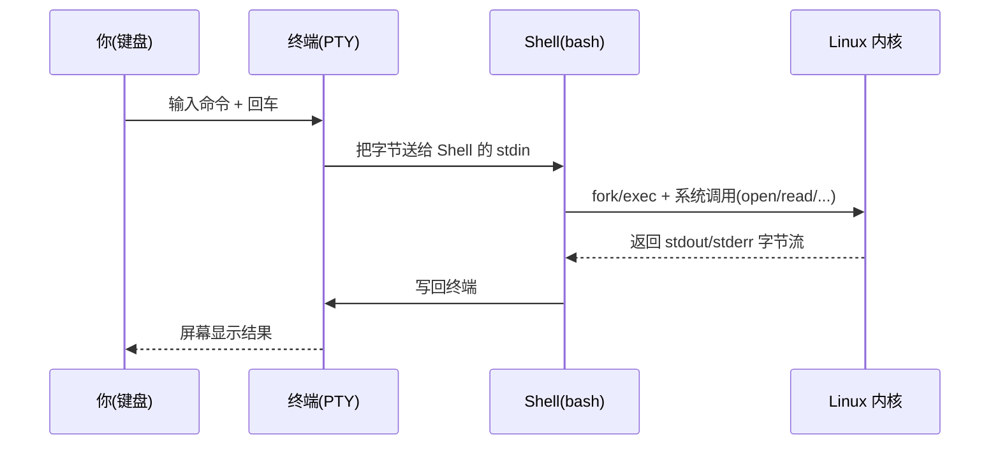
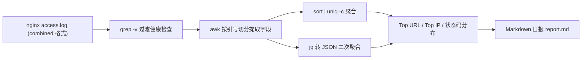

# 第 2 章 文件系统、终端与文本处理

> **定位**：从「会登录一台机器」进化到「敢摸它的文件系统、能组合管道、能从一堆日志里挖出业务信号」。
> 本章是整个课程里**复用率最高**的一章——第 5 章的 Shell/Python 巡检、第 6 章的 Nginx 排错、第 8 章的 Loki 日志查询，底层全是这里的 `grep/sed/awk/jq` + 标准流心智模型。今天练出的「管道手感」，后面 22 周都在用。
> 核心作品：用一份 Nginx 访问日志，端到端生成一份 **Markdown 日报**（请求量、5xx、Top URL、Top IP、状态码分布）。
>
> | 项 | 值 |
> |---|---|
> | 周次 | 第 2 周 |
> | 建议学时 | 10～12 小时（讲解 3h / 实验 5h / 复盘 4h） |
> | 核心作品 | Nginx 访问日志 → Markdown 日报（`report.md`） |
> | 主线环境 | Rocky Linux 9（`dnf`） |
> | 对照环境 | Ubuntu 22.04/24.04 LTS（`apt`，可用 Multipass 速起） |
> | 完成标准 | 你能独立用 `grep/sed/awk/jq` 从任意文本里提取字段、做统计、生成一份可读报表，且对编码乱码 / 字段错位 / 磁盘写满三类事故知道怎么定位与修复 |

**学习目标**
1. 说清 FHS 目录层级各目录的用途，以及 `ext4` / `xfs` 的取舍；
2. 讲明白 inode、rwx 权限对「文件」和「目录」的不同含义，以及 Shell 与终端的关系；
3. 建立标准流（stdin/stdout/stderr）+ 重定向 + 管道的心智模型，能画出来、能讲给别人听；
4. 熟练用 `grep/sed/awk/jq/sort/uniq` 做文本处理，并产出一份 Markdown 日报；
5. 对「编码乱码 / 字段错位 / 磁盘写满」三类故障有证据链级的定位与修复能力；
6. 养成改前备份、脚本进 Git、日志轮转、敏感信息不入日志的运维反射。

> [!WARNING]
> 本章涉及 `rm`、磁盘填充（`dd`）、`umask`、`.bashrc`/`.vimrc` 改动等。凡是写盘、动全局配置、占满磁盘的命令，**只在你自己可控、可重置的实验虚拟机里执行**。动手前先在脑中回答三件事：**改了哪层状态？怎么证明生效？怎么还原？** 配置类改动永远先 `cp` 一份带时间戳的备份。

> [!NOTE]
> **命令环境约定**：本章代码块统一用中文注释标注环境，例如「【Rocky 9 或 Ubuntu，ops 普通用户】」「【需 sudo】」。凡出现 `#` 开头的命令注释均为说明，不是 root 提示符；需要 root 权限处会显式写 `sudo`。示例里的 IP、主机名、令牌均为占位值，切勿照抄真实凭据进 Git。

---

## 1. 原理讲解（Principles）

### 1.1 FHS：先知道文件通常在哪里

Linux 用 **FHS（Filesystem Hierarchy Standard，文件系统层级标准）** 约定「什么东西该放哪」。不是死规则，但 99% 的发行版都遵守。先建立空间感，你后面 `find`/`grep`/排错时才不会像无头苍蝇。

| 路径 | 用途 | 运维常见内容 / 踩坑 |
|---|---|---|
| `/` | 根，所有一切的起点 | 一切挂载都挂在它下面 |
| `/bin` `/sbin` | 基础用户 / 管理命令 | 新版发行版多软链到 `/usr/bin`、`/usr/sbin` |
| `/boot` | 内核与启动引导 | 别手贱删这里的文件，否则起不来 |
| `/dev` | 设备节点（伪文件） | 磁盘 `/dev/sda`、PTY `/dev/pts/*` 都由 `udev` 动态生成 |
| `/etc` | 系统级配置（**本章重点**） | `ssh/`、`systemd/`、`nginx/`、`fstab` |
| `/home` | 普通用户家目录 | 个人配置、脚本、SSH 密钥放这里 |
| `/root` | root 家目录 | 仅 root 可进，权限 550/700 |
| `/lib` `/lib64` | 基础共享库 | 程序依赖的 `.so` |
| `/opt` | 第三方大型软件 | 有些商业软件整包塞这里 |
| `/proc` | 内核 / 进程视图（伪文件系统） | `/proc/cpuinfo`、`/proc/<PID]/`、`/proc/meminfo` |
| `/sys` | 设备与内核对象（sysfs） | 调内核参数、看块设备 / 网络 |
| `/run` | 本次启动的运行时状态（tmpfs） | PID 文件、套接字、临时状态；重启即空 |
| `/srv` | 服务数据 | 某些发行版把 Web 根放 `/srv/www` |
| `/tmp` | 临时文件 | 可能被 `systemd-tmpfiles` 定时清理 |
| `/usr` | 用户空间程序与只读数据 | `/usr/bin`、`/usr/lib`、`/usr/local/bin`（你编译装的自留地） |
| `/var` | **易变数据**（**本章重点**） | `/var/log`（日志）、`/var/cache`、`/var/lib`、`/var/spool` |

建立空间感的命令：

```bash
# 【Rocky 9 或 Ubuntu，ops 普通用户】
pwd                                   # 你在哪(print working directory)
ls -lah                               # 长列表 + 隐藏文件 + 人类可读大小
findmnt                               # 看"设备 → 挂载点"的全貌(比 mount 清爽)
df -hT                                # 各文件系统剩余空间与类型(Type)
du -xhd1 /var 2>/dev/null | sort -h   # /var 本层各目录占用(跨文件系统不递归)
```

> [!CAUTION] 避坑：`df` 看**文件系统整体**剩余，`du` 统计**目录可见文件**占用。当「文件删了但 `df` 显示空间没释放」时，两者会明显不一致——通常是文件被删但仍有进程持有它的句柄（`lsof | grep deleted`），见故障 7.3。

### 1.2 ext4 与 XFS：两种主流文件系统的取舍

课程主线在 Rocky 9，默认文件系统是 **XFS**；Ubuntu 默认 **ext4**。两者都是日志型文件系统（写入先记日志，掉电可恢复），但取舍不同：

| 维度 | ext4 | XFS |
|---|---|---|
| 定位 | 通用、稳、兼容性最好 | 大文件 / 高并发 I/O 性能强 |
| 单文件 / 卷上限 | 16TiB / 1EiB（足够用） | 更大（8EiB 级） |
| 在线扩容 | 支持 | 支持（XFS 不能随意缩容） |
| 缩容 | 可（需离线 `resize2fs`） | **不支持缩容**（`xfs_growfs` 只能扩） |
| inode | 格式化时固定（可事后 `resize2fs` 调整） | **动态分配**，基本不会 inode 耗尽 |
| 典型场景 | 通用系统盘、云主机系统盘 | 大日志盘、数据库盘、媒体存储 |

> [!NOTE] 版本说明：Rocky Linux 9 / 9.5 / 9.6 默认 XFS；Ubuntu 22.04 / 24.04 LTS 默认 ext4。**版本可能变动，以官方兼容矩阵为准**（见参考资料 Rocky/Ubuntu 文档）。本章不格式化磁盘，重点是理解「为什么有的盘能缩、有的不能」，避免第 4 章 LVM 扩容时踩坑。

实操看一眼你机器用的是什么：

```bash
# 【Rocky 9 或 Ubuntu，ops 普通用户】
findmnt -n -o SOURCE,FSTYPE /        # 看根分区文件系统类型
lsblk -f                             # 看每块盘的文件系统/UUID
```

### 1.3 inode 与 rwx 权限模型

**inode 是什么**：文件在磁盘上的「身份证」。目录里看到的文件名只是硬链接（指向 inode 的指针）；inode 里存的是元数据——权限、属主、大小、时间戳、数据块位置。**文件名不在 inode 里，在目录项里**。所以「同一文件多个名字」（硬链接）共享一个 inode；`rm` 本质是删目录项、递减链接计数，计数到 0 且无人打开才真正释放数据块。

```bash
# 【Rocky 9 或 Ubuntu，ops 普通用户】
stat access.log                      # 看 inode 号、大小、三个时间(access/modify/change)
ls -i access.log                     # 单独看 inode 号
df -i /                              # 看 inode 使用率(小文件 exploded 时会 inode 100% 而容量未满)
```

**rwx 对「文件」与「目录」含义不同**（这是高频考点，也是故障根因）：

| | 文件 | 目录 |
|---|---|---|
| `r` | 可读内容 | 可列目录项（`ls`） |
| `w` | 可改内容 | 可增删目录里的文件（改名/新建/删除） |
| `x` | 可作程序执行 | 可 `cd` 进入 / 穿透（`cd` 进其子目录） |

> 关键直觉：**删一个文件，需要的是它所在目录的 `w` 权限，不是文件本身的 `w`**。所以一个 `rw-r--r--` 的文件，只要父目录你有写权限，你照样能 `rm` 它。这也是为什么「共享上传目录」要小心给 `w`。

**UGO 模型**：权限分三类主体——**U**ser（属主）、**G**roup（属组）、**O**ther（其他人）。`ls -l` 十位里：
- 第 1 位：类型（`-` 普通文件 / `d` 目录 / `l` 软链 / `b` 块设备 / `c` 字符设备）
- 2-4：属主 rwx；5-7：属组 rwx；8-10：其他 rwx

```bash
# 【Rocky 9 或 Ubuntu，ops 普通用户】
ls -l access.log                     # -rw-r--r-- 1 ops ops ... => 属主 rw, 组和其他只读
chmod 640 access.log                 # 属主 rw, 组 r, 其他无(日志最小可读原则)
chown ops:ops access.log             # 改属主与属组
```

**三个特殊位**（运维常见，先认脸）：
- `setuid`（`4`，`rws` 中 `s` 在属主 x 位）：执行该程序时**临时以属主身份**跑（如 `passwd` 借 root 改 `/etc/shadow`）。
- `setgid`（`2`，组 x 位 `s`）：目录里**新建文件继承该目录的组**（共享目录协作利器，第 3 章细讲）。
- `sticky bit`（`1`，其他 x 位 `t`，如 `/tmp` 的 `drwxrwxrwt`）：**目录里自己的文件只能自己删**，别人不能删你的。

```bash
chmod 2750 shared_dir/               # setgid: 组内协作目录, 新建文件归 shared_dir 的组
chmod 1777 /tmp                      # sticky: 所有人可写但只能删自己的(系统默认已如此)
```

### 1.4 Shell 与终端：谁是谁

新手最容易混淆。一句话：**终端是「输入输出设备」，Shell 是「命令解释器」**。

- **终端（Terminal / TTY / PTY）**：负责把你的按键变成字节、把程序输出变成屏幕像素。早期是物理电传（TTY），现在是伪终端（PTY，由终端模拟器或 SSH 提供）。
- **Shell**：一个用户态程序（常见 `bash` / `zsh`），读终端送来的字节、解析、调用内核执行命令、把结果写回终端。
- **关系**：你敲键 → 终端把字节喂给 Shell 的 **stdin** → Shell `exec` 命令 → 命令的 **stdout/stderr** 写回终端显示。SSH 登录时，`sshd` 给你开一对 PTY，再 `fork` 出你的 Shell 挂在上面。



> [!NOTE] 避坑：`bash script.sh` 与 `source script.sh`（或 `. script.sh`）天差地别——前者开**子 Shell**，脚本里 `cd`/`export` 不影响你当前环境；后者在**当前 Shell** 执行，变量/目录切换会留下来。改 `.bashrc` 后用 `source ~/.bashrc` 才立即生效，不用重开终端。

### 1.5 标准流、重定向与管道的心智模型

这是本章的「灵魂模型」。每个进程天生打开三个文件描述符（fd）：**0=stdin（标准输入）、1=stdout（标准输出）、2=stderr（标准错误）**。它们默认都连到终端，但可以被重定向到文件、彼此合并、或接到另一个进程的 stdin。

```text
 生产者                 标准流                      消费者 / 目的地
┌─────────┐   stdin    ┌──────────┐  stdout    ┌──────────┐
│ 键盘/文件│ ────────▶ │  进程 A   │ ────────▶ │ 屏幕/文件│
└─────────┘   (fd 0)   └──────────┘  (fd 1)   └──────────┘
                            │
                            │ stderr (fd 2)
                            ▼
                       ┌──────────┐
                       │ 屏幕/err │
                       └──────────┘
    管道 A | B : 把 A 的 stdout 接到 B 的 stdin(不经过磁盘, 内存缓冲)
    重定向   : > 覆盖stdout  >> 追加  2> 错误  &>> 合并  2>&1 把错误并到输出
```

核心符号（务必背熟并讲得出）：

```bash
command > out.txt          # 覆盖 stdout 到文件(文件原有内容清空)
command >> out.txt         # 追加 stdout
command 2> err.txt         # 单独把 stderr 写文件(正常输出仍上屏)
command > all.txt 2>&1     # 合并 stdout+stderr 到同一文件(顺序: 先 2>&1 再 >)
command &> all.txt         # 等价简写(bash): 标准+错误一起重定向
cmd1 | cmd2                # 管道: cmd1 的 stdout → cmd2 的 stdin(经典流式处理)
command < in.txt           # 从文件读 stdin
command <<'EOF'            # here-doc: 后续直到 EOF 的行作为 stdin(引号防展开)
command 2>/dev/null        # 丢弃错误输出(静默)
command | tee out.txt      # 既上屏又落盘(tee 分叉)
```

> [!CAUTION] 避坑：`2>&1` 的**顺序很重要**。`cmd > all.txt 2>&1` 先重定向 1 再合并 2→1，正确；`cmd 2>&1 > all.txt` 会先把 2 合并到「当时的 1（终端）」，再把 1 指向文件，结果错误仍上屏、只有正常输出进文件。记住口诀：**先定目标，再合并**。

---

## 2. 架构（Architecture）

### 2.1 根目录树（FHS ASCII 图）

```text
/
├── bin ──▶ /usr/bin        # 基础命令(新发行版软链)
├── boot                    # 内核 vmlinuz + grub
├── dev                     # 设备节点(udev 动态生成, 伪文件)
├── etc                     # 系统配置 ★本章改这里(.bashrc 在 ~/.bashrc)
├── home                    # 普通用户家目录
│   └── ops/.bashrc         # 你的别名/环境(本章配置)
│   └── ops/.vimrc          # 你的 vim 配置(本章配置)
│   └── ops/.ssh/           # 密钥(第1章, 权限 700/600)
├── lib ──▶ /usr/lib         # 基础库
├── opt                     # 第三方软件
├── proc                    # 内核/进程视图(伪文件, 不占盘)
├── root                    # root 家目录(550)
├── run                     # 运行时(tmpfs, 重启空)
├── sbin ──▶ /usr/sbin       # 管理命令
├── srv                     # 服务数据(如 /srv/www)
├── sys                     # sysfs(伪文件)
├── tmp                     # 临时(可能被清)
├── usr                     # 用户程序/只读数据
│   └── local/bin           # 你编译安装的自留地(PATH 优先)
└── var                     # 易变数据 ★本章读这里
    ├── log/                # 日志(Nginx 在这里, 本章数据源)
    │   └── nginx/access.log
    ├── cache/
    ├── lib/                # 各服务持久数据(数据库等)
    └── spool/              # 队列(邮件/cron)
```

### 2.2 标准流与管道的数据流（ASCII 图）

把「管道」想成一根不落盘的管子——前一条命令的 stdout 直接喂给后一条的 stdin，整条流水线常驻内存、边产边消：

```text
 nginx access.log (磁盘)
        │  cat / < 读入
        ▼
   ┌──────────┐  stdout │  ┌──────────┐  stdout │  ┌──────────┐
   │ grep -v   │ ───────▶ │   awk     │ ───────▶ │ sort|uniq │ ──▶ 屏幕 / report.md
   │ 过滤健康  │          │ 提取字段   │          │ 聚合 Top  │
   └──────────┘          └──────────┘          └──────────┘
        ▲                     ▲                     ▲
        │  stderr(2) 各自独立, 默认上屏; 用 2> 单独收集
```

### 2.3 日志处理流水线（mermaid 图）



> 参考：[Linux 基金会 FHS 3.0 标准](https://refspecs.linuxfoundation.org/FHS_3.0/fhs/index.html) ｜ [GNU coreutils 手册](https://www.gnu.org/software/coreutils/manual/coreutils.html)

---

## 3. 部署（Deployment）—— 实验准备

目标：在上一章的实验机上，装好本章要用到的文本处理与观察工具。两种包管理路线都给，**二选一**（你主线是 Rocky 9）。

### 3.1 工具清单

| 工具 | 用途 | 是否系统自带 |
|---|---|---|
| `tree` | 目录树可视化 | 通常需装 |
| `vim` | 编辑器（必备基本功） | 最小安装可能没有 |
| `jq` | JSON 查询/转换（现代运维必会） | 需装 |
| `ripgrep`(`rg`) | 极快递归搜索，替代 `grep -R` | 需装（可选但强推） |
| `bat` | 带语法高亮/行号的 `cat` | 需装（可选） |
| `sysstat`(`iostat`) | 磁盘 I/O 基线 | 需装 |
| `iotop` | 实时看谁在刷盘 | 需装（排错用） |

> 版本提示：本章验证基于 `jq 1.7.1`、`ripgrep 14.x`、`bat 0.24/0.25`、`vim 9.x`、`gawk 5.1+`、`sysstat 12.x`、Rocky Linux 9.5/9.6、Ubuntu 22.04/24.04 LTS、Multipass 1.14.x。**版本可能变动，以官方兼容矩阵为准**。

### 3.2 Rocky Linux 9（dnf）路线

```bash
# 【Rocky 9，需 sudo】
sudo dnf install -y tree vim jq sysstat iotop        # 核心: 目录树/编辑器/JSON/IO基线
sudo dnf install -y ripgrep bat                       # 现代增强工具(可选但推荐)
# 验证
tree --version; jq --version; rg --version; vim --version | head -1
```

### 3.3 Ubuntu（apt）路线

```bash
# 【Ubuntu 22.04/24.04，需 sudo】
sudo apt update
sudo apt install -y tree vim jq sysstat iotop
sudo apt install -y ripgrep bat
# 验证
tree --version; jq --version; rg --version; vim --version | head -1
```

### 3.4 Multipass 对照机（可选）

想做对照实验（比如同样命令在 Ubuntu 上跑一遍），用 Multipass 10 分钟出一台：

```powershell
# 【宿主机 Windows PowerShell / macOS / Linux】Multipass 路线(对照用)
multipass launch 24.04 --name linux-ops-ubu --cpus 2 --memory 4G --disk 20G
multipass shell linux-ops-ubu
# 进去后按 3.3 装工具即可
```

### 3.5 建好本章实验目录

```bash
# 【Rocky 9 或 Ubuntu，ops 普通用户】
mkdir -p ~/labs/ch02/{input,output,backup,scripts}
cd ~/labs/ch02
tree -L 2 .        # 看结构: input(原始日志) output(报表) backup(备份) scripts(脚本)
```

---

## 4. 配置（Configuration）

### 4.1 .bashrc 实用别名

别名是「把重复敲的命令缩成一句话」。统一写进 `~/.bashrc`，新终端自动加载。

```bash
# 【Rocky 9 或 Ubuntu，ops 普通用户】追加到 ~/.bashrc
cat >> ~/.bashrc <<'EOF'
# ---- 第 2 章：文本处理与文件操作实用别名 ----
alias ll='ls -lhF --time-style=long-iso'   # 易读长列表 + 完整时间戳
alias la='ls -lhaF --time-style=long-iso'  # 含隐藏文件
alias lt='ls -ltrhF'                       # 按修改时间倒序(看最新改动)
alias ..='cd ..'                           # 上层目录
alias ...='cd ../..'
alias dfh='df -hT'                         # 看挂载与用量
alias du1='du -xhd1'                       # 本层目录占用(跨文件系统不递归)
alias psg='ps -eo pid,ppid,user,comm --sort=-%mem | head'  # 内存占用 Top
alias grep='grep --color=auto'             # 命中高亮
alias rm='rm -i'                           # 交互确认(仅降误删概率, 不替备份)
alias mkdirp='mkdir -pv'                   # 建多级目录并回显
alias big='du -xh . 2>/dev/null | sort -rh | head -10'     # 当前目录下大文件 Top10
EOF
source ~/.bashrc   # 立即生效(不必重开终端)
```

### 4.2 umask：默认权限的源头

`umask` 决定「你新建的文件/目录默认是什么权限」。它是**掩码**——从最大权限里**扣掉**对应位：文件基准 666、目录基准 777。

- `umask 022`：文件 644（`rw-r--r--`）、目录 755（默认，偏宽松）
- `umask 027`：文件 640（`rw-r-----`）、目录 750（组可读、其他无，运维更推荐）

```bash
# 【Rocky 9 或 Ubuntu，ops 普通用户】写入 ~/.bashrc 固化
echo 'umask 027' >> ~/.bashrc
source ~/.bashrc
umask                          # 应显示 0027
touch t.txt && mkdir t.dir && stat -c '%a %n' t.txt t.dir
# 预期: 640 t.txt   750 t.dir
```

> [!CAUTION] 避坑：`alias rm='rm -i'` 只在**交互式** Shell 里降低误删概率，对脚本、cron、`find -delete` 完全无效，也救不了你删错路径。真正可靠的是：缩小权限 + 明确绝对路径 + **先预览再删** + 定期备份（见 8 章）。

### 4.3 ~/.vimrc 基础配置

vim 是服务器上几乎必有的编辑器。一份最小配置让你不慌：

```bash
# 【Rocky 9 或 Ubuntu，ops 普通用户】
cat > ~/.vimrc <<'EOF'
" 第 2 章：vim 最小化生存配置
set number              " 显示行号
set relativenumber      " 相对行号(跳转更顺手)
set tabstop=4           " Tab 宽 4
set shiftwidth=4
set expandtab           " 用空格代替 Tab(脚本友好)
set encoding=utf-8      " 内部编码统一 UTF-8, 防乱码
set fileencodings=utf-8,gbk,ucs-bom,default,latin1  " 打开文件时按此顺序探测编码
set hlsearch            " 搜索高亮
set incsearch           " 增量搜索
set ruler               " 右下角显示光标位置
set mouse=a             " 终端内可用鼠标
set background=dark
syntax on               " 语法高亮
EOF
```

vim 最小生存键位（贴墙备忘）：

| 目标 | 操作 |
|---|---|
| 插入 / 追加 / 新行 | `i` / `a` / `o` |
| 回到普通模式 | `Esc` |
| 保存 / 退出 / 强退 | `:w` / `:q` / `:q!` |
| 删 / 复制 / 粘贴一行 | `dd` / `yy` / `p` |
| 撤销 / 重做 | `u` / `Ctrl-r` |
| 搜索 / 下一个 | `/pattern` / `n` |
| 显示行号 | `:set number` |

> [!NOTE] 避坑：出现 `.swp` 交换文件警告时**不要直接批量删 `.*.swp`**。先确认是否还有另一个 vim 进程在编辑；需要恢复用 `vim -r 文件名`，保存确认后再删对应交换文件。

### 4.4 生成一份样例 Nginx 访问日志（测试数据）

下面是一份 **combined 格式**的标准 Nginx 访问日志（字段：`$remote_addr - $remote_user [$time_local] "$request" $status $body_bytes_sent "$http_referer" "$http_user_agent"`）。内嵌成测试数据，你后面的所有练习都能直接跟做。注意我故意混入：健康检查 `/healthz`、若干 4xx/5xx、一个**带 token 的敏感请求**（用于第 10 章安全演练）、以及一个 GBK 中文路径（用于故障 7.1）。

```bash
# 【Rocky 9 或 Ubuntu，ops 普通用户】生成测试日志
mkdir -p ~/labs/ch02/input
cat > ~/labs/ch02/input/access.log <<'EOF'
192.168.1.10 - - [04/Sep/2026:10:15:32 +0400] "GET /api/v1/products HTTP/1.1" 200 1234 "https://shop.example.com/" "Mozilla/5.0 (X11; Linux x86_64) AppleWebKit/537.36"
192.168.1.10 - - [04/Sep/2026:10:15:33 +0400] "GET /api/v1/products/42 HTTP/1.1" 200 2048 "-" "Mozilla/5.0 (X11; Linux x86_64) AppleWebKit/537.36"
192.168.1.20 - - [04/Sep/2026:10:15:40 +0400] "GET / HTTP/1.1" 200 512 "-" "curl/8.4.0"
192.168.1.20 - - [04/Sep/2026:10:15:41 +0400] "GET /static/app.js HTTP/1.1" 304 0 "-" "curl/8.4.0"
10.0.0.5 - - [04/Sep/2026:10:15:55 +0400] "GET /healthz HTTP/1.1" 200 2 "-" "kube-probe/1.29"
10.0.0.5 - - [04/Sep/2026:10:15:57 +0400] "GET /healthz HTTP/1.1" 200 2 "-" "kube-probe/1.29"
203.0.113.7 - - [04/Sep/2026:10:16:10 +0400] "GET /api/v1/missing HTTP/1.1" 404 153 "-" "Mozilla/5.0 (iPhone) AppleWebKit/605.1"
203.0.113.7 - - [04/Sep/2026:10:16:12 +0400] "POST /api/v1/checkout HTTP/1.1" 500 204 "-" "Mozilla/5.0 (iPhone) AppleWebKit/605.1"
203.0.113.45 - - [04/Sep/2026:10:16:30 +0400] "GET /api/v1/products HTTP/1.1" 200 1190 "-" "Googlebot/2.1"
198.51.100.23 - - [04/Sep/2026:10:16:45 +0400] "GET /login?token=abc123secret&apikey=xyz789token HTTP/1.1" 200 88 "-" "Mozilla/5.0 (Windows NT 10.0) Chrome/126"
192.168.1.10 - - [04/Sep/2026:10:17:01 +0400] "GET /api/v1/cart HTTP/1.1" 200 640 "-" "Mozilla/5.0 (X11; Linux x86_64) AppleWebKit/537.36"
192.168.1.20 - - [04/Sep/2026:10:17:20 +0400] "GET /api/v1/products HTTP/1.1" 200 1230 "-" "curl/8.4.0"
203.0.113.7 - - [04/Sep/2026:10:17:35 +0400] "GET /api/v1/products/42 HTTP/1.1" 200 2051 "-" "Mozilla/5.0 (iPhone) AppleWebKit/605.1"
10.0.0.5 - - [04/Sep/2026:10:17:50 +0400] "GET /healthz HTTP/1.1" 200 2 "-" "kube-probe/1.29"
203.0.113.45 - - [04/Sep/2026:10:18:02 +0400] "GET /static/app.js HTTP/1.1" 304 0 "-" "Googlebot/2.1"
198.51.100.23 - - [04/Sep/2026:10:18:15 +0400] "GET /api/v1/checkout HTTP/1.1" 502 0 "-" "Mozilla/5.0 (Windows NT 10.0) Chrome/126"
192.168.1.10 - - [04/Sep/2026:10:18:40 +0400] "GET /api/v1/products HTTP/1.1" 200 1240 "-" "Mozilla/5.0 (X11; Linux x86_64) AppleWebKit/537.36"
192.168.1.20 - - [04/Sep/2026:10:18:55 +0400] "GET / HTTP/1.1" 301 0 "-" "curl/8.4.0"
203.0.113.7 - - [04/Sep/2026:10:19:10 +0400] "GET /api/v1/missing HTTP/1.1" 404 153 "-" "Mozilla/5.0 (iPhone) AppleWebKit/605.1"
203.0.113.45 - - [04/Sep/2026:10:19:25 +0400] "GET /api/v1/products/42 HTTP/1.1" 200 2044 "-" "Googlebot/2.1"
10.0.0.5 - - [04/Sep/2026:10:19:40 +0400] "GET /healthz HTTP/1.1" 200 2 "-" "kube-probe/1.29"
198.51.100.23 - - [04/Sep/2026:10:19:55 +0400] "POST /api/v1/checkout HTTP/1.1" 500 204 "-" "Mozilla/5.0 (Windows NT 10.0) Chrome/126"
192.168.1.10 - - [04/Sep/2026:10:20:10 +0400] "GET /api/v1/cart HTTP/1.1" 200 655 "-" "Mozilla/5.0 (X11; Linux x86_64) AppleWebKit/537.36"
192.168.1.20 - - [04/Sep/2026:10:20:25 +0400] "GET /static/app.js HTTP/1.1" 304 0 "-" "curl/8.4.0"
203.0.113.7 - - [04/Sep/2026:10:20:40 +0400] "GET /api/v1/products HTTP/1.1" 200 1225 "-" "Mozilla/5.0 (iPhone) AppleWebKit/605.1"
203.0.113.45 - - [04/Sep/2026:10:20:55 +0400] "GET /api/v1/products HTTP/1.1" 200 1210 "-" "Googlebot/2.1"
198.51.100.23 - - [04/Sep/2026:10:21:10 +0400] "GET /api/v1/checkout HTTP/1.1" 502 0 "-" "Mozilla/5.0 (Windows NT 10.0) Chrome/126"
192.168.1.10 - - [04/Sep/2026:10:21:25 +0400] "GET /api/v1/products/42 HTTP/1.1" 200 2060 "-" "Mozilla/5.0 (X11; Linux x86_64) AppleWebKit/537.36"
EOF
wc -l ~/labs/ch02/input/access.log     # 应 26 行
```

### 4.5 【核心作品】端到端：Nginx 日志 → Markdown 日报（完整跟做）

下面是一条**可直接复制运行**的流水线，从 `access.log` 生成 `output/nginx-daily-<日期>.md`。先分步理解，再给合并版。

**第 0 步：先看格式、数行数（永远先抽样再处理）**

```bash
# 【Rocky 9 或 Ubuntu，ops 普通用户】
cd ~/labs/ch02
LOG=input/access.log
wc -l "$LOG"                 # 总量
head -3 "$LOG"               # 看 combined 格式长什么样
```

**第 1 步：过滤健康检查流量**（探针不是真实用户请求，日报要剔除）

```bash
grep -v '"GET /healthz' "$LOG" > /tmp/clean.log
echo "过滤后有效请求: $(wc -l < /tmp/clean.log) 行"   # 26 - 5 = 21 行
```

**第 2 步：用 awk 按「双引号」切分，稳健提取字段**

> combined 格式里 `[时间]` 和 `"请求行"` 都含空格，按空格切分会错位（见故障 7.2）。正确姿势：用 `"` 作分隔符，引号包裹的请求/referer/UA 各自成一整段。

```bash
awk -F'"' '
{
  split($1, a, " "); ip   = a[1]        # $1 开头即客户端 IP
  split($2, r, " "); path = r[2]        # $2 是请求行, 第2段是 URL 路径
  split($3, s, " "); status = s[2]+0; bytes = s[3]+0   # $3 形如 " 200 1234 "
  printf "{\"ip\":\"%s\",\"path\":\"%s\",\"status\":%d,\"bytes\":%d}\n", ip, path, status, bytes
}' /tmp/clean.log > /tmp/access.jsonl

head -2 /tmp/access.jsonl     # 每行一个 JSON 对象(JSON Lines)
# 用 jq 校验并美化第一条
head -1 /tmp/access.jsonl | jq .
```

**第 3 步：核心指标 —— 总量 & 5xx**

```bash
total=$(wc -l < /tmp/clean.log)
err5xx=$(jq '[.[] | select(.status>=500)] | length' /tmp/access.jsonl)
echo "有效请求: $total | 5xx 错误: $err5xx"
```

**第 4 步：Top 10 请求路径 & Top 10 来源 IP（经典 `sort | uniq -c`）**

```bash
echo "## Top 10 请求路径"
awk -F'"' '{split($2,r," "); print r[2]}' /tmp/clean.log | sort | uniq -c | sort -rn | head -10
echo "## Top 10 来源 IP"
awk -F'"' '{split($1,a," "); print a[1]}' /tmp/clean.log | sort | uniq -c | sort -rn | head -10
```

**第 5 步：状态码分布（用 jq 二次聚合，输出 Markdown 表格行）**

```bash
jq -r -s 'group_by(.status)
  | map({status:.[0].status, count:length})
  | sort_by(.status)
  | .[] | "| \(.status) | \(.count) |"' /tmp/access.jsonl
```

**第 6 步：组装成 Markdown 日报并落盘**

```bash
OUT=output/nginx-daily-$(date +%F).md
{
  echo "# Nginx 访问日报 $(date +%F)"
  echo
  echo "- 生成时间: $(date '+%F %T %z')"
  echo "- 数据源: $LOG"
  echo "- 有效请求总数: $total"
  echo "- 5xx 错误数: $err5xx"
  echo
  echo "## 状态码分布"
  echo
  echo "| 状态码 | 次数 |"
  echo "|---|---:|"
  jq -r -s 'group_by(.status) | map({status:.[0].status, count:length}) | sort_by(.status) | .[] | "| \(.status) | \(.count) |"' /tmp/access.jsonl
  echo
  echo "## Top 10 请求路径"
  echo
  echo "| 次数 | 路径 |"
  echo "|---:|---|"
  awk -F'"' '{split($2,r," "); print r[2]}' /tmp/clean.log | sort | uniq -c | sort -rn | head -10 | awk '{print "| "$1" | "$2" |"}'
  echo
  echo "## Top 10 来源 IP"
  echo
  echo "| 次数 | IP |"
  echo "|---:|---|"
  awk -F'"' '{split($1,a," "); print a[1]}' /tmp/clean.log | sort | uniq -c | sort -rn | head -10 | awk '{print "| "$1" | "$2" |"}'
  echo
  echo "## 异常请求示例(>=400)"
  echo
  echo "| 状态码 | 路径 | IP |"
  echo "|---:|---|---|"
  jq -r 'select(.status>=400) | "| \(.status) | \(.path) | \(.ip) |"' /tmp/access.jsonl | sort -t'|' -k2 -rn
} > "$OUT"

cat "$OUT"      # 看成品
```

**合并一键版**（把上面整套存成脚本也行，见第 8 章进 Git）：

```bash
# 【Rocky 9 或 Ubuntu，ops 普通用户】一键生成(变量在上文已定义则直接跑第6步块即可)
# 若新开终端, 从头跑: 定义 LOG, 做第1~3步生成 /tmp/clean.log 和 /tmp/access.jsonl, 再执行第6步块
```

> [!NOTE] 边界情况：① 空文件 / 不存在文件要先判存在，否则 `awk`/`jq` 报错难看：`[ -s "$LOG" ] || { echo "日志为空或不存在"; exit 1; }`；② 路径含空格时 `uniq -c` 的 `awk '{print $1,$2}'` 会截断——本例路径无空格，生产日志务必先抽样确认；③ `jq` 吃 JSON Lines 用 `-s` 一次性 slurp，超大文件会占内存，见第 6 章流式取舍。

---

## 5. 验证（Verification）

每条变更都要用**明确命令**证明生效——这是 Ops 基本功。

### 5.1 配置生效验证

```bash
# 【Rocky 9 或 Ubuntu，ops 普通用户】
# 1) 别名是否生效
type ll                 # 应显示 ll 是 alias
ll ~/labs/ch02          # 应出彩色长列表

# 2) umask 是否生效
umask                   # 应显示 0027
touch /tmp/t.txt && stat -c '%a %n' /tmp/t.txt   # 预期 640

# 3) vim 配置是否生效
vim -c 'set number? | q' 2>&1 | head   # 应回显 number(或进 vim 看到行号)

# 4) 工具是否就位
for t in tree vim jq rg bat iostat; do command -v $t >/dev/null && echo "OK  $t" || echo "MISS $t"; done
```

### 5.2 文本处理四件套逐个验收

```bash
# grep: 找所有 5xx 行
grep -E ' (500|502) ' input/access.log | wc -l          # 预期 5(3个500 + 2个502, 含健康检查无5xx)

# sed: 把示例域名替换, 看变换(不改原文件)
sed 's#shop.example.com#new.shop.example#g' input/access.log | grep -c new.shop.example

# awk: 用引号切分拿状态码, 统计 200 数量
awk -F'"' '{split($3,s," "); print s[2]}' input/access.log | grep -c '^200$'   # 应含健康检查的200

# jq: 从 jsonl 里筛 4xx/5xx 的路径
jq -r 'select(.status>=400) | .path' /tmp/access.jsonl | sort | uniq -c
```

### 5.3 验收清单

- [ ] `ll`/`la`/`..` 等别名可用，新终端自动加载
- [ ] `umask` 为 027，新建文件 640、目录 750
- [ ] `vim` 带行号/语法高亮，编辑小文件无压力
- [ ] `tree/jq/rg/bat/iostat` 均已安装
- [ ] 能从 `access.log` 用 `awk -F'"'` 正确提取 IP/路径/状态码（不加引号切分就错位）
- [ ] 能独立跑出「Nginx 访问日报」，含总量、5xx、Top 路径、Top IP、状态码分布
- [ ] 对空文件 / 不存在文件有显式报错处理

---

## 6. 性能（Performance）—— 建立基线 + 流式意识

### 6.1 建立磁盘 I/O 基线（iostat / iotop）

和第 1 章「先有基线才有异常」一致，文本处理吃的是磁盘 I/O，先量干净态：

```bash
# 【Rocky 9 或 Ubuntu，需 sudo】安装 sysstat 后采集
sudo dnf install -y sysstat 2>/dev/null || sudo apt install -y sysstat
iostat -xk 1 3        # 每1秒采样共3次; 关注 %util(设备忙百分比) / await(平均等待ms) / r/s,w/s
sudo iotop -o -b -n 3 # -o 只看有 I/O 的进程, -b 批处理, -n 3 采样3次
```

把输出存进实验笔记——这就是你这台机的「磁盘健康指纹」，后面任何 I/O 异常都拿它对比。

### 6.2 大文件 / 大日志：流式 vs 加载内存

这是文本处理的**性能命门**。核心原则：**能用管道流式处理，就别把整个文件读进内存**。

```bash
# ✅ 流式(常量内存): awk 一行一行过, 处理 10GB 日志也只占几十 MB
awk -F'"' '{split($3,s," "); if (s[2]+0>=500) c++} END {print c}' huge.log

# ❌ 危险(全量入内存): mapfile 把整个文件塞进数组, 大文件直接 OOM 被 kill
mapfile -t lines < huge.log          # 10GB => 进程吃满内存, OOM Killer 杀掉

# ⚠ sort 对超大文件会"溢写磁盘"(安全但慢)。ASCII 文本加 LC_ALL=C 跳过本地化、显著提速
LC_ALL=C sort huge.log | LC_ALL=C uniq -c

# 计数用 wc -l(极快, 只数换行符, 不读内容); 别用 awk 'END{print NR}' 处理超大文件(虽也流式但 wc 更快)
wc -l huge.log
```

> [!CAUTION] 避坑：`jq -s`（slurp）会把**整个 JSON Lines 文件读进内存再处理**。GB 级日志别用 `-s`，改用 `jq` 逐行流式（`jq -c` 配合 `while read` 或 `jq` 不带 `-s` 对每行独立处理）。

### 6.3 几个影响性能的隐形因素

- **`LC_ALL`**：中文/UTF-8  locale 下 `grep/sort` 要做本地化排序，慢数倍；纯 ASCII 日志前 `export LC_ALL=C` 提速明显（仅本次 Shell 生效）。
- **管道段数**：`grep | awk | sort | uniq` 每段都 fork 进程、过一遍内存；能用 `awk` 一步做完的统计就别套四五级管道。
- **`grep -E` vs `rg`**：递归搜代码库，`rg`（ripgrep）用 Rust + 并行 + 忽略 `.git`，比 `grep -R` 快一个量级；但脚本面向大量机器时，优先用系统自带的 `grep` 保兼容（见 mermaid 架构与参考资料）。

---

## 7. 故障（Troubleshooting）—— 故障演练

> 目标：主动制造三类事故，用证据链定位并修复。全部在**可重置实验机**做。

### 7.1 演练：日志编码乱码（GBK ↔ UTF-8）

**制造**：模拟一份从 Windows 采集的旧日志（GBK 编码，含中文路径）。

```bash
# 【Rocky 9 或 Ubuntu，ops 普通用户】仅在实验机
printf '192.168.1.10 - - [04/Sep/2026:10:00:00 +0400] "GET /搜索 HTTP/1.1" 200 10 "-" "curl/8"\n' \
  | iconv -t GBK > input/legacy-gbk.log
file input/legacy-gbk.log            # 证据①: 显示 GBK/ISO-8859 之类
cat input/legacy-gbk.log             # 现象: 中文变乱码(终端按 UTF-8 解)
```

**定位**：
```bash
enca input/legacy-gbk.log 2>/dev/null || file -b input/legacy-gbk.log   # 证据②: 确认是 GBK
```

**修复**：
```bash
iconv -f GBK -t UTF-8 input/legacy-gbk.log > input/legacy-utf8.log
file input/legacy-utf8.log           # 证据③: UTF-8
cat input/legacy-utf8.log            # 中文恢复正常
```
> [!NOTE] 避坑：vim 里临时切编码 `:e ++enc=gbk`；永久在 `~/.vimrc` 加 `set fileencodings=utf-8,gbk,...`（已配）。`iconv` 转不了时加 `//IGNORE` 丢坏字节，但会丢数据，慎用。

### 7.2 演练：字段错位导致 awk 解析失败

**制造（错误示范）**：想当然认为「状态码是第 9 个空格字段」。

```bash
awk '{print $9}' input/access.log | head -3
# 现象: 输出是 +0400] / +0400] / +0400] —— 根本不是状态码!
```

**定位（证据链）**：
```bash
head -1 input/access.log | awk '{for(i=1;i<=NF;i++) print i, $i}'
# 证据: 时间 [04/Sep/2026:10:15:32 +0400] 被空格拆成两段(4和5),
#       请求行 "GET /api/... HTTP/1.1" 也被拆成多段 => 按空格切分字段整体漂移
```

**修复（稳健写法）**：用双引号作分隔符（请求/referer/UA 都被引号包住）。

```bash
awk -F'"' '{split($3,s," "); print "status="$s[2]}' input/access.log | head -3
# 正确拿到 200 / 200 / 200
```

> [!CAUTION] 避坑：处理任何带引号/带空格的日志，**先 `head -1` 抽样 + `awk` 打印每字段位置**，确认分隔符再写解析。Nginx 换 `log_format`、加字段后，老脚本会瞬间全错——这就是「界定影响 → 用证据判断」的现场版。

### 7.3 演练：磁盘写满导致写入失败

**制造（⚠ 仅实验机，用 lab 目录填充，不碰系统根）**：

```bash
# 【Rocky 9 或 Ubuntu，ops 普通用户】仅在可重置实验机
df -h ~                            # 先看基线用量
dd if=/dev/zero of=~/labs/ch02/bigfill.bin bs=1M count=2048 2>/dev/null  # 填 2G(按你盘剩余调)
df -h ~                            # 证据①: Use% 接近 100%
echo "test" > ~/labs/ch02/output/full.log   # 现象: No space left on device
```

**定位（证据链）**：
```bash
du -xh ~ | sort -rh | head -10     # 证据②: 谁占了空间(bigfill.bin 在列)
lsof +L1 | grep -i deleted         # 证据③: 找"已删但仍被进程持有"的文件(删了不释放)
```

**修复**：
```bash
rm -f ~/labs/ch02/bigfill.bin      # 删填充文件
df -h ~                            # 证据④: 用量回落
echo "test" > ~/labs/ch02/output/full.log && echo "写入恢复 OK"
```

> [!NOTE] 生产里磁盘写满常见真凶：① 日志未轮转（见第 9 章 `logrotate`）；② 删了大文件但进程还持有（`lsof | grep deleted` → 重启对应进程或清空而非删）；③ `journalctl` 暴涨（用 `journalctl --vacuum-size=500M` 清理）。真出事先 `df -h` 再 `du` 定位，别乱 `rm -rf /`。

### 7.4 日志里的敏感信息泄漏（避坑，呼应第 10 章）

**制造（看第 4.4 节那行带 token 的日志）**：
```bash
grep -nEi 'token|apikey|password|secret|cookie|authorization' input/access.log
# 命中: /login?token=abc123secret&apikey=xyz789token —— 密钥直接进了访问日志!
```

**影响**：任何人拿到这份日志（备份、SIEM、公开报表）都能提取密钥；日报若原样输出路径也会泄漏。

**修复（两道闸）**：
1. 日志侧：Nginx 用自定义 `log_format` 只记 `$request_uri` 的路径、丢弃 query（`$query_string` 不写），或对含敏感词的请求不打访问日志；
2. 处理侧：生成日报前先脱敏（把 query 部分切掉再统计）。

```bash
# 处理侧脱敏: 只取 URL 路径(?之前), 避免 token 进报表
awk -F'"' '{split($2,r," "); sub(/\?.*/,"",r[2]); print r[2]}' input/access.log \
  | sort | uniq -c | sort -rn | head
```

---

## 8. 回滚（Rollback）

Ops 不怕改错，怕改错回不来。本章两类回滚通道。

### 8.1 配置文件改前备份（.bashrc / .vimrc）

```bash
# 【Rocky 9 或 Ubuntu，ops 普通用户】任何改 ~/.bashrc / ~/.vimrc 前
cp -a ~/.bashrc ~/.bashrc.bak.$(date +%F_%H%M)
cp -a ~/.vimrc ~/.vimrc.bak.$(date +%F_%H%M)

# 改坏了回滚:
cp -a ~/.bashrc.bak.$(date +%F_%H%M) ~/.bashrc
source ~/.bashrc
```

### 8.2 日志处理脚本纳入 Git 版本管理

把第 4.5 节的流水线存成 `scripts/report.sh`，用 Git 管版本：

```bash
# 【Rocky 9 或 Ubuntu，ops 普通用户】
cd ~/labs/ch02
git init -q
git config user.email "ops@linux-ops.local"     # 仅本仓库, 占位值
git config user.name "ops"
# 把第 4.5 节脚本写入 scripts/report.sh(用 vim 或 cat heredoc)
cat > scripts/report.sh <<'EOF'
#!/usr/bin/env bash
# 第2章 核心作品: Nginx 访问日志 -> Markdown 日报
set -euo pipefail
LOG="${1:-input/access.log}"
OUT="output/nginx-daily-$(date +%F).md"
[ -s "$LOG" ] || { echo "日志为空或不存在: $LOG" >&2; exit 1; }
grep -v '"GET /healthz' "$LOG" > /tmp/clean.log
awk -F'"' '{split($1,a," ");split($2,r," ");split($3,s," ");\
  printf "{\"ip\":\"%s\",\"path\":\"%s\",\"status\":%d,\"bytes\":%d}\n",a[1],r[2],s[2]+0,s[3]+0}' \
  /tmp/clean.log > /tmp/access.jsonl
total=$(wc -l < /tmp/clean.log)
err5xx=$(jq '[.[]|select(.status>=500)]|length' /tmp/access.jsonl)
{ echo "# Nginx 访问日报 $(date +%F)"; echo; echo "- 生成时间: $(date '+%F %T %z')";
  echo "- 数据源: $LOG"; echo "- 有效请求总数: $total"; echo "- 5xx 错误数: $err5xx"; echo;
  echo "## 状态码分布"; echo; echo "| 状态码 | 次数 |"; echo "|---|---:|";
  jq -r -s 'group_by(.status)|map({s:.[0].status,c:length})|sort_by(.s)|.[]|"| \(.s) | \(.c) |"' /tmp/access.jsonl;
} > "$OUT"
echo "已生成: $OUT (有效 $total, 5xx $err5xx)"
EOF
chmod +x scripts/report.sh
bash scripts/report.sh            # 直接跑, 验证脚本可用

git add scripts/report.sh
git commit -m "ch02: Nginx 日志 -> Markdown 日报 脚本 v1"
# 后续改坏用: git revert / git checkout -- scripts/report.sh 回退
```

> 复盘模板（写进实验报告）：**改了哪层？** 日志处理脚本/Shell 配置 ／ **证据？** 跑 `report.sh` 产出 `report.md` 且指标正确 ／ **失败留的中间态？** `.bak` 文件 + Git 历史 ／ **影响范围？** 仅本机本目录 ／ **如何回滚？** 还原 `.bak` 或 `git checkout`。

---

## 9. 灾备（Disaster Recovery）

### 9.1 日志归档与轮转：logrotate 概念

日志会无限增长，撑满磁盘（即故障 7.3 真凶）。生产用 **logrotate** 按策略切割、压缩、保留 N 份、切割后发信号让服务重新打开文件。

```text
# /etc/logrotate.d/nginx (概念示例, 真实路径随发行版)
/var/log/nginx/*.log {
    daily            # 每天一轮
    missingok        # 日志缺失不报错
    rotate 14        # 保留 14 份
    compress         # 轮转后 gzip
    delaycompress    # 延后一轮再压(方便排查最新)
    notifempty       # 空日志不轮
    create 0640 nginx adm   # 新建日志权限/属主
    sharedscripts
    postrotate
        [ -f /var/run/nginx.pid ] && kill -USR1 $(cat /var/run/nginx.pid)  # 平滑重开日志(不中断服务)
    endscript
}
```

> [!CAUTION] 避坑：Nginx 日志轮转**必须发 `USR1` 信号**重新打开文件句柄，否则 Nginx 还写旧文件（已改名），磁盘照样涨——这正是 `lsof | grep deleted` 常见场景。手动验证：`sudo logrotate -d /etc/logrotate.d/nginx`（dry-run 不真切）。

### 9.2 关键配置与脚本纳入 Git 远程

```bash
# 把 ~/.bashrc / ~/.vimrc / 本章脚本 纳入一个你控制的 Git 仓库(推到远程=异地副本雏形)
git remote add origin git@github.com:you/linux-ops-runbook.git   # 占位, 用你自己的仓库
git push -u origin main
# 3-2-1 原则最小实践: 本地快照 + 配置 Git 远程(副本2/异地雏形); 完整异地留待后续章节
```

---

## 10. 安全（Security）

把配置上升为原则，而不只是步骤。

### 10.1 权限最小化

| 原则 | 本章落地 | 为什么 |
|---|---|---|
| 默认拒绝宽松 | `umask 027`（文件 640 / 目录 750） | 其他用户看不到你的日志/脚本 |
| 最小权限 | 不用 root 跑文本处理，用 `ops` + `sudo` | 出错爆炸半径小 |
| 可恢复 | 改前 `.bak` + Git | 改错能回家 |
| 不泄漏 | 日志脱敏（见 7.4） | 密钥不进报表/备份 |

### 10.2 敏感文件权限

```bash
# 【Rocky 9 或 Ubuntu，ops 普通用户】
chmod 700 ~/.ssh                       # 私钥目录只能自己进
chmod 600 ~/.ssh/id_ed25519            # 私钥绝不外传(第1章已讲)
chmod 600 ~/.ssh/authorized_keys       # 公钥清单也收紧
chmod 600 ~/.bash_history 2>/dev/null  # 历史命令(可能含密钥/命令)别人不可读
# 更狠: 不让历史记录敏感命令
export HISTCONTROL=ignorespace         # 命令前加空格则不入历史
export HISTFILESIZE=2000               # 限制历史条数
```

> [!WARNING] 避坑：**永远不要把私钥 `id_ed25519` 提交进任何 Git 仓库或发给别人**；公钥 `*.pub` 才可分发。`.bash_history` 里若出现过 `export TOKEN=xxx`、`mysql -p密码`，会随备份/共享泄漏——用 `ignorespace` 或在命令前加空格规避。

### 10.3 日志中可能泄露的敏感信息（与故障 7.4 呼应）

- **URL query 里的 token / apikey / session**（最常见）：Nginx 默认 `combined` 会记完整 `$request`，含 `?token=`。处理前脱敏（7.4 已演示），或日志侧只记路径。
- **认证头 / Cookie**：若用 `log_subrequest` 或自定义格式记 `$http_authorization` / `$http_cookie`，直接泄漏凭据——**不要**把它们写进访问日志。
- **客户端 IP + 行为**：访问日志本身是 PII，跨系统共享前考虑脱敏/聚合。
- **报错详情**：5xx 日志别把堆栈/SQL 原样进公网可访问的仪表盘。

检测你日志里有没有敏感字段：
```bash
grep -nEi 'token|api[_-]?key|secret|password|passwd|authorization|cookie|session' input/access.log
```

---

## 11. 自测题与参考答案

### 自测题

1. 以下哪条路径通常**不**放系统级配置？A) `/etc`  B) `/var/log`  C) `/usr/local/bin`  D) `/home/ops/.bashrc`
2. `ext4` 与 `XFS` 在「缩容」上有何区别？为什么第 4 章 LVM 扩容要留意文件系统类型？
3. 一个文件权限 `rw-r--r--`，其父目录你有写权限但你对该文件无写权限，你能 `rm` 它吗？为什么？
4. `inode` 里存的是文件名还是元数据？硬链接为什么「共享」一个 inode？
5. `2>&1 > out.txt` 与 `> out.txt 2>&1` 结果有何不同？说出根因。
6. Shell 与终端（PTY）分别负责什么？`bash script.sh` 和 `source script.sh` 对当前环境的影响有何不同？
7. 用 `awk` 解析 Nginx combined 日志时，为什么「按空格切分取第 9 字段当状态码」会错位？正确做法是什么？
8. 你用 `sort | uniq -c` 统计 Top URL，但路径含空格导致统计被截断。至少给两种改进思路。
9. 处理一份 GBK 编码的旧日志，终端显示乱码。写出「检测 → 修复」的完整命令链。
10. `jq -s` 处理 GB 级 JSON Lines 有什么风险？流式替代是什么？
11. 磁盘写满（`No space left on device`）时，你会按什么顺序定位？`lsof | grep deleted` 在这类问题里说明什么？
12. Nginx 访问日志轮转后磁盘仍在涨，最可能漏了哪一步？怎么验证？
13. 你的 `.bash_history` 里出现过 `export DB_PASSWORD=xxx`，有什么风险？如何避免？
14. 用一句话概括「改之前先留退路」在本章的具体落地动作。
15. 端到端日报里，`grep -v '"GET /healthz'` 这一步在做什么？如果不做会怎样？

### 参考答案

1. **B**。`/var/log` 是日志目录（易变数据），不放系统配置；`/etc`（配置）、`/usr/local/bin`（自装程序）、`~/.bashrc`（用户配置）都属配置类。
2. **ext4 可离线缩容**（`resize2fs`，需先 `e2fsck`），**XFS 不支持缩容**（`xfs_growfs` 只能扩）。第 4 章 LVM 能缩 LV，但上层若是 XFS 文件系统无法安全缩小——别把「LV 能缩」误解成「文件系统能缩」。
3. **能**。`rm` 删的是目录项、需要的是**父目录的写权限**，不是文件本身的 `w`。这正是「删文件看目录权限」的关键直觉。
4. inode 存**元数据**（权限/属主/大小/时间戳/数据块指针），**不存文件名**；文件名在目录项里。硬链接是多个目录项指向同一 inode，所以共享元数据、共享数据。
5. `2>&1 > out.txt` 先把 stderr 合并到「当时的 stdout（终端）」，再把 stdout 指向文件 → 错误仍上屏、只有正常输出进文件；`> out.txt 2>&1` 先把 stdout 指向文件，再把 stderr 合并到文件 → 两者都进文件。根因：**重定向按顺序求值，先定目标再合并**。
6. **终端（PTY）**负责字节 I/O（按键→字节、输出→屏幕）；**Shell**是命令解释器，解析并执行。前者是设备/通道，后者是程序。`bash script.sh` 开**子 Shell**，里面 `cd`/`export` 不影响当前环境；`source script.sh` 在**当前 Shell** 执行，变量/目录切换会留下来（改 `.bashrc` 后用它立即生效）。
7. combined 格式里 `[时间]` 和 `"请求行"` 都含空格，按空格切分后字段整体漂移，第 9 字段其实是 `+0400]` 之类而非状态码。正确做法：**用双引号作分隔符** `awk -F'"'`，请求/referer/UA 各自成整段，再从 `$3` 里取状态码。
8. ① 用 `awk -F'"'` 取路径段（引号内完整，不被空格拆）；② `sort | uniq -c` 后改用 `awk` 以**最后一个字段之外**的方式重组，或先用 `sed` 把路径内空格替换掉再统计；③ 用 `jq` 解析（路径作为 JSON 字段永不因空格错位）。
9. 检测：`file -b legacy.log`（或 `enca`）；修复：`iconv -f GBK -t UTF-8 legacy.log > legacy.utf8.log`。vim 内临时 `:e ++enc=gbk`。
10. `jq -s` 会**把整个文件读进内存**再处理，GB 级直接 OOM。流式替代：不用 `-s`，让 `jq` 对每行独立处理（配合 `while read` 或逐行管道），或先 `awk` 做轻量预处理再交给 `jq`。
11. 顺序：`df -h`（看哪块满）→ `du -xh <挂载点> | sort -rh | head`（找大文件/目录）→ `lsof +L1 | grep deleted`（找已删但进程仍持有的文件）。`lsof | grep deleted` 说明有文件被删但句柄没释放，空间不回落，需重启对应进程或 `> 文件` 清空而非删。
12. 漏了**轮转后发 `USR1` 信号让 Nginx 重新打开日志文件**（或 `copytruncate` 未配）。Nginx 还写旧（已改名）文件，磁盘照涨。验证：`sudo logrotate -d /etc/logrotate.d/nginx`（dry-run）+ `lsof | grep deleted` 看是否仍有已删 nginx 日志被持有。
13. 风险：`.bash_history` 会被备份/共享/他人读取，密码随之泄漏。避免：命令前加空格（`HISTCONTROL=ignorespace` 不记录）、用 `export HISTFILESIZE=` 限制、或把密钥放文件并以 `chmod 600` 收紧、绝不内联在命令行。
14. 改任何配置/脚本前先 `cp` 一份带时间戳的 `.bak`，并把脚本纳入 Git——出错时 `cp -a` 还原或 `git checkout` 即可回家。
15. 过滤**健康检查探针**（`/healthz`，来自 kube-probe 等），它们不是真实用户请求。不做会导致日报的「请求总量 / Top URL / Top IP」被探针污染（本例会多出 5 条 `/healthz`、放大总量、干扰 Top 排名），业务指标失真。

---

## 参考资料（GitHub / 官方文档外链）

- [Linux 基金会 FHS 3.0 文件系统层级标准](https://refspecs.linuxfoundation.org/FHS_3.0/fhs/index.html)
- [GNU coreutils 手册（ls/df/du/sort/uniq 等）](https://www.gnu.org/software/coreutils/manual/coreutils.html)
- [GNU gawk 手册（awk 权威文档）](https://www.gnu.org/software/gawk/manual/gawk.html)
- [GNU sed 手册](https://www.gnu.org/software/sed/manual/sed.html)
- [jq 官方手册（JSON 处理）](https://jqlang.github.io/jq/manual/)
- [ripgrep (rg) — GitHub 极速递归搜索](https://github.com/BurntSushi/ripgrep)
- [linux-command — 中文 Linux 命令手册（GitHub）](https://github.com/jaywcjlove/linux-command)
- [Linux Upskill Challenge — GitHub 24 课社区教程](https://github.com/livialima/linuxupskillchallenge)
- [logrotate 官方文档 / 手册](https://linux.die.net/man/8/logrotate)
- [Rocky Linux 官方文档](https://docs.rockylinux.org/) ｜ [Ubuntu 文档](https://documentation.ubuntu.com/)

---

> **下一步**：第 3 章《用户权限与 systemd 服务》会在本章的文本处理功力上，把「非 root 运维账户 + sudo 最小权限 + 一个常驻监控服务」做出来，并让你用本章的 `awk/grep` 去巡检它。
