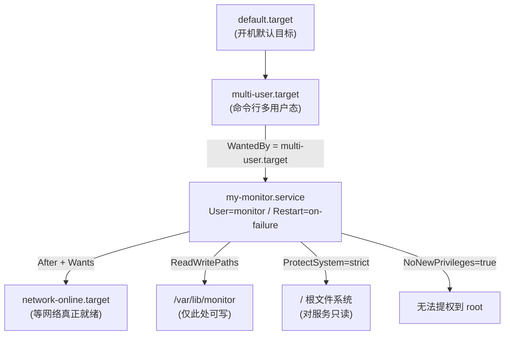
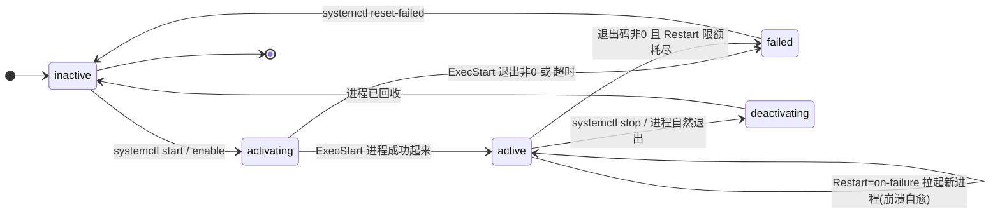

# 第 3 章 用户权限与 systemd 服务

> **定位**：你已经有一台能密钥登录、带 sudo 的实验机（第 1 章）。这一章，你要把「谁能干什么」这件事从模糊的直觉，变成**可设计、可约束、可审计**的工程能力——并亲手交付本章的核心作品：**一个以非 root 用户运行、由 systemd 管理的系统监控服务**。
>
> 这是 Ops 工程师日常最频繁接触的两块地基：身份与权限（谁以什么身份跑）、进程与服务治理（怎么让它稳定常驻、崩溃自愈、资源可控）。后面第 4 章的 LVM、第 5 章的巡检脚本、第 8 章的 GitOps 与可观测，全都要建立在「服务是这么被管起来的」这个认知上。
>
> | 项 | 值 |
> |---|---|
> | 周次 | 第 3～4 周 |
> | 建议学时 | 12～16 小时（讲解 4h / 实验 6h / 故障演练 3h / 复盘 3h） |
> | 核心作品 | 一个以专用低权限用户 `monitor` 运行、由 systemd 托管、带资源限制与 hardening 的系统监控服务 |
> | 完成标准 | 你能从零重建该服务；证明它以非 root 运行；能复现 2 个故障并修复；能回滚到已知好状态 |
> | 主线环境 | Rocky Linux 9.4（systemd 252）|
> | 对照环境 | Ubuntu 22.04.4 LTS / 24.04 LTS（Multipass 快速实验）|
> | 固定版本 | `node_exporter` **v1.8.2**；本书自写监控脚本 `sysmon` 见第 3 章内嵌代码块 |

**学习目标**
1. 说清楚 Linux 的「用户/组/进程」三者如何映射到 UID/GID，以及特权分离为何是安全基石；
2. 能创建专用低权限系统账户，并用 `/etc/sudoers.d/` 做最小授权；
3. 理解 systemd 既是 init（PID 1）又是服务管理器，能读懂并编写 `[Unit]/[Service]/[Install]` 单元文件；
4. 把一次监控任务落地为「非 root + systemd 托管 + 资源受限 +  hardened」的真实服务；
5. 建立本章贯穿全课程的运维反射：**改前备份 → 明确验证 → 故障有证据链 → 随时可回滚**。

> [!WARNING]
> 本章所有写盘、改 `/etc/passwd`/`/etc/sudoers`、动 systemd 的命令，只在**你自己可控、可重置的实验虚拟机**里执行。任何涉及 `userdel`、`sudoers`、单元文件的误操作，都可能让你失去 sudo 或让机器起不来。动之前在脑中回答五件事：**改了哪层状态？影响谁？怎么证明生效？失败时留了什么中间态？怎么还原？**

---

## 1. 原理讲解（Principles）

### 1.1 Linux 并不靠「密码」识别你，而靠「数字」

Linux 内核根本不认识「用户名」。它只认整数：**UID（用户 ID）和 GID（组 ID）**。你在命令行看到的 `root`、`ops`、`monitor` 只是 UID 的「人类可读别名」，由 `/etc/passwd` 做映射。

- **UID 0 = root**：内核里写死了「UID 0 拥有全部能力（capabilities）」。`root` 之所以无所不能，不是因为它叫 root，而是因为它的 UID 是 0。
- **普通 UID（如 1000+）**：受权限位、capabilities、SELinux 等层层约束。
- **系统账户（UID 通常 1～999，Rocky 9 常见 0～999 的 system 区间）**：专门给服务进程用，一般没有登录 Shell，不能交互登录。

> 心智模型：权限判断发生在内核里，判断依据是「当前进程的 effective UID/GID」，而不是「你刚才敲了什么名字」。这就是为什么 sudo 本质是「让你的进程临时以另一个 UID 运行」。

### 1.2 用户 / 组 / 进程 的映射关系

```text
用户名(alice) ── /etc/passwd ──▶ UID=1000 ─┐
                                            ├──▶ 进程(euid=1000) ──▶ 内核按 UID/GID 判权限
组名(appops)  ── /etc/group  ──▶ GID=1001 ─┘        │
                                                继承：fork 出的子进程拿到父进程同样的 euid/egid
                                                + 进程还可加入「附加组」(supplementary groups)
```

关键点：
- 一个用户可以属于**多个组**（一个主组 + 多个附加组）。权限检查时，内核会逐一比对「进程的有效 UID/GID 以及所有附加 GID」。
- 进程的身份（`ps` 里看到的 USER）来自**它启动时所在的 UID**，而不是你当前 Shell 的 UID。sudo 起的服务、systemd 的 `User=` 指定的服务，都是「换身份」的实例。

### 1.3 特权分离：为什么不一直用 root

长期用 root 干活的爆炸半径（blast radius）是「整台机器」。一次 `rm -rf $VAR/` 如果 `VAR` 为空，删的就是 `/`。一条有漏洞的服务被攻破，攻击者直接拿到 root。

**特权分离原则**：让每个进程只持有完成工作所必需的最小身份与权限。一个监控服务只需要「读 `/proc`、写自己的状态目录、监听本地端口」——它**完全不需要 root**。把它降权到 `monitor` 用户，等于给潜在的漏洞套了一层沙箱。

### 1.4 systemd：既是 init，又是服务管理器

传统 SysV init 只是一个「按序号跑脚本」的启动器。systemd 做了两件事，且是一体的：

1. **作为 init（PID 1）**：内核启动后第一个用户态进程，负责拉起整个系统、挂载文件系统、激活目标（target）。开机看到的 `multi-user.target`、`graphical.target` 就是 systemd 的「状态目标」。
2. **作为服务管理器**：用**单元（unit）文件**描述每一个服务/挂载/定时器/套接字，统一管理它们的启动顺序、依赖、崩溃重启、日志、资源限制。

```text
内核 ──▶ /sbin/init (即 systemd, PID 1)
              │
              ├─▶ 挂载 / 与必要文件系统
              ├─▶ 拉起 default.target
              │        └─▶ multi-user.target
              │                ├─▶ sshd.service
              │                ├─▶ my-monitor.service   ← 本章作品
              │                └─▶ ...其他服务
              └─▶ 接管所有子进程作为 cgroup 的父
```

> 为什么重要：正因为 systemd 是 PID 1 且管理 cgroup，它才能「强制」给每个服务套上你写的资源限制和 hardening 选项——这是老式 init 做不到的。

### 1.5 cgroup：systemd 给每个服务画的「资源笼子」

cgroup（control group）是内核特性，用来把一组进程按层级组织并限制它们的资源。systemd 把每个 service 放进自己的 cgroup 子树，你写的 `MemoryMax=`、`CPUWeight=` 等指令，最终翻译成 cgroup v2 的接口文件（如 `memory.max`、`cpu.weight`）。

```text
cgroup v2 层级（Rocky 9 / 新版 Ubuntu 默认 v2）
/system.slice/
   └─ my-monitor.service/        ← systemd 自动建
        ├─ memory.max   = 128M   (MemoryMax=)
        ├─ cpu.weight   = 50     (CPUWeight=)
        ├─ pids.max     = 200    (TasksMax=)
        └─ 进程(monitor, PID 12345)
```

> [!NOTE] 避坑：Rocky Linux 9 与 Ubuntu 22.04+ 默认都用 **cgroup v2**。极少数老镜像或特定容器环境仍是 v1，部分资源指令语义不同。用 `stat -fc %T /sys/fs/cgroup` 查看：输出 `cgroup2fs` 即 v2。本书指令以 v2 为准。

---

## 2. 架构（Architecture）

### 2.1 用户 / 组 / 进程 / 权限 映射图（ASCII）

```text
┌──────────────────────────────────────────────────────────────────────────┐
│  Linux 内核 (PID 1 = systemd)                                              │
│                                                                            │
│  uid=0 root ──(sudo 提权路径, 仅运维偶尔使用)──┐                           │
│                                                │ 切换身份                   │
│  ┌──────────────┐    ┌──────────────────┐     ▼                          │
│  │ 用户 monitor  │    │ 组 monitor        │  fork/exec                   │
│  │ uid=991      │    │ gid=991           │                              │
│  │ /sbin/nologin│    └────────┬─────────┘                              │
│  └──────┬───────┘             │ 组内权限(继承 GID)                       │
│         │ 进程以该身份运行      │                                          │
│         ▼                     ▼                                          │
│  ┌──────────────────────────────────────────────────────────────────┐   │
│  │ my-monitor.service 进程 (euid=991, egid=991, 附加组=[991])        │   │
│  │   • 受 systemd cgroup 限制: MemoryMax / CPUWeight / TasksMax      │   │
│  │   • 受 UGO/ACL 限制: 只能写 /var/lib/monitor (ReadWritePaths)     │   │
│  │   • ProtectSystem=strict ⇒ 整个 / 对它是只读 (除白名单)            │   │
│  │   • 监听 127.0.0.1:9101 (不暴露公网, 缩小攻击面)                  │   │
│  └──────────────────────────────────────────────────────────────────┘   │
│         │                           │                                      │
│         │ 写指标状态                │ 读                                    │
│         ▼                           ▼                                      │
│  /var/lib/monitor/state.json   /proc/{stat,meminfo,uptime,loadavg}        │
│  (monitor 拥有, 700)           (所有人可读, 内核接口)                      │
└──────────────────────────────────────────────────────────────────────────┘
```

### 2.2 systemd 单元依赖与启动顺序（mermaid）



> `After=` 只表达**启动顺序**，不等于依赖。要让「顺序」真正生效，通常要配合 `Wants=`/`Requires=`：`Wants=network-online.target` 表达「希望它先起来，但起不来我也不阻塞」；`Requires=` 则更硬——它失败我也失败。

### 2.3 服务生命周期（mermaid）



> 参考：[Arch Wiki — systemd（社区公认最系统的中文可读资料）](https://wiki.archlinux.org/title/systemd) ｜ [systemd 官方手册总目录](https://www.freedesktop.org/software/systemd/man/)

---

## 3. 部署（Deployment）—— 实验环境

本章主线在 **Rocky Linux 9.4**，对照实验用 **Multipass + Ubuntu 22.04 LTS**。两种环境命令几乎一致，差异处我会用「Rocky / Ubuntu」双行标注。

### 3.1 创建专用低权限监控账户

永远不要给监控服务 root。建一个**系统账户** `monitor`：无登录 Shell、家目录放在 `/var/lib/monitor`、唯一用途就是跑这个服务。

```bash
# 以下命令在【实验机内】以 root 或具 sudo 的 ops 用户执行（本书统一用 sudo 前缀表示需提权）
# 1) 创建系统用户 monitor：--system 表示系统账户(UID 落在系统区间)
#    --no-create-home 我们稍后手动建状态目录; --shell /sbin/nologin 禁止交互登录
sudo useradd --system \
             --home-dir /var/lib/monitor \
             --shell /sbin/nologin \
             --comment "Course system monitor service account" \
             monitor

# 2) 确认账户已建（getent 比直接 cat 文件更稳，能同时查本地与网络账户源）
getent passwd monitor
# 预期输出形如: monitor:x:991:991:Course system monitor service account:/var/lib/monitor:/sbin/nologin

# 3) 创建服务专属状态目录，并把它交给 monitor 拥有
sudo install -d -m 0700 -o monitor -g monitor /var/lib/monitor

# 4) 验证身份三件套：id / 家目录权限 / Shell
id monitor
ls -ld /var/lib/monitor
getent shadow monitor | cut -d: -f1,2   # 第二字段应为 !! 或 *（锁定的密码，禁止密码登录）
```

> [!CAUTION] 避坑：`/sbin/nologin` 不等于「不能运行进程」。它只是拒绝**交互登录**（提示 `This account is currently not available.`）。systemd 用 `User=monitor` 直接以该身份 `exec` 程序，根本不走登录流程，所以服务照样能跑。反之，如果你误用 `/bin/bash` 当服务账户 Shell，等于给一个本不该登录的账户开了交互后门。

**边界情况 1：账户已存在怎么办（幂等）？**
脚本化部署时必须考虑「重复执行」。用 `id` 做前置判断：

```bash
# 幂等创建：已存在就跳过，避免 useradd 报错中断脚本
if ! id -u monitor >/dev/null 2>&1; then
  sudo useradd --system --home-dir /var/lib/monitor --shell /sbin/nologin monitor
  sudo install -d -m 0700 -o monitor -g monitor /var/lib/monitor
  echo "monitor 账户已创建"
else
  echo "monitor 已存在，跳过创建"
fi
```

**边界情况 2：想让 monitor 也能读某个共享目录？**
不要把它塞进 `wheel`/`sudo`！正确做法是把它加入「只读数据组」，再用组权限或 ACL 授权：

```bash
# 例：监控需要读 /srv/app/logs（属主 root:appops, 组可读）
sudo groupadd -f appops                      # 确保组存在
sudo usermod -aG appops monitor              # -a 追加, 不覆盖原有附加组!
id monitor                                   # 确认附加组里出现了 appops
```

### 3.2 安装监控工具（双路线）

本章核心作品是「自写 `sysmon` 监控服务」（见第 4 章端到端示例）。但在真实生产里，你更可能直接部署成熟的 `node_exporter`。两条路线都给你，任选其一作为练习；**端到端交付物建议用自写 `sysmon`**，因为它完整覆盖 User=/Restart=/ hardening 每个字段。

#### 路线 A：部署 node_exporter（真实生产工具，对照学习）

`node_exporter` 把主机指标（CPU/内存/磁盘/网络）暴露成 Prometheus 格式。我们以**非 root、systemd 托管**方式部署。

```bash
# 固定版本: node_exporter v1.8.2（版本可能变动，以官方兼容矩阵为准）
# 详见 https://github.com/prometheus/node_exporter/releases
VER=1.8.2
ARCH=amd64
cd /tmp
curl -fsSLO "https://github.com/prometheus/node_exporter/releases/download/v${VER}/node_exporter-${VER}.linux-${ARCH}.tar.gz"

# ⚠ 生产务必校验 SHA256（从同版本 releases 页面的 sha256sums.txt 取对应行比对）
# sha256sum node_exporter-${VER}.linux-${ARCH}.tar.gz
tar -xzf "node_exporter-${VER}.linux-${ARCH}.tar.gz"
sudo install -m 0755 "node_exporter-${VER}.linux-${ARCH}/node_exporter" /usr/local/bin/node_exporter
node_exporter --version        # 确认版本与构建信息
```

> [!CAUTION] 避坑：node_exporter 默认监听 `:9100`。如果你同时跑多个 exporter 或云主机 9100 已被占用，启动会报 `address already in use`。本书自写 `sysmon` 特意改用 `9101` 规避冲突，并只绑 `127.0.0.1`。生产里记得用防火墙/安全组限制 9100 只对采集端开放。

#### 路线 B：直接用本书自写 sysmon（零外部依赖）

`sysmon` 仅用 Python 标准库，读 `/proc` 计算 CPU/内存/磁盘/运行时长，监听 `127.0.0.1:9101` 暴露 Prometheus 文本格式。完整代码见第 4.4 节，部署只需：

```bash
# Rocky / Ubuntu 都自带 python3（Rocky 9 为 3.9, Ubuntu 22.04 为 3.10）
python3 --version
# 把第 4.4 节的 sysmon.py 落地到 /usr/local/bin 并赋可执行
sudo install -m 0755 -o root -g root /tmp/sysmon.py /usr/local/bin/sysmon
sudo sysmon --help 2>&1 | head    # 先把脚本放好, 单元文件稍后在第 4 章编写
```

### 3.3 验证机已就绪（sanity check）

```bash
cat /etc/os-release | head -n 3     # 确认发行版( Rocky 9.4 / Ubuntu 22.04 )
systemctl --version | head -n 1     # 确认 systemd 版本( Rocky 252 / Ubuntu 249 )
stat -fc %T /sys/fs/cgroup          # 确认 cgroup v2 (应输出 cgroup2fs)
id monitor                          # 确认监控账户存在
```

> 参考：[Prometheus node_exporter 仓库](https://github.com/prometheus/node_exporter) ｜ [Rocky Linux 文档](https://docs.rockylinux.org/) ｜ [Multipass 文档](https://documentation.ubuntu.com/multipass/latest/)

---

## 4. 配置（Configuration）

### 4.1 `/etc/passwd` / `shadow` / `group` 字段含义

**`/etc/passwd`（所有人可读，不含密码）**——每行 7 字段，冒号分隔：

```text
monitor:x:991:991:Course system monitor service account:/var/lib/monitor:/sbin/nologin
│       │ │   │   │  │                                      │                │
│       │ │   │   │  │                                      │                └─ 登录 Shell( nologin=禁止交互登录)
│       │ │   │   │  │                                      └─ 家目录
│       │ │   │   │  └─ GECOS 注释(可为空, 描述用途)
│       │ │   │   └─ GID(主组 ID)
│       │ │   └─ UID(用户 ID, 0=root, 1-999 系统账户, 1000+ 普通用户)
│       │ └─ 密码占位符(固定为 x, 真正散列在 /etc/shadow)
│       └─ 用户名
```

**`/etc/shadow`（仅 root 可读，存密码散列与过期策略）**——9 字段：

```text
monitor:!!:19900:0:99999:7:::
│       │  │     │  │    │  │ │ │
│       │  │     │  │    │  │ │ └─ 保留/未用
│       │  │     │  │    │  │ └─ 账户失效日(空=不失效)
│       │  │     │  │    │  └─ 失效前警告天数
│       │  │     │  │    └─ 密码最长有效期(天)
│       │  │     │  └─ 密码最短有效期(0=随时可改)
│       │  │     └─ 上次改密日(距1970-01-01的天数)
│       │  └─ 密码散列( !! 表示锁定/无密码, * 表示禁用)
│       └─ 用户名
```

> [!NOTE] 避坑：系统账户 `monitor` 的 shadow 第二字段应是 `!!` 或 `*`（无有效密码、禁止密码登录）。如果你用 `passwd monitor` 给它设了密码，等于给它开了后门。服务不需要密码，**始终保持锁定**。

**`/etc/group`（组定义）**——4 字段：

```text
monitor:x:991:                 ← 组名:密码占位: GID: 以该组为附加组的用户列表(逗号分隔)
appops:x:1001:monitor,deploy   ← monitor 与 deploy 都把 appops 当附加组
```

查看某用户「实际生效的全部组」用 `id`，比看文件更准：

```bash
id monitor        # 显示 uid / 主 gid / 全部附加组
groups monitor    # 仅列组名
```

### 4.2 sudo 最小授权（用 `/etc/sudoers.d/`）

**永远不要**直接 `vim /etc/sudoers`——写错一个字符可能让你永久失去 sudo。正确姿势：用 `visudo` 编辑，或把规则放到 `/etc/sudoers.d/` 下的独立文件（系统会自动 include）。

```bash
# 1) 为监控运维组 appops 授权「只许查 my-monitor 的状态与日志」, 不可启停其他服务
#    用 visudo -f 安全地写(会自动做语法校验, 错则拒绝保存)
sudo visudo -f /etc/sudoers.d/monitor-ops
```

文件内容（注意路径写绝对路径，且命令精确）：

```sudoers
# /etc/sudoers.d/monitor-ops
# 授权 appops 组成员: 仅可查看 my-monitor 状态/日志, 不可改其他服务
# 语法: 谁  在哪台主机=(以谁身份)  允许执行的命令
%appops ALL=(root) /usr/bin/systemctl status my-monitor.service, \
                     /usr/bin/systemctl status my-monitor, \
                     /usr/bin/journalctl -u my-monitor.service, \
                     /usr/bin/journalctl -u my-monitor
```

授权后验证（以属于 appops 的 ops 用户执行）：

```bash
sudo -l                              # 列出当前用户被授权可执行的命令
sudo systemctl status my-monitor    # 应允许
sudo systemctl restart sshd          # 应被拒: 不在授权列表
```

> [!WARNING] 避坑：以下写法**等价于把整台机器交给对方**，绝对禁止出现在最小授权里：
> - `%appops ALL=(ALL) ALL` —— 全员全权（仅适合你个人的 admin 账户，不适合服务运维组）
> - `%appops ALL=(root) /usr/bin/vim /etc/*` —— 能编辑任意文件 = 能改 sudoers 自我提权
> - `%appops ALL=(root) /usr/bin/systemctl *` —— 通配符让对方能 `systemctl restart` 任意服务乃至 `systemctl` 自身
> 最小授权原则：**命令精确到参数，宁可多写几行，也不用一个通配符**。

**边界情况：免密 sudo（谨慎）**
监控巡检脚本常需非交互执行 `journalctl -u my-monitor`。可在该条命令后加 `NOPASSWD:`：

```sudoers
%appops ALL=(root) NOPASSWD: /usr/bin/journalctl -u my-monitor.service
```
> 只在「自动化脚本确需」时授予，且命令必须精确。不要对 `ALL` 用 `NOPASSWD`。

### 4.3 编写完整 systemd 单元文件

这是本章的核心交付物。我们在 `/etc/systemd/system/my-monitor.service` 写一个**非 root + 自愈 + 资源受限 + hardened** 的完整单元。

> 先备份目录再落盘，养成「改前留退路」的反射：
> ```bash
> sudo cp -a /etc/systemd/system /etc/systemd/system.bak.$(date +%F_%H%M)
> ```

完整的 `/etc/systemd/system/my-monitor.service`（内嵌，无需另建文件）：

```ini
[Unit]
# === 单元元信息 ===
Description=Course system monitor (sysmon)        # 服务描述, status 时可见
Documentation=file:///usr/local/bin/sysmon         # 文档位置(可选)

# === 启动顺序与依赖 ===
# After= 只定顺序, Wants= 表达"希望先就绪但不强依赖"
Wants=network-online.target                        # 希望网络先起来(软依赖)
After=network-online.target                        # 在网络就绪后再启动本服务
# 注意: 本服务不依赖数据库/磁盘挂载, 故不写 Requires=, 避免被无关故障拖垮

[Service]
# === 进程身份(特权分离核心) ===
User=monitor                                      # 以低权限系统账户运行, 绝不用 root
Group=monitor                                     # 以 monitor 组运行

# === 启动行为 ===
Type=simple                                       # 前台进程, ExecStart 不 fork 即视为已启动
ExecStart=/usr/local/bin/sysmon                   # 必须用绝对路径! systemd 不读 PATH
# 如需传参: ExecStart=/usr/local/bin/sysmon --port 9101
Restart=on-failure                                # 仅在非正常退出(码≠0/被信号杀)时重启
RestartSec=5s                                     # 重启前等 5 秒, 避免疯狂重启打满日志
# StartLimitBurst=5 与 StartLimitInterval=60s 默认存在: 60 秒内失败 5 次进入 failed, 防雪崩

# === 进程环境(避坑: systemd 不继承你的交互 Shell 环境) ===
# 本服务用环境变量配置, 必须显式声明; 也可用 EnvironmentFile=/etc/sysmon/env
Environment=SYSMON_PORT=9101
Environment=SYSMON_BIND=127.0.0.1
Environment=SYSMON_STATE_DIR=/var/lib/monitor
Environment=SYSMON_INTERVAL=10

# === 资源限制(cgroup v2, 见第 6 章) ===
MemoryMax=128M                                    # 内存硬上限, 超限被 OOM 杀(保护整机)
CPUWeight=50                                      # CPU 权重(1-10000, 默认100), 低优先级
TasksMax=200                                      # 最大进程/线程数, 防 fork 炸弹
IOWeight=50                                       # 块 IO 权重

# === 安全加固(systemd hardening, 见第 10 章) ===
NoNewPrivileges=true                              # 禁止进程通过 setuid/文件能力提权
PrivateTmp=true                                   # 用私有 /tmp, 不与其他服务共享临时文件
ProtectSystem=strict                              # 整个 / 文件系统对服务只读
ProtectHome=true                                  # /home /root /run/user 不可见
ReadWritePaths=/var/lib/monitor                    # 在只读基础上, 仅放开状态目录可写
ProtectKernelTunables=true                        # 禁止改内核参数(sysctl)
ProtectKernelModules=true                         # 禁止加载/卸载内核模块
ProtectControlGroups=true                        # 禁止改 cgroup
RestrictSUIDSGID=true                             # 禁止创建 setuid/setgid 文件
LockPersonality=true                              # 锁定 personality 系统调用
CapabilityBoundingSet=                           # 清空所有 Linux capabilities(监控不需要)
AmbientCapabilities=
SystemCallFilter=@system-service                  # 只允许"系统服务"白名单系统调用
SystemCallErrorNumber=EPERM                       # 命中非白名单调用返回 EPERM 而非杀进程

[Install]
# === 开机启用目标 ===
WantedBy=multi-user.target                        # enable 后, 在 multi-user.target 下被拉起
```

写入文件（内嵌 heredoc，注意用 `sudo tee`，因为 `/etc/systemd/system` 仅 root 可写）：

```bash
sudo tee /etc/systemd/system/my-monitor.service >/dev/null <<'EOF'
[Unit]
Description=Course system monitor (sysmon)
Documentation=file:///usr/local/bin/sysmon
Wants=network-online.target
After=network-online.target

[Service]
User=monitor
Group=monitor
Type=simple
ExecStart=/usr/local/bin/sysmon
Restart=on-failure
RestartSec=5s
Environment=SYSMON_PORT=9101
Environment=SYSMON_BIND=127.0.0.1
Environment=SYSMON_STATE_DIR=/var/lib/monitor
Environment=SYSMON_INTERVAL=10
MemoryMax=128M
CPUWeight=50
TasksMax=200
IOWeight=50
NoNewPrivileges=true
PrivateTmp=true
ProtectSystem=strict
ProtectHome=true
ReadWritePaths=/var/lib/monitor
ProtectKernelTunables=true
ProtectKernelModules=true
ProtectControlGroups=true
RestrictSUIDSGID=true
LockPersonality=true
CapabilityBoundingSet=
AmbientCapabilities=
SystemCallFilter=@system-service
SystemCallErrorNumber=EPERM

[Install]
WantedBy=multi-user.target
EOF

# 改完必须让 systemd 重新加载单元定义
sudo systemctl daemon-reload
# 上线前先用 systemd-analyze 校验语法
sudo systemd-analyze verify /etc/systemd/system/my-monitor.service
```

> [!CAUTION] 避坑：`systemd-analyze verify` 报 `--` 警告（如「Unit my-monitor.service is not a dependency of any unit」）通常是无害提示，但若有 **error** 级别必须修掉再 `daemon-reload`。真正致命的是 `ExecStart` 路径不存在或 `User=` 指向不存在的账户——后者会让服务直接 `failed`。

### 4.4 监控程序本体 `sysmon.py`（内嵌，零依赖）

把下面整个文件落到 `/usr/local/bin/sysmon`（仅标准库，读 `/proc`）。

```python
#!/usr/bin/env python3
# sysmon.py —— 第3章端到端示例：以非 root 用户运行的轻量系统监控服务
# 仅用 Python 标准库；监听 127.0.0.1:9101，暴露 Prometheus 文本格式指标
# 设计要点：后台采样线程周期性刷新指标 → HTTP 处理器只读缓存(不阻塞请求)
import json
import os
import signal
import subprocess
import threading
import time
from http.server import BaseHTTPRequestHandler, ThreadingHTTPServer

STATE_DIR = os.environ.get("SYSMON_STATE_DIR", "/var/lib/monitor")
METRICS_PORT = int(os.environ.get("SYSMON_PORT", "9101"))
BIND_ADDR = os.environ.get("SYSMON_BIND", "127.0.0.1")
INTERVAL = float(os.environ.get("SYSMON_INTERVAL", "10"))

_stop = threading.Event()          # 优雅退出标志
_lock = threading.Lock()           # 保护指标缓存
_metrics = {"cpu": 0.0, "mem_pct": 0.0, "dpct": 0.0, "up": 0.0, "updated": 0.0}
_prev = None                       # 上一次 /proc/stat 的 (idle, total)


def read_cpu_stat():
    """读取 /proc/stat 第一行(汇总), 返回 (idle_ticks, total_ticks)"""
    with open("/proc/stat") as f:
        line = f.readline()
    vals = list(map(int, line.split()[1:]))   # 跳过 'cpu' 前缀
    # 字段: user nice system idle iowait irq softirq steal guest guest_nice
    idle = vals[3] + vals[4]                   # idle + iowait
    total = sum(vals[:8])                       # 取前 8 项(含 steal)
    return idle, total


def read_mem():
    info = {}
    with open("/proc/meminfo") as f:
        for line in f:
            k, v = line.split(":", 1)
            info[k.strip()] = int(v.split()[0])  # 单位 kB
    total = info.get("MemTotal", 0)
    avail = info.get("MemAvailable", info.get("MemFree", 0))
    used = total - avail
    pct = round(100.0 * used / total, 2) if total else 0.0
    return used, total, pct


def read_disk():
    # df -P / 输出第二行为根分区统计
    out = subprocess.check_output(["df", "-P", "/"], text=True).splitlines()
    parts = out[1].split()
    used = int(parts[2]); avail = int(parts[3]); pct = int(parts[4].rstrip("%"))
    return used, avail, pct


def read_uptime():
    with open("/proc/uptime") as f:
        return float(f.readline().split()[0])


def sample_once():
    """后台线程周期性调用：刷新 _metrics 缓存"""
    global _prev
    idle, total = read_cpu_stat()
    cpu = 0.0
    if _prev:
        td = total - _prev[1]
        id_ = idle - _prev[0]
        if td > 0:
            cpu = round(100.0 * (td - id_) / td, 2)   # 两次采样的空闲差占比反推使用率
    _prev = (idle, total)
    _, _, mem_pct = read_mem()
    _, _, dpct = read_disk()
    up = read_uptime()
    with _lock:
        _metrics.update(cpu=cpu, mem_pct=mem_pct, dpct=dpct, up=up, updated=time.time())


def write_state():
    """把状态落盘到 ReadWritePaths 白名单目录, 证明服务确实能写"""
    os.makedirs(STATE_DIR, exist_ok=True)
    path = os.path.join(STATE_DIR, "state.json")
    with open(path, "w") as f:
        with _lock:
            json.dump({"updated": _metrics["updated"], "pid": os.getpid()}, f)


def sampler_loop():
    sample_once()                       # 启动即先采一次, 避免首请求全 0
    while not _stop.is_set():
        try:
            sample_once()
            write_state()
        except Exception as e:
            print(f"WARN sampler error: {e}", flush=True)
        _stop.wait(INTERVAL)


def build_metrics():
    with _lock:
        m = dict(_metrics)
    lines = [
        "# HELP node_cpu_usage_percent CPU 使用率(0-100)",
        "# TYPE node_cpu_usage_percent gauge",
        f"node_cpu_usage_percent {m['cpu']}",
        "# HELP node_mem_used_percent 内存使用率(0-100)",
        "# TYPE node_mem_used_percent gauge",
        f"node_mem_used_percent {m['mem_pct']}",
        "# HELP node_disk_root_used_percent 根分区使用率(0-100)",
        "# TYPE node_disk_root_used_percent gauge",
        f"node_disk_root_used_percent {m['dpct']}",
        "# HELP node_uptime_seconds 系统运行时长(秒)",
        "# TYPE node_uptime_seconds counter",
        f"node_uptime_seconds {m['up']:.0f}",
    ]
    return "\n".join(lines) + "\n"


class Handler(BaseHTTPRequestHandler):
    def do_GET(self):
        if self.path != "/metrics":
            self.send_response(404); self.end_headers(); return
        data = build_metrics().encode("utf-8")
        self.send_response(200)
        self.send_header("Content-Type", "text/plain; version=0.0.4")
        self.send_header("Content-Length", str(len(data)))
        self.end_headers()
        self.wfile.write(data)

    def log_message(self, *args):
        pass  # 静默访问日志, 全部交给 journald


def main():
    # 优雅退出：收到 SIGTERM( systemctl stop 发送) 即停止采样并关闭服务器
    def handle_term(*_):
        _stop.set()
    signal.signal(signal.SIGTERM, handle_term)
    signal.signal(signal.SIGINT, handle_term)

    t = threading.Thread(target=sampler_loop, daemon=True)
    t.start()

    server = ThreadingHTTPServer((BIND_ADDR, METRICS_PORT), Handler)
    print(f"sysmon listening on {BIND_ADDR}:{METRICS_PORT}", flush=True)
    try:
        server.serve_forever()
    finally:
        server.shutdown()
        print("sysmon stopped gracefully", flush=True)


if __name__ == "__main__":
    main()
```

落地与赋权：

```bash
# 把上面整段(从 #!/usr/bin/env python3 到 if __name__ == "__main__")写入 /usr/local/bin/sysmon
# 这里假设你已通过编辑器/剪贴板放到 /tmp/sysmon.py
sudo install -m 0755 -o root -g root /tmp/sysmon.py /usr/local/bin/sysmon
sudo python3 -c "import py_compile,sys; py_compile.compile('/usr/local/bin/sysmon', doraise=True); print('语法 OK')"
```

> [!NOTE] 避坑：`/usr/local/bin/sysmon` 必须是 **root 拥有 + 755**，且 `monitor` 用户**只能读/执行、不能写**。否则 `ProtectSystem=strict` 下虽仍可运行，但若文件属主是 `monitor` 且可写，等于服务能自我篡改二进制—— hardening 的意义就丢了。

### 4.5 日志轮转（logrotate）

systemd 服务默认日志进 **journald**（结构化、带服务名/优先级/时间戳）。但 journald 本身有大小上限（`/etc/systemd/journald.conf` 的 `SystemMaxUse`）。对会产生文件日志的服务，仍建议配 `logrotate`。本章 sysmon 走 stdout→journald，无需文件轮转；下面给一个**通用模板**，供你以后接文件日志参考：

```text
# /etc/logrotate.d/my-monitor  (内嵌示例, 非本章必需)
/var/log/my-monitor/*.log {
    daily                   # 每天轮转
    missingok               # 日志不存在也不报错
    rotate 14               # 保留 14 份(约两周)
    compress                # 轮转后 gzip
    delaycompress           # 延迟一轮再压缩(保证当前日志可查)
    notifempty              # 空文件不轮转
    copytruncate            # 拷贝后截断原文件, 适合不能发信号重开的程序
    su monitor monitor      # 以 monitor 身份操作(契合低权限)
}
```

> 若服务用 journald（推荐），直接用 `journalctl --vacuum-size=200M` 控制 journal 体积即可，不必再叠文件轮转。

---

## 5. 验证（Verification）

每次变更后，用**明确命令**证明结果正确——这是 Ops 的基本功。

```bash
# 1) 启用并立即启动
sudo systemctl enable --now my-monitor.service

# 2) 状态是否 active(running)
systemctl status my-monitor.service --no-pager
# 预期: Active: active (running) 且 Main PID 行显示 monitor 用户

# 3) 是否开机自启(enabled)
systemctl is-enabled my-monitor.service      # 预期: enabled

# 4) 看实时日志(跟随模式)
sudo journalctl -u my-monitor.service -f
# 预期: 看到 "sysmon listening on 127.0.0.1:9101"

# 5) 关键证据: 进程到底以谁的身份在跑?(不只是 status 显示, 用 ps 二次确认)
ps -eo pid,user,uid,cmd | grep -F '[s]ysmon'
# 预期: USER=monitor, UID=991(或你的 monitor 实际 UID), 绝不能是 root/0

# 6) 更硬的证据: 直接读 /proc/<PID>/status 的 Uid/Gid
PID=$(pgrep -f /usr/local/bin/sysmon | head -1)
grep -E '^(Name|Uid|Gid)' /proc/$PID/status
# Uid: 991 991 991 991  (real/effective/saved/fs 都应是 monitor, 不是 0)

# 7) 指标接口是否真在出数
curl -s http://127.0.0.1:9101/metrics | head
# 预期: node_cpu_usage_percent / node_mem_used_percent 等数值行

# 8) 状态文件是否真的写到了 monitor 专属目录(验证 ReadWritePaths 生效)
sudo ls -l /var/lib/monitor/state.json
```

**验收清单（本章交付物检查）**

- [ ] `monitor` 系统账户已建，Shell 为 `/sbin/nologin`，shadow 密码字段锁定
- [ ] `/var/lib/monitor` 由 `monitor:monitor` 拥有，权限 700
- [ ] `/etc/sudoers.d/monitor-ops` 已授权且仅限 `my-monitor` 相关命令
- [ ] `my-monitor.service` 通过 `systemd-analyze verify`
- [ ] 服务 `active (running)` 且 `enabled`
- [ ] `ps`/`/proc/<PID>/status` 双重确认进程 **UID ≠ 0**
- [ ] `curl /metrics` 能取到指标
- [ ] 日志经 journald 可查（`journalctl -u`）
- [ ] 已对单元目录做改前备份（`/etc/systemd/system.bak.*`）

---

## 6. 性能（Performance）—— 给服务画资源笼子

第 1 章我们建立了「先有基线，才有异常」的习惯。这一章更进一步：**用 systemd 把每个服务的资源上限写死**，让一个失控的服务永远拖不垮整机。

### 6.1 cgroup 资源限制实战

我们在单元里写的 `MemoryMax`/`CPUWeight`/`TasksMax` 已经生效。验证它真的被套上了：

```bash
# 查看该服务实际的 cgroup 资源值(Rocky 9 / cgroup v2)
PID=$(pgrep -f /usr/local/bin/sysmon | head -1)

# 内存上限 -> 对应 cgroup memory.max
cat /proc/$PID/cgroup                                  # 找到所属 cgroup 路径
# 形如: 0::/system.slice/my-monitor.service
sudo cat /sys/fs/cgroup/system.slice/my-monitor.service/memory.max
# 预期输出: 134217728  (即 128M 字节数)

# CPU 权重 -> cpu.weight
sudo cat /sys/fs/cgroup/system.slice/my-monitor.service/cpu.weight
# 预期: 50

# 任务数上限 -> pids.max
sudo cat /sys/fs/cgroup/system.slice/my-monitor.service/pids.max
# 预期: 200
```

**制造一次「内存超限」观察（实验机内，安全）**：临时把 `MemoryMax` 调到极小，触发 OOM，看 systemd 如何按 `Restart=on-failure` 自愈：

```bash
# 临时覆盖(不改动原文件): 用 drop-in 片段
sudo mkdir -p /etc/systemd/system/my-monitor.service.d
sudo tee /etc/systemd/system/my-monitor.service.d/oom-test.conf >/dev/null <<'EOF'
[Service]
MemoryMax=8M        # 故意压到 8M, 让 Python 解释器很快超限额
EOF
sudo systemctl daemon-reload
sudo systemctl restart my-monitor.service

# 观察: 服务会反复被 OOM killer 杀掉并重启, 整机其他服务不受影响
sudo journalctl -u my-monitor.service --since "1 min ago" --no-pager | tail -n 20
# 你会看到 "Killed" / "Main process exited, code=killed, status=9/KILL" 然后自动重启

# 清理实验覆盖, 恢复正常
sudo rm -rf /etc/systemd/system/my-monitor.service.d/oom-test.conf
sudo systemctl daemon-reload
sudo systemctl restart my-monitor.service
```

> [!CAUTION] 避坑：`MemoryMax` 是**硬上限**，超限直接 OOM 杀死（exit status 137）。如果你希望「软限制、接近时告警而非杀」，用 `MemoryHigh=`（cgroup v2 软上限）。生产里常两者配合：`MemoryHigh=100M`（预警线）+ `MemoryMax=128M`（不可越红线）。

### 6.2 服务启动耗时（systemd-analyze）

```bash
# 整机启动各单元耗时排行(找出开机慢的服务)
systemd-analyze blame | head -n 10

# 单个服务的启动耗时
systemd-analyze critical-chain my-monitor.service
# 因本服务简单, 通常 <100ms; 若你后续加了 Wants=network-online.target
# 且网络久等, 这里会显示卡在 network-online 上

# 校验单元文件本身的潜在风险/性能提示
systemd-analyze verify /etc/systemd/system/my-monitor.service
```

### 6.3 基线采集（延续第 1 章习惯）

```bash
echo "==== 监控服务基线 $(date) ===="
systemctl show my-monitor.service -p MemoryCurrent -p TasksCurrent -p CPUUsageNSec
# MemoryCurrent: 当前常驻内存; TasksCurrent: 当前任务数; CPUUsageNSec: 累计 CPU 纳秒
curl -s http://127.0.0.1:9101/metrics | grep -E 'node_(cpu|mem|disk)'
# 把上述输出存进实验报告, 作为"健康指纹"
```

---

## 7. 故障（Troubleshooting）—— 故障演练

> 目标：主动制造 3 类真实事故，再用 journald 证据链定位修复。做过，真实出事就不慌。所有演练都在已打快照的实验机上进行。

标准排错链（记住这个顺序）：

```text
服务状态(systemctl status) → 最近日志(journalctl -u) → 单元内容(cat unit)
   → 手动运行(以正确身份 ExecStart) → 权限/路径(ls/namei/stat)
   → 依赖(target 是否 up) → SELinux/防火墙/端口(netstat/ss)
```

### 演练 7.1：单元文件写错，导致启动失败

```bash
# 步骤 1：故意写坏——把 ExecStart 指向不存在的路径
sudo sed -i 's#^ExecStart=.*#ExecStart=/usr/local/bin/sysmon-WRONG-PATH#' /etc/systemd/system/my-monitor.service
sudo systemctl daemon-reload
sudo systemctl restart my-monitor.service
# 现象: 启动失败

# 步骤 2：收集证据链
systemctl status my-monitor.service --no-pager
# 预期: Active: failed; 提示 "Executable path ... does not exist"
sudo journalctl -u my-monitor.service --since "2 min ago" --no-pager | tail -n 15
# 日志明确: "my-monitor.service: Executable /usr/local/bin/sysmon-WRONG-PATH not found"

# 步骤 3：修复——还原正确的 ExecStart
sudo sed -i 's#^ExecStart=.*#ExecStart=/usr/local/bin/sysmon#' /etc/systemd/system/my-monitor.service
sudo systemctl daemon-reload
sudo systemctl restart my-monitor.service
systemctl is-active my-monitor.service      # 预期: active
```

> [!NOTE] 避坑：改了单元文件**必须** `daemon-reload`，否则 systemd 还在用内存里的旧定义，`restart` 不会生效，你会以为没改对、反复改——这是新手最常见的「改了没反应」。

### 演练 7.2：权限不足，服务无法写状态文件

```bash
# 步骤 1：制造故障——把状态目录改成 root 拥有, monitor 不可写
sudo chown root:root /var/lib/monitor
sudo chmod 700 /var/lib/monitor
sudo systemctl restart my-monitor.service
# 现象: 服务起来后, 采样线程写 state.json 失败, 日志刷 WARN, 但进程可能仍在(取决于代码是否吞异常)

# 步骤 2：证据链
sudo journalctl -u my-monitor.service --no-pager | grep -i 'warn\|error\|permission'
# 预期: "WARN sampler error: [Errno 13] Permission denied: '/var/lib/monitor/state.json'"
namei -l /var/lib/monitor/state.json        # 逐层看权限, 一眼看出 monitor 卡在哪一级
# 输出会标红 monitor 无权进入/写入 /var/lib/monitor

# 步骤 3：修复——归还归属
sudo chown monitor:monitor /var/lib/monitor
sudo chmod 700 /var/lib/monitor
sudo systemctl restart my-monitor.service
sudo journalctl -u my-monitor.service -n 3 --no-pager   # 确认 WARN 消失
```

> [!CAUTION] 避坑：路径上**每一级目录**都需要执行（x）权限。常见误区是只改了最终文件归属，却忘了父目录 `/var/lib` 对 `monitor` 是否可遍历。用 `namei -l` 一次性看穿整条路径，比逐个 `ls -ld` 高效得多。

### 演练 7.3：端口被占用（Bonus）

```bash
# 步骤 1：抢先占住 9101
python3 -c "import socket;s=socket.socket();s.setsockopt(socket.SOL_SOCKET,socket.SO_REUSEADDR,1);s.bind(('127.0.0.1',9101));s.listen();import time;time.sleep(600)" &
echo "占用进程 PID=$!"

# 步骤 2：重启服务 -> 绑定失败
sudo systemctl restart my-monitor.service
systemctl status my-monitor.service --no-pager | grep -i 'address already\|bind'
# 日志: "OSError: [Errno 98] Address already in use"

# 步骤 3：定位占用者并释放(生产中应先确认占用者是否该存在!)
sudo ss -lntp | grep 9101          # 找到占用 PID
sudo journalctl -u my-monitor.service -n 5 --no-pager
kill %1                            # 杀掉我们自己的测试占用(真实环境要谨慎!)
sudo systemctl restart my-monitor.service
```

> 真实环境里「端口被占」多半是因为**上一个实例没真正退出**（僵尸/守护线程残留）。先 `systemctl stop` + `pgrep` 确认进程清空，再启动，避免「以为是端口冲突、其实是自己没退干净」。

---

## 8. 回滚（Rollback）

Ops 不怕改错，怕的是改错了回不来。本章给你三条回滚通道。

### 方式一：单元文件改前备份还原（最快，推荐）

```bash
# 还原整个 systemd 单元目录(第 4.3 节我们做过备份)
sudo cp -a /etc/systemd/system.bak.*/system /etc/systemd/system 2>/dev/null || \
  sudo cp -a /etc/systemd/system.bak.*/my-monitor.service /etc/systemd/system/
sudo systemctl daemon-reload
sudo systemctl restart my-monitor.service
```

如果只备份了单文件：

```bash
# 假设备份名为 /etc/systemd/system/my-monitor.service.bak.2026-09-04_1906
sudo cp -a /etc/systemd/system/my-monitor.service.bak.2026-09-04_1906 \
          /etc/systemd/system/my-monitor.service
sudo systemctl daemon-reload
sudo systemctl restart my-monitor.service
```

### 方式二：服务版本回退（程序本体）

```bash
# 若你升级过 sysmon 出新 bug, 回退到上一版二进制
sudo cp -a /usr/local/bin/sysmon /usr/local/bin/sysmon.broken   # 先留证
sudo cp -a /usr/local/bin/sysmon.v1 /usr/local/bin/sysmon       # 还原旧版
sudo systemctl restart my-monitor.service
systemctl is-active my-monitor.service
```

### 方式三：disable + 恢复初始态

```bash
# 彻底停服并取消开机自启(重大回退/迁移前)
sudo systemctl disable --now my-monitor.service
# 恢复: 重新启用
sudo systemctl enable --now my-monitor.service

# 若服务卡在 failed 且重启无效, 先清 failed 标记再处理
sudo systemctl reset-failed my-monitor.service
```

> 复盘模板（写进实验报告）：**改了哪层？** systemd 单元 ／ **证据？** `systemd-analyze verify` 通过 + `status` 显示 active ／ **失败时留的中间态？** `.bak` 文件 + `systemctl status failed` ／ **影响范围？** 仅本服务，整机其他服务不受影响（因有 cgroup 隔离）／ **如何回滚？** 还原 `.bak` 或快照。

---

## 9. 灾备（Disaster Recovery）

快照是「本机可恢复」，灾备是「机器没了也能恢复」。本章把**身份与服务的全部定义**纳入版本控制。

```bash
# 1) 把以下「可重建定义」纳入 Git 仓库存 Runbook(不要存私钥/密码!)
#      - /etc/systemd/system/my-monitor.service
#      - /etc/sudoers.d/monitor-ops
#      - sysmon.py 本体(或指向其 Git 源)
#      - 用户/组定义脚本(创建 monitor 的幂等片段, 见第 3.1)
#    ⚠ shadow 第二字段为锁定的 !!/*, 不泄露密码, 可安全入库; 但若你设了真实密码散列切勿入库

# 2) 理想状态: 一段「重建脚本」能从零复现整个服务
#    把第 3.1(建用户) + 第 4.3(写 unit) + 第 4.4(落 sysmon) 串成一个幂等脚本
#    这样换一台新实验机, 一条命令即可重建本章作品

# 3) 3-2-1 原则的最小实践(后续章节深化):
#      3 份副本 / 2 种介质 / 1 份异地
#    本章先做到: 本地快照(副本1) + 配置 Git 远程(副本2/异地雏形)

# 4) 重建验证(灾难后必须能跑通):
#    git clone <你的runbook> && bash deploy-monitor.sh && systemctl status my-monitor
```

> 参考：[Learn Linux TV — 备份与灾备思路（GitHub Topics 聚合）](https://github.com/topics/backup)

---

## 10. 安全（Security）

把前面零散的配置上升为**原则**。

| 原则 | 本章落地 | 为什么 |
|---|---|---|
| 最小权限 | `User=monitor` 非 root + `ProtectSystem=strict` | 爆炸半径=一个监控账户，不是整机 |
| 专用低特权账户 | `monitor` 系统账户、`/sbin/nologin`、密码锁定 | 服务账户≠人，不该能登录 |
| sudo 最小授权 | `/etc/sudoers.d/` 精确到命令参数 | 运维组只能看监控，不能动其他服务 |
| 攻击面收敛 | 绑 `127.0.0.1`、仅开方需端口 | 监控指标不暴露公网 |
| 纵深防御 | `NoNewPrivileges` + `CapabilityBoundingSet=` + `SystemCallFilter` | 即便被攻破也提不了权 |
| 资源隔离 | cgroup `MemoryMax`/`TasksMax` | 一个服务失控拖不垮整机 |
| 可恢复 | 备份 `.bak` + 快照 + Git Runbook | 改坏能回家 |

### 10.1 systemd hardening 选项详解（避坑融入）

```ini
NoNewPrivileges=true        # 进程及其子进程不能通过 exec setuid 程序/文件能力获得新特权
PrivateTmp=true             # 给服务一个私有的 /tmp(挂载命名空间), 防 /tmp  symlink 攻击
ProtectSystem=strict        # 整个 / 只读; 需要写的路径必须用 ReadWritePaths 显式放开
ProtectHome=true            # 隐藏 /home /root /run/user, 服务看不到用户私密数据
ReadWritePaths=/var/lib/monitor   # 在只读基础上, 仅此目录可写(白名单思维)
CapabilityBoundingSet=      # 清空 Linux capabilities(监控只需读 /proc, 无需任何 cap)
SystemCallFilter=@system-service   # 只允许"系统服务"系统调用白名单, 其余返回 EPERM
RestrictSUIDSGID=true       # 禁止创建 setuid/setgid 文件, 堵死常见提权后门
ProtectKernelTunables=true  # 禁止写 /proc/sys 等内核参数
ProtectKernelModules=true   # 禁止加载/卸载内核模块
ProtectControlGroups=true   # 禁止修改 cgroup(防止逃逸/提权)
```

> [!WARNING] 避坑：`ProtectSystem=strict` 之后，如果你的程序**必须**写 `/var/log` 或 `/etc`，它会被拒绝。正确做法是用 `ReadWritePaths=` 逐路径放开，而不是退回到 `ProtectSystem=false`。另外 `SystemCallFilter` 若设得太狠（如 `@raw-io` 类型调用被禁），某些程序会崩；先用 `SystemCallErrorNumber=EPERM` 让它「报错而非被杀」，观察日志再微调白名单。

> [!CAUTION] 避坑：`CapabilityBoundingSet=` 写成空值时，**等号后必须留空或跟具体能力**，不要写成 `CapabilityBoundingSet` 无值行（会被当成保留全部）。本书写法 `CapabilityBoundingSet=` 后接空，即清空，是正确的。

### 10.2 最小权限自查清单

```bash
# 服务运行时, 确认它没有拿到任何多余能力
PID=$(pgrep -f /usr/local/bin/sysmon | head -1)
grep CapEff /proc/$PID/status          # 预期: 0000000000000000 (无任何 capability)
# 若不是全 0, 说明 hardening 没生效, 回头查 NoNewPrivileges/CapabilityBoundingSet

# 确认它看不到 /home(ProtectHome 生效)
sudo -u monitor ls /home 2>&1 | head -n1   # 预期: 空或 Permission denied
```

---

## 11. 自测题与参考答案

### 自测题

1. Linux 内核识别进程身份依靠的是：A) 用户名  B) UID/GID  C) 登录密码  D) 家目录路径
2. 为什么监控服务应该以专用低权限账户（如 `monitor`）运行，而不是 root？
3. `After=network-online.target` 是否等同于「强依赖网络必须起来」？若要让「网络起不来就别启动我」，该配什么？
4. 改完 `/etc/systemd/system/my-monitor.service` 后，为什么**必须** `systemctl daemon-reload`？只 `restart` 会怎样？
5. `/etc/sudoers.d/monitor-ops` 里写 `%appops ALL=(root) /usr/bin/systemctl *` 有什么灾难性后果？
6. 服务 `active (running)`，但 `curl 127.0.0.1:9101/metrics` 连不上。请列出至少 3 个可能原因及对应排查命令。
7. `MemoryMax=128M` 与 `MemoryHigh=100M` 有什么区别？超限时分别发生什么？
8. 你用 `ps` 看到 sysmon 的 USER 是 `monitor`，但 `grep Uid /proc/<PID>/status` 显示 `Uid: 0 0 0 0`。这说明什么？问题可能出在哪？
9. `ProtectSystem=strict` 下程序需要写 `/var/log/my-monitor/`，正确做法是什么？为什么不该直接设 `ProtectSystem=false`？
10. 端口 9101 启动报 `Address already in use`，但 `ss -lntp | grep 9101` 没结果。最可能的原因是什么？怎么确认？
11. 服务反复 `failed` 又重启，5 次后彻底进入 failed。这是哪个机制在起作用？如何解除让它重新尝试？
12. 把 `/etc/systemd/system/`、`/etc/sudoers.d/monitor-ops`、`sysmon.py` 纳入 Git 属于哪一章讲的哪类能力？为什么这些能入库而 `/etc/shadow` 的真实密码散列不能？

### 参考答案

1. **B**。内核只认整数 UID/GID；用户名是 `/etc/passwd` 做的映射别名。
2. 爆炸半径小：服务一旦被漏洞攻破，攻击者只能拿到 `monitor` 的低权限身份，而非 root；且它本就只需读 `/proc`、写自己目录、监听本地端口，完全不需要 root。特权分离是纵深防御的第一层。
3. **不等同**。`After=` 只定启动顺序，不创建依赖。要「强依赖」，用 `Requires=network-online.target`（它失败我也失败）；`Wants=` 则是软依赖（希望它起，起不来我也不阻塞）。注意 `network-online.target` 要真正代表「网络可用」，需 `NetworkManager-wait-online` 或 `systemd-networkd-wait-online` 服务生效。
4. `daemon-reload` 让 systemd **重新读取磁盘上的单元文件到内存**。只 `restart` 而没 reload，systemd 用的是旧的内存定义，你的改动不生效，会误以为没改对而反复改。任何改 `[Unit]/[Service]/[Install]` 内容后都必须 reload。
5. 通配符 `*` 让 `appops` 组能用 root 身份执行**任意** `systemctl` 子命令，包括 `systemctl restart sshd`、`systemctl stop` 关键服务，甚至 `systemctl` 自身——**等价于把整机 root 交给该组**。绝不在 sudoers 里对危险命令用通配符。
6. 可能原因：① 服务其实没真起（看 `systemctl status`，可能瞬间崩）；② 绑的是 `127.0.0.1` 而你从别的机器 `curl` 公网 IP（应本机 `curl 127.0.0.1`）；③ 程序监听端口与单元里 `SYSMON_PORT` 不一致（查环境变量与代码默认值）；④ 防火墙/SELinux 挡了本地回环（罕见，但 `journalctl` 看 bind 错误）；⑤ `ProtectSystem`/沙箱把端口占用异常。排查链：`status` → `journalctl -u` → 手动以 monitor 跑 `sysmon` 看报错。
7. `MemoryMax` 是**硬上限**，进程触及即被 OOM killer 杀（exit 137），配合 `Restart` 自愈。`MemoryHigh` 是**软上限**（cgroup v2），接近时内核会积极回收/节流，但不直接杀。生产常两者配合：`MemoryHigh=100M`（预警线）+ `MemoryMax=128M`（红线）。
8. `ps` 显示的是**进程名/初始身份**，而 `/proc/<PID>/status` 的 `Uid:` 四元组（real/effective/saved/fs）才是真实生效身份。`Uid: 0 0 0 0` 说明 effective UID 是 root——很可能单元里 `User=monitor` 没生效（拼写错、账户不存在），或程序内部 `setuid(0)` 提权。回查单元 `User=` 与实际账户。
9. 正确做法：保留 `ProtectSystem=strict`，追加 `ReadWritePaths=/var/log/my-monitor`（白名单思维，只放开必要路径）。不该设 `ProtectSystem=false` 是因为那会让**整个 `/` 可写**，服务一旦被攻破可篡改任意系统文件（包括覆盖 `/usr/bin` 下的二进制），hardening 形同虚设。
10. 最可能：**上一个 sysmon 实例没真正退出**（守护线程/僵尸残留），端口仍被它独占，但 `ss` 因进程已进入不可列状态或 `Time-Wait` 看不到监听项。确认：`pgrep -af sysmon` 看是否还有进程；`sudo ss -tanp | grep 9101` 看 `TIME-WAIT`；必要时 `systemctl stop` 后 `pkill -f sysmon` 彻底清场再启动。
11. 这是 systemd 的 **启动限流（StartLimit）**：默认 `StartLimitBurst=5` / `StartLimitInterval=10s`（不同版本略异），短时间内失败太多次进入 `failed` 并暂停重启。解除：`sudo systemctl reset-failed my-monitor.service` 清掉失败计数，再 `start`；并先修掉根因（否则还会再触发）。
12. 属于第 9 章（灾备）讲的**「配置/定义纳入版本控制（Git Runbook）」**能力，是「机器没了也能重建」的关键。这些文件不含机密（shadow 锁定字段 `!!` 不泄露密码、sudoers 只是指令、sysmon.py 是代码），可安全入库；而 `/etc/shadow` 里**真实密码散列**一旦入库就可能被离线暴力破解，且属敏感凭据，必须用密钥管理而非 Git。

---

## 参考资料（GitHub / 官方文档外链）

- [systemd.service — 单元文件 `[Service]` 段权威手册](https://www.freedesktop.org/software/systemd/man/systemd.service.html)
- [systemd.exec — `User=`/`NoNewPrivileges`/`ProtectSystem` 等执行选项](https://www.freedesktop.org/software/systemd/man/systemd.exec.html)
- [systemd.resource-control — `MemoryMax`/`CPUWeight`/`TasksMax` 等 cgroup 限制](https://www.freedesktop.org/software/systemd/man/systemd.resource-control.html)
- [sudoers 手册（官方）— 最小授权语法与陷阱](https://www.sudo.ws/docs/man/sudoers.man/)
- [Prometheus node_exporter — 真实生产监控 exporter](https://github.com/prometheus/node_exporter)
- [Arch Wiki: systemd — 社区公认最系统的中文可读资料](https://wiki.archlinux.org/title/systemd)
- [systemd 官方 GitHub 仓库 — 源码与 issue 追踪](https://github.com/systemd/systemd)
- [Linux Upskill Challenge — GitHub 24 课社区教程](https://github.com/livialima/linuxupskillchallenge)
- [Rocky Linux 官方文档](https://docs.rockylinux.org/)
- [Red Hat RHEL 9 文档 — 用户/组与 systemd 管理](https://access.redhat.com/documentation/en-us/red_hat_enterprise_linux/9)

> **版本提示**：本书固定 `node_exporter v1.8.2`、Rocky Linux 9.4、systemd 252 为写作基准；组件版本可能变动，落地前请以官方兼容矩阵与 releases 页面的最新稳定版为准，并校验下载包 SHA256。

---

> **下一步**：第 4 章《LVM 与网络排错》会在本章这台已受 systemd 托管、带监控的机器上，练出「在线扩容数据卷」与「逐层网络排错」的硬功夫，并产出数据卷扩容与网络故障报告。
