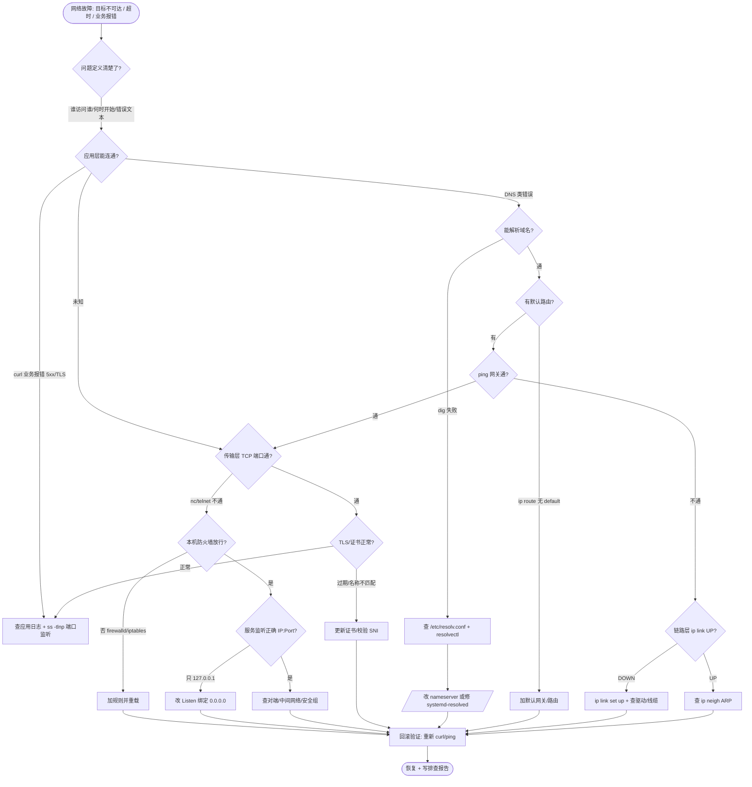

# 第 4 章 LVM 与网络排错

> **定位**：从「磁盘空间写满、网络不通只能重启」到「能在线扩容数据卷、能用地基式证据链定位网络故障」。
> 这是「运维内功」阶段的第一块硬骨头——第 1 章给了你一台可恢复的实验机，第 4 章教你**如何安全地动它的磁盘与网络**，并且动完能证明、动错能回退。本章的两件核心作品（一次数据卷在线扩容 + 一份网络故障排查报告）会直接进入你的实验档案，作为后续章节的底座。
>
> | 项 | 值 |
> |---|---|
> | 章 | 第 4 章 |
> | 周次 | 第 5～7 周 |
> | 建议学时 | 18～24 小时（原理 4h / LVM 实验 7h / 网络实验 9h / 复盘 4h） |
> | 主线环境 | Rocky Linux 9（课程主线，文档与 RHEL 9 通用） |
> | 对照环境 | Ubuntu 22.04/24.04 LTS + Multipass |
> | 核心作品 | ① 一次数据卷在线扩容（含 fstab 持久化）　② 一份网络故障排查报告（证据链 + 根因 + 修复） |
> | 完成标准 | 你能独立把一块新盘纳入 LVM 并在线扩给正在运行的业务；当「上不了网」时，能按层给出 `ip`/`ss`/`dig`/`traceroute` 证据，而非重启了事 |
>
> **学习目标**
> 1. 说清楚 LVM 三层（PV/VG/LV）各自是什么、为什么不直接用分区；
> 2. 建立「网络分层」心智模型（链路层→IP 层→传输层→应用层），任何故障先定位到层；
> 3. 在实验机上用真实命令完成：加盘→`pvcreate`→`vgcreate`→`lvcreate`→`mkfs`→`fstab` 持久挂载；
> 4. 完成一次 XFS/ext4 在线扩容，并踩中「只扩 LV 没扩文件系统」的经典陷阱；
> 5. 用 `nmcli`/`netplan` 配置静态 IP、默认路由、DNS，`firewalld`/`iptables` 做最小放行；
> 6. 用自顶向下 + 自底向上双视角，把一次「网络不通」排成可复现的证据链报告。
>
> **本章在全局中的位置**
> ```text
> 应用 / K8s / 数据库
>       ↑
> 网络（本章下半） + 存储 LVM（本章上半）   ← 你正在写这章
>       ↑
> systemd / 用户权限（第 3 章）
>       ↑
> 实验机地基（第 1 章）
> ```

> [!WARNING]
> 本章**全程涉及写盘与改网络**，属于易翻车操作。**务必先在快照上执行**：
> - LVM：`pvcreate`/`vgcreate`/`lvcreate` 会清空磁盘数据；`lvreduce`（缩减）更可能直接损坏文件系统；`/etc/fstab` 写错会让机器**起不来**（进入 emergency 模式）。
> - 网络：改错网关/DNS/防火墙，可能让你**立刻失去 SSH 连接**，只能靠控制台/VNC 救。
> 铁律：① 动 `pvcreate` 前三次确认设备名（`lsblk` + `wipefs -n`）；② 改网络配置保持当前 SSH 会话不断开，另开终端验证；③ `fstab` 改完先 `findmnt --verify` + `mount -a` 验证，**不要直接重启**；④ 所有变更前打快照 + 备份配置文件。涉及 `/etc` 关键文件、防火墙、网络脚本的命令，先回答三件事：**改了哪层？怎么证明生效？怎么还原？**

---

## 1. 原理讲解（Principles）

### 1.1 为什么要 LVM：直接分区有什么问题

传统做法是「一块盘 = 一个分区 = 一个文件系统 = 一个挂载点」。它的最大痛点是**僵化**：

- 业务涨到 9G，分区只有 10G，想扩？只能停机、备份、重分区、恢复——生产上基本不可接受。
- 多块盘无法当成一个大空间给一个业务用，得手动把数据「挪」到不同挂载点。
- 想给某个目录做一致性快照备份？分区做不到，得停业务。

**LVM（Logical Volume Manager，逻辑卷管理）把「物理磁盘」和「业务看到的卷」解耦**，中间插入一层抽象池，让容量变成可弹性伸缩的资源。

> 心智模型：分区像「把仓库隔成固定大小的格子，塞满就废了」；LVM 像「先建一个总仓库（VG），再按需划出可伸缩的货架（LV），货架不够就从总仓库里再拿料，货架还能在线加长」。

### 1.2 LVM 三层结构

LVM 的抽象从下到上正好三层，记住这个顺序，命令就一一对应：

| 层 | 全称 | 是什么 | 对应命令 | 类比 |
|---|---|---|---|---|
| **PV** | Physical Volume 物理卷 | 一块被 LVM 接管的磁盘或分区（打了 LVM 标签） | `pvcreate` | 仓库里的一垛原材料 |
| **VG** | Volume Group 卷组 | 把多块 PV 聚成一个**存储池**，统一分配 | `vgcreate`/`vgextend` | 整个总仓库 |
| **LV** | Logical Volume 逻辑卷 | 从 VG 里「切」出来的一段空间，格式化后挂载给业务 | `lvcreate`/`lvextend` | 给某个业务划出的可伸缩货架 |

完整链路（自上而下，业务视角；自下而上，构建视角）：

```text
应用数据 (MySQL / Nginx 日志 / 网站文件)
        ↑  挂载点 /data
   文件系统 (XFS / ext4)          ← mkfs.xfs / mkfs.ext4
        ↑
   逻辑卷 LV  data_lv            ← lvcreate / lvextend (可在线加长)
        ↑
   卷组 VG  data_vg (存储池)      ← vgcreate / vgextend (池里可加新盘)
        ↑
   物理卷 PV  /dev/sdb,/dev/sdc   ← pvcreate (裸盘或分区)
        ↑
   物理磁盘 /dev/sdb, /dev/sdc
```

> [!NOTE]
> LVM 不是备份，也不是 RAID。它解决「容量弹性」，不解决「冗余」（盘坏了数据照样没）；也不解决「可恢复」（删了 LV 里文件还是要靠备份）。这两点会在第 9、10 模块专门强调——**LVM 扩容前必须备份**。

### 1.3 网络分层：任何故障先定位到「哪一层」

网络排错最忌「随机重启服务」。正确做法是先判断故障发生在 OSI/TCPIP 的哪一层，再用对应工具取证。本章用四层心智模型：

| 层 | 名称 | 关心什么 | 关键工具 | 典型故障现象 |
|---|---|---|---|---|
| 链路层 L2 | Link / 以太 | 网卡 up 吗？MAC/ARP 通吗？ | `ip link` / `ip neigh` | 网卡 `DOWN`、MAC 冲突、ARP 学不到 |
| 网络层 L3 | IP / 路由 | 有 IP 吗？有路由吗？能到下一跳吗？ | `ip addr` / `ip route` / `ping` | 没地址、没默认路由、网关不通 |
| 传输层 L4 | TCP / UDP | 端口在监听吗？TCP 握手成功吗？ | `ss -tlnp` / `nc` / `tcpdump` | 端口没监听、被防火墙 RST |
| 应用层 L7 | HTTP/DNS/TLS | 域名能解析？TLS 有效？业务返回对吗？ | `dig` / `curl -v` / `openssl` | DNS 失败、证书过期、502/504 |

排错总路径（自顶向下问「谁访问谁、错在哪层」，自底向上逐层验证）：

```text
应用层(L7)  DNS解析 → TLS握手 → HTTP业务
    ↑
传输层(L4)  端口监听(ss -tlnp) → TCP握手(三次握手)
    ↑
网络层(L3)  本机IP(ip addr) → 路由(ip route) → 到网关(ping)
    ↑
链路层(L2)  网卡状态(ip link) → 邻居ARP(ip neigh)
```

### 1.4 命名空间、路由表与 DNS 解析链

**路由表**：内核决定「这个包从哪张网卡出去」的依据。`ip route` 看到的 `default via 192.168.1.1` 就是默认网关——没有它，所有「不在本子网」的目标都发不出去（这是网络故障演练里最高频的根因）。

**命名空间（network namespace）**：Linux 把网络栈（网卡、路由、iptables）隔离到独立视图的机制。容器/K8s 的本质就是每个 Pod 一个 netns。本章主要操作**默认（主机）命名空间**，但要理解：`ip addr` 看到的是当前 netns 的；`ip netns exec xxx` 才能进别的命名空间看。

**DNS 解析链**（这是「能 ping IP 但打不开域名」的根因来源）：

```text
应用程序调用 getaddrinfo()
   ↓
/etc/nsswitch.conf  →  hosts: files dns
   ↓ (files 先查)       查 /etc/hosts
   ↓ (dns 再查)         查 /etc/resolv.conf 里的 nameserver
   ↓                    nameserver 8.8.8.8 → 递归查询 → 返回 IP
   ↓
systemd-resolved：Ubuntu 上 /etc/resolv.conf 常是指向 127.0.0.53 的 stub（看 resolvectl status）
```

> 关键坑：Ubuntu 用 `systemd-resolved` 时，`/etc/resolv.conf` 里写的是 `nameserver 127.0.0.53`（本地 stub 解析器），真正的上游 DNS 在 `resolvectl status` 里。直接 `cat /etc/resolv.conf` 看到 127.0.0.53 是**正常的**，别误以为 DNS 配错。

### 1.5 本章在全局中的位置（图）

```text
应用软件 / 容器 / K8s
        ↑
   网络(本章下) + 存储 LVM(本章上)   ← 你在这
        ↑
   systemd 服务、权限(第 3 章)
        ↑
   实验机地基(第 1 章)
        ↑
   内核 + 硬件
```

---

## 2. 架构（Architecture）

### 2.1 LVM 物理结构图（一块新盘纳入 LVM 的全过程）

```text
┌──────────────────────────────────────────────────────────────────────┐
│ 业务数据：MySQL 表 / Nginx 日志 / 网站静态文件                          │
└───────────────────────────────────┬──────────────────────────────────┘
                                    │  挂载点 /data  (mount)
                         ┌──────────▼──────────┐
                         │  文件系统 XFS/ext4   │   mkfs.xfs / mkfs.ext4
                         │  (块设备上的格式化)   │
                         └──────────┬──────────┘
                         ┌──────────▼──────────┐
                         │  LV  data_lv         │   lvcreate -L 10G -n data_lv
                         │  逻辑卷（可在线加长） │   lvextend -L +5G
                         └──────────┬──────────┘
            ┌───────────────────────┴───────────────────────┐
            │       VG  data_vg（统一存储池，容量=各PV之和）  │   vgcreate data_vg /dev/sdb
            │   ┌─────────────────┐     ┌─────────────────┐  │
            │   │  PV  /dev/sdb    │     │  PV  /dev/sdc    │  │   pvcreate /dev/sdb /dev/sdc
            │   │  20G（已打标签） │     │  20G（已打标签） │  │   vgextend data_vg /dev/sdc
            │   └────────┬─────────┘     └────────┬─────────┘  │
            └────────────┼────────────────────────┼────────────┘
                         │                        │
                  ┌──────▼───────┐        ┌───────▼──────┐
                  │  磁盘 /dev/sdb │       │  磁盘 /dev/sdc │
                  │ (裸盘或分区)   │       │ (裸盘或分区)   │
                  └───────────────┘        └───────────────┘
```

要点：VG 是一个「池」，业务只认 LV。哪天 `/dev/sdb` 满了，往池里 `vgextend` 一块新盘 `/dev/sdc`，再 `lvextend` 把 LV 拉长即可——业务**全程不中断**（XFS/ext4 在线扩容）。

### 2.2 网络排错决策树（mermaid：自顶向下 + 自底向上双视角）



> 用法：从上往下是「自顶向下」（先问应用层/业务），从左下往右上是「自底向上」（先查物理/链路/路由）。真实排错两者结合——先 `ping 网关`（底）确认链路通，再 `curl 域名`（顶）确认应用通，中间哪层断就在哪层取证。

> 参考：[Arch Wiki — LVM](https://wiki.archlinux.org/title/LVM) ｜ [Arch Wiki — Network troubleshooting](https://wiki.archlinux.org/title/Network_troubleshooting) ｜ [Red Hat RHEL9 配置与管理逻辑卷](https://docs.redhat.com/en/documentation/red_hat_enterprise_linux/9/html/configuring_and_managing_logical_volumes/)

---

## 3. 部署（Deployment）—— 实验环境准备

> 前提：你已经有一台第 1 章的实验机（Rocky 9 或 Ubuntu 22.04/24.04），且**已打快照**。本章所有写盘/改网络都在快照后做。

### 3.1 准备第二块磁盘（LVM 实验专用）

LVM 实验需要一块**干净、可清空**的盘。两种给法：

**路线 B（VirtualBox / VMware）手动加盘**：关机 → 设置 → 存储 → 添加一块 20G 虚拟硬盘 → 开机。开机后内核应能看到 `/dev/sdb`。

```bash
# 在实验机内执行, 确认新盘出现且无重要数据
lsblk -d -o NAME,SIZE,MODEL,TYPE            # 应看到 sdb(20G, disk 类型)
lsblk -o NAME,SIZE,FSTYPE,MOUNTPOINTS /dev/sdb   # 确认无挂载、无文件系统签名
sudo wipefs -n /dev/sdb                     # 预览: 列出盘上的签名(应无输出或仅旧签名)
```

**路线 A（Multipass）加盘**：Multipass 默认不挂额外盘，可用 `--disk` 扩大系统盘，或挂载 `disk` 实例：

```powershell
# 宿主机 PowerShell: 给 linux-ops-01 追加一块 20G 数据盘(需较新 Multipass)
multipass set client gui=false
# 注: Multipass 挂裸数据盘能力随版本变化; 若不支持, 用路线 B 的虚拟化加盘更稳
```

> [!CAUTION] 避坑：确认设备名！虚拟机里第二块盘通常是 `/dev/sdb`，但**不一定是**。永远用 `lsblk` + `wipefs -n` 三次确认目标盘没挂载、没数据，再 `pvcreate`。把 `pvcreate /dev/sda` 当 `/dev/sdb` 执行 = 清空系统盘。

### 3.2 安装网络与 LVM 工具

Rocky 9 默认已带 LVM；Ubuntu 最小镜像可能缺。统一装齐：

```bash
# ===== Rocky / RHEL 系 =====
sudo dnf install -y lvm2 iproute2 bind-utils   # lvm2=LVM 套件; bind-utils 含 dig/host
sudo dnf install -y net-tools tcpdump traceroute iperf3  # 排错与吞吐测试

# ===== Ubuntu / Debian 系 =====
sudo apt update
sudo apt install -y lvm2 iproute2 dnsutils     # dnsutils 含 dig
sudo apt install -y net-tools tcpdump traceroute iperf3

# 验证工具到位
which pvcreate vgcreate lvcreate mkfs.xfs ip ss dig traceroute iperf3
```

版本固定（课程验证基线，版本可能变动，以官方兼容矩阵为准）：

| 组件 | 课程固定版本 | 说明 |
|---|---|---|
| Rocky Linux | 9.5（主线；9.x 通用） | RHEL 免费 1:1 克隆 |
| Ubuntu LTS | 22.04 / 24.04 | Multipass 对照实验 |
| LVM2 | 2.03.x（随发行版） | `lvm version` 查看 |
| iproute2 | 6.x（随发行版） | `ip -V` 查看 |
| XFS | 内核原生 xfsprogs 6.x | `mkfs.xfs -V` |
| iperf3 | 3.16+ | 吞吐测试 |

### 3.3 双路线差异速查

| 操作 | Rocky 9（主线） | Ubuntu（对照） |
|---|---|---|
| 网卡配置 | `nmcli`（NetworkManager） | `netplan`（`/etc/netplan/*.yaml`） |
| DNS 解析器 | `nmcli` 写 `/etc/resolv.conf` 或 `systemd-resolved` | `systemd-resolved`，`resolvectl` |
| 防火墙 | `firewalld` | `ufw`（底层 `iptables`/`nftables`） |
| LVM 工具 | `lvm2`（已带） | 需 `apt install lvm2` |
| DNS 查询 | `bind-utils` 的 `dig` | `dnsutils` 的 `dig` |

> [!NOTE] 本章网络「配置」部分会同时给 `nmcli`（Rocky）与 `netplan`（Ubuntu）两套命令，标注清晰。实验时**只用你当前系统的那一套**，不要混用。

---

## 4. 配置（Configuration）

### 4.1 LVM 完整创建：加盘 → PV → VG → LV → 文件系统 → 挂载

以下全程 `#` 表示需 root（`sudo`）。假设新盘为 `/dev/sdb`。

```bash
# ① 三次确认目标盘(破坏性前最后保险)
lsblk -o NAME,SIZE,TYPE,FSTYPE,MOUNTPOINTS /dev/sdb
sudo wipefs -n /dev/sdb          # 确认无残留文件系统签名

# ② 打 LVM 标签 → 成为 PV(物理卷)
sudo pvcreate /dev/sdb
sudo pvs                         # 确认 sdb 已入列, PV 大小正确

# ③ 建 VG(卷组, 存储池), 命名为 data_vg
sudo vgcreate data_vg /dev/sdb
sudo vgs                         # 确认 VG 已建, VSize≈20G, VFree≈20G

# ④ 从 VG 切出 10G 的 LV(逻辑卷), 命名为 data_lv
sudo lvcreate -L 10G -n data_lv data_vg
sudo lvs                         # 确认 LV 已建, LSize=10G

# ⑤ 在 LV 上建文件系统(XFS, 适合大文件/高并发; 也可 mkfs.ext4)
sudo mkfs.xfs -f /dev/data_vg/data_lv     # -f 仅当确定覆盖; 首次建可不加
# 若用 ext4: sudo mkfs.ext4 /dev/data_vg/data_lv

# ⑥ 建挂载点并挂载
sudo mkdir -p /data
sudo mount /dev/data_vg/data_lv /data
df -hT /data                    # 确认 /data 已挂载, 类型 xfs, 容量≈10G

# ⑦ 放点测试数据, 后面扩容/验证用
sudo mkdir -p /data/app
echo "lvm-lab-$(date +%F)" | sudo tee /data/app/hello.txt
ls -l /data/app
```

> [!NOTE] LV 的设备路径有两种写法，等价：`/dev/data_vg/data_lv`（友好名）和 `/dev/mapper/data_vg-data_lv`（dm 设备）。`fstab` 里**强烈建议用 UUID**，不用这两种设备名（设备名重启可能变）。

### 4.2 UUID 持久挂载（fstab）—— 避免重启丢挂载

```bash
# 取 LV 文件系统的 UUID(注意是文件系统的 UUID, 不是 PV 的)
sudo blkid /dev/data_vg/data_lv
# 输出类似: /dev/mapper/data_vg-data_lv: UUID="a1b2c3d4-..." TYPE="xfs"
```

编辑 `/etc/fstab`，加入一行（**用上面真实 UUID 替换**）：

```fstab
# <文件系统 UUID>          <挂载点>  <类型>  <挂载选项>              <dump> <fsck>
UUID=a1b2c3d4-0000-0000-0000-000000000000  /data  xfs  defaults,nofail,x-systemd.device-timeout=30  0  0
```

逐项解释（这是 fstab 写错起不来的重灾区）：

- `defaults`：rw,suid,dev,exec,auto,nouser,async 的集合，日常够用。
- `nofail`：**非关键数据盘强烈建议加**——盘不在时系统仍能启动，不会卡 emergency。关键数据库卷则要权衡：加了 `nofail` 若盘真没挂上，业务可能把数据写到根分区（静默灾难）。
- `x-systemd.device-timeout=30`：等盘最多 30s，避免启动时无限阻塞。
- 第 5 列 `dump`：0（不备份）；第 6 列 `fsck`：XFS 填 0（XFS 不开机自检），ext4 根/数据卷通常 1/2。

> [!CAUTION] **fstab 写错 = 机器起不来（emergency 模式）**。永远先验证再重启：

```bash
sudo findmnt --verify --verbose   # 静态校验 fstab 语法/挂载点
sudo umount /data                  # 先卸载, 再模拟开机挂载
sudo mount -a                      # 按 fstab 重新挂载全部, 出错会直接报
findmnt /data                      # 确认 /data 真的挂上了
# 只有上面都通过, 才允许重启。严禁写完 fstab 直接 reboot!
```

### 4.3 网络配置（Rocky：nmcli）

假设要把网卡 `ens192` 设成静态 IP `192.168.1.20/24`，网关 `192.168.1.1`，DNS `8.8.8.8`。

```bash
# ① 先改前备份(回滚用)
sudo cp -a /etc/sysconfig/network-scripts/ /root/nbak-$(date +%F_%H%M)   # Rocky 传统路径
# 新版本 Rocky 用 keyfile: 也备份现有连接
nmcli connection show                # 看当前连接名(如 ens192)

# ② 改前确认: 保持当前 SSH 会话不断开! 另开终端验证
# ③ 用 nmcli 配静态 IP(连接名用上一步看到的; 这里用 ens192)
sudo nmcli connection modify ens192 \
  ipv4.method manual \
  ipv4.addresses 192.168.1.20/24 \
  ipv4.gateway 192.168.1.1 \
  ipv4.dns "8.8.8.8 1.1.1.1" \
  ipv4.dns-search "" \
  connection.autoconnect yes

# ④ 应用(不重启系统, 仅重载连接)
sudo nmcli connection down ens192 && sudo nmcli connection up ens192

# ⑤ 验证(见第 5 章); 若断了 SSH, 用控制台进去做第 8 章回滚
ip -brief address show ens192        # 应显示 192.168.1.20/24
ip route | grep default              # 应显示 default via 192.168.1.1
resolvectl status 2>/dev/null || cat /etc/resolv.conf
```

### 4.4 网络配置（Ubuntu：netplan）

Ubuntu 22.04/24.04 用 netplan。配置文件在 `/etc/netplan/*.yaml`（如 `00-installer-config.yaml`）。

```bash
# ① 改前备份
sudo cp -a /etc/netplan/ /root/nbak-netplan-$(date +%F_%H%M)

# ② 编辑 netplan(用真实文件名; YAML 严格缩进!)
sudo tee /etc/netplan/01-static.yaml >/dev/null <<'EOF'
network:
  version: 2
  ethernets:
    ens192:                      # 网卡名, 用 ip -brief address 确认
      dhcp4: no
      addresses: [192.168.1.20/24]
      routes:
        - to: default
          via: 192.168.1.1        # 默认网关
      nameservers:
        addresses: [8.8.8.8, 1.1.1.1]
EOF

# ③ 先用 try 灰度生效(120s 内不确认会自动回退, 防锁死自己)
sudo netplan try --timeout 120
# ④ 确认没问题再正式 apply
sudo netplan apply
```

> [!CAUTION] YAML 对缩进**零容忍**：少一个空格就整个失效。写完先用 `sudo netplan try`（带自动回退）而不是直接 `apply`，这是 Ubuntu 上防失联的关键保命动作。

### 4.5 防火墙基础（最小放行）

```bash
# ===== Rocky: firewalld(默认拒绝入站) =====
sudo systemctl enable --now firewalld
sudo firewall-cmd --permanent --add-service=ssh      # 放行 SSH(否则改完网络可能进不来)
# 业务端口示例: sudo firewall-cmd --permanent --add-port=80/tcp
sudo firewall-cmd --reload
sudo firewall-cmd --list-all                         # 确认只放行了必要服务

# ===== Ubuntu: ufw(底层 nftables/iptables) =====
sudo ufw default deny incoming
sudo ufw allow ssh
# sudo ufw allow 80/tcp
sudo ufw enable
sudo ufw status

# iptables 直查(两边通用, 看真实规则)
sudo iptables -S -t filter      # 或 sudo nft list ruleset
```

> [!WARNING] 改网络配置**务必先放行 SSH**：很多人配静态 IP 时顺手把防火墙开了，结果新 IP 连不上——因为 firewalld 默认没放行 22。改网络前先 `--add-service=ssh --permanent --reload`，再动 IP。

---

## 5. 验证（Verification）

每次变更后用**明确命令**证明结果正确——这是 Ops 基本功，也是核心作品「排查报告」的证据来源。

### 5.1 LVM 验证

```bash
# 全链路确认: 磁盘→PV→VG→LV→挂载
lsblk -o NAME,SIZE,TYPE,FSTYPE,MOUNTPOINTS /dev/sdb   # sdb→PV→(dm)→/data
sudo pvs             # PV 列表, Attr 无 a-- 异常
sudo vgs             # VG 容量与剩余(VFree 后续扩容要用)
sudo lvs             # LV 大小
lsblk -f | grep data # 看 LV 的 UUID/文件系统
df -hT /data         # 挂载点容量与类型
findmnt /data        # 确认是 fstab 持久挂载(非临时 mount)
```

### 5.2 网络验证

```bash
# ① 本机地址与链路
ip -brief address               # 所有网卡 IP, 确认静态 IP 生效
ip -brief link                  # 确认网卡 STATE 是 UP(不是 DOWN/UNKNOWN)

# ② 路由
ip route                        # 确认有 default via <网关>
ip route get 8.8.8.8            # 内核判定: 去 8.8.8.8 走哪个网卡/网关

# ③ 链路层下一跳(ARP)
ip neigh                        # 看网关 MAC 是否学到(REACHABLE/STALE, 不是 FAILED)

# ④ DNS
resolvectl status 2>/dev/null || cat /etc/resolv.conf   # 确认 nameserver
dig +short example.com @8.8.8.8                          # 直连指定 DNS 解析
dig example.com A                                          # 走系统配置解析

# ⑤ 端到端
ping -c 4 192.168.1.1        # 到网关(链路+路由层)
ping -c 4 8.8.8.8            # 到外网 IP(路由层, 绕过 DNS)
curl -sS -o /dev/null -w "%{http_code}\n" https://example.com   # 应用层
```

### 5.3 监听端口与连接（ss）

```bash
# 看本机在监听什么(排错"端口不通"第一刀)
ss -tlnp                       # tcp 监听 + 端口 + 进程(-p 需 root)
ss -tlnp 'sport = :22'         # 只看 22
ss -tlnp | grep -E ':80|:443'  # 只看 Web
ss -s                          # 总览: 各状态连接数(ESTAB/LISTEN/TIME-WAIT)

# 建立中的连接(确认 TCP 握手是否成功)
ss -tnp state established '( dport = :443 )'
```

> 排错逻辑：`ss -tlnp` 里**没有**业务端口 → 服务没起/只监听 127.0.0.1 → 不是网络是服务问题；**有**端口但远程连不上 → 防火墙/路由/安全组问题。

**验收清单（本章交付物）**

- [ ] `pvcreate/vgcreate/lvcreate` 后 `pvs/vgs/lvs` 三表都能看到对应对象
- [ ] `/data` 已挂载且 `df -hT` 可见，文件系统为 XFS/ext4
- [ ] `/etc/fstab` 用 UUID 持久化，且 `findmnt --verify` + `mount -a` 通过（未直接重启验证）
- [ ] 静态 IP、默认路由、DNS 均配好，`ip route`/`dig`/`ping` 三层验证通过
- [ ] 防火墙默认拒绝入站，仅放行 SSH（及必要业务端口）
- [ ] 已打一个「LVM+网络已配好」的快照

---

## 6. 性能（Performance）—— 建立存储与网络基线

第 4 章不深调优，但要养成「先有基线，才有异常」的习惯。下面两条基线，后续任何扩容/变更前后都对比它。

### 6.1 磁盘 IO 基线

```bash
sudo dnf install -y fio sysstat 2>/dev/null || sudo apt install -y fio sysstat
# 顺序写吞吐基线(在 /data 上跑, 注意会写临时文件)
sudo fio --name=seqwrite --rw=write --bs=1M --size=1G --numjobs=1 \
         --directory=/data --ioengine=libaio --direct=1 --runtime=30 --time_based
# 随机读写 IOPS 基线
sudo fio --name=randread --rw=randread --bs=4k --size=512M --numjobs=4 \
         --directory=/data --ioengine=libaio --runtime=30 --time_based
# 实时观察(另一终端)
iostat -xz 1 5                   # 看 %util/await 是否异常
```

### 6.2 LVM 条带（stripe）与缓存（cache）概念

> 概念先行，不强求实验，但扩容/性能专题会用到。

- **条带（stripe）**：LV 的数据跨多块 PV 分布，顺序大 IO 可并行，提升吞吐。创建时 `-i <PV数> -I <条带大小>`：

```bash
# 例: 用 2 块 PV 做条带 LV(性能向, 非可靠性向!)
sudo lvcreate -L 20G -i 2 -I 64k -n stripe_lv data_vg
```

> [!NOTE] 条带提升性能但**不提升可靠性**——任一条带盘坏了整卷不可用。它和 RAID 0 同理。生产用条带通常配合 RAID 或只用于可重建的缓存数据。

- **缓存（cache）**：用小块高速盘（SSD）给大慢盘（HDD）做 LVM cache，加速热点。命令族 `lvconvert --type cache`。本课程实验环境多为单盘，暂不展开，知道存在即可。

### 6.3 网络吞吐基线（iperf3）

```bash
# 一端当服务端(实验机)
iperf3 -s -p 5201
# 另一端当客户端(宿主机或另一台实验机)
iperf3 -c 192.168.1.20 -p 5201 -t 10      # TCP 吞吐
iperf3 -c 192.168.1.20 -u -b 100M          # UDP 吞吐/丢包

# 连接数监控(高并发场景基线)
ss -s | grep -E 'TCP:|closed'              # 总连接数与 TIME-WAIT
watch -n 1 'ss -tn state established | wc -l'   # 实时已建立连接数
```

> 心智模型：吞吐、连接数、延迟的「正常值」是你在干净环境**量出来的**，不是背的。第 5 章写监控脚本时，告警阈值就来自这条基线。

---

## 7. 故障（Troubleshooting）—— 故障演练

> 目标：主动制造事故，用证据链救回，再写成「网络故障排查报告」（核心作品②）。每个演练**先打快照**。

### 演练 7.1：LVM 在线扩容（端到端，含「未扩文件系统」经典陷阱）

**场景**：`/data` 业务跑了半年涨到 9G，LV 是 10G 快满。需求：在线扩到 20G，业务不中断。

**准备**：确认 VG 还有空间（没有就先 `vgextend` 加盘，见下）：

```bash
sudo vgs data_vg                 # 看 VFree, 需 ≥ 10G; 不够则:
# sudo pvcreate /dev/sdc && sudo vgextend data_vg /dev/sdc   # 加第二块盘到池

# 扩容前先备份(铁律! LVM 不替代备份)
sudo tar czf /backup/data_lv_$(date +%F).tgz -C /data . 2>/dev/null || echo "请先准备备份盘"
```

**步骤 1：扩 LV（只扩逻辑卷）**

```bash
sudo lvextend -L 20G /dev/data_vg/data_lv
sudo lvs /dev/data_vg/data_lv    # LSize 已变 20G
df -hT /data                     # ⚠ 注意: 这里还是 ~10G! 文件系统没扩!
```

> [!CAUTION] **经典陷阱（必考）**：`lvextend` 只把 LV 拉长，**文件系统不知道**。此时 `df` 看到的仍是旧大小，业务继续往里写会「LV 有空间、文件系统报满」。很多人到此以为扩容完成，实际上磁盘还是满的。

**步骤 2：扩文件系统（XFS vs ext4 命令不同！）**

```bash
# XFS: 用挂载点, 必须在线(已挂载)
sudo xfs_growfs /data
# ext4: 用设备, 在线也行
# sudo resize2fs /dev/data_vg/data_lv

df -hT /data                     # ✅ 现在显示 ~20G, 扩容真正完成
```

**一键写法（推荐，减少漏步）**：

```bash
sudo lvextend -r -L 20G /dev/data_vg/data_lv   # -r 让 lvextend 自动调文件系统扩容工具
df -hT /data
```

> [!NOTE] XFS **只能扩容不能缩容**；ext4 可缩容但必须**离线（先 umount）**且风险高。所以「LV 缩了但文件系统没缩」也会出事——缩减请看第 8 章。

**步骤 3：验证业务不中断**

```bash
cat /data/app/hello.txt          # 老数据还在(在线扩容不丢数据)
sudo touch /data/app/after_grow.txt
ls -l /data/app                  # 新数据也能写, 业务无感知
```

### 演练 7.2：网络故障（改错网关 + DNS + 防火墙，三连击取证）

**场景**：业务突然「上不了外网」，但本机服务正常。你用证据链定位根因并修复。下面三个故障可分别演练，每个都先另存一份报告证据。

**故障 A：默认网关写错**

```bash
# 制造: 把网关改成不存在的地址(仅实验机, 保持控制台!)
sudo nmcli connection modify ens192 ipv4.gateway 192.168.1.254   # 错误网关
sudo nmcli connection down ens192 && sudo nmcli connection up ens192
# 现象: ping 8.8.8.8 超时, curl 外网失败, 但 ping 192.168.1.20(本机)正常

# 证据链(自底向上):
ip route | grep default              # 证据①: default via 192.168.1.254(错)
ping -c 3 192.168.1.1                # 证据②: 真网关不通(因为路由指向错网关)
ping -c 3 8.8.8.8                    # 证据③: 外网不通
ip neigh                             # 证据④: 192.168.1.254 的 MAC 学不到(FAILED)

# 修复:
sudo nmcli connection modify ens192 ipv4.gateway 192.168.1.1
sudo nmcli connection down ens192 && sudo nmcli connection up ens192
ping -c 3 8.8.8.8                    # 恢复
```

**故障 B：DNS 配错（能 ping IP 但打不开域名）**

```bash
# 制造: 把 DNS 改成不可达地址
sudo nmcli connection modify ens192 ipv4.dns "192.0.2.99"   # TEST-NET 保留地址, 不可达
sudo nmcli connection down ens192 && sudo nmcli connection up ens192

# 证据链:
ping -c 3 8.8.8.8                    # 证据①: IP 通 → 网络层正常, 不是路由问题
dig example.com                     # 证据②: 解析超时/失败(SERVFAIL)
dig +short example.com @8.8.8.8     # 证据③: 直连真 DNS 却能解析 → 问题在本机 DNS 配置
resolvectl status 2>/dev/null || cat /etc/resolv.conf   # 证据④: nameserver=192.0.2.99(错)

# 修复:
sudo nmcli connection modify ens192 ipv4.dns "8.8.8.8 1.1.1.1"
sudo nmcli connection down ens192 && sudo nmcli connection up ens192
dig +short example.com              # 恢复
```

**故障 C：防火墙误伤（端口被拦）**

```bash
# 制造: 假设业务在 8080, 防火墙忘了放行
sudo firewall-cmd --remove-port=8080/tcp --permanent && sudo firewall-cmd --reload
# 现象: 本地 curl 127.0.0.1:8080 通, 远程 curl <IP>:8080 超时

# 证据链:
ss -tlnp 'sport = :8080'            # 证据①: 服务在监听, 0.0.0.0:8080(不是服务问题)
sudo iptables -S -t filter | grep 8080   # 证据②: 无放行规则 / 被 DROP
tcpdump -ni any 'tcp port 8080' -c 20   # 证据③: 抓到外部 SYN, 但无 SYN-ACK(被墙)

# 修复:
sudo firewall-cmd --add-port=8080/tcp --permanent && sudo firewall-cmd --reload
curl -sS -o /dev/null -w "%{http_code}\n" http://192.168.1.20:8080/   # 恢复
```

> 排查报告骨架（核心作品②，每个故障填一份）：
> ```markdown
> # 网络故障排查报告 — <日期>
> ## 现象: <谁访问谁, 错误文本>
> ## 假设: <最先怀疑哪层>
> ## 证据链:
>   1. ip route: ...       2. dig: ...       3. ss -tlnp: ...       4. tcpdump: ...
> ## 根因: <明确到配置项/命令>
> ## 修复: <命令>
> ## 验证: <恢复后的命令输出>
> ## 防复发: <fstab/备份/监控项>
> ```

### 演练 7.3：磁盘即将写满预警（容量故障）

```bash
# 模拟: 往 /data 猛写, 观察 df 与告警阈值
sudo dd if=/dev/zero of=/data/filltest bs=1M count=8000 status=progress   # 注意空间, 实验盘!

# 监控与取证:
df -hT /data                    # 总空间满
df -i /data                     # inode 是否也满(小文件爆炸时容量未满但 inode 满)
sudo du -xhd1 /data | sort -h   # 找谁是元凶目录
sudo lsof +L1                   # 证据: 有文件已删但进程仍持有(空间不释放!)

# 典型根因与修复:
# ① 日志暴涨 → 查 journalctl --disk-usage, 配 logrotate
# ② 删了文件空间不降 → lsof +L1 找到持有进程, 重启/清空它(不要直接 kill)
# ③ inode 满 → 大量小文件, 需清理或换文件系统
# ④ LV 还有空间但文件系统没扩 → 回到演练 7.1 步骤 2
```

> [!WARNING] 删除「正在被进程持有」的大文件，`df` 不会立刻释放——必须重启持有进程或对其发信号清空。盲目 `rm` 只是让文件名消失，磁盘照样满。这是线上最常见「删了空间没回来」的真因。

---

## 8. 回滚（Rollback）

### 8.1 LVM 缩减（lvreduce）—— 高风险，能不缩就不缩

LV 扩容易、缩危险。尤其 XFS **根本不支持缩容**；ext4 缩容必须离线且先 `e2fsck`。

```bash
# ext4 离线缩容(危险! 先备份, 先 umount):
sudo umount /data
sudo e2fsck -f /dev/data_vg/data_lv          # 必须先 fsck
sudo resize2fs /dev/data_vg/data_lv 8G        # 先把文件系统缩到 8G
sudo lvreduce -L 8G /dev/data_vg/data_lv      # 再缩 LV
sudo mount /dev/data_vg/data_lv /data
```

> [!CAUTION] 顺序错=数据全毁：必须先缩**文件系统**再缩 **LV**。若先 `lvreduce` 把 LV 截短，文件系统尾巴被切掉，数据不可逆损坏。XFS 用户**直接放弃缩容**，改用「建新 LV + 迁移数据 + 删旧 LV」。

### 8.2 网络配置改前备份 + 回滚

```bash
# Rocky: network-scripts / keyfile 备份
ls -d /root/nbak-*                          # 第 4 章创建的备份目录
# 回滚: 把备份的连接文件拷回 /etc/sysconfig/network-scripts/ 或
#       nmcli connection modify ens192 ipv4.gateway 192.168.1.1  # 直接改回正确值

# Ubuntu: netplan 备份
ls -d /root/nbak-netplan-*                  # 第 4 章备份
# 回滚: cp 备份的 yaml 回 /etc/netplan/, 再 sudo netplan apply
# 或直接 sudo netplan try(带自动回退)改回正确配置
```

### 8.3 快照恢复（最快兜底）

```powershell
# 路线 B (VirtualBox) 在宿主机执行
VBoxManage snapshot "linux-ops-01" list --snapshot
VBoxManage snapshot "linux-ops-01" restore "lvm-net-good"   # 一键回到已知好

# 路线 A (Multipass) 没有原生快照, 用宿主机级快照或:
multipass stop linux-ops-01
# 依赖 VirtualBox/VMware 快照; 纯 Multipass 用户务必保留一个控制台(shell)通道兜底
```

> 复盘模板：**改了哪层？** LV/网关/DNS ／ **证据？** `lvs`/`ip route`/`dig` 通过 ／ **失败时中间态？** `.bak` 或快照 ／ **影响范围？** 仅本机存储/网络 ／ **如何回滚？** 还原备份或快照。

---

## 9. 灾备（Disaster Recovery）

快照是「本机可恢复」，灾备是「机器没了也能恢复」。LVM 这里有两个独门能力。

### 9.1 重要数据卷的备份策略

```bash
# 1) 业务数据定期 rsync 到备份盘(注意 --delete 先 --dry-run)
sudo rsync -aHAX --numeric-ids --dry-run /data/ /backup/data/   # 先演练
sudo rsync -aHAX --numeric-ids /data/ /backup/data/
sha256sum /backup/data/app/hello.txt                            # 校验一致性

# 2) 3-2-1 最小实践: 3 副本 / 2 介质 / 1 异地(本章先做到本地快照+异地 git)
# 3) 记录 RPO/RTO: 这份数据最多丢多久? 恢复要多久?
```

### 9.2 LVM 快照做一致性备份（冻结瞬间）

LVM 快照是「写时复制（COW）」时间点：创建后，原 LV 的修改会复制到快照区，快照保持创建瞬间的一致性视图——**适合给数据库做不中断的一致性备份**。

```bash
# 给 data_lv 建一个 2G 的快照(大小要够备份期间的变化量)
sudo lvcreate -s -L 2G -n data_lv_snap /dev/data_vg/data_lv
sudo lvs                              # 看到 data_lv_snap, 属性 s(快照)

# 挂载快照做备份(业务毫无感知)
sudo mkdir -p /mnt/snap
sudo mount -o ro /dev/data_vg/data_lv_snap /mnt/snap
sudo rsync -aHAX /mnt/snap/ /backup/consistency/    # 备份的是冻结瞬间的数据
sudo umount /mnt/snap

# 备份完删快照(否则快照区写满会拖累原卷!)
sudo lvremove -y /dev/data_vg/data_lv_snap
```

> [!CAUTION] 快照不是备份本身，只是「一致视图」。快照区**写满会失效**且拖慢原卷；用完必须 `lvremove`。真正的备份是 rsync 出去那份，不是快照。

### 9.3 配置纳入 Git（可审计、可回退）

```bash
sudo dnf install -y git 2>/dev/null || sudo apt install -y git
mkdir -p ~/ops-config && cd ~/ops-config && git init -q
# 把关键配置纳入版本库
sudo cat /etc/fstab > fstab.data_vg
nmcli connection show ens192 > netplan-ens192.txt 2>/dev/null
cp /etc/netplan/*.yaml . 2>/dev/null
git add -A && git commit -m "ch4: LVM /data + static net baseline"
# 改坏后: git checkout <file> 再覆盖回 /etc, 或对照 diff 看改了什么
```

> 参考：[GitHub Topics: backup（备份工具横向对比）](https://github.com/topics/backup) ｜ [Arch Wiki — LVM#Snapshots](https://wiki.archlinux.org/title/LVM#Snapshots)

---

## 10. 安全（Security）

把本章配置上升为**原则**，而不只是步骤。LVM 与网络各自有坑。

| 原则 | 本章落地 | 为什么 |
|---|---|---|
| 最小暴露面 | 防火墙默认拒绝，仅放行 SSH/必要端口 | 缩小攻击面 |
| 变更可回退 | 快照 + 配置备份 + `findmnt --verify` | 出错能回家 |
| 不混淆职责 | LVM 管容量，备份管可恢复，RAID 管冗余 | 三者互不可替 |
| 默认安全 | `nofail` 权衡、静态 IP 先放行 SSH | 避免把自己锁门外 |

### 10.1 网络最小暴露面 + 默认拒绝

```bash
# 默认拒绝入站, 只开需要的(第 4 章已配); 定期审计开放项
sudo firewall-cmd --list-all          # Rocky
sudo ufw status verbose               # Ubuntu
# 不要为了"省事"直接 firewall-cmd --add-port=8080 又忘删; 用 --timeout 临时放行:
sudo firewall-cmd --add-port=8080/tcp --timeout=300   # 5 分钟自动失效
```

### 10.2 LVM 不替代备份（避坑融入）

> [!WARNING] 三个反复强调的 LVM 安全陷阱：
> 1. **LVM 扩容前必须备份**——`lvextend` 一般不丢数据，但操作失误（`lvreduce`、写错设备）不可逆；且 LVM 本身不防盘坏、不防误删文件。
> 2. **`/etc/fstab` 写错会起不来**——必须用 `findmnt --verify` + `mount -a` 验证，绝不写完直接 `reboot`。
> 3. **只扩 LV 不扩文件系统 = 假扩容**——`df` 仍满，业务照样写爆。扩容后必查 `df`。

### 10.3 磁盘操作的安全反射

```bash
# 任何 pvcreate/vgcreate/lvcreate 前:
lsblk -o NAME,SIZE,FSTYPE,MOUNTPOINTS /dev/sdb   # ① 确认设备
sudo wipefs -n /dev/sdb                            # ② 确认无数据签名
sudo pvs                                          # ③ 确认未误伤其他 PV
# 三者都确认, 才动手。这三条救过无数人的系统盘。
```

---

## 11. 自测题与参考答案

### 自测题

1. LVM 三层的正确自下而上顺序是？A) LV→VG→PV  B) PV→VG→LV  C) VG→PV→LV  D) PV→LV→VG
2. 为什么不直接用分区，而要用 LVM？（至少 3 点）
3. `pvcreate /dev/sdb` 执行前，为什么必须先用 `lsblk` 和 `wipefs -n` 确认？
4. XFS 和 ext4 在「在线扩容」命令上有什么区别？XFS 能不能缩容？
5. 你 `lvextend -L 20G` 后 `df -h` 还是 10G。问题出在哪？怎么修？
6. `/etc/fstab` 用什么标识 LV 最稳？为什么不用 `/dev/data_vg/data_lv` 设备名？写错 fstab 会导致什么？验证 fstab 的正确命令是什么？
7. 网络排错「四层模型」是哪四层？`ping 8.8.8.8` 通但 `curl example.com` 失败，故障最可能落在哪一层？用什么命令取证？
8. 改静态 IP 前为什么必须先把 SSH 放行？Ubuntu 上用什么命令「带自动回退」地验证网络配置？
9. `ss -tlnp` 看不到业务端口 8080，但进程明明在跑。至少给出 2 种可能原因及排查方向。
10. LVM 快照（`lvcreate -s`）是备份吗？用完为什么必须 `lvremove`？写满快照区会怎样？
11. `resolvectl status` 显示 nameserver 是 127.0.0.53，这是 DNS 配错了吗？真实上游 DNS 在哪看？
12. 一条 `ping` 网关超时，但 `ip addr` 显示 IP 已配。请按证据链列出你还该查哪 3 个地方。
13. 缩减一个 ext4 逻辑卷，正确的命令顺序是？XFS 用户该怎么做？
14. 「删了大文件但 `df` 空间不降」最可能的原因是什么？怎么定位和恢复？
15. 用一句话概括：LVM、RAID、备份，分别解决什么问题，为什么互不替代？

### 参考答案

1. **B**。物理卷 PV（盘）→ 卷组 VG（池）→ 逻辑卷 LV（给业务的卷）。命令也对应 `pvcreate`→`vgcreate`→`lvcreate`。
2. ① **弹性扩容**：LV 可在线加长，分区不行；② **存储池化**：多块盘聚成一个 VG，业务无感；③ **快照能力**：LVM 快照可做一致性备份；④ 便于迁移/镜像（pvmove）。代价是多一点抽象层与学习成本。
3. `lsblk` 确认设备名与容量，**防止把系统盘 `/dev/sda` 当数据盘清空**；`wipefs -n` 预览盘上已有的文件系统/分区签名，确认是干净盘，避免 `pvcreate` 误覆盖有数据的盘。这是 LVM 最致命的误操作防线。
4. XFS 用 `xfs_growfs /挂载点`（必须指定**已挂载点**）；ext4 用 `resize2fs /dev/卷路径`（可指定设备）。**XFS 不能缩容**，只能扩容；ext4 可缩容但须离线。所以「扩 LV 用 `lvextend -r`」最稳，让它自动选对工具。
5. 只扩了 **LV**，没扩**文件系统**——经典陷阱。`lvextend` 只拉长逻辑卷，文件系统不知道。修：`xfs_growfs /data`（XFS）或 `resize2fs /dev/data_vg/data_lv`（ext4），再 `df -hT` 确认。推荐以后用 `lvextend -r -L 20G` 一步到位。
6. 用 **UUID**（`blkid` 取）。设备名 `/dev/data_vg/data_lv` 重启后可能变（尤其多 VG/盘序变化），UUID 稳定。写错 fstab 会导致**系统启动进入 emergency 模式、起不来**。验证：`sudo findmnt --verify --verbose` 然后 `sudo umount /data && sudo mount -a`，全通过才允许重启——**绝不写完直接 reboot**。
7. 链路层（L2）/ 网络层（L3）/ 传输层（L4）/ 应用层（L7）。IP 通但域名失败 → 故障在**应用层 DNS 解析**（L7 的 DNS 子层）。取证：`dig example.com`（系统解析）、`dig +short @8.8.8.8 example.com`（直连真 DNS 对照）、`resolvectl status`/`cat /etc/resolv.conf`（看 nameserver）。
8. 因为 firewalld/ufw **默认拒绝入站**，配静态 IP 时若防火墙开着且没放行 22，新 IP 就连不进来，只能控制台救。Ubuntu 用 `sudo netplan try --timeout 120`——120 秒内不确认会自动回退，是防失联保命动作；确认无误再 `netplan apply`。
9. ① 服务只监听 `127.0.0.1`（非 `0.0.0.0`）→ 远程看不到；查 `ss -tlnp` 里本地地址列。② 服务根本没起或崩溃 → 看 `systemctl status`/`journalctl`。③ 监听在 IPv6 而你在查 IPv4 → 看 `:::` 还是 `0.0.0.0:*`。④ 进程刚起还没 bind → 稍等或查日志。
10. **不是备份**，只是「写时复制的一致性视图」。用完必须 `lvremove` 删快照，否则快照区被原卷后续写入填满会**失效并拖慢原卷**；真正的备份是 rsync 出去那份。
11. **不是配错**。Ubuntu 用 `systemd-resolved`，`/etc/resolv.conf` 指向本地 stub `127.0.0.53` 是正常的；真实上游 DNS 在 `resolvectl status` 里看（DNS Servers 字段）。直接改 `/etc/resolv.conf` 还常被 resolved 覆盖。
12. ① `ip route | grep default`——有没有默认路由；② `ip neigh`——网关 MAC 是否学到（REACHABLE 还是 FAILED）；③ `ip -brief link`——网卡是不是 UP（不是 DOWN）；④ 对端/交换机/防火墙是否拦了 ICMP。
13. ext4 顺序：**先缩文件系统再缩 LV**——`umount` → `e2fsck -f` → `resize2fs /dev/卷 8G` → `lvreduce -L 8G /dev/卷` → `mount`。顺序反了数据必毁。XFS 用户**放弃缩容**，改用「建新 LV → 迁数据 → 删旧 LV」。
14. 大文件被**进程持有**（已删但 fd 未释放），`df` 不回收。定位：`sudo lsof +L1` 找到持有进程；恢复：重启该进程或向其发信号清空（不要直接 kill），空间才释放。盲目 `rm` 只是删了文件名。
15. **LVM 管容量弹性**（扩缩/池化），**RAID 管冗余**（盘坏不丢），**备份管可恢复**（误删/损毁能还原）。三者目标不同、互不可替代：LVM 不防盘坏，RAID 不防误删，备份不解决在线扩容。

---

## 参考资料（GitHub / 官方文档外链）

- [Arch Wiki — LVM（社区最全 LVM 实操，含快照/缓存/条带）](https://wiki.archlinux.org/title/LVM)
- [Arch Wiki — Network configuration（iproute2 / 路由 / DNS 全解）](https://wiki.archlinux.org/title/Network_configuration)
- [Arch Wiki — Network troubleshooting（自底向上排错范式）](https://wiki.archlinux.org/title/Network_troubleshooting)
- [Red Hat RHEL 9 — Configuring and managing logical volumes（官方 LVM 文档）](https://docs.redhat.com/en/documentation/red_hat_enterprise_linux/9/html/configuring_and_managing_logical_volumes/)
- [Red Hat RHEL 9 — Configuring and managing networking（nmcli 网络管理）](https://docs.redhat.com/en/documentation/red_hat_enterprise_linux/9/html/configuring_and_managing_networking/)
- [Netplan 官方文档（Ubuntu 网络配置）](https://netplan.readthedocs.io/)
- [firewalld 官方文档（默认拒绝防火墙）](https://firewalld.org/documentation/)
- [iperf3 项目主页（网络吞吐测试）](https://iperf.fr/)
- [Rocky Linux 官方文档（主线环境）](https://docs.rockylinux.org/)
- [Linux Upskill Challenge — GitHub 24 课社区教程（含磁盘/网络章节）](https://github.com/livialima/linuxupskillchallenge)

---

> **下一步**：第 5 章《Shell 与 Python 自动化》会基于本章的 LVM/网络实验机，写出一个多主机自动巡检器——把 `df`/`ss`/`ip`/`dig` 这些取证命令封装成可重复、可审计的脚本，并产出本章那份「网络故障排查报告」的自动采集版。
