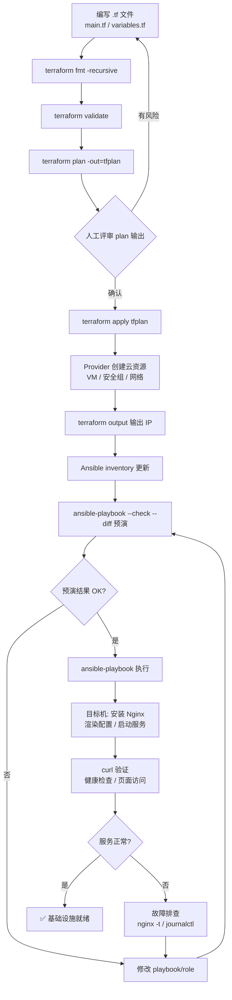

# 第 6 章 Nginx、Ansible、Terraform

> **定位**：从「手动运维」跨入「自动化与基础设施即代码（IaC）」。
> 前九章你在单机上磨内功——文件、网络、Shell、Python；本章把三件武器交到你手上：Nginx 做流量入口，Ansible 做配置管理，Terraform 做基础设施编排。三者协同，你就能从零创建一套**可重复构建、可版本追溯、可一键回滚**的 Web 基础设施。第 7 章容器、第 8 章 K8s 都会以此为基础。
>
> | 项 | 值 |
> |---|---|
> | 章 | 第 6 章 |
> | 周次 | 第 10～13 周 |
> | 建议学时 | 28～36 小时（讲解 10h / 实验 14h / 复盘 8h） |
> | 核心作品 | 一套可重复创建的 Web 基础设施（Nginx 反向代理 + Ansible 配置管理 + Terraform 基础设施编排） |
> | 完成标准 | 你能用 Terraform 创建资源 → Ansible 自动配置 Nginx → curl 验证服务可用，且每一步都能 plan/check/回滚 |
> | 主线环境 | Rocky Linux 9 |
> | 对照环境 | Ubuntu 22.04 LTS + Multipass |
> | 版本基准 | Nginx 1.24 / Ansible 9 (core 2.16) / Terraform 1.7（版本可能变动，以官方兼容矩阵为准） |

> **学习目标**
> 1. 说清楚反向代理、负载均衡、TLS termination 的原理及 Nginx 在架构中的位置；
> 2. 区分「配置管理（Ansible 声明式）」与「基础设施编排（Terraform 声明式）」的边界与协作方式；
> 3. 用 Nginx 搭建反向代理 + 负载均衡 + TLS 终止，并调优 worker/keepalive/gzip/缓存；
> 4. 用 Ansible 编写 inventory + playbook + role，实现多机幂等配置（含 handler、变量、Jinja2 模板）；
> 5. 用 Terraform 完成 plan → apply → verify 全流程，理解 state、远程后端、模块化与生命周期钩子；
> 6. 完成端到端实战：Terraform 创建资源 → Ansible 配置 Nginx → 访问验证；
> 7. 面对故障能从日志/plan 证据链定位根因，并安全回滚。

> [!WARNING]
> 本章涉及 `terraform apply`（创建真实云/本地资源）、`terraform destroy`（销毁资源）、Ansible 批量变更、Nginx 配置重载等操作。**每一步执行前在脑中回答三件事：改了哪层状态？怎么证明生效？怎么还原？** 尤其是 `terraform destroy` 会真实删除资源——**先 plan、确认环境、再执行**。生产环境应先备份、评审并准备回滚方案。破坏性操作只在可重置实验虚拟机执行。

---

## 1. 原理讲解（Principles）

### 1.1 Nginx：不只是 Web 服务器

很多人把 Nginx 当成「装个网站的服务器」，但它在 Ops 架构里更多扮演**流量入口**的角色：

- **静态资源服务**：直接吐 HTML/CSS/JS/图片，性能极高。
- **反向代理（Reverse Proxy）**：客户端请求先到 Nginx，Nginx 再转发给后端应用（Python/Java/Node），后端只需关注业务逻辑，不用管 TLS、限流、压缩。
- **负载均衡（Load Balancing）**：多台后端实例挂在 `upstream` 块里，Nginx 按策略（轮询/最少连接/IP hash）分发请求，某台挂了自动摘除。
- **TLS Termination（TLS 终止）**：HTTPS 在 Nginx 解密，后端用纯 HTTP，后端无需配证书——集中管理、降低后端 CPU 开销。
- **访问日志与基础限流**：`access_log` 记录所有请求，`limit_req` 做简单的请求速率控制。

> **心智模型**：Nginx 是「门口的保安兼前台」——它拦住非法请求、分发访客到不同窗口、记录谁来过、还能在门前加密/解密。

### 1.2 Ansible：声明式配置管理

Ansible 的核心思想是**声明目标状态**，而非编写执行步骤。

```
命令式思维："在 100 台机器上执行 systemctl restart nginx"
  → 如果 nginx 没装呢？如果配置文件是旧的呢？如果已经 restart 过了呢？

声明式思维："确保 nginx 已安装、配置文件内容正确、语法校验通过、服务已启动且开机自启"
  → Ansible 自己判断当前状态 vs 目标状态，决定是否需要变更，且重复执行不会产生副作用（幂等）
```

**Ansible 关键特性**：

| 特性 | 说明 |
|---|---|
| 无 Agent | 目标机只需 SSH，不需要装客户端守护进程 |
| 幂等（Idempotent） | 同一 playbook 跑 1 次和 100 次，结果一致 |
| 声明式 | 你描述「应该是什么样」，Ansible 决定「怎么变成那样」 |
| 模块化 | dnf/apt/template/systemd/copy 等模块封装了跨平台差异 |
| Role 可复用 | 把一组 task + 变量 + 模板 + handler 打包成 Role，跨项目共享 |
| Jinja2 模板 | 用变量渲染配置文件，支持条件、循环、过滤器 |

### 1.3 Terraform：基础设施编排

Terraform 管的是**资源生命周期**——创建、修改、销毁云/本地基础设施（虚拟机、网络、安全组、DNS 记录等）。

```
Terraform 工作流：
  write → fmt → validate → plan → review → apply → verify
```

**Terraform 核心概念**：

| 概念 | 说明 |
|---|---|
| Provider | 与云/平台 API 对接的插件（AWS/Azure/VMware/Multipass 等） |
| Resource | 一份 .tf 声明对应一份真实基础设施对象（一台 VM、一条安全组规则） |
| State | 记录「配置中的资源」与「真实资源」的映射，不能手动编辑，不应提交 Git |
| 远程后端 | 把 state 存到 S3/OSS/Consul，支持团队协作与状态锁 |
| 模块（Module） | 把一组 resource 打包复用，类似 Ansible Role |
| 依赖图 | Terraform 自动分析资源间依赖，决定创建/销毁顺序 |

### 1.4 Ansible vs Terraform：边界与协作

| 维度 | Ansible | Terraform |
|---|---|---|
| 管什么 | 机器**内部**的配置（软件包、文件、服务） | 机器**本身**及网络等基础设施（VM、VPC、DNS） |
| 执行方式 | SSH 推送，在目标机上跑模块 | 通过 Provider 调用云 API |
| 状态管理 | 无状态（每次执行都重新判断） | 有状态（state 文件记录映射） |
| 幂等机制 | 模块自身保证 | plan/apply 对比 state 与配置差异 |
| 典型用途 | 装软件、配 Nginx、管用户 | 创建 VM、安全组、RDS、负载均衡 |
| 生命周期 | 不跟踪资源销毁 | 全生命周期（create → update → destroy） |

> **协作模型**：Terraform 创建基础设施 → 输出 IP → Ansible 配置机器内部 → 验证。

### 1.5 IaC 心智模型

- **版本化**：所有定义在 .tf/.yml 文件里，纳入 Git，可追溯每次变更。
- **可审查**：Terraform plan / Ansible --check 让你在执行前看到精确差异。
- **可复现**：同一份代码在不同环境创建等价基础设施。
- **可回滚**：代码回退 → 重新 apply → 基础设施回到旧状态。
- **可测试**：Ansible Molecule、Terraform validate + plan 做预演。

> 参考：[Terraform 最佳实践](https://developer.hashicorp.com/terraform/language/best-practices) | [Ansible 官方入门](https://docs.ansible.com/ansible/latest/getting_started/index.html)

---

## 2. 架构（Architecture）

### 2.1 整体逻辑架构（ASCII 图）

```text
┌──────────────────────────────────────────────────────────────────────┐
│                        互联网 / 局域网 客户端                          │
│                    (浏览器 / curl / 压测工具)                          │
└──────────────────────────────┬───────────────────────────────────────┘
                               │  HTTPS (443) / HTTP (80)
                               ▼
┌──────────────────────────────────────────────────────────────────────┐
│  Nginx 节点 (web-lb)                                                  │
│  ┌────────────────────────────────────────────────────────────────┐  │
│  │  TLS Termination (证书在 Nginx 解密)                           │  │
│  │  反向代理 + 负载均衡 (upstream)                                 │  │
│  │  安全头 / 限流 / gzip / access_log                             │  │
│  └───────────┬───────────────────────┬────────────────────────────┘  │
│              │                       │                               │
│         ┌────▼────┐            ┌─────▼─────┐                         │
│         │ web01   │            │  web02    │   ← 后端应用实例         │
│         │ :8080   │            │  :8080    │     (Python http.server  │
│         │         │            │           │      或 Nginx 静态页)    │
│         └─────────┘            └───────────┘                         │
└──────────────────────────────────────────────────────────────────────┘

         ┌───────────────────────────────────────────────────┐
         │  Ansible 控制机 (ansible-ctl)                     │
         │  inventory → playbook → roles/                    │
         │  SSH 推送配置到: web01 / web02                    │
         └───────────────────────────────────────────────────┘

         ┌───────────────────────────────────────────────────┐
         │  Terraform 执行机 (terraform-runner)               │
         │  main.tf / variables.tf / outputs.tf               │
         │  → Provider API → 创建 VM/网络/安全组               │
         │  → 输出 IP 地址给 Ansible inventory                 │
         └───────────────────────────────────────────────────┘
```

### 2.2 从 Terraform apply 到服务可用的数据流（Mermaid）



> 参考：[Terraform Architecture](https://developer.hashicorp.com/terraform/internals/architecture) | [Nginx Docs](https://nginx.org/en/docs/)

---

## 3. 部署（Deployment）

### 3.1 实验环境规划

| 角色 | 主机名 | CPU | 内存 | 磁盘 | IP（示例） |
|---|---|---|---|---|---|
| Ansible 控制机 | ansible-ctl | 1 | 1G | 10G | 192.168.56.10 |
| Nginx LB + 后端 web01 | web01 | 1 | 1G | 10G | 192.168.56.21 |
| 后端 web02 | web02 | 1 | 1G | 10G | 192.168.56.22 |

> [!NOTE]
> 资源紧张时可把 LB 和 web01 放同一台机器（不同端口区分）。Terraform 可在 ansible-ctl 上执行。

### 3.2 用 Multipass 快速创建实验机

```bash
# --- 宿主机执行 ---
multipass launch 22.04 --name ansible-ctl --cpus 1 --memory 1G --disk 10G
multipass launch 22.04 --name web01       --cpus 1 --memory 1G --disk 10G
multipass launch 22.04 --name web02       --cpus 1 --memory 1G --disk 10G
multipass info ansible-ctl web01 web02 | grep IPv4
```

### 3.3 安装 Nginx（双路线）

#### Rocky Linux 9

```bash
# --- web01 / web02 上执行，用户: ops ---
sudo dnf install -y epel-release
sudo dnf install -y nginx
nginx -v                                 # 确认版本
sudo systemctl enable --now nginx

# 防火墙放行
sudo firewall-cmd --permanent --add-service=http
sudo firewall-cmd --permanent --add-service=https
sudo firewall-cmd --reload

# SELinux：允许 Nginx 反向代理连接后端（Rocky 特有坑）
sudo setsebool -P httpd_can_network_connect 1
```

#### Ubuntu 22.04 LTS

```bash
# --- web01 / web02 上执行 ---
sudo apt update && sudo apt install -y nginx
nginx -v
sudo systemctl enable --now nginx
sudo ufw allow 'Nginx Full'
```

> [!NOTE]
> 如需 Nginx 1.24 官方稳定版，可添加 [Nginx 官方仓库](https://nginx.org/en/download.html)。版本可能变动，以官方兼容矩阵为准。

### 3.4 安装 Ansible（控制机）

```bash
# --- ansible-ctl 上执行 ---
sudo apt install -y python3-pip python3-venv
python3 -m venv ~/ansible-venv
source ~/ansible-venv/bin/activate
pip install ansible==9.7.0              # Ansible 9 (core 2.16)
ansible --version

# 配置 SSH 免密
ssh-keygen -t ed25519 -C "ansible-ctl" -f ~/.ssh/id_ed25519 -N ""
ssh-copy-id ops@192.168.56.21
ssh-copy-id ops@192.168.56.22
```

### 3.5 安装 Terraform（控制机）

```bash
# --- ansible-ctl 上执行 ---
sudo apt install -y gnupg curl
curl -fsSL https://apt.releases.hashicorp.com/gpg | sudo gpg --dearmor -o /usr/share/keyrings/hashicorp-archive-keyring.gpg
echo "deb [signed-by=/usr/share/keyrings/hashicorp-archive-keyring.gpg] https://apt.releases.hashicorp.com $(lsb_release -cs) main" | sudo tee /etc/apt/sources.list.d/hashicorp.list
sudo apt update && sudo apt install -y terraform=1.7.*
terraform version                        # 预期: Terraform v1.7.x
```

> [!NOTE]
> Terraform 版本迭代较快，请以 [Terraform 下载页](https://developer.hashicorp.com/terraform/downloads) 最新稳定版为准。

---

## 4. 配置（Configuration）

### 4.1 Nginx 配置：反向代理 + 负载均衡 + TLS

#### 4.1.1 反向代理配置

```nginx
# 文件路径: /etc/nginx/conf.d/app.conf
# 部署位置: web01 (LB 节点)

# --- upstream 定义后端池 ---
upstream app_backend {
    least_conn;                                      # 最少连接策略
    server 192.168.56.21:8080 weight=1 max_fails=3 fail_timeout=30s;
    server 192.168.56.22:8080 weight=1 max_fails=3 fail_timeout=30s;
    keepalive 32;                                    # 到后端的长连接池
}

# --- HTTP 跳转 HTTPS ---
server {
    listen 80;
    server_name app.lab;
    return 301 https://$host$request_uri;
}

# --- HTTPS 主服务 ---
server {
    listen 443 ssl http2;
    server_name app.lab;

    ssl_certificate     /etc/nginx/ssl/app.lab.crt;
    ssl_certificate_key /etc/nginx/ssl/app.lab.key;
    ssl_protocols TLSv1.2 TLSv1.3;
    ssl_ciphers ECDHE-ECDSA-AES128-GCM-SHA256:ECDHE-RSA-AES128-GCM-SHA256;
    ssl_prefer_server_ciphers off;
    ssl_session_cache shared:SSL:10m;
    ssl_session_timeout 10m;

    access_log /var/log/nginx/app_access.log;
    error_log  /var/log/nginx/app_error.log warn;

    # 安全响应头
    add_header X-Frame-Options "SAMEORIGIN" always;
    add_header X-Content-Type-Options "nosniff" always;
    add_header Strict-Transport-Security "max-age=31536000; includeSubDomains" always;

    # 健康检查
    location = /healthz {
        access_log off;
        return 200 "ok\n";
        add_header Content-Type text/plain;
    }

    # 反向代理
    location / {
        proxy_pass http://app_backend;
        proxy_set_header Host              $host;
        proxy_set_header X-Real-IP         $remote_addr;
        proxy_set_header X-Forwarded-For   $proxy_add_x_forwarded_for;
        proxy_set_header X-Forwarded-Proto $scheme;
        proxy_http_version 1.1;
        proxy_set_header Connection "";
        proxy_connect_timeout 5s;
        proxy_read_timeout    60s;
    }

    # 静态资源缓存
    location ~* \.(jpg|jpeg|png|gif|ico|css|js|woff2?)$ {
        proxy_pass http://app_backend;
        expires 30d;
        add_header Cache-Control "public, immutable";
    }
}
```

#### 4.1.2 生成自签 TLS 证书

```bash
# --- web01 上执行，用户: ops ---
sudo mkdir -p /etc/nginx/ssl
sudo openssl req -x509 -nodes -days 365 \
  -newkey rsa:2048 \
  -keyout /etc/nginx/ssl/app.lab.key \
  -out /etc/nginx/ssl/app.lab.crt \
  -subj "/C=CN/ST=Lab/L=Lab/O=Lab/CN=app.lab" \
  -addext "subjectAltName=DNS:app.lab,IP:192.168.56.21"
sudo chmod 600 /etc/nginx/ssl/app.lab.key
sudo chmod 644 /etc/nginx/ssl/app.lab.crt
```

#### 4.1.3 Nginx 主配置调优片段

```nginx
# 文件: /etc/nginx/nginx.conf (关键调优段)
user nginx;
worker_processes auto;             # 自动匹配 CPU 核数
worker_rlimit_nofile 65535;

events {
    worker_connections 4096;
    multi_accept on;
}

http {
    sendfile on;
    tcp_nopush on;
    tcp_nodelay on;
    keepalive_timeout 65;
    keepalive_requests 1000;
    server_tokens off;             # 隐藏版本号

    gzip on;
    gzip_vary on;
    gzip_min_length 1024;
    gzip_comp_level 4;
    gzip_types text/plain text/css text/xml application/json application/javascript image/svg+xml;

    limit_req_zone $binary_remote_addr zone=api_rate:10m rate=10r/s;

    include /etc/nginx/conf.d/*.conf;
}
```

> [!CAUTION]
> 每次修改 Nginx 配置后，**必须先 `nginx -t` 校验语法再 `systemctl reload`**。`reload` 是平滑重载，比 `restart` 更安全。如果配置语法错误，`reload` 会拒绝执行并保持旧配置运行。

### 4.2 Ansible 配置：inventory + playbook + role

#### 4.2.1 项目结构

```text
ansible/
├── ansible.cfg
├── inventories/lab/
│   ├── hosts.yml
│   └── group_vars/
│       ├── all.yml
│       └── webservers.yml
├── playbooks/site.yml
└── roles/nginx/
    ├── defaults/main.yml
    ├── handlers/main.yml
    ├── tasks/main.yml
    ├── templates/
    │   ├── nginx.conf.j2
    │   └── app.conf.j2
    └── meta/main.yml
```

#### 4.2.2 ansible.cfg

```ini
[defaults]
inventory = inventories/lab/hosts.yml
host_key_checking = False
retry_files_enabled = False
stdout_callback = yaml
forks = 5
timeout = 30

[privilege_escalation]
become = True
become_method = sudo
become_ask_pass = False
```

#### 4.2.3 inventory

```yaml
# 文件: inventories/lab/hosts.yml
all:
  children:
    load_balancer:
      hosts:
        web01:
          ansible_host: 192.168.56.21
          ansible_user: ops
    webservers:
      hosts:
        web01:
          ansible_host: 192.168.56.21
          ansible_user: ops
        web02:
          ansible_host: 192.168.56.22
          ansible_user: ops
      vars:
        backend_port: 8080
  vars:
    domain_name: app.lab
```

#### 4.2.4 group_vars/all.yml

```yaml
# 文件: inventories/lab/group_vars/all.yml
---
domain_name: app.lab
ssl_cert_path: /etc/nginx/ssl/app.lab.crt
ssl_key_path: /etc/nginx/ssl/app.lab.key
upstream_keepalive: 32
worker_connections: 4096
backend_servers:
  - { name: "web01", host: "192.168.56.21", port: 8080, weight: 1 }
  - { name: "web02", host: "192.168.56.22", port: 8080, weight: 1 }
```

#### 4.2.5 Role: defaults/main.yml

```yaml
# 文件: roles/nginx/defaults/main.yml
---
nginx_worker_processes: auto
nginx_worker_connections: 4096
nginx_keepalive_timeout: 65
nginx_gzip_enabled: true
nginx_server_tokens: "off"
```

#### 4.2.6 Role: tasks/main.yml

```yaml
# 文件: roles/nginx/tasks/main.yml
---
# Task 1: 安装 Nginx（跨平台）
- name: Install nginx on Rocky/RHEL
  ansible.builtin.dnf:
    name: nginx
    state: present
  when: ansible_os_family == "RedHat"

- name: Install nginx on Ubuntu/Debian
  ansible.builtin.apt:
    name: nginx
    state: present
    update_cache: true
  when: ansible_os_family == "Debian"

# Task 2: 创建 SSL 目录
- name: Ensure SSL directory exists
  ansible.builtin.file:
    path: /etc/nginx/ssl
    state: directory
    owner: root
    group: root
    mode: "0755"

# Task 3: 部署 TLS 证书
- name: Deploy TLS certificate
  ansible.builtin.copy:
    src: "files/app.lab.crt"
    dest: "{{ ssl_cert_path }}"
    owner: root
    group: root
    mode: "0644"
  notify: Reload nginx

- name: Deploy TLS private key
  ansible.builtin.copy:
    src: "files/app.lab.key"
    dest: "{{ ssl_key_path }}"
    owner: root
    group: root
    mode: "0600"
  notify: Reload nginx

# Task 4: 部署 Nginx 主配置（Jinja2 模板）
- name: Deploy nginx main config
  ansible.builtin.template:
    src: nginx.conf.j2
    dest: /etc/nginx/nginx.conf
    owner: root
    group: root
    mode: "0644"
    validate: /usr/sbin/nginx -t -c %s
  notify: Reload nginx

# Task 5: 部署反向代理配置（仅 LB 节点）
- name: Deploy reverse proxy config on LB
  ansible.builtin.template:
    src: app.conf.j2
    dest: /etc/nginx/conf.d/app.conf
    owner: root
    group: root
    mode: "0644"
    validate: /usr/sbin/nginx -t -c %s
  when: inventory_hostname in groups['load_balancer']
  notify: Reload nginx

# Task 6: 部署后端静态页
- name: Deploy backend index page
  ansible.builtin.copy:
    dest: /var/www/html/index.html
    content: |
      <!DOCTYPE html>
      <html><body>
      <h1>Hello from {{ inventory_hostname }}</h1>
      </body></html>
    owner: nginx
    group: nginx
    mode: "0644"
  when: ansible_os_family == "RedHat"

- name: Deploy backend index page (Ubuntu)
  ansible.builtin.copy:
    dest: /var/www/html/index.html
    content: |
      <!DOCTYPE html>
      <html><body>
      <h1>Hello from {{ inventory_hostname }}</h1>
      </body></html>
    owner: www-data
    group: www-data
    mode: "0644"
  when: ansible_os_family == "Debian"

# Task 7: 配置后端监听 8080
- name: Deploy backend server block
  ansible.builtin.copy:
    dest: /etc/nginx/conf.d/backend.conf
    content: |
      server {
          listen 8080;
          server_name _;
          root /var/www/html;
          index index.html;
      }
    owner: root
    group: root
    mode: "0644"
    validate: /usr/sbin/nginx -t -c %s
  notify: Reload nginx

# Task 8: SELinux 允许 Nginx 网络连接（Rocky）
- name: Allow Nginx to connect to backend (SELinux)
  ansible.posix.seboolean:
    name: httpd_can_network_connect
    state: true
    persistent: true
  when: ansible_os_family == "RedHat"

# Task 9: 防火墙放行
- name: Open firewall for HTTP/HTTPS (firewalld)
  ansible.posix.firewalld:
    service: "{{ item }}"
    permanent: true
    state: enabled
    immediate: true
  loop:
    - http
    - https
  when: ansible_os_family == "RedHat"

- name: Open firewall for HTTP/HTTPS (ufw)
  community.general.ufw:
    rule: allow
    name: "Nginx Full"
  when: ansible_os_family == "Debian"

# Task 10: 确保 Nginx 已启动且开机自启
- name: Ensure nginx is enabled and running
  ansible.builtin.systemd_service:
    name: nginx
    enabled: true
    state: started
```

#### 4.2.7 Role: handlers/main.yml

```yaml
# 文件: roles/nginx/handlers/main.yml
---
- name: Reload nginx
  ansible.builtin.systemd_service:
    name: nginx
    state: reloaded     # 平滑重载，不是 restart
```

#### 4.2.8 Role: templates/nginx.conf.j2

```jinja2
# 文件: roles/nginx/templates/nginx.conf.j2
# Jinja2 模板：用变量渲染 Nginx 主配置
user nginx;
worker_processes {{ nginx_worker_processes }};
worker_rlimit_nofile 65535;

events {
    worker_connections {{ nginx_worker_connections }};
    multi_accept on;
}

http {
    sendfile on;
    tcp_nopush on;
    tcp_nodelay on;
    keepalive_timeout {{ nginx_keepalive_timeout }};
    keepalive_requests 1000;
    server_tokens {{ nginx_server_tokens }};


    gzip on;
    gzip_vary on;
    gzip_min_length 1024;
    gzip_comp_level 4;
    gzip_types text/plain text/css text/xml application/json application/javascript image/svg+xml;


    limit_req_zone $binary_remote_addr zone=api_rate:10m rate=10r/s;

    include /etc/nginx/conf.d/*.conf;
}
```

#### 4.2.9 Role: templates/app.conf.j2

```jinja2
# 文件: roles/nginx/templates/app.conf.j2
# 反向代理配置（仅部署到 load_balancer 组）

upstream app_backend {
    least_conn;

    server {{ server.host }}:{{ server.port }} weight={{ server.weight }} max_fails=3 fail_timeout=30s;

    keepalive {{ upstream_keepalive }};
}

server {
    listen 80;
    server_name {{ domain_name }};
    return 301 https://$host$request_uri;
}

server {
    listen 443 ssl http2;
    server_name {{ domain_name }};

    ssl_certificate     {{ ssl_cert_path }};
    ssl_certificate_key {{ ssl_key_path }};
    ssl_protocols TLSv1.2 TLSv1.3;
    ssl_prefer_server_ciphers off;
    ssl_session_cache shared:SSL:10m;
    ssl_session_timeout 10m;

    access_log /var/log/nginx/app_access.log;
    error_log  /var/log/nginx/app_error.log warn;

    add_header X-Frame-Options "SAMEORIGIN" always;
    add_header X-Content-Type-Options "nosniff" always;
    add_header Strict-Transport-Security "max-age=31536000; includeSubDomains" always;

    location = /healthz {
        access_log off;
        return 200 "ok\n";
        add_header Content-Type text/plain;
    }

    location / {
        proxy_pass http://app_backend;
        proxy_set_header Host              $host;
        proxy_set_header X-Real-IP         $remote_addr;
        proxy_set_header X-Forwarded-For   $proxy_add_x_forwarded_for;
        proxy_set_header X-Forwarded-Proto $scheme;
        proxy_http_version 1.1;
        proxy_set_header Connection "";
        proxy_connect_timeout 5s;
        proxy_read_timeout    60s;
    }

    location ~* \.(jpg|jpeg|png|gif|ico|css|js|woff2?)$ {
        proxy_pass http://app_backend;
        expires 30d;
        add_header Cache-Control "public, immutable";
    }
}
```

#### 4.2.10 playbooks/site.yml

```yaml
# 文件: playbooks/site.yml
---
- name: Configure load balancer
  hosts: load_balancer
  become: true
  serial: 1                       # 每次只改一台（零停机保障）
  roles:
    - nginx

- name: Configure backend webservers
  hosts: webservers
  become: true
  serial: 1
  roles:
    - nginx
```

### 4.3 Terraform 配置

#### 4.3.1 variables.tf

```hcl
# 文件: ~/iac-lab/terraform/variables.tf

variable "instance_count" {
  description = "后端 web 实例数量"
  type        = number
  default     = 2
}

variable "instance_cpu" {
  description = "每台实例 CPU 核数"
  type        = number
  default     = 1
}

variable "instance_memory" {
  description = "每台实例内存"
  type        = string
  default     = "1GiB"
}

variable "instance_disk" {
  description = "每台实例磁盘大小"
  type        = string
  default     = "10GiB"
}

variable "ubuntu_image" {
  description = "Multipass 镜像"
  type        = string
  default     = "22.04"
}

variable "env_tag" {
  description = "环境标签"
  type        = string
  default     = "lab"
}
```

#### 4.3.2 main.tf

```hcl
# 文件: ~/iac-lab/terraform/main.tf

terraform {
  required_version = ">= 1.7, < 2.0"

  required_providers {
    multipass = {
      source  = "canonical/multipass"
      version = "~> 1.0"
    }
  }

  # 远程后端概念演示（实验中用本地 state 即可）
  # 生产环境应使用远程后端 + 状态锁 + 加密：
  # backend "s3" {
  #   bucket         = "example-terraform-state"
  #   key            = "lab/nginx-ansible/terraform.tfstate"
  #   region         = "us-east-1"
  #   encrypt        = true
  #   dynamodb_table = "terraform-locks"
  # }
}

provider "multipass" {}

# --- 创建后端 Web 实例 ---
resource "multipass_vm" "web" {
  count  = var.instance_count
  name   = "${var.env_tag}-web${count.index + 1}"
  image  = var.ubuntu_image
  cpus   = var.instance_cpu
  memory = var.instance_memory
  disk   = var.instance_disk

  cloud_init = <<-EOF
    #cloud-config
    users:
      - name: ops
        sudo: ALL=(ALL) NOPASSWD:ALL
        shell: /bin/bash
        ssh_authorized_keys:
          - ${file("~/.ssh/id_ed25519.pub")}
    packages:
      - nginx
    runcmd:
      - systemctl enable --now nginx
      - ufw allow 'Nginx Full'
  EOF

  tags = {
    Environment = var.env_tag
    Role        = "webserver"
    ManagedBy   = "terraform"
  }
}

# --- 创建 Ansible 控制机 ---
resource "multipass_vm" "ansible_ctl" {
  name   = "${var.env_tag}-ansible-ctl"
  image  = var.ubuntu_image
  cpus   = 1
  memory = "1GiB"
  disk   = "10GiB"

  cloud_init = <<-EOF
    #cloud-config
    users:
      - name: ops
        sudo: ALL=(ALL) NOPASSWD:ALL
        shell: /bin/bash
        ssh_authorized_keys:
          - ${file("~/.ssh/id_ed25519.pub")}
    packages:
      - python3-pip
      - python3-venv
    runcmd:
      - su - ops -c "python3 -m venv ~/ansible-venv && ~/ansible-venv/bin/pip install ansible==9.7.0"
  EOF

  tags = {
    Environment = var.env_tag
    Role        = "ansible-controller"
    ManagedBy   = "terraform"
  }
}
```

#### 4.3.3 outputs.tf

```hcl
# 文件: ~/iac-lab/terraform/outputs.tf

output "web_ips" {
  description = "后端 Web 实例的 IP 地址列表"
  value = {
    for vm in multipass_vm.web : vm.name => vm.ipv4_address
  }
}

output "ansible_ctl_ip" {
  description = "Ansible 控制机 IP"
  value       = multipass_vm.ansible_ctl.ipv4_address
}

output "ansible_inventory_snippet" {
  description = "可直接粘贴到 Ansible inventory 的 YAML 片段"
  value = yamlencode({
    all = {
      children = {
        webservers = {
          hosts = {
            for vm in multipass_vm.web : vm.name => {
              ansible_host = vm.ipv4_address
              ansible_user = "ops"
            }
          }
        }
      }
    }
  })
}
```

#### 4.3.4 .gitignore

```gitignore
.terraform/
*.tfstate
*.tfstate.*
*.tfplan
crash.log
.terraform.tfstate.lock.info
```

> [!NOTE]
> `.terraform.lock.hcl` 是 Provider 依赖锁文件，**应该提交 Git**。它和 state 锁不是一回事。

> 参考：[Terraform Best Practices](https://developer.hashicorp.com/terraform/language/best-practices) | [Ansible Galaxy nginx role](https://galaxy.ansible.com/nginxinc/nginx)

---

## 5. 验证（Verification）

### 5.1 Nginx 验证

```bash
# --- 在 web01 (LB) 上执行 ---
# 1) 语法校验（任何变更后必做）
sudo nginx -t
# 预期: nginx: configuration file /etc/nginx/nginx.conf test is successful

# 2) 查看实际加载的完整配置
sudo nginx -T | grep -A5 'server_name app.lab'

# 3) 验证 HTTPS 健康检查
curl -k https://127.0.0.1/healthz -H 'Host: app.lab'
# 预期: ok

# 4) 验证 HTTP → HTTPS 跳转
curl -I http://127.0.0.1/ -H 'Host: app.lab'
# 预期: 301 Moved Permanently, Location: https://app.lab/

# 5) 验证负载均衡（多次请求看是否分发到不同后端）
for i in $(seq 1 6); do
  curl -k -s https://127.0.0.1/ -H 'Host: app.lab' | grep "Hello from"
done
# 预期: 交替出现 web01 和 web02

# 6) 验证后端直连
curl http://192.168.56.21:8080/ | grep "Hello from"
curl http://192.168.56.22:8080/ | grep "Hello from"
```

### 5.2 Ansible 验证

```bash
# --- 在 ansible-ctl 上执行 ---
cd ~/iac-lab/ansible

# 1) 语法检查（不执行任何变更）
ansible-playbook -i inventories/lab/hosts.yml playbooks/site.yml --syntax-check

# 2) 预演（dry run，显示会做什么变更但不执行）
ansible-playbook -i inventories/lab/hosts.yml playbooks/site.yml --check --diff

# 3) 实际执行
ansible-playbook -i inventories/lab/hosts.yml playbooks/site.yml

# 4) 再次执行——验证幂等性（应该报告 changed=0）
ansible-playbook -i inventories/lab/hosts.yml playbooks/site.yml
# 预期: PLAY RECAP ... changed=0 ... unreachable=0 ... failed=0

# 5) 验证目标机 Nginx 状态
ansible webservers -i inventories/lab/hosts.yml -m command -a 'nginx -t'
ansible webservers -i inventories/lab/hosts.yml -m command -a 'systemctl is-active nginx'
```

### 5.3 Terraform 验证

```bash
# --- 在 ansible-ctl 上执行 ---
cd ~/iac-lab/terraform

# 1) 格式化检查
terraform fmt -recursive -check

# 2) 初始化（下载 provider）
terraform init

# 3) 语法校验
terraform validate
# 预期: Success! The configuration is valid.

# 4) 预览变更（不执行）
terraform plan -out=tfplan
# 仔细阅读输出：Plan: N to add, 0 to change, 0 to destroy

# 5) 查看 plan 详情
terraform show tfplan

# 6) 执行变更
terraform apply tfplan

# 7) 验证资源已创建
terraform state list                    # 列出所有资源
terraform output                        # 查看输出值（IP 地址）
```

### 5.4 端到端验证

```bash
# --- 在 ansible-ctl 上执行 ---
# 用 Terraform 输出的 IP 更新 Ansible inventory
terraform output -raw ansible_inventory_snippet > /tmp/tf_inventory.yml

# 手动合并到 hosts.yml 或用 terraform output 的 IP 直接 SSH
# 验证 SSH 可达
ssh ops@$(terraform output -raw ansible_ctl_ip) 'echo TF-SSH-OK'

# 执行 Ansible playbook 配置 Nginx
cd ~/iac-lab/ansible
ansible-playbook -i inventories/lab/hosts.yml playbooks/site.yml --check --diff
ansible-playbook -i inventories/lab/hosts.yml playbooks/site.yml

# curl 验证最终服务
LB_IP=$(terraform output -raw web_ips | grep -oP '192\.[\d.]+')
curl -k https://$LB_IP/healthz -H 'Host: app.lab'
# 预期: ok
```

**验收清单**

- [ ] `terraform plan` 无报错，apply 后 `terraform state list` 列出所有资源
- [ ] `ansible-playbook --syntax-check` 通过
- [ ] `ansible-playbook --check --diff` 预演结果符合预期
- [ ] `ansible-playbook` 执行后 `changed` 数量合理
- [ ] 重复执行 playbook，`changed=0`（幂等性验证）
- [ ] `nginx -t` 在所有节点通过
- [ ] `curl -k https://<LB_IP>/healthz` 返回 `ok`
- [ ] 多次请求 `curl -k https://<LB_IP>/` 交替显示不同后端主机名
- [ ] HTTP 80 端口正确 301 跳转到 HTTPS

---

## 6. 性能（Performance）

### 6.1 Nginx 性能调优

| 参数 | 作用 | 调优建议 |
|---|---|---|
| `worker_processes` | worker 进程数 | `auto`（匹配 CPU 核数），或手动指定等于核数 |
| `worker_connections` | 每 worker 最大连接数 | 4096～10240，需配合 `worker_rlimit_nofile` |
| `worker_rlimit_nofile` | 文件描述符上限 | 65535，需同步调 `systemd` 的 `LimitNOFILE` |
| `keepalive_timeout` | 客户端长连接超时 | 65s（默认），长连接减少 TCP 握手 |
| `keepalive_requests` | 单连接最大请求数 | 1000（默认），高并发可调到 10000 |
| `gzip_comp_level` | 压缩级别 | 4（1-9，越高 CPU 消耗越大） |
| `multi_accept` | 一次接受多连接 | `on`（高并发场景） |

```bash
# 验证系统限制
nginx -V                                  # 查看编译参数
systemctl show nginx -p LimitNOFILE       # 查看 systemd 文件描述符限制
cat /proc/$(pgrep -o nginx)/limits        # 查看 master 进程的 ulimit
ss -s                                     # 查看当前连接统计

# 压测（用 ab 或 wrk）
ab -n 10000 -c 100 https://127.0.0.1/healthz
# 或: wrk -t4 -c100 -d30s https://127.0.0.1/healthz
```

### 6.2 Ansible 执行策略

- **forks**：并发数，默认 5。目标机多时调大到 20～50。
- **serial**：分批执行，`serial: 1` 每次只改一台（零停机）。
- **strategy**: `linear`（默认，逐 task 执行）vs `free`（每台尽快跑完不等其他）。
- **throttle**：限制单批最大并发（比 forks 更细粒度）。

```yaml
# 执行策略示例
- hosts: webservers
  serial: 2                  # 每批 2 台
  forks: 10                  # 每批内并发 10
  strategy: linear           # 逐 task 推进
  # strategy: free           # 或: 每台尽快跑完全部 task
```

```bash
# 命令行临时调 forks
ansible-playbook playbooks/site.yml -f 20
```

### 6.3 Terraform 并行与状态锁

- **并行**：Terraform 默认并行创建无依赖的资源（`-parallelism` 控制并发数，默认 10）。
- **状态锁**：远程后端（S3+DynamoDB / Consul）提供状态锁，防止多人同时 apply 导致 state 损坏。
- **plan 刷新**：`terraform plan -refresh=false` 跳过状态刷新（快速预演，但不检测外部变更）。

```bash
# 调整并行度
terraform apply -parallelism=5

# 查看状态锁信息（如果被锁住）
terraform force-unlock <LOCK_ID>   # 慎用！确认没有其他 Terraform 运行时才用
```

> [!CAUTION]
> `terraform force-unlock` 只在确认没有其他 Terraform 进程在运行时使用。误用会导致 state 损坏。

---

## 7. 故障（Troubleshooting）

### 7.1 故障演练一：Nginx 配置写错导致 502 Bad Gateway

**制造故障**：

```bash
# --- 在 web01 上执行 ---
# 故意把后端端口改错（8080 写成 9999）
sudo sed -i 's/8080/9999/' /etc/nginx/conf.d/app.conf
sudo nginx -t && sudo systemctl reload nginx

# 现象：访问返回 502
curl -k https://127.0.0.1/ -H 'Host: app.lab'
# 预期: 502 Bad Gateway
```

**定位**：

```bash
# 1) 看 Nginx error 日志
sudo tail -20 /var/log/nginx/app_error.log
# 预期: connect() failed (111: Connection refused) while connecting to upstream

# 2) 检查后端是否在监听
ss -tlnp | grep 8080
# 预期: 有 nginx 进程监听 8080（说明后端没问题，是 LB 配置的端口写错了）

# 3) 查看 LB 实际加载的 upstream 配置
sudo nginx -T | grep -A5 'upstream app_backend'
# 预期: 看到 server 192.168.56.21:9999 ← 端口错误！
```

**修复**：

```bash
# 修正端口
sudo sed -i 's/9999/8080/' /etc/nginx/conf.d/app.conf
sudo nginx -t && sudo systemctl reload nginx
curl -k https://127.0.0.1/ -H 'Host: app.lab' | grep "Hello from"
# 恢复正常
```

### 7.2 故障演练二：Ansible 幂等性被破坏

**制造故障**：

```yaml
# 在 tasks/main.yml 中故意加一个非幂等的 task：
- name: Add line to index.html (非幂等示范)
  ansible.builtin.shell: echo "Appended at $(date)" >> /var/www/html/index.html
  # 问题：每次执行都会追加一行，不是幂等的
```

**定位**：

```bash
# 执行 playbook 两次
ansible-playbook playbooks/site.yml
ansible-playbook playbooks/site.yml
# 第二次仍然 changed=1 ← 幂等性被破坏

# 验证：index.html 越来越长
ssh ops@192.168.56.21 'wc -l /var/www/html/index.html'
# 每执行一次多一行
```

**修复**：

```yaml
# 用幂等模块替代 shell：
- name: Ensure marker line exists in index.html (幂等修复)
  ansible.builtin.lineinfile:
    path: /var/www/html/index.html
    line: "<!-- Managed by Ansible -->"
    state: present
    # lineinfile 天然幂等：行已存在就不追加
```

```bash
# 再次执行两次，验证 changed=0
ansible-playbook playbooks/site.yml
ansible-playbook playbooks/site.yml
# 第二次: changed=0 ← 幂等性恢复
```

### 7.3 故障演练三：Terraform State 漂移

**制造故障**：

```bash
# --- 在 ansible-ctl 上执行 ---
cd ~/iac-lab/terraform

# 手动删除一个 Terraform 管理的资源（模拟外部人工干预）
multipass delete lab-web2 --purge

# 现在 Terraform state 认为有 web2，但实际已不存在——state 漂移
```

**定位**：

```bash
# 1) terraform plan 会检测到漂移
terraform plan
# 预期输出: # multipass_vm.web[1] will be destroyed (because the resource no longer exists)
# 或: multipass_vm.web[1] will be created

# 2) 查看 state 中的资源
terraform state list
# multipass_vm.web[0]  ← 存在
# multipass_vm.web[1]  ← state 有但实际已删除（漂移！）
```

**修复**：

```bash
# 方案 A: 让 Terraform 重建资源
terraform apply
# Terraform 会重新创建 web2

# 方案 B: 从 state 中移除已不存在的资源（不重建）
terraform state rm 'multipass_vm.web[1]'
# 然后更新 .tf 中的 count 或手动处理
```

> [!WARNING]
> `terraform state rm` 只是修改 state 文件，不销毁真实资源。用前先备份 state：`cp terraform.tfstate terraform.tfstate.bak.$(date +%F)`。修改 state 一律用 `terraform state` 子命令，**绝不手动编辑 .tfstate 文件**。

### 7.4 故障演练四：SELinux 拦截 Nginx 反向代理（Rocky 特有）

**制造故障**（在 Rocky 9 上）：

```bash
# 恢复 SELinux 默认值（禁止 Nginx 连后端）
sudo setsebool -P httpd_can_network_connect 0

# reload 后访问
sudo systemctl reload nginx
curl -k https://127.0.0.1/ -H 'Host: app.lab'
# 预期: 502 Bad Gateway
```

**定位**：

```bash
# 查看 SELinux 审计日志
sudo ausearch -m AVC -ts recent | grep nginx
# 或:
sudo auditctl -w /var/log/nginx -p rwa
sudo tail /var/log/audit/audit.log | grep nginx
# 预期: type=AVC ... denied ... comm="nginx" ... dest=8080

# 确认布尔值状态
getsebool httpd_can_network_connect
# 预期: httpd_can_network_connect --> off
```

**修复**：

```bash
sudo setsebool -P httpd_can_network_connect 1
curl -k https://127.0.0.1/ -H 'Host: app.lab' | grep "Hello from"
# 恢复正常
```

> [!NOTE]
> Rocky/RHEL 上 SELinux 是常见踩坑点。**正确做法是开启对应布尔值，绝不关闭 SELinux**。用 `getsebool -a | grep httpd` 查看所有相关布尔值。

---

## 8. 回滚（Rollback）

### 8.1 Nginx 配置回退

```bash
# 改前备份（养成习惯）
sudo cp -a /etc/nginx/conf.d/app.conf /etc/nginx/conf.d/app.conf.bak.$(date +%F_%H%M)

# 回滚
sudo cp -a /etc/nginx/conf.d/app.conf.bak.$(date +%F_%H%M) /etc/nginx/conf.d/app.conf
sudo nginx -t && sudo systemctl reload nginx
```

### 8.2 Ansible 重新 apply 收敛

```bash
# Ansible 的回滚就是"把配置改回正确状态再 apply"
# 如果某台机器被人手动改乱了，直接重新 apply 即可收敛：
ansible-playbook playbooks/site.yml --limit web01
# Ansible 会检测差异，只修复被改歪的部分

# 用 --check --diff 先看差异
ansible-playbook playbooks/site.yml --limit web01 --check --diff
```

### 8.3 Terraform destroy / taint / 版本回退

```bash
# --- 销毁所有资源 ---
terraform destroy
# 会显示要销毁的资源列表，输入 yes 确认

# --- taint 单个资源（标记为需要重建）---
terraform taint 'multipass_vm.web[1]'
terraform plan     # 会显示该资源将被 destroy + create
terraform apply    # 执行重建

# --- 版本回退 ---
# 1) git checkout 到旧版本代码
git log --oneline
git checkout <旧commit> -- main.tf
# 2) 重新 plan + apply
terraform plan -out=tfplan
terraform apply tfplan
```

> [!CAUTION]
> `terraform destroy` 会**真实删除资源**。执行前务必确认环境（实验 vs 生产），先 plan 看清单，确认无误再 destroy。`prevent_destroy` 生命周期钩子可以为关键资源加护栏：

```hcl
resource "multipass_vm" "web" {
  # ...
  lifecycle {
    prevent_destroy = true       # 防止被误 destroy
  }
}
```

> `prevent_destroy` 是护栏不是备份。对数据库、状态桶、关键网络使用云端删除保护、快照与权限审批。

### 8.4 Terraform State 备份

```bash
# 每次重要操作前手动备份 state
cp terraform.tfstate terraform.tfstate.bak.$(date +%F_%H%M)

# 使用远程后端时，S3 版本控制可自动保留历史版本
# 生产环境应开启 S3 bucket versioning + encryption
```

---

## 9. 灾备（Disaster Recovery）

### 9.1 Terraform State 远程备份与加密

```hcl
# 生产级远程后端配置（S3 + DynamoDB 状态锁）
terraform {
  backend "s3" {
    bucket         = "mycompany-terraform-state"
    key            = "lab/nginx-ansible/terraform.tfstate"
    region         = "us-east-1"
    encrypt        = true              # 服务端加密
    dynamodb_table = "terraform-locks" # 状态锁表
  }
}
```

```bash
# S3 bucket 应开启：
# - 版本控制（Versioning）：可恢复历史版本的 state
# - 服务端加密（SSE-S3 或 SSE-KMS）
# - 访问策略：仅允许 DevOps 团队读写
# - MFA Delete：删除需要 MFA 验证（防误删）
```

### 9.2 Ansible 剧本与变量纳入 Git

```bash
# 把整个 ansible 项目纳入 Git
cd ~/iac-lab/ansible
git init
git add -A
git commit -m "init: ansible nginx role + inventory"

# 敏感变量用 Ansible Vault 加密
ansible-vault encrypt inventories/lab/group_vars/all.yml
# 输入 vault 密码后，文件被加密
# 执行 playbook 时需要提供 vault 密码：
ansible-playbook playbooks/site.yml --ask-vault-pass
```

### 9.3 Nginx 配置版本化

```bash
# 把 Nginx 配置纳入 Git 管理
sudo mkdir -p /etc/nginx/.git 2>/dev/null || true
cd /etc/nginx
sudo git init
sudo git add conf.d/ nginx.conf
sudo git commit -m "baseline: nginx reverse proxy + TLS + gzip"
# 每次变更后 commit，出事可以 git checkout 回退
```

### 9.4 3-2-1 灾备原则实践

| 原则 | 本章落地 |
|---|---|
| 3 份副本 | 本地 state + Git 仓库 + 远程后端 |
| 2 种介质 | 本地磁盘 + 云端 S3/OSS |
| 1 份异地 | Git 远程仓库（GitHub/GitLab） |

> 参考：[Terraform State 避坑指南](https://developer.hashicorp.com/terraform/language/state) | [Ansible Vault 文档](https://docs.ansible.com/ansible/latest/vault_guide/index.html)

---

## 10. 安全（Security）

### 10.1 Nginx 安全加固

| 加固项 | 配置 | 说明 |
|---|---|---|
| 隐藏版本号 | `server_tokens off` | 不暴露 Nginx 版本，增加攻击成本 |
| 安全响应头 | X-Frame-Options / X-Content-Type-Options / HSTS | 防 XSS/点击劫持/降级攻击 |
| TLS 配置 | TLSv1.2+1.3 / ECDHE / AEAD 加密套件 | 遵循 Mozilla Intermediate 建议 |
| 限流 | `limit_req_zone rate=10r/s` | 防暴力请求/CC 攻击 |
| 真实客户端 IP | `set_real_ip_from <可信代理网段>` | 只信任明确代理，不无条件信任 X-Forwarded-For |

```nginx
# 限流配置示例
limit_req_zone $binary_remote_addr zone=api_rate:10m rate=10r/s;

server {
    # ...
    location /api/ {
        limit_req zone=api_rate burst=20 nodelay;
        # burst=20: 允许突发 20 个请求排队
        # nodelay: 超出速率的请求立即拒绝（不排队等待）
        proxy_pass http://app_backend;
    }
}
```

```nginx
# 真实客户端 IP（如果前面有可信负载均衡器）
# 只信任明确代理网段，无条件信任 X-Forwarded-For 会让限流和审计被伪造
set_real_ip_from 10.0.0.0/8;          # 只信任内网代理
real_ip_header X-Forwarded-For;
real_ip_recursive on;                 # 从右往左剥离可信代理 IP
```

> [!WARNING]
> 如果 Nginx 前面还有 CDN/LB，**不要无条件信任 `X-Forwarded-For`**——客户端可以伪造这个头。用 `set_real_ip_from` 只信任明确代理网段。

### 10.2 TLS 最佳实践

- 优先 TLSv1.3（性能更好、握手更快）。
- TLSv1.2 作为兼容（旧客户端兜底）。
- 禁用 TLSv1.0/TLSv1.1（已不安全）。
- 用 ECDHE 前向保密套件。
- `ssl_prefer_server_ciphers off`（TLSv1.3 不需要，且让客户端选择更安全）。
- 生产用 [Let's Encrypt](https://letsencrypt.org/) 免费证书 + 自动续期。

### 10.3 Ansible Vault 密文管理

```bash
# 加密敏感变量文件
ansible-vault encrypt inventories/lab/group_vars/all.yml

# 加密单个字符串（嵌入到 yml 中）
ansible-vault encrypt_string --name 'db_password' 'MySecret123'
# 输出 !$ANSIBLE_VAULT;1.1;AES256... 可直接粘贴到 yml 文件

# 执行时提供 vault 密码
ansible-playbook playbooks/site.yml --ask-vault-pass

# 或用密码文件（不交互，适合 CI）
echo "my_vault_password" > ~/.vault_pass
chmod 600 ~/.vault_pass
ansible-playbook playbooks/site.yml --vault-password-file ~/.vault_pass
```

> [!CAUTION]
> `~/.vault_pass` 密码文件权限必须 600，且**不提交 Git**。生产环境应使用外部 Secret Manager（HashiCorp Vault / AWS Secrets Manager）。

### 10.4 Terraform 最小权限与 State 保密

- **Provider 凭证最小权限**：Terraform 使用的云账号只给必要权限（如只管 VM/网络，不给删数据库权限）。
- **State 含敏感数据**：state 文件可能包含密码、密钥、私钥——**绝不提交 Git**，用远程后端 + 加密。
- **Plan 文件也敏感**：`*.tfplan` 可能包含明文敏感值，不入 Git。
- **环境隔离**：dev/staging/prod 用不同的 state 后端路径和不同的云账号。

```hcl
# 环境隔离示例：用不同的 state key
# dev:  key = "dev/nginx-ansible/terraform.tfstate"
# prod: key = "prod/nginx-ansible/terraform.tfstate"
```

> 参考：[Nginx Security Headers](https://nginx.org/en/docs/http/ngx_http_headers_module.html) | [Ansible Vault](https://docs.ansible.com/ansible/latest/vault_guide/index.html) | [Terraform State 敏感数据](https://developer.hashicorp.com/terraform/language/state/sensitive-data)

---

## 11. 自测题与参考答案

### 自测题

1. Nginx 的 `reload` 和 `restart` 有什么区别？为什么生产环境应该用 `reload`？
2. `upstream` 块中 `max_fails=3 fail_timeout=30s` 的含义是什么？
3. Ansible 的「幂等性」是什么意思？为什么 `shell` 模块容易破坏幂等性？
4. Ansible 的 `notify` 和 `handler` 机制是如何工作的？为什么比直接 `restart` 更好？
5. Terraform 的 state 文件有什么作用？为什么不能手动编辑？为什么不应提交 Git？
6. `terraform plan -out=tfplan` 保存的 plan 文件有什么好处？有什么风险？
7. Ansible 和 Terraform 都是「声明式」，它们管的层次有什么不同？请各举一个典型场景。
8. 在 Rocky Linux 9 上，Nginx 反向代理返回 502 但后端服务正常，最可能的原因是什么？如何定位？
9. `terraform taint` 和 `terraform destroy` 的区别是什么？`prevent_destroy` 能阻止哪个？
10. Nginx 前面有 CDN 时，如何正确获取真实客户端 IP？为什么不能无条件信任 `X-Forwarded-For`？
11. Ansible Vault 加密后的变量文件，在执行 playbook 时需要做什么？
12. 描述完整的端到端流程：从 Terraform 创建资源到最终 curl 验证服务可用。
13. `terraform force-unlock` 什么时候可以使用？误用会有什么后果？
14. Nginx 的 `worker_processes auto` 和 `worker_connections 4096` 分别影响什么？理论连接上限受哪些因素约束？
15. 3-2-1 灾备原则的内容是什么？本章在 Terraform state 上如何实践？

### 参考答案

1. **reload** 是平滑重载：Nginx master 进程发信号给旧 worker，旧 worker 处理完当前请求后退出，同时启动新 worker 加载新配置——整个过程不中断服务。**restart** 会先停止再启动，有短暂服务中断窗口。生产环境用 `reload` 是因为零停机、且如果新配置语法错误，`reload` 会拒绝执行并保持旧配置运行。
2. `max_fails=3`：在 `fail_timeout`（30秒）窗口内，如果后端连续失败 3 次，Nginx 将该后端标记为不可用，30 秒内不再把请求分给它。30 秒后尝试恢复。
3. 幂等性指同一操作执行多次结果一致。`shell` 模块直接执行命令（如 `echo ... >> file`），每次执行都会追加一行——不是幂等的。应改用 `lineinfile`、`copy` 等幂等模块。
4. `notify` 只在 task 真正发生变更（changed）时触发；`handler` 是被 notify 触发的任务，在 play 结束时统一执行。好处：① 没变更就不重载（避免不必要的服务中断）；② 多个 task notify 同一个 handler 只触发一次；③ 在 play 最后统一执行，中间过程不中断。
5. State 记录「配置中的资源」与「真实资源」的映射，是 Terraform 判断是否需要变更的依据。不能手动编辑因为格式复杂且容易损坏。不应提交 Git 因为可能含密码、密钥等敏感数据。应使用远程后端（S3+加密）存储。
6. 好处：确保 apply 的就是刚评审过的计划，不会被中间变更影响。风险：plan 文件可能含敏感数据（如密码明文），不应提交 Git 或长期保存。
7. Ansible 管机器内部（软件包/文件/服务），如「确保 Nginx 已安装且配置正确」。Terraform 管基础设施本身（VM/网络/安全组），如「创建 2 台 VM 和 1 个安全组」。
8. 最可能是 SELinux 拦截了 Nginx 到后端的连接。定位：`getsebool httpd_can_network_connect` 看是否 off；`ausearch -m AVC | grep nginx` 看审计日志；修复：`setsebool -P httpd_can_network_connect 1`。
9. `taint` 标记单个资源为「需要重建」，下次 apply 时只销毁并重建该资源；`destroy` 销毁所有资源。`prevent_destroy` 能阻止 `destroy` 和 `taint` 触发的销毁。
10. 用 `set_real_ip_from <可信代理网段>` + `real_ip_header X-Forwarded-For` + `real_ip_recursive on`。不能无条件信任 X-Forwarded-For 因为客户端可以伪造该头，导致限流被绕过、审计被污染。
11. 需要提供 vault 密码：`--ask-vault-pass`（交互输入）或 `--vault-password-file`（从文件读取）。CI/CD 中通常用密码文件或外部 Secret Manager。
12. ① 写 .tf 文件 → ② `terraform fmt` → ③ `terraform validate` → ④ `terraform plan -out=tfplan` → ⑤ 人工评审 → ⑥ `terraform apply tfplan` → ⑦ `terraform output` 获取 IP → ⑧ 更新 Ansible inventory → ⑨ `ansible-playbook --check --diff` 预演 → ⑩ `ansible-playbook` 执行 → ⑪ `curl -k https://<IP>/healthz` 验证。
13. 只在确认没有其他 Terraform 进程在运行时使用（如锁残留/进程崩溃后）。误用会导致两个人同时操作 state，可能造成资源不一致或 state 损坏。
14. `worker_processes` 决定 worker 进程数（并发处理能力），`worker_connections` 决定每 worker 的最大连接数。理论连接上限 = worker_processes × worker_connections，但还受文件描述符限制（`worker_rlimit_nofile`/`LimitNOFILE`）、内核参数、内存、端口范围、上游容量约束。
15. 3 份副本 / 2 种介质 / 1 份异地。本章：本地 state（副本1）+ Git 仓库（副本2）+ 远程 S3 后端（副本3/异地）；本地磁盘 + 云端 S3 两种介质；S3/Git 远程提供异地。

---

## 参考资料（GitHub / 官方文档外链）

- [Nginx 官方文档](https://nginx.org/en/docs/)
- [Nginx 安全配置指南 (Mozilla SSL Config Generator)](https://ssl-config.mozilla.org/)
- [Ansible 官方文档](https://docs.ansible.com/ansible/latest/index.html)
- [Ansible Galaxy — nginxinc/nginx Role](https://galaxy.ansible.com/nginxinc/nginx)
- [Ansible Vault 指南](https://docs.ansible.com/ansible/latest/vault_guide/index.html)
- [Terraform 官方文档](https://developer.hashicorp.com/terraform/docs)
- [Terraform Best Practices (HashiCorp)](https://developer.hashicorp.com/terraform/language/best-practices)
- [Terraform State 管理](https://developer.hashicorp.com/terraform/language/state)
- [Multipass Terraform Provider](https://registry.terraform.io/providers/canonical/multipass/latest/docs)
- [Terraform Up & Running (Yevgeniy Brikman 著)](https://www.terraformupandrunning.com/)

---

> **下一步**：第 7 章《容器底层与镜像工程》会在本章搭建的 Web 基础设施上引入 Docker/容器，把 Nginx 和后端应用容器化，并用 Ansible 自动化容器部署——从「管虚拟机」升级到「管容器」。
