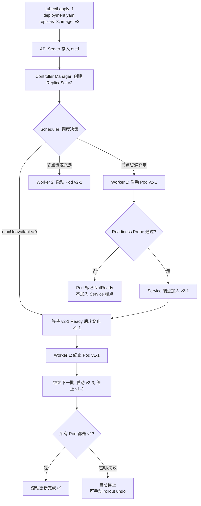
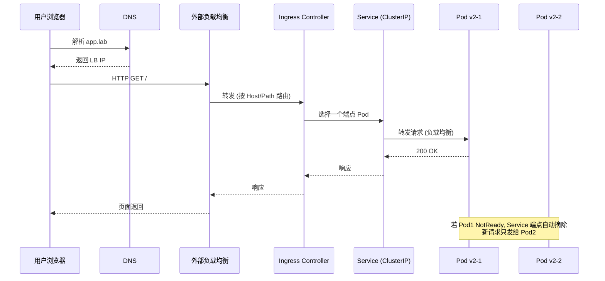

# 第 7 章 容器与 Kubernetes 高可用

> **定位**：从「一台机器跑一个进程」跃迁到「一个集群自愈、弹性、滚动发布」。本章是 24 周课程的云原生核心——你将亲手构建安全镜像、搭建多控制面 K8s 集群、部署应用并验证自愈与回滚。后续第 8 章 GitOps 与可观测、第 9 章 AIOps 都建立在这一集群之上。
>
> | 项 | 值 |
> |---|---|
> | 周次 | 第 14～18 周 |
> | 建议学时 | 36～45 小时（讲解 12h / 实验 18h / 复盘 9h） |
> | 核心作品 | ① 一个非 root、多阶段、扫描通过的安全镜像；② 一个 3 控制面 + 2 Worker 的高可用实验 K8s 集群 |
> | 完成标准 | 能从零搭建集群、部署应用、验证自愈/回滚/etcd 恢复，并能解释每一步操作动了哪一层状态 |
> | 前置依赖 | 第 1～6 章全部完成（尤其网络排错与 systemd） |
> | 资源需求 | 最低 16 GiB 内存可跑 k3s/kind；推荐 32 GiB 做多节点 kubeadm 集群 |

**学习目标**

1. 解释容器与虚拟机的本质区别、镜像分层、namespace/cgroup 隔离原理；
2. 编写非 root、多阶段、最小化 Dockerfile 并用 Trivy 扫描通过；
3. 用 kubeadm 或 k3s 搭建多控制面高可用 K8s 集群（Rocky / Ubuntu 双路线）；
4. 部署 Deployment / Service / Ingress，配置资源限制、健康探针与网络策略；
5. 完成故障演练：杀控制面节点验证 etcd 多数派、删 Pod 验证自愈、让探针失败看重启；
6. 执行滚动更新与回滚、etcd 快照恢复与集群重建。

> [!WARNING]
> **集群操作前必须做的事**：
> 1. 对所有控制面节点打虚拟机快照（标签：`pre-k8s-chapter`）；
> 2. 备份 etcd（本章第 9 节教）——etcd 是集群唯一有状态的核心，丢了等于全集群没了；
> 3. **删节点是不可逆操作**：`kubectl delete node` 后该节点上的 Pod 会被强制驱逐，etcd 成员也需要手动移除；
> 4. 破坏性命令只在实验虚拟机执行，生产环境需变更工单 + 备份 + 双人审批 + 回滚方案。

---

## 1. 原理讲解（Principles）

### 1.1 容器不是轻量虚拟机

这是本章最重要的一句话。很多事故的根因就是把它理解反了。

| 维度 | 虚拟机 | 容器 |
|---|---|---|
| 隔离层 | Hypervisor + 独立内核 | 共享宿主机内核 + namespace |
| 资源开销 | 每个 VM 有完整 OS（GB 级） | 共享内核，镜像通常 MB 级 |
| 启动时间 | 秒到分钟级 | 毫秒到秒级 |
| 隔离强度 | 强（硬件级虚拟化） | 弱于 VM（内核共享） |
| 典型用途 | 强隔离多租户、异构 OS | 应用打包、密度部署、快速弹性 |

容器进程就是宿主机上的普通进程，只不过被 namespace 限制了「能看到什么」、被 cgroup 限制了「能用多少」。

> [!CAUTION]
> 容器边界 ≠ 虚拟机边界。内核漏洞、`--privileged`、挂载 Docker socket、`CAP_SYS_ADMIN` 都可能突破预期隔离。生产环境绝不开 `--privileged`，除非你完全理解后果。

### 1.2 namespace：进程能看见什么

Linux namespace 把全局系统资源「包装」成看似独立的实例：

| Namespace | 隔离对象 | 容器里的效果 |
|---|---|---|
| `pid` | 进程号 | 容器内 PID 1 是自己的 init |
| `net` | 网络栈 | 独立网卡、IP、路由表、iptables |
| `mnt` | 挂载点 | 独立文件系统视图 |
| `uts` | 主机名 | 容器有自己的 hostname |
| `ipc` | 进程间通信 | 隔离消息队列、共享内存 |
| `user` | 用户 ID | 容器内 root 映射到宿主机非 root |
| `cgroup` | cgroup 视图 | 容器看到自己的资源限制 |

```bash
# 在实验机上观察一个运行中容器的 namespace（需安装 containerd/docker/podman）
# 以下用 podman 演示（Rocky 9 默认可用）
sudo dnf install -y podman
podman run -d --name ns-demo alpine:3.22 sleep 3600

# 查看该容器的 7 个 namespace 链接
ls -l /proc/$(podman inspect ns-demo --format '{{.State.Pid}}')/ns/

# 对比宿主机自己的 namespace
ls -l /proc/$$/ns/

# 清理
podman rm -f ns-demo
```

每条命令都在回答一个问题：容器的「世界边界」由哪些内核机制划定。

### 1.3 cgroup：进程能用多少

cgroup v2（Rocky 9 / Ubuntu 22.04 默认）把资源限制统一到 `/sys/fs/cgroup/` 层级下：

```bash
# 查看宿主机 cgroup 版本
mount | grep cgroup
# 预期: cgroup2 on /sys/fs/cgroup type cgroup2

# 查看某个进程的 cgroup
cat /proc/$$/cgroup
# 预期: 0::/user.slice/user-1000.slice/session-1.scope

# 限制一个进程的内存上限（实验）
systemd-run --scope -p MemoryMax=100M bash -c 'dd if=/dev/urandom bs=1M count=200 | base64 > /dev/null'
# 预期: 被 OOM killer 杀掉, 因为超过了 100M 限制
```

K8s 的 `resources.limits.memory` 最终就是通过 cgroup `memory.max` 落地到内核。

### 1.4 镜像分层：联合文件系统

镜像是只读层（layer）的堆叠，容器启动时在上面加一层可读写层：

```text
┌──────────────────────┐
│  可读写层 (container)  │  ← 容器运行时的修改写在这里
├──────────────────────┤
│  Layer 5: COPY app    │  ← Dockerfile 中每条指令一层
├──────────────────────┤
│  Layer 4: RUN pip install
├──────────────────────┤
│  Layer 3: WORKDIR
├──────────────────────┤
│  Layer 2: FROM python:3.12-slim
├──────────────────────┤
│  Layer 1: debian base
└──────────────────────┘
```

```bash
# 观察镜像分层
podman pull alpine:3.22
podman history alpine:3.22
# 每一行就是一个层, 注意大小和创建指令

podman pull nginx:1.27-alpine
podman history nginx:1.27-alpine
# 对比: nginx 镜像层数更多, 因为有更多 RUN/COPY 指令
```

**为什么多阶段构建能大幅减小镜像**：编译工具（gcc、go、maven）只存在于构建阶段，不会被复制到最终镜像。最终镜像只包含二进制和运行时必需文件。

### 1.5 Kubernetes 架构总览

K8s 是一个「声明式、自愈、最终一致」的集群编排系统。你告诉它「我想要 3 个 Pod 运行 demo-api」，它持续驱动现实状态向声明状态收敛。

```text
┌─────────────────────────────── 控制面 (Control Plane) ──────────────────────────────┐
│                                                                                      │
│   ┌──────────┐  ┌───────────┐  ┌──────────┐  ┌──────────────┐  ┌───────────────┐  │
│   │ API Server│  │ Controller │  │ Scheduler│  │   etcd       │  │ Cloud         │  │
│   │ (6443)    │  │ Manager    │  │          │  │ (集群状态库)  │  │ Controller    │  │
│   │           │  │ (自愈引擎)  │  │ (调度决策)│  │ (Raft 共识)   │  │ Manager       │  │
│   └─────┬─────┘  └─────┬─────┘  └────┬─────┘  └──────┬───────┘  └───────────────┘  │
│         │              │              │               │                              │
│         └──────────────┴──────────────┴───────────────┘                              │
│                                    (都通过 API Server 通信)                           │
└──────────────────────────────────┬───────────────────────────────────────────────────┘
                                   │
                    ┌──────────────┼──────────────┐
                    │              │              │
              ┌─────▼─────┐ ┌─────▼─────┐ ┌─────▼─────┐
              │  Worker 1  │ │  Worker 2  │ │  Worker N  │
              │            │ │            │ │            │
              │ kubelet    │ │ kubelet    │ │ kubelet    │  ← 每个节点上的"代理人"
              │ kube-proxy │ │ kube-proxy │ │ kube-proxy │  ← 服务转发/负载均衡
              │ containerd │ │ containerd │ │ containerd │  ← 容器运行时
              │ Pod×N      │ │ Pod×N      │ │ Pod×N      │  ← 你的应用跑在这里
              └────────────┘ └────────────┘ └────────────┘
```

**核心组件职责**：

| 组件 | 职责 | 故障影响 |
|---|---|---|
| **API Server** | 唯一入口，所有组件和 kubectl 都通过它通信 | 集群不可操作（但已运行 Pod 不受影响） |
| **etcd** | 存储集群所有状态（Pod/Service/Secret/ConfigMap…） | **最致命**——丢 etcd = 丢整个集群 |
| **Controller Manager** | 持续驱动实际状态 → 声明状态（自愈核心） | Pod 不再自愈、副本数不自动恢复 |
| **Scheduler** | 决定新 Pod 调度到哪个节点 | 新 Pod 永远 Pending |
| **kubelet** | 节点上的代理人，管理 Pod 生命周期 | 该节点 Pod 不被管理、不上报状态 |
| **kube-proxy** | 实现 Service 的负载均衡和转发 | Service 不可达 |
| **containerd** | 容器运行时，实际跑容器 | 该节点无法启动新容器 |

### 1.6 声明式与自愈

```text
你写 YAML (期望状态: replicas=3)
        │
        ▼
API Server 存入 etcd
        │
        ▼
Controller Manager 发现: 声明 3 个, 实际只有 2 个
        │
        ▼
Scheduler: 决定新 Pod 调度到哪个节点
        │
        ▼
目标节点 kubelet: 拉镜像、创建容器、上报状态
        │
        ▼
实际状态 = 声明状态 → 自愈完成
```

这就是「声明式」的精髓：你**不告诉 K8s 怎么做**（不要 `docker run`），你**告诉 K8s 你想要什么**（`replicas: 3`），它自己想办法达到并维持这个状态。

---

## 2. 架构（Architecture）

### 2.1 高可用 K8s 集群拓扑（ASCII 图）

```text
                        ┌─────────────────────┐
                        │   外部负载均衡器      │
                        │   (HAProxy / kube-vip)│
                        │   lb.k8s.lab:6443    │
                        └──────────┬──────────┘
                                   │ TCP 转发到 3 个 API Server
                    ┌──────────────┼──────────────┐
                    │              │              │
              ┌─────▼─────┐ ┌─────▼─────┐ ┌─────▼─────┐
              │  CP-1      │ │  CP-2      │ │  CP-3      │
              │ API Server │ │ API Server │ │ API Server │
              │ etcd       │ │ etcd       │ │ etcd       │  ← 3 节点 Raft, 容忍 1 台故障
              │ scheduler  │ │ scheduler  │ │ scheduler  │
              │ controller │ │ controller │ │ controller │
              └─────┬─────┘ └─────┬─────┘ └─────┬─────┘
                    │              │              │
                    └──────────────┼──────────────┘
                                   │
                    ┌──────────────┼──────────────┐
                    │              │              │
              ┌─────▼─────┐ ┌─────▼─────┐ ┌─────▼─────┐
              │  Worker 1  │ │  Worker 2  │ │  Worker 3  │
              │ kubelet    │ │ kubelet    │ │ kubelet    │
              │ containerd │ │ containerd │ │ containerd │
              │ Cilium     │ │ Cilium     │ │ Cilium     │
              │ Pod×N      │ │ Pod×N      │ │ Pod×N      │
              └────────────┘ └────────────┘ └────────────┘
```

**高可用的三个关键设计**：

1. **etcd 多数派（Quorum）**：3 个 etcd 成员组成 Raft 集群，容忍 1 台故障。5 个容忍 2 台。永远用**奇数**。
2. **API Server 前置负载均衡**：kubectl 和 kubelet 都连一个虚拟 IP / DNS 名，背后是多个 API Server。
3. **Worker 跨节点分布**：Pod 副本通过 anti-affinity / topology spread 分布到不同节点，单节点故障不影响服务。

> [!NOTE]
> 2 个控制面节点不是高可用——etcd 需要多数派（≥⌈N/2⌉+1），2 节点只能容忍 0 台故障。最低高可用是 3 节点。

### 2.2 Pod 调度与滚动更新（Mermaid）



### 2.3 请求从外部到 Pod 的完整流转（Mermaid）



---

## 3. 部署（Deployment）—— 搭建高可用集群

### 3.1 最低资源规划

| 角色 | 数量 | vCPU | 内存 | 磁盘 | OS |
|---|---|---|---|---|---|
| 控制面 (CP) | 3 | 2 | 4 GiB | 40 GiB SSD | Rocky 9 / Ubuntu 22.04 |
| Worker | 2 | 2 | 4 GiB | 40 GiB SSD | Rocky 9 / Ubuntu 22.04 |
| 负载均衡 | 1 | 1 | 1 GiB | 10 GiB | Rocky 9 / Ubuntu 22.04 |
| **合计** | **6** | **11** | **21 GiB** | **210 GiB** | — |

> [!NOTE]
> 内存不够 32 GiB？用 **k3s** 或 **kind** 降低门槛：
> - k3s：单机跑控制面+Worker，约 2 GiB 即可；多机 k3s 也可用更小规格。
> - kind（Kubernetes in Docker）：在单台机器上用容器模拟多节点，4 GiB 内存可跑 3 节点。
> - 本章主线路线用 kubeadm 多节点，降低门槛路线用 k3s。

### 3.2 安装容器运行时：containerd

在**所有**控制面和 Worker 节点上执行（Rocky 9 路线）：

```bash
# --- 在每个 K8s 节点上执行, 用户: root 或 sudo ---
# 1) 移除旧版本容器运行时（避免冲突）
sudo dnf remove -y docker docker-client docker-client-latest docker-common docker-latest \
  docker-latest-logrotate docker-logrotate docker-engine podman runc 2>/dev/null

# 2) 配置 containerd 官方仓库（Rocky 9 / RHEL 9）
sudo dnf install -y dnf-utils
sudo dnf config-manager --add-repo https://download.docker.com/linux/centos/docker-ce.repo

# 3) 安装 containerd
sudo dnf install -y containerd.io

# 4) 生成默认配置并修改为 SystemdCgroup（K8s 1.25+ 要求）
sudo mkdir -p /etc/containerd
containerd config default | sudo tee /etc/containerd/config.toml
sudo sed -i 's/SystemdCgroup \= false/SystemdCgroup \= true/' /etc/containerd/config.toml

# 5) 启动并设为开机自启
sudo systemctl enable --now containerd
sudo systemctl status containerd --no-pager

# 6) 验证
ctr version
```

Ubuntu 22.04 路线：

```bash
# --- Ubuntu 22.04 LTS ---
# 1) 安装依赖
sudo apt update && sudo apt install -y ca-certificates curl gnupg lsb-release

# 2) 添加 Docker 官方 GPG key 和仓库（containerd.io 包）
sudo install -m 0755 -d /etc/apt/keyrings
curl -fsSL https://download.docker.com/linux/ubuntu/gpg | sudo gpg --dearmor -o /etc/apt/keyrings/docker.gpg
echo "deb [arch=$(dpkg --print-architecture) signed-by=/etc/apt/keyrings/docker.gpg] https://download.docker.com/linux/ubuntu $(lsb_release -cs) stable" | sudo tee /etc/apt/sources.list.d/docker.list

# 3) 安装 containerd
sudo apt update
sudo apt install -y containerd.io

# 4) 配置 SystemdCgroup
sudo mkdir -p /etc/containerd
containerd config default | sudo tee /etc/containerd/config.toml
sudo sed -i 's/SystemdCgroup \= false/SystemdCgroup \= true/' /etc/containerd/config.toml

# 5) 重启 containerd
sudo systemctl enable --now containerd
sudo systemctl restart containerd
```

### 3.3 内核参数与防火墙前置

```bash
# --- 所有节点执行 ---
# 1) 加载内核模块
cat <<'EOF' | sudo tee /etc/modules-load.d/k8s.conf
overlay
br_netfilter
EOF
sudo modprobe overlay
sudo modprobe br_netfilter

# 2) 设置 sysctl 参数（K8s 网络必需）
cat <<'EOF' | sudo tee /etc/sysctl.d/k8s.conf
net.bridge.bridge-nf-call-iptables  = 1
net.bridge.bridge-nf-call-ip6tables = 1
net.ipv4.ip_forward                 = 1
EOF
sudo sysctl --system

# 3) 关闭 swap（K8s 1.29 仍要求 swap=0）
sudo swapoff -a
sudo sed -i '/ swap / s/^\(.*\)$/#\1/' /etc/fstab

# 4) 放行 K8s 端口（Rocky firewalld）
# 控制面节点:
sudo firewall-cmd --permanent --add-port={6443,2379,2380,10250,10257,10259}/tcp
# Worker 节点:
sudo firewall-cmd --permanent --add-port={10250,30000-32767}/tcp
sudo firewall-cmd --reload

# Ubuntu ufw 用户:
# sudo ufw allow 6443/tcp && sudo ufw allow 10250/tcp ...
```

> [!CAUTION]
> `swapoff -a` 只关闭当前运行时。`/etc/fstab` 里的 swap 行也必须注释掉，否则重启后 swap 又回来了，kubelet 会拒绝启动。

### 3.4 安装 kubeadm / kubelet / kubectl

```bash
# --- Rocky 9 / RHEL 9 ---
# 1) 添加 K8s 官方仓库（固定 1.29 版本）
cat <<'EOF' | sudo tee /etc/yum.repos.d/kubernetes.repo
[kubernetes]
name=Kubernetes
baseurl=https://pkgs.k8s.io/core:/stable:/v1.29/rpm/
enabled=1
gpgcheck=1
gpgkey=https://pkgs.k8s.io/core:/stable:/v1.29/rpm/repodata/repomd.xml.key
exclude=kubelet kubeadm kubectl cri-tools kubernetes-cni
EOF

# 2) 安装
sudo dnf install -y kubelet kubeadm kubectl cri-tools
sudo systemctl enable --now kubelet

# 3) 锁定版本（防止 dnf update 意外升级）
sudo dnf versionlock add kubelet kubeadm kubectl

# 4) 验证版本
kubeadm version
kubelet --version
kubectl version --client --short
```

```bash
# --- Ubuntu 22.04 ---
# 1) 添加 K8s apt 仓库
sudo apt install -y apt-transport-https ca-certificates curl gpg
curl -fsSL https://pkgs.k8s.io/core:/stable:/v1.29/deb/Release.key | sudo gpg --dearmor -o /etc/apt/keyrings/kubernetes-apt-keyring.gpg
echo 'deb [signed-by=/etc/apt/keyrings/kubernetes-apt-keyring.gpg] https://pkgs.k8s.io/core:/stable:/v1.29/deb/ /' | sudo tee /etc/apt/sources.list.d/kubernetes.list

# 2) 安装
sudo apt update
sudo apt install -y kubelet kubeadm kubectl cri-tools kubernetes-cni
sudo apt-mark hold kubelet kubeadm kubectl cri-tools kubernetes-cni

# 3) 验证
kubeadm version
kubelet --version
kubectl version --client
```

> [!NOTE]
> K8s 版本以 1.29 为例。版本可能变动，以[官方兼容矩阵](https://kubernetes.io/releases/)为准。安装前确认 containerd 版本与 K8s 版本兼容。

### 3.5 配置外部负载均衡器

用 HAProxy 在 `lb.k8s.lab` 上转发到 3 个 API Server：

```bash
# --- 在负载均衡节点上执行 ---
sudo dnf install -y haproxy   # Ubuntu: sudo apt install -y haproxy

# 写入配置
sudo tee /etc/haproxy/haproxy.cfg <<'EOF'
global
    log /dev/log local0
    maxconn 4096

defaults
    log     global
    mode    tcp
    option  tcplog
    timeout connect 5s
    timeout client  30s
    timeout server  30s

frontend k8s_api
    bind *:6443
    default_backend k8s_api_servers

backend k8s_api_servers
    mode tcp
    option tcp-check
    balance roundrobin
    server cp1 192.168.56.11:6443 check
    server cp2 192.168.56.12:6443 check
    server cp3 192.168.56.13:6443 check
EOF

# 语法检查 + 启动
sudo haproxy -c -f /etc/haproxy/haproxy.cfg
sudo systemctl enable --now haproxy
sudo systemctl status haproxy --no-pager
```

> [!NOTE]
> 生产环境可用 **kube-vip** 或 **keepalived** 给负载均衡器本身做高可用，避免 LB 节点成为单点。实验环境单 LB 足够。

### 3.6 用 kubeadm 初始化高可用集群

```bash
# --- 在 CP-1 (第一个控制面节点) 上执行 ---
# 1) 初始化集群（etcd 堆叠模式）
sudo kubeadm init \
  --control-plane-endpoint "lb.k8s.lab:6443" \
  --upload-certs \
  --pod-network-cidr 10.244.0.0/16 \
  --service-cidr 10.96.0.0/12 \
  --kubernetes-version v1.29.x

# 2) 成功后输出会包含两条关键命令:
#    a) join 命令 (控制面) —— 拿来在 CP-2, CP-3 上执行
#    b) join 命令 (Worker) —— 拿来在 Worker 节点上执行
#    把这两条命令记下来!

# 3) 配置 kubectl
mkdir -p $HOME/.kube
sudo cp -i /etc/kubernetes/admin.conf $HOME/.kube/config
sudo chown $(id -u):$(id -g) $HOME/.kube/config

# 4) 验证
kubectl get nodes
# 预期: cp1 是 NotReady (还没装 CNI)
kubectl get pods -n kube-system
# 预期: coredns Pending (还没装 CNI)
```

加入其余控制面节点：

```bash
# --- 在 CP-2 和 CP-3 上分别执行 ---
# 用 kubeadm init 输出的 control-plane join 命令
sudo kubeadm join lb.k8s.lab:6443 \
  --token <token> \
  --discovery-token-ca-cert-hash sha256:<hash> \
  --control-plane \
  --certificate-key <key>

# 验证 (在 CP-1 上)
kubectl get nodes
# 预期: cp1, cp2, cp3 都是 NotReady
kubectl get pods -n kube-system -o wide
# 预期: etcd, apiserver, controller, scheduler 每个都有 3 个副本
```

加入 Worker 节点：

```bash
# --- 在 Worker-1, Worker-2 上执行 ---
sudo kubeadm join lb.k8s.lab:6443 \
  --token <token> \
  --discovery-token-ca-cert-hash sha256:<hash>

# 验证
kubectl get nodes
# 预期: 6 个节点, 全部 NotReady (等装完 CNI 就变 Ready)
```

### 3.7 安装 CNI：Cilium

```bash
# --- 在 CP-1 上执行 ---
# 1) 安装 Helm
curl -fsSL https://raw.githubusercontent.com/helm/helm/main/scripts/get-helm-3 | bash

# 2) 添加 Cilium Helm 仓库
helm repo add cilium https://helm.cilium.io/
helm repo update

# 3) 安装 Cilium 1.14（替代 kube-proxy 模式）
helm install cilium cilium/cilium \
  --version 1.14.x \
  --namespace kube-system \
  --set kubeProxyReplacement=true \
  --set k8sServiceHost=lb.k8s.lab \
  --set k8sServicePort=6443 \
  --set hubble.enabled=true \
  --set hubble.relay.enabled=true \
  --set hubble.ui.enabled=true

# 4) 等待 Cilium 就绪
kubectl -n kube-system wait --for=condition=Ready pod -l app.kubernetes.io/name=cilium --timeout=300s

# 5) 验证所有节点 Ready
kubectl get nodes -o wide
# 预期: 所有节点都是 Ready

# 6) Cilium 连通性测试
cilium status --wait
cilium connectivity test
```

> [!NOTE]
> 如果使用 k3s 路线，CNI 默认是 Flannel。切换到 Cilium 需参考 [Cilium 官方 k3s 文档](https://docs.cilium.io/en/stable/network/kubernetes/k3s/)。本章主线用 kubeadm + Cilium。

### 3.8 降低门槛路线：k3s 多节点

如果资源有限，用 k3s 快速搭建：

```bash
# --- 在 CP-1 (Server 节点) 上 ---
curl -sfL https://get.k3s.io | K3S_TOKEN=mytoken sh -s - server \
  --cluster-init \
  --tls-san lb.k8s.lab \
  --disable traefik \
  --disable servicelb \
  --flannel-backend=none

# 获取 join token
cat /var/lib/rancher/k3s/server/token

# --- 在 CP-2, CP-3 上 ---
curl -sfL https://get.k3s.io | K3S_TOKEN=mytoken sh -s - server \
  --server https://lb.k8s.lab:6443 \
  --tls-san lb.k8s.lab \
  --disable traefik \
  --disable servicelb

# --- 在 Worker 节点上 ---
curl -sfL https://get.k3s.io | K3S_TOKEN=mytoken sh -s - agent \
  --server https://lb.k8s.lab:6443

# --- 在 CP-1 上验证 ---
kubectl get nodes
# k3s 自带 etcd (dqlite 或嵌入式 etcd, 取决于版本)
```

> k3s 默认用 Flannel + iptables。若要换 Cilium，参考上文 Cilium 文档。本章后续实验以 kubeadm + Cilium 为主，k3s 用户按等价思路调整即可。

---

## 4. 配置（Configuration）—— 安全镜像与 K8s 清单

### 4.1 安全 Dockerfile：完整端到端示例

以下是一个完整的 Go Web 应用 Dockerfile，体现多阶段构建、非 root 用户、最小化基础镜像、只读根文件系统兼容。

```dockerfile
# syntax=docker/dockerfile:1
# ──────────────────────────────────────────────────────
# 阶段 1: 构建阶段（编译 Go 二进制）
# 这一层有编译器、源码、依赖——体积大, 但不会进最终镜像
# ──────────────────────────────────────────────────────
FROM golang:1.22 AS build

WORKDIR /src

# 先复制依赖清单, 利用 Docker 缓存层
COPY go.mod go.sum ./
RUN go mod download

# 复制源码
COPY . .

# 静态编译: CGO_ENABLED=0 保证不依赖 glibc, 可在 distroless 上运行
# -trimpath: 去除路径信息, 提升可复现性
# -ldflags="-s -w": 去除调试信息, 减小二进制体积
RUN CGO_ENABLED=0 GOOS=linux GOARCH=amd64 go build \
    -trimpath \
    -ldflags="-s -w" \
    -o /out/webapp \
    ./cmd/webapp

# ──────────────────────────────────────────────────────
# 阶段 2: 最终镜像（distroless, 非 root, 极小体积）
# ──────────────────────────────────────────────────────
FROM gcr.io/distroless/static-debian12:nonroot

# 从构建阶段复制编译好的二进制
COPY --from=build --chown=nonroot:nonroot /out/webapp /app

# 使用 distroless 自带的 nonroot 用户 (UID 65532)
USER nonroot:nonroot

# 暴露应用端口
EXPOSE 8080

# exec 形式 (不是 shell 形式), 保证信号正确传递
ENTRYPOINT ["/app"]
```

对应的 `.dockerignore`：

```text
.git
.env
*.pem
*.key
*.p12
tmp/
coverage/
Dockerfile
docker-compose*.yml
README.md
```

构建并验证：

```bash
# --- 在开发机或 CI 中执行 ---
# 1) 构建镜像
docker build --pull --tag webapp:secure-v1 .

# 2) 查看镜像大小（对比单阶段构建）
docker images webapp:secure-v1
# 预期: 约 20-30 MB (distroless + 静态二进制)

# 3) 查看镜像分层
docker history webapp:secure-v1

# 4) 验证非 root 运行
docker run --rm webapp:secure-v1 id
# 预期: uid=65532(nonroot) gid=65532(nonroot)

# 5) 验证只读根文件系统可运行
docker run --rm --read-only --cap-drop ALL -p 8080:8080 webapp:secure-v1

# 6) 验证信号传递（SIGTERM 能优雅退出）
docker run -d --name signal-test webapp:secure-v1
docker stop signal-test   # 发送 SIGTERM, 预期 10 秒内退出
docker rm signal-test
```

### 4.2 用 Trivy 漏洞扫描

```bash
# --- 安装 Trivy (Rocky 9) ---
sudo dnf install -y dnf-plugins-core
sudo dnf config-manager --add-repo https://aquasecurity.github.io/trivy-repo/rpm/releases
sudo dnf install -y trivy

# --- Ubuntu ---
# sudo apt install -y apt-transport-https gnupg wget
# wget -qO - https://aquasecurity.github.io/trivy-repo/deb/public.key | gpg --dearmor | sudo tee /usr/share/keyrings/trivy.gpg > /dev/null
# echo "deb [signed-by=/usr/share/keyrings/trivy.gpg] https://aquasecurity.github.io/trivy-repo/deb $(lsb_release -cs) main" | sudo tee /etc/apt/sources.list.d/trivy.list
# sudo apt update && sudo apt install -y trivy

# 1) 扫描镜像
trivy image webapp:secure-v1

# 2) 只报 CRITICAL 且有修复版本的漏洞
trivy image --severity CRITICAL --ignore-unfixed webapp:secure-v1

# 3) 生成 JSON 报告（CI 集成用）
trivy image --format json --output trivy-report.json webapp:secure-v1

# 4) 设置退出码（CI 门禁: 有 CRITICAL 漏洞就失败）
trivy image --exit-code 1 --severity CRITICAL,HIGH --ignore-unfixed webapp:secure-v1
```

> [!NOTE]
> Trivy 版本以 0.50 为例。版本可能变动，以 [Trivy 官方发布](https://github.com/aquasecurity/trivy/releases) 为准。

### 4.3 Deployment YAML（带中文注释）

```yaml
apiVersion: apps/v1
kind: Deployment
metadata:
  name: demo-api
  namespace: production
  labels:
    app: demo-api
    version: v1
spec:
  replicas: 3                    # 3 个副本, 跨节点分布
  strategy:
    type: RollingUpdate          # 滚动更新策略
    rollingUpdate:
      maxUnavailable: 0          # 不允许同时减少 Pod (保证可用性)
      maxSurge: 1                # 最多多出 1 个 Pod (控制资源峰值)
  selector:
    matchLabels:
      app: demo-api
  template:
    metadata:
      labels:
        app: demo-api
        version: v1
    spec:
      # Pod 安全上下文（Pod 级别）
      securityContext:
        runAsNonRoot: true       # 禁止以 root 运行
        runAsUser: 65532         # distroless nonroot UID
        runAsGroup: 65532
        fsGroup: 65532           # 挂载卷的文件 GID
        seccompProfile:
          type: RuntimeDefault   # 使用容器运行时默认 seccomp 配置

      # 优雅终止等待时间（秒）
      terminationGracePeriodSeconds: 30

      # 跨节点反亲和性（让 3 个副本分布到不同 Worker）
      affinity:
        podAntiAffinity:
          preferredDuringSchedulingIgnoredDuringExecution:
            - weight: 100
              podAffinityTerm:
                labelSelector:
                  matchLabels:
                    app: demo-api
                topologyKey: kubernetes.io/hostname

      containers:
        - name: api
          # 使用 digest 而非 tag, 保证不可变性
          # image: registry.example.com/webapp@sha256:<digest>
          image: webapp:secure-v1
          ports:
            - name: http
              containerPort: 8080
              protocol: TCP

          # 资源限制（requests 参与调度, limits 做硬限制）
          resources:
            requests:
              cpu: 100m          # 0.1 核 (调度依据)
              memory: 128Mi      # 128 MB (调度依据)
            limits:
              memory: 256Mi      # 内存硬上限, 超过会被 OOMKilled
              # CPU limit 可选: 设了可能造成节流, 不设则可突发
              # cpu: 200m

          # 就绪探针: Pod 准备好接收流量了吗?
          # 失败 → 从 Service 端点摘除 (不重启)
          readinessProbe:
            httpGet:
              path: /readyz
              port: http
            initialDelaySeconds: 3   # 容器启动后 3 秒开始探测
            periodSeconds: 5          # 每 5 秒探测一次
            failureThreshold: 3       # 连续 3 次失败才标记 NotReady

          # 存活探针: Pod 还活着吗?
          # 失败 → 重启容器
          livenessProbe:
            httpGet:
              path: /livez
              port: http
            initialDelaySeconds: 15   # 给应用更多启动时间
            periodSeconds: 10
            failureThreshold: 3

          # 启动探针: 慢启动应用专用
          # 通过后才开启 liveness/readiness (K8s 1.25+)
          startupProbe:
            httpGet:
              path: /readyz
              port: http
            periodSeconds: 5
            failureThreshold: 30     # 5s × 30 = 最多等 150 秒启动

          # 容器安全上下文（容器级别）
          securityContext:
            allowPrivilegeEscalation: false  # 禁止提权 (即使 setuid)
            readOnlyRootFilesystem: true     # 只读根文件系统
            capabilities:
              drop: ["ALL"]                 # 删除所有 Linux capabilities

          # 挂载 tmpfs 给需要写入的临时目录
          volumeMounts:
            - name: tmp
              mountPath: /tmp

      volumes:
        - name: tmp
          emptyDir:
            medium: Memory    # tmpfs, 内存支持的临时目录
```

### 4.4 Service YAML

```yaml
apiVersion: v1
kind: Service
metadata:
  name: demo-api
  namespace: production
  labels:
    app: demo-api
spec:
  type: ClusterIP          # 集群内部访问 (Ingress 再对外暴露)
  selector:
    app: demo-api           # 匹配 Deployment 中的 Pod 标签
  ports:
    - name: http
      port: 80              # Service 监听端口
      targetPort: http      # 转发到容器的 named port (8080)
      protocol: TCP
```

### 4.5 Ingress YAML

```yaml
apiVersion: networking.k8s.io/v1
kind: Ingress
metadata:
  name: demo-api-ingress
  namespace: production
  annotations:
    nginx.ingress.kubernetes.io/ssl-redirect: "true"
    nginx.ingress.kubernetes.io/proxy-body-size: "10m"
    nginx.ingress.kubernetes.io/rate-limit: "100"    # 限流: 100 req/s
spec:
  ingressClassName: nginx
  tls:
    - hosts:
        - app.lab
      secretName: app-lab-tls       # TLS 证书 Secret
  rules:
    - host: app.lab
      http:
        paths:
          - path: /
            pathType: Prefix
            backend:
              service:
                name: demo-api
                port:
                  name: http
```

### 4.6 NetworkPolicy：默认拒绝 + 按需开放

```yaml
---
# 1) 默认拒绝所有入站流量
apiVersion: networking.k8s.io/v1
kind: NetworkPolicy
metadata:
  name: default-deny-ingress
  namespace: production
spec:
  podSelector: {}          # 选中命名空间内所有 Pod
  policyTypes: [Ingress]

---
# 2) 允许 Ingress Controller → demo-api
apiVersion: networking.k8s.io/v1
kind: NetworkPolicy
metadata:
  name: allow-ingress-to-demo-api
  namespace: production
spec:
  podSelector:
    matchLabels:
      app: demo-api
  policyTypes: [Ingress]
  ingress:
    - from:
        - namespaceSelector:
            matchLabels:
              kubernetes.io/metadata.name: ingress-nginx
      ports:
        - protocol: TCP
          port: 8080

---
# 3) 允许 demo-api → 数据库 (同命名空间)
apiVersion: networking.k8s.io/v1
kind: NetworkPolicy
metadata:
  name: allow-demo-api-to-db
  namespace: production
spec:
  podSelector:
    matchLabels:
      app: postgres
  policyTypes: [Ingress]
  ingress:
    - from:
        - podSelector:
            matchLabels:
              app: demo-api
      ports:
        - protocol: TCP
          port: 5432
```

> [!CAUTION]
> 实施 default-deny 前，必须先枚举所有必要流量：DNS（kube-dns 53）、监控（Prometheus）、镜像拉取（如果走集群内代理）、Ingress Controller、控制面 → kubelet。否则会出现"Pod 能跑但无法被访问"或"DNS 解析失败"的诡异问题。

### 4.7 部署 Ingress Controller

```bash
# --- 在 CP-1 上执行 ---
# 安装 ingress-nginx
helm repo add ingress-nginx https://kubernetes.github.io/ingress-nginx
helm repo update

helm install ingress-nginx ingress-nginx/ingress-nginx \
  --namespace ingress-nginx \
  --create-namespace \
  --set controller.service.type=NodePort \
  --set controller.service.nodePorts.http=30080 \
  --set controller.service.nodePorts.https=30443

# 等待就绪
kubectl -n ingress-nginx wait --for=condition=Ready pod -l app.kubernetes.io/name=ingress-nginx --timeout=300s

# 验证
kubectl -n ingress-nginx get svc
```

### 4.8 端到端部署：从镜像到访问

```bash
# --- 在 CP-1 上执行 ---
# 1) 创建命名空间
kubectl create namespace production

# 2) 部署应用
kubectl apply -f deployment.yaml
kubectl apply -f service.yaml
kubectl apply -f ingress.yaml
kubectl apply -f networkpolicy.yaml

# 3) 等待滚动完成
kubectl rollout status deployment/demo-api -n production --timeout=2m
# 预期: deployment "demo-api" successfully rolled out

# 4) 查看 Pod 分布（应跨多个 Worker）
kubectl get pods -n production -o wide

# 5) 查看 Service 端点（应有 3 个 Ready Pod）
kubectl get endpointslice -n production -l kubernetes.io/service-name=demo-api

# 6) 通过 Ingress 访问
# 在实验机 /etc/hosts 添加: <Worker-1-IP> app.lab
curl -k https://app.lab:30443/healthz
# 预期: 200 OK

# 7) 测试 Ingress 路由
curl -k https://app.lab:30443/
```

---

## 5. 验证（Verification）

### 5.1 集群基础验证

```bash
# 1) 节点状态
kubectl get nodes -o wide
# 预期: 6 个节点全部 Ready, 版本一致

# 2) 节点详情
kubectl describe node cp1 | head -n 30
# 关注: Taints, Capacity, Conditions, Images

# 3) 核心组件
kubectl get pods -n kube-system -o wide
# 预期: etcd/apiserver/controller/scheduler 各 3 副本, cilium 运行中

# 4) 集群信息
kubectl cluster-info
kubectl cluster-info dump | head -n 20
```

### 5.2 应用验证

```bash
# 1) Pod 状态
kubectl get pods -n production -o wide
# 预期: 3/3 Running, 每个 Worker 各 1 个

# 2) Pod 详情（检查探针、安全上下文、资源限制）
kubectl describe pod -n production -l app=demo-api

# 3) 日志
kubectl logs -n production -l app=demo-api --tail=20

# 4) Service 端点
kubectl get endpointslice -n production -l kubernetes.io/service-name=demo-api
# 预期: 3 个端点地址

# 5) Ingress 状态
kubectl get ingress -n production
kubectl describe ingress demo-api-ingress -n production

# 6) 端到端访问测试
curl -k https://app.lab:30443/healthz
curl -k https://app.lab:30443/readyz
curl -k https://app.lab:30443/livez
```

### 5.3 探针生效验证

```bash
# 1) 就绪探针验证: 临时让 /readyz 返回 503
kubectl exec -n production deploy/demo-api -- curl -s -X POST localhost:8080/readyz/disable
# 等待 ~15 秒

# 2) 观察 Pod 变成 NotReady
kubectl get pods -n production -w
# 预期: READY 列从 1/1 变成 0/1

# 3) Service 端点应该移除该 Pod
kubectl get endpointslice -n production -l kubernetes.io/service-name=demo-api
# 预期: 端点数从 3 变成 2

# 4) 恢复
kubectl exec -n production deploy/demo-api -- curl -s -X POST localhost:8080/readyz/enable
# 等待 ~15 秒
kubectl get pods -n production
# 预期: 恢复 1/1 Running, 端点恢复 3 个
```

### 5.4 验收清单

- [ ] 6 节点集群全部 Ready
- [ ] etcd 3 副本，Raft 多数派正常
- [ ] Cilium 运行，连通性测试通过
- [ ] demo-api 3 副本跨节点分布
- [ ] 镜像非 root 运行（`kubectl exec ... -- id` 显示 uid=65532）
- [ ] 只读根文件系统生效（`kubectl exec ... -- touch /test` 失败）
- [ ] 就绪探针失败后 Service 端点摘除验证通过
- [ ] 通过 Ingress HTTPS 访问应用成功
- [ ] NetworkPolicy default-deny 生效（非允许流量被拒绝）
- [ ] Trivy 扫描无 CRITICAL 漏洞（或已记录例外）

---

## 6. 性能（Performance）

### 6.1 资源 requests / limits 与调度

```bash
# 查看节点资源分配情况
kubectl describe node worker1 | grep -A 10 "Allocated resources"
# 关注: CPU requests/limits, Memory requests/limits 占比

# 如果 requests 过高, 调度器找不到足够资源的节点, Pod 会 Pending
# 如果 limits.memory 过低, Pod 会被 OOMKilled
kubectl get events -n production --field-selector reason=FailedScheduling
```

**关键原则**：

| 设置 | 作用 | 建议 |
|---|---|---|
| `requests.cpu` | 调度依据、CPU 共享权重 | 设为常态使用的 80~90% |
| `requests.memory` | 调度依据 | 设为常态使用的 100~110% |
| `limits.memory` | OOM 硬上限 | 设为 requests 的 1.5~2 倍 |
| `limits.cpu` | CFS 节流上限 | **谨慎设置**——可能造成延迟突增 |

> [!NOTE]
> CPU limit 使用 CFS quota 机制。容器在 period（默认 100ms）内用完 quota 后会被节流到等待下一个 period。对延迟敏感的服务，不设 CPU limit 或设为较高值，靠 requests 控制调度。

### 6.2 HPA：水平 Pod 自动伸缩

```yaml
apiVersion: autoscaling/v2
kind: HorizontalPodAutoscaler
metadata:
  name: demo-api-hpa
  namespace: production
spec:
  scaleTargetRef:
    apiVersion: apps/v1
    kind: Deployment
    name: demo-api
  minReplicas: 3                # 最少 3 个（高可用基线）
  maxReplicas: 10               # 最多 10 个
  metrics:
    - type: Resource
      resource:
        name: cpu
        target:
          type: Utilization
          averageUtilization: 70    # CPU 使用率超过 70% 扩容
    - type: Resource
      resource:
        name: memory
        target:
          type: Utilization
          averageUtilization: 80    # 内存使用率超过 80% 扩容
  behavior:
    scaleUp:
      stabilizationWindowSeconds: 30   # 扩容稳定窗口: 30 秒
      policies:
        - type: Percent
          value: 100                    # 每次最多翻倍
          periodSeconds: 60
    scaleDown:
      stabilizationWindowSeconds: 300   # 缩容稳定窗口: 5 分钟（避免抖动）
      policies:
        - type: Percent
          value: 10                     # 每次最多缩 10%
          periodSeconds: 60
```

```bash
# 安装 metrics-server（HPA 依赖）
kubectl apply -f https://github.com/kubernetes-sigs/metrics-server/releases/latest/download/components.yaml

# 等待就绪
kubectl -n kube-system wait --for=condition=Ready pod -l k8s-app=metrics-server --timeout=120s

# 查看 Pod 资源使用
kubectl top pods -n production
kubectl top nodes

# 应用 HPA
kubectl apply -f hpa.yaml
kubectl get hpa -n production -w
```

### 6.3 调度亲和性

```yaml
# topology spread: 让副本跨可用区均匀分布
spec:
  topologySpreadConstraints:
    - maxSkew: 1                           # 最多允许 1 个偏差
      topologyKey: topology.kubernetes.io/zone
      whenUnsatisfiable: DoNotSchedule     # 不满足就不调度
      labelSelector:
        matchLabels:
          app: demo-api
```

```yaml
# nodeSelector / nodeAffinity: 指定 Pod 调度到特定节点
spec:
  nodeSelector:
    node-role.kubernetes.io/worker: ""     # 只调度到 Worker 节点
```

### 6.4 Cilium eBPF 网络性能

Cilium 用 eBPF 在内核态处理网络包，跳过部分 iptables 规则，降低延迟：

```bash
# 查看 Cilium 性能指标
cilium metrics list | grep -E 'forward|drop|latency'

# Hubble 观察流量（Cilium 的可观测组件）
hubble observe -f --namespace production

# 查看 eBPF 程序加载情况
cilium bpf metrics list
```

### 6.5 镜像拉取优化

```yaml
# Pod 中配置镜像拉取策略
spec:
  containers:
    - name: api
      imagePullPolicy: IfNotPresent    # 本地有就不拉（默认 Always for :latest）
      # 生产环境避免用 :latest, 用固定 tag 或 digest
```

```bash
# 预拉取镜像到所有 Worker 节点（减少首次启动延迟）
# 用 DaemonSet 在每个节点提前拉取
kubectl apply -f - <<'EOF'
apiVersion: apps/v1
kind: DaemonSet
metadata:
  name: image-prefetch
  namespace: kube-system
spec:
  selector:
    matchLabels:
      app: image-prefetch
  template:
    metadata:
      labels:
        app: image-prefetch
    spec:
      initContainers:
        - name: pull-webapp
          image: webapp:secure-v1
          command: ["true"]
      containers:
        - name: pause
          image: registry.k8s.io/pause:3.9
EOF
```

---

## 7. 故障（Troubleshooting）—— 故障演练

### 7.1 演练一：杀掉一个控制面节点，验证 etcd 多数派与恢复

**目标**：证明 3 控制面集群容忍 1 台故障。

```bash
# ── 步骤 1: 制造故障 ──
# 在虚拟化平台上强制关闭 CP-2（模拟断电）
# VBoxManage controlvm cp2 poweroff  # VirtualBox 示例

# ── 步骤 2: 在 CP-1 上观察集群状态 ──
kubectl get nodes
# 预期: cp2 变成 NotReady, cp1/cp3 仍 Ready

kubectl get pods -n kube-system -o wide | grep -E 'etcd|apiserver'
# 预期: cp2 上的 Pod 变成 Unknown, 其余仍 Running

# ── 步骤 3: 验证 etcd 多数派 ──
# 在 CP-1 上直接操作 etcd
sudo crictl ps | grep etcd    # 找到 etcd 容器
sudo crictl exec <etcd-container-id> etcdctl \
  --endpoints=https://127.0.0.1:2379 \
  --cacert=/etc/kubernetes/pki/etcd/ca.crt \
  --cert=/etc/kubernetes/pki/etcd/peer.crt \
  --key=/etc/kubernetes/pki/etcd/peer.key \
  endpoint status --write-out=table
# 预期: 2 个成员在线 (cp1, cp3), 1 个离线 (cp2)
# Quorum = 2, 仍 > ⌈3/2⌉ = 2, 集群可正常工作

# ── 步骤 4: 验证集群仍可操作 ──
kubectl get pods -n production
# 预期: 应用 Pod 不受影响, 仍 3/3 Running

kubectl scale deployment demo-api -n production --replicas=4
# 预期: 仍能创建新 Pod (API Server 通过 LB 到 CP-1 或 CP-3)

# ── 步骤 5: 恢复 CP-2 ──
# 启动 CP-2 虚拟机
# VBoxManage startvm cp2  # VirtualBox 示例

# 等待 CP-2 上的组件自动恢复
kubectl get nodes -w
# 预期: cp2 从 NotReady → Ready (约 1-2 分钟)

# 验证 etcd 恢复
sudo crictl exec <etcd-container-id> etcdctl ... endpoint status
# 预期: 3 个成员全部 online
```

**证据链**：

| 步骤 | 命令 | 预期 | 实际含义 |
|---|---|---|---|
| 制造故障 | 关闭 CP-2 | — | 模拟控制面节点故障 |
| 节点状态 | `kubectl get nodes` | cp2 NotReady | K8s 检测到节点失联 |
| etcd 状态 | `etcdctl endpoint status` | 2/3 online | Raft 多数派存活 |
| 应用状态 | `kubectl get pods` | 3/3 Running | 应用不受控制面故障影响 |
| 集群操作 | `kubectl scale` | 新 Pod 创建 | API Server 仍可用 |
| 恢复 | 启动 CP-2 | cp2 Ready | 节点自动重新加入 |

> [!CAUTION]
> 如果同时关掉 2 个控制面节点（3 个中只剩 1 个），etcd 丢失多数派，集群**不可写**。已有 Pod 继续运行，但任何 `kubectl` 写操作会超时。恢复方法是重启至少 1 个控制面节点恢复多数派。

### 7.2 演练二：删除 Pod 验证自愈 + 探针失败看重启

**目标**：验证 Deployment 自愈和健康探针机制。

```bash
# ── 步骤 1: 删除一个 Pod, 观察 Deployment 自愈 ──
kubectl get pods -n production -o wide
# 记录一个 Pod 名, 例如 demo-api-xxxx-yyyy

kubectl delete pod demo-api-xxxx-yyyy -n production
# 立即观察
kubectl get pods -n production -w
# 预期:
#   旧 Pod Terminating → 新 Pod ContainerCreating → Running
#   整个过程约 5-15 秒
#   副本数始终 >= 3 (maxUnavailable=0)

# ── 步骤 2: 让存活探针失败, 观察容器重启 ──
# 记录重启次数
kubectl get pod -n production -l app=demo-api -o jsonpath='{.items[0].status.containerStatuses[0].restartCount}'
# 预期: 0

# 让 /livez 返回失败
kubectl exec -n production deploy/demo-api -- curl -s -X POST localhost:8080/livez/disable

# 等待 ~45 秒 (initialDelaySeconds=15 + periodSeconds=10 × failureThreshold=3)
kubectl get pods -n production -w
# 预期: 该 Pod 的 RESTARTS 从 0 变成 1

# 验证重启次数
kubectl get pod -n production -l app=demo-api -o jsonpath='{.items[0].status.containerStatuses[0].restartCount}'
# 预期: 1

# 查看 Events 证据链
kubectl describe pod -n production -l app=demo-api | grep -A 5 "Events:"
# 预期: 看到 "Liveness probe failed: HTTP probe failed" + "Container was killed"

# ── 步骤 3: 修复 ──
# 容器重启后应用应恢复, /livez 自动回到正常
kubectl get pods -n production
# 预期: 恢复 1/1 Running, RESTARTS 保持为 1
```

### 7.3 演练三：NetworkPolicy 阻断流量

```bash
# ── 步骤 1: 确认正常访问 ──
curl -k https://app.lab:30443/healthz
# 预期: 200 OK

# ── 步骤 2: 添加一个"拒绝所有入站"的策略 (覆盖之前的允许策略) ──
kubectl apply -f - <<'EOF'
apiVersion: networking.k8s.io/v1
kind: NetworkPolicy
metadata:
  name: block-all-ingress
  namespace: production
spec:
  podSelector:
    matchLabels:
      app: demo-api
  policyTypes: [Ingress]
  ingress: []    # 空列表 = 拒绝所有入站
EOF

# ── 步骤 3: 验证流量被阻断 ──
curl -k --connect-timeout 5 https://app.lab:30443/healthz
# 预期: 超时或连接被拒绝

# ── 步骤 4: 用 Hubble 观察被拒绝的包 ──
hubble observe --namespace production --verdict DROPPED -f
# 预期: 看到 Policy denied 的 drop 事件

# ── 步骤 5: 修复 —— 恢复允许策略 ──
kubectl delete networkpolicy block-all-ingress -n production
curl -k https://app.lab:30443/healthz
# 预期: 恢复 200 OK
```

> [!NOTE]
> 故障演练结束后，务必在实验报告中记录：**制造了什么故障 → 用哪些命令收集了什么证据 → 根因判断 → 修复方式 → 恢复验证**。这就是 Ops 值班时的标准思维链。

---

## 8. 回滚（Rollback）

### 8.1 kubectl rollout undo

```bash
# 1) 查看发布历史
kubectl rollout history deployment/demo-api -n production
# 预期:
#   deployment.apps/demo-api
#   REVISION  CHANGE-CAUSE
#   1         <none>        # v1 初始版本
#   2         <none>        # v2 更新版本

# 2) 模拟一次更新（故意用一个会 CrashLoopBackOff 的镜像）
kubectl set image deployment/demo-api -n production api=webapp:bad-version
kubectl rollout status deployment/demo-api -n production --timeout=30s
# 预期: 超时, 因为新镜像拉取失败或启动失败

# 3) 查看 Pod 状态
kubectl get pods -n production
# 预期: 新 Pod ImagePullBackOff 或 CrashLoopBackOff

# 4) 回滚到上一个版本
kubectl rollout undo deployment/demo-api -n production
# 或回滚到指定版本: kubectl rollout undo deployment/demo-api -n production --to-revision=1

# 5) 验证恢复
kubectl rollout status deployment/demo-api -n production --timeout=2m
# 预期: successfully rolled out
kubectl get pods -n production
# 预期: 3/3 Running, 镜像恢复为 webapp:secure-v1
```

### 8.2 镜像版本回退策略

```bash
# 方法 1: kubectl set image（快速回退）
kubectl set image deployment/demo-api -n production api=webapp:secure-v1

# 方法 2: 修改 YAML 后 apply（GitOps 推荐, 有审计）
# 编辑 deployment.yaml 中的 image: 字段
# kubectl apply -f deployment.yaml

# 方法 3: rollback（保留历史, 自动生成新 revision）
kubectl rollout undo deployment/demo-api -n production
```

> [!CAUTION]
> **镜像回滚 ≠ 数据库回滚**。如果新版本做了数据库 schema 变更（加列、改类型），回滚镜像后旧代码可能不兼容新 schema。数据库迁移必须向前兼容（expand/contract 模式），并独立备份。

### 8.3 etcd 快照恢复

```bash
# ── 步骤 1: 创建 etcd 快照（在任何 etcd 成员上执行）──
ETCDCTL_API=3 sudo crictl exec <etcd-container> etcdctl \
  --endpoints=https://127.0.0.1:2379 \
  --cacert=/etc/kubernetes/pki/etcd/ca.crt \
  --cert=/etc/kubernetes/pki/etcd/peer.crt \
  --key=/etc/kubernetes/pki/etcd/peer.key \
  snapshot save /var/lib/etcd/snapshot-$(date +%Y%m%d).db

# 验证快照
ETCDCTL_API=3 sudo crictl exec <etcd-container> etcdctl \
  snapshot status /var/lib/etcd/snapshot-20260904.db --write-out=table
# 预期: 显示 hash, revision, total keys, total size

# ── 步骤 2: 在隔离集群恢复（不要在生产集群原地恢复！）──
# 停止 etcd
sudo systemctl stop etcd  # 如果是外部 etcd
# 或停止 kube-apiserver + etcd pod (堆叠模式)

# 清空 etcd 数据目录
sudo rm -rf /var/lib/etcd/member

# 恢复快照
ETCDCTL_API=3 etcdctl \
  --data-dir=/var/lib/etcd \
  snapshot restore /var/lib/etcd/snapshot-20260904.db

# 重启 etcd
sudo systemctl start etcd
# 或重新启动静态 Pod: mv /etc/kubernetes/manifests/etcd.yaml.bak /etc/kubernetes/manifests/etcd.yaml

# ── 步骤 3: 验证恢复 ──
kubectl get nodes
kubectl get pods -A
# 预期: 恢复到快照时的集群状态
```

> [!WARNING]
> etcd 恢复是**高风险操作**。必须在隔离环境演练，绝不在生产集群上直接操作。恢复前备份当前 etcd 数据目录，以防恢复失败可以回退。

### 8.4 集群重建脚本

当集群不可恢复时，从零重建的步骤脚本化：

```bash
#!/usr/bin/env bash
# ──────────────────────────────────────────────────────
# cluster-rebuild.sh — 实验集群重建脚本
# 在所有节点上执行前置准备后, 在 CP-1 上运行此脚本
# ──────────────────────────────────────────────────────
set -euo pipefail

# 1) 重置所有节点（在每个节点上执行）
# sudo kubeadm reset -f
# sudo rm -rf /etc/kubernetes/ /var/lib/etcd /var/lib/cni /etc/cni

# 2) 重新初始化 CP-1
sudo kubeadm init \
  --control-plane-endpoint "lb.k8s.lab:6443" \
  --upload-certs \
  --pod-network-cidr 10.244.0.0/16 \
  --service-cidr 10.96.0.0/12

# 3) 配置 kubectl
mkdir -p $HOME/.kube
sudo cp -i /etc/kubernetes/admin.conf $HOME/.kube/config
sudo chown $(id -u):$(id -g) $HOME/.kube/config

# 4) 安装 Cilium
helm install cilium cilium/cilium \
  --version 1.14.x \
  --namespace kube-system \
  --set kubeProxyReplacement=true \
  --set k8sServiceHost=lb.k8s.lab \
  --set k8sServicePort=6443

# 5) 等待就绪
kubectl -n kube-system wait --for=condition=Ready pod -l app.kubernetes.io/name=cilium --timeout=300s
kubectl get nodes

# 6) 重新部署应用
kubectl create namespace production
kubectl apply -f deployment.yaml
kubectl apply -f service.yaml
kubectl apply -f ingress.yaml
kubectl apply -f networkpolicy.yaml
kubectl rollout status deployment/demo-api -n production --timeout=2m

echo "=== 集群重建完成 ==="
kubectl get nodes
kubectl get pods -A
```

---

## 9. 灾备（Disaster Recovery）

### 9.1 etcd 定期快照

```bash
# ── 创建定期快照脚本（cron 每小时一次）──
sudo tee /usr/local/bin/etcd-backup.sh <<'SCRIPT'
#!/usr/bin/env bash
set -euo pipefail

BACKUP_DIR="/backup/etcd"
DATE=$(date +%Y%m%d-%H%M)
KEEP_DAYS=7

mkdir -p "$BACKUP_DIR"

# 获取 etcd 容器 ID
ETCD_CID=$(sudo crictl ps --name etcd -q | head -1)

# 创建快照
sudo crictl exec "$ETCD_CID" etcdctl \
  --endpoints=https://127.0.0.1:2379 \
  --cacert=/etc/kubernetes/pki/etcd/ca.crt \
  --cert=/etc/kubernetes/pki/etcd/peer.crt \
  --key=/etc/kubernetes/pki/etcd/peer.key \
  snapshot save "/var/lib/etcd/snapshot-${DATE}.db"

# 复制到备份目录
sudo cp "/var/lib/etcd/snapshot-${DATE}.db" "$BACKUP_DIR/"

# 清理旧备份
find "$BACKUP_DIR" -name "snapshot-*.db" -mtime +${KEEP_DAYS} -delete

echo "[$(date)] etcd backup saved to $BACKUP_DIR/snapshot-${DATE}.db"
SCRIPT

sudo chmod +x /usr/local/bin/etcd-backup.sh

# 添加 cron 任务
echo "0 * * * * /usr/local/bin/etcd-backup.sh >> /var/log/etcd-backup.log 2>&1" | sudo tee /etc/cron.d/etcd-backup
```

### 9.2 集群配置纳入 Git

```bash
# ── 在 CP-1 上初始化 Git 仓库 ──
mkdir -p ~/k8s-manifests
cd ~/k8s-manifests
git init

# 导出当前集群所有自定义资源
kubectl get deployment,service,ingress,networkpolicy,hpa \
  -n production -o yaml > production-manifests.yaml

# 分文件管理（推荐）
mkdir -p production/
cp deployment.yaml service.yaml ingress.yaml networkpolicy.yaml hpa.yaml production/

git add .
git commit -m "feat: initial K8s manifests for demo-api"
git remote add origin git@example.com:k8s-manifests.git
git push -u origin main
```

### 9.3 Velero 概念

[Velero](https://velero.io/) 是 K8s 原生的备份与恢复工具：

| 能力 | 说明 |
|---|---|
| 集群资源备份 | 导出所有 K8s 对象（Deployment/Service/ConfigMap/Secret…） |
| PV 快照 | 调用云厂商 CSI 快照接口或本地 Restic |
| 命名空间级恢复 | 可选恢复特定命名空间，粒度细 |
| 跨集群迁移 | 从 A 集群备份，在 B 集群恢复 |
| 定时备份 | Schedule CRD，类似 cron |

```bash
# Velero 安装示例（需 S3 兼容存储后端）
# velero install \
#   --provider aws \
#   --bucket velero-backups \
#   --secret-file credentials-velero \
#   --backup-location-config region=minio,s3ForcePathStyle=true,s3Url=http://minio:9000 \
#   --snapshot-location-config region=minio

# 创建备份
# velero backup create demo-api-backup --include-namespaces production

# 查看备份
# velero backup get
# velero backup describe demo-api-backup --details
```

> 实验环境可装 [MinIO](https://min.io/) 作为 S3 兼容后端。Velero 不是本章重点，但生产环境必须有等价方案。

### 9.4 跨区容灾意识

```text
可用区 (AZ) 级别:
  ┌─────────────┐    ┌─────────────┐    ┌─────────────┐
  │   AZ-1      │    │   AZ-2      │    │   AZ-3      │
  │ CP-1, W-1   │    │ CP-2, W-2   │    │ CP-3, W-3   │
  └─────────────┘    └─────────────┘    └─────────────┘

  ✅ 一个 AZ 故障: 2 CP + 2 Worker 存活, 多数派 + 应用可用
  ❌ 两个 AZ 故障: 仅 1 CP, 丢失多数派 (不可写)
```

- 控制面跨 AZ 分布（topologySpreadConstraints）；
- Worker 跨 AZ 分布（podAntiAffinity by zone）；
- etcd 备份异地存储（S3 / 对象存储）；
- 镜像仓库多副本或多区域；
- DNS TTL 短，支持快速切换到备用集群。

---

## 10. 安全（Security）

### 10.1 镜像供应链安全

| 环节 | 工具/措施 | 本章落地 |
|---|---|---|
| 基础镜像 | distroless / alpine | 最终镜像不含 Shell、包管理器 |
| 构建 | 多阶段 Dockerfile | 编译工具不进最终镜像 |
| 用户 | 非 root (UID 65532) | `USER nonroot:nonroot` |
| 扫描 | Trivy | CRITICAL 漏洞门禁 |
| 签名 | cosign / Notation | 可验证镜像未被篡改（概念引入） |
| SBOM | syft / Trivy | 生成软件物料清单 |
| 准入 | OPA Gatekeeper / Kyverno | 只允许签名镜像部署 |

```bash
# 生成 SBOM（软件物料清单）
trivy image --format spdx-json --output webapp-sbom.spdx.json webapp:secure-v1

# 用 cosign 签名镜像（需要 cosign 和密钥, 概念演示）
# cosign sign --key cosign.key registry.example.com/webapp:secure-v1
# cosign verify --key cosign.pub registry.example.com/webapp:secure-v1
```

### 10.2 RBAC：最小权限

```yaml
---
# 创建一个只读 ServiceAccount
apiVersion: v1
kind: ServiceAccount
metadata:
  name: read-only-sa
  namespace: production
---
apiVersion: rbac.authorization.k8s.io/v1
kind: Role
metadata:
  name: pod-reader
  namespace: production
rules:
  - apiGroups: [""]
    resources: ["pods", "pods/log"]
    verbs: ["get", "list", "watch"]
  - apiGroups: ["apps"]
    resources: ["deployments"]
    verbs: ["get", "list", "watch"]
---
apiVersion: rbac.authorization.k8s.io/v1
kind: RoleBinding
metadata:
  name: read-only-binding
  namespace: production
subjects:
  - kind: ServiceAccount
    name: read-only-sa
    namespace: production
roleRef:
  kind: Role
  name: pod-reader
  apiGroup: rbac.authorization.k8s.io
```

```bash
# 验证: 用 read-only-sa 的 token 尝试操作
kubectl apply -f rbac.yaml

# 获取 token
SA_TOKEN=$(kubectl -n production create token read-only-sa --duration=1h)

# 能读 Pod
kubectl --token="$SA_TOKEN" -n production get pods
# 预期: 成功

# 不能删除 Pod
kubectl --token="$SA_TOKEN" -n production delete pod demo-api-xxxx
# 预期: Forbidden
```

### 10.3 Pod 安全上下文检查清单

```bash
# 验证 Pod 是否符合安全基线
kubectl get pod -n production -l app=demo-api -o jsonpath='{range .items[0].spec}{.securityContext}{"\n"}{.containers[0].securityContext}{"\n"}{end}' | jq .

# 检查项:
# ✅ runAsNonRoot: true
# ✅ runAsUser: 非 0 (非 root)
# ✅ readOnlyRootFilesystem: true
# ✅ allowPrivilegeEscalation: false
# ✅ capabilities.drop: ["ALL"]
# ✅ seccompProfile: RuntimeDefault
```

### 10.4 Secret 管理

```bash
# 创建 Secret（不通过命令行明文, 避免进入 shell 历史）
kubectl create secret generic app-config \
  -n production \
  --from-literal=db_password='$(read -s pw; echo $pw)'   # 交互式输入

# 或从文件创建
echo -n 'my-secret-password' > /tmp/db_password
kubectl create secret generic app-config \
  -n production \
  --from-file=db_password=/tmp/db_password
rm /tmp/db_password   # 立即清理临时文件

# 查看 Secret（默认 Base64, 不是加密!）
kubectl get secret app-config -n production -o jsonpath='{.data.db_password}' | base64 -d
# 预期: 输出明文 —— 这说明 Secret 不安全, 需要额外保护
```

> [!WARNING]
> Secret 默认只是 Base64 编码，**不是加密**。生产环境必须：
> 1. 启用 [etcd 静态加密](https://kubernetes.io/docs/tasks/administer-cluster/encrypt-data/)；
> 2. 使用 [External Secrets Operator](https://external-secrets.io/) 对接 Vault / 云密钥服务；
> 3. RBAC 限制谁可以读取 Secret；
> 4. 审计日志记录 Secret 访问。

### 10.5 安全检查总表

| 维度 | 措施 | 验证命令 |
|---|---|---|
| 镜像 | 非 root + distroless + 多阶段 | `docker history` / `docker run ... id` |
| 漏洞 | Trivy 扫描门禁 | `trivy image --exit-code 1` |
| Pod | 安全上下文全开 | `kubectl describe pod` |
| 网络 | NetworkPolicy default-deny | `hubble observe --verdict DROPPED` |
| RBAC | 最小权限 Role | `kubectl auth can-i --as=...` |
| Secret | etcd 加密 + 外部 Secret 管理 | `kubectl get secret -o yaml` |
| etcd | 定期快照 + 异地备份 | `etcdctl snapshot status` |
| 审计 | audit log 开启 | `/var/log/kubernetes/audit.log` |

---

## 11. 自测题与参考答案

### 自测题

1. 容器和虚拟机最本质的区别是什么？为什么说「容器不是轻量虚拟机」？
2. 镜像分层存储的好处是什么？多阶段构建如何减小最终镜像体积？
3. K8s 集群中 etcd 的角色是什么？为什么必须用奇数个成员？
4. 3 个控制面节点同时关掉 2 个，集群会发生什么？已有的 Pod 呢？新的 `kubectl apply` 呢？
5. `readinessProbe` 和 `livenessProbe` 失败后的行为有什么不同？`startupProbe` 解决什么问题？
6. `resources.requests` 和 `resources.limits` 分别参与什么？为什么不建议设置 CPU limit？
7. 用 kubeadm 搭建高可用集群时，`--control-plane-endpoint` 指向的是什么？为什么不能直接写某个 CP 节点的 IP？
8. 滚动更新时 `maxUnavailable: 0` 和 `maxSurge: 1` 组合的效果是什么？回滚用什么命令？
9. NetworkPolicy 实施 default-deny 前必须先排查哪些流量？否则会出现什么问题？
10. etcd 快照恢复为什么不能在生产集群原地操作？正确的恢复流程是什么？
11. Secret 默认的存储方式安全吗？生产环境应该如何管理 Secret？
12. Pod 安全上下文中 `readOnlyRootFilesystem: true` 后，应用需要写临时文件怎么办？
13. HPA 的 `scaleDown.stabilizationWindowSeconds` 为什么通常比 `scaleUp` 大？
14. 什么情况下应该用 `kubectl rollout undo`，什么情况下应该修改 YAML 重新 `apply`？
15. Cilium 替代 kube-proxy 的原理是什么？这带来了什么好处和风险？

### 参考答案

1. **共享内核 vs 独立内核**。容器进程是宿主机上的普通进程，由 namespace 限制可见范围、cgroup 限制资源用量。VM 有独立内核和完整 OS。容器的隔离弱于 VM，`--privileged` 或内核漏洞可能突破隔离。

2. **分层好处**：层可被多个镜像共享（如都基于 debian），拉取和存储效率高；Dockerfile 指令顺序影响缓存复用。**多阶段构建**：编译工具留在构建阶段，只有 `COPY --from=build` 的产物进入最终镜像，体积从 GB 级降到 MB 级。

3. **etcd 是集群的唯一状态存储**，存了所有 Pod/Service/Secret/ConfigMap 等数据。Raft 共识需要多数派（≥⌈N/2⌉+1）才能写入。奇数成员最大化容忍能力：3 个容忍 1 台，5 个容忍 2 台。偶数（如 4）容忍数和 3 一样（都是 1 台），浪费资源。

4. **etcd 丢失多数派（3 中只剩 1）→ 集群不可写**。已有 Pod 继续运行（kubelet 有本地缓存）。`kubectl apply` 等写操作会超时（API Server 无法写入 etcd）。读操作可能成功（API Server 有缓存），但不保证一致。恢复方法是重启至少 1 个控制面节点恢复多数派。

5. **readiness 失败**：从 Service 端点摘除，不重启。**liveness 失败**：重启容器。**startupProbe**：慢启动应用专用，通过前 liveness/readiness 不生效，避免 liveness 在启动阶段过早杀 Pod。

6. **requests** 参与调度决策（Scheduler 根据节点剩余 request 容量分配 Pod）和 CPU 共享权重。**limits** 做硬限制：memory 超过触发 OOMKilled，cpu 超过触发 CFS 节流。**不建议设 CPU limit**：CFS quota 会导致延迟突增（period 内用完 quota 后被节流），对延迟敏感服务影响大。靠 requests 控制调度份额更合适。

7. 指向**外部负载均衡器的地址**（如 `lb.k8s.lab:6443`），背后是多个 API Server。如果写某个 CP 节点 IP，该节点故障后 kubectl 和 kubelet 无法连接 API Server，即使其他 CP 存活。

8. `maxUnavailable: 0` = 不允许减少可用副本（保证始终有 3 个 Ready）。`maxSurge: 1` = 最多多出 1 个（瞬间有 4 个 Pod）。效果：先启动新 Pod → Ready 后 → 才终止旧 Pod，实现零停机更新。回滚用 `kubectl rollout undo deployment/demo-api`。

9. 必须排查：① DNS（kube-dns 53/UDP+TCP）；② 监控（Prometheus scrape）；③ 镜像拉取（如果走集群内代理）；④ Ingress Controller 流量；⑤ 控制面 → kubelet（10250）；⑥ 同命名空间其他 Pod 间的依赖。否则会出现「Pod 能跑但无法被访问」「DNS 解析失败」「监控断盲」等问题。

10. etcd 恢复会用快照数据**覆盖**当前数据，所有快照之后的变化都会丢失。生产环境必须在**隔离环境**演练恢复，验证快照完整性后再决定策略。原地恢复需停 etcd → 清数据目录 → 恢复 → 重启，风险极高。正确流程：快照 → 传到隔离集群 → 恢复 → 验证 → 如确需在生产恢复，走变更工单 + 双人审批 + 先备份当前 etcd。

11. **不安全**。Secret 默认只做 Base64 编码，`kubectl get secret -o yaml` 后 `base64 -d` 就能看到明文。生产环境应：① 启用 etcd 静态加密；② 使用 External Secrets Operator 对接 Vault/云密钥服务；③ RBAC 限制读取权限；④ 审计日志记录访问。

12. 挂载 `emptyDir` with `medium: Memory`（tmpfs）到需要写入的目录（如 `/tmp`、`/cache`）。数据写在内存支持的临时卷上，容器重启后清空，但不影响只读根文件系统的安全性。

13. **缩容要保守**：避免流量抖动导致频繁缩容 → 扩容 → 缩容振荡。扩容要快速：流量来了要尽快加副本应对。所以 `scaleDown` 的稳定窗口（如 300 秒）通常远大于 `scaleUp`（如 30 秒）。

14. **`rollout undo`**：紧急回滚，快速恢复服务，但不会修改 Git 中的 YAML（下次 apply 可能又回到坏版本）。**修改 YAML 重新 apply**：GitOps 推荐，有审计轨迹，保证 Git 仓库与集群状态一致。正确做法：先 `undo` 止血 → 再修改 Git 中的 YAML → apply 或通过 GitOps 同步。

15. Cilium 用 **eBPF 程序**在内核态处理 Service 负载均衡和网络策略，跳过 kube-proxy 的 iptables/ipvs 数据路径。好处：降低延迟、减少 iptables 规则量、Hubble 可观测。风险：依赖内核版本（需要较新内核的 eBPF 特性）、替换关键数据路径需充分测试、版本兼容性需关注 Cilium/K8s/内核矩阵。

---

## 参考资料（GitHub / 官方文档外链）

- [Kubernetes 官方文档 — kubeadm 高可用集群](https://kubernetes.io/docs/setup/production-environment/tools/kubeadm/high-availability/)
- [Kubernetes 官方文档 — 容器运行时](https://kubernetes.io/docs/setup/production-environment/container-runtimes/)
- [Kubernetes 官方文档 — Pod 安全上下文](https://kubernetes.io/docs/tasks/configure-pod-container/security-context/)
- [Kubernetes 官方文档 — NetworkPolicy](https://kubernetes.io/docs/concepts/services-networking/network-policies/)
- [Cilium 官方文档 — eBPF 替代 kube-proxy](https://docs.cilium.io/en/stable/network/kubernetes/kubeproxy-free/)
- [Cilium 官方文档 — Hubble 可观测](https://docs.cilium.io/en/stable/observability/hubble/)
- [Trivy 官方文档 — 镜像扫描](https://aquasecurity.github.io/trivy/latest/)
- [Distroless 镜像 — GoogleContainerTools](https://github.com/GoogleContainerTools/distroless)
- [k3s 官方文档 — 轻量 K8s](https://docs.k3s.io/)
- [kind — Kubernetes in Docker](https://kind.sigs.k8s.io/)
- [Velero — K8s 备份与恢复](https://velero.io/docs/)
- [containerd 官方文档](https://containerd.io/docs/)

---

> **下一步**：第 8 章《GitOps 与全栈可观测》会在本章搭建的集群上，用 GitLab CI + Argo CD 实现自动交付闭环，用 Prometheus + Loki 建立指标、日志和告警体系。你今天建好的这个集群，就是下一章的实验场。
