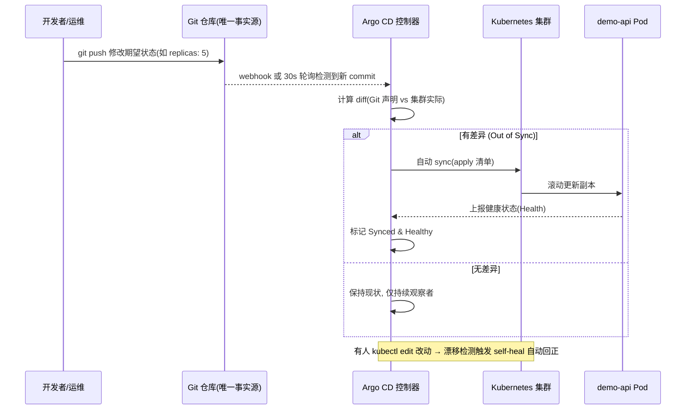

# 第 8 章 GitOps 与全栈可观测

> **定位**：本章是整套课程从「能交付」走向「能运营」的关键一跃。
> 你将在第 7 章高可用 K8s 集群之上，建立一条**以 Git 为唯一事实源（Single Source of Truth）**的自动交付链路，并补齐**指标（Metrics）/ 日志（Logs）/ 链路（Traces）**三支柱可观测能力，最终跑通一条**可行动告警闭环**：从指标异常 → 自动告警 → 值班定位 → 修复 → 自愈 → 无责复盘。
> 学完本章，第 9 章（AIOps 与平台工程）的 AI 辅助诊断、Golden Path 才有数据底座；本章也是最终综合项目「自动交付 + 仪表盘 + 告警闭环」的直接交付物。
>
> | 项 | 值 |
> |---|---|
> | 周次 | 第 19～21 周 |
> | 建议学时 | 22～28 小时（原理 4h / 部署 6h / 配置 6h / 验证与故障 8h / 复盘 4h） |
> | 核心作品 | 自动交付（Argo CD）+ 仪表盘（Prometheus/Grafana）+ 告警闭环（Loki/Alertmanager） |
> | 前置依赖 | 第 7 章高可用 K8s 集群（≥3 控制面）、kubectl/helm、可访问的 Git 仓库（GitHub/GitLab/Gitea）、工作站（Rocky 9 主线 / Ubuntu 22.04 LTS 对照） |
> | 完成标准 | 你 push 一次 Git 提交即触发一次可验证的部署；改错配置能被 Argo 拦下或自愈；一个 5xx 告警能自动通知、手动定位并自愈 |
>
> **本章固定版本（以官方兼容矩阵为准，开课前请复核）**
> - Argo CD `v2.11.x`（文档示例 `2.11.3`）
> - kube-prometheus-stack Helm chart `54.x`（内含 Prometheus `2.51.x`、Alertmanager `0.27.x`、Grafana `10.4.x`、Prometheus Operator `0.72.x`）
> - Loki `2.9.x`（Helm chart `grafana/loki 5.47.x`）、Promtail `2.9.x`
> - 演示应用 `stefanprodan/podinfo:6.5.4`
> - 集群：Kubernetes `1.28/1.29`（与第 7 章一致）
>
> [!WARNING]
> **Git 是集群的唯一事实源，不是其中之一的来源。** 一旦开启 `automated.syncPolicy` + `selfHeal`，以下行为会**自动且无人确认地**作用到集群：
> - 你 `git push` 了一个错误的清单（镜像不存在、字段拼错、配额超限）→ Argo CD 会**立刻尝试同步并失败**，或把集群推向错误状态；
> - 你手忙脚乱时直接用 `kubectl edit/scale/delete` 改了线上资源 → Argo CD 会在下一个 reconcile 周期把它**悄悄改回 Git 声明的样子**，你的手动改动会"凭空消失"且可能中断业务。
> 因此：**所有变更先走 Git**；紧急手工改动后必须把最终状态回写 Git 并恢复同步；本章所有"破坏性"演练只在第 7 章那台可重置实验集群执行，并先给 `argocd` 命名空间打快照/备份。

**学习目标**
1. 讲清楚 GitOps 四大原则（声明式 / 版本化 / 自动 reconcile / 漂移检测），并能在 Argo CD 里落地；
2. 区分可观测三支柱（指标 / 日志 / 链路）各自擅长与短板，会用 RED/USE 方法和 PromQL；
3. 理解 SLO / SLI / 错误预算 / 多窗口多燃烧率告警，写出"可行动"的告警规则；
4. 端到端跑通：**Git 提交即部署（Argo CD）+ 指标/日志上盘（Prometheus/Loki）+ 一条告警闭环（Alertmanager）**；
5. 掌握故障定位、回滚、灾备、安全加固与无责复盘，能独立交付本章核心作品。

---

## 1. 原理讲解（Principles）

### 1.1 GitOps 是什么：把"运维操作"变成"合并请求"

传统运维里，"部署"是一个**动作**（你跑 `kubectl apply`、点 Jenkins 按钮）。GitOps 把它变成一种**状态声明**：你在 Git 里写清楚"集群**应该**长什么样"，一个控制器持续把集群**拉向**这个状态。

GitOps 四大原则（源自 Weaveworks / CNCF OpenGitOps）：

| 原则 | 含义 | 在本章的落地 |
|---|---|---|
| **声明式（Declarative）** | 期望状态用 YAML 声明，而非一串命令 | Argo CD `Application` 指向 Git 里的 K8s 清单 |
| **版本化且不可变（Versioned & Immutable）** | 状态存 Git，每次变更是一个 commit，可审计、可回滚 | `git revert` 即回滚；Argo CD 自动跟 |
| **自动 reconcile（Pull 型）** | 控制器周期性对比 Git 与集群，自动拉平差异 | `syncPolicy.automated` + 每 30s 探测 |
| **漂移检测（Drift Detection）** | 任何不走 Git 的改动都会被看见、可自愈 | `selfHeal: true` 把手动改动改回 Git 声明 |

> 心智模型：**Git 是"宪法"，集群是"现状"，Argo CD 是"宪法法院"**——它不断检查现状是否符合宪法，不符合就纠偏。

### 1.2 可观测三支柱

工具不是目的，目的是缩短 **MTTD（发现时间）** 和 **MTTR（恢复时间）**，同时别用垃圾告警把值班人逼疯。

| 信号 | 擅长回答 | 不擅长回答 |
|---|---|---|
| **Metrics（指标）** | 趋势、阈值、聚合、告警（"现在 QPS 多少？错误率多高？"） | 单个请求的完整细节 |
| **Logs（日志）** | 离散事件、错误上下文、审计（"那条 500 是哪个 trace 触发的？"） | 低成本长期高维聚合 |
| **Traces（链路）** | 一次请求跨多个服务的路径与耗时（"这笔下单卡在支付服务几秒？"） | 宏观容量趋势 |

> 三支柱不是三选一，而是**接力**：指标告诉你"出事了"（what/when），日志告诉你"为什么"（why），链路告诉你"卡在哪一段"（where）。

### 1.3 RED 与 USE：两个够用一辈子的套路

- **RED（面向请求驱动的服务）**：
  - **R**ate：请求速率（QPS）
  - **E**rrors：错误率（5xx 占比）
  - **D**uration：延迟分布（p50/p95/p99）
- **USE（面向资源）**：
  - **U**tilization：利用率（CPU 用了多少）
  - **S**aturation：饱和度/排队（run-queue、throttling）
  - **E**rrors：错误（磁盘 IO 错误、OOM）

### 1.4 指标类型与 PromQL 基础

| 类型 | 特点 | 用法 | 反例 |
|---|---|---|---|
| Counter | 只增不减（重启可归零） | 配合 `rate()` 看速率 | 直接画原值（永远向上，看不出速率） |
| Gauge | 可增可减 | 直接画（温度、队列长度） | — |
| Histogram | 按 bucket 计数，可估分位数 | `histogram_quantile()` | 用 Summary 跨实例聚合分位数 |
| Summary | 客户端算分位数 | 单实例分位 | 跨实例聚合受限 |

```promql
# 5 分钟请求速率（Counter 必须套 rate）
sum by (service) (rate(http_requests_total[5m]))

# 5xx 错误比例（经典 RED 错误率）
sum(rate(http_requests_total{status=~"5.."}[5m]))
/
sum(rate(http_requests_total[5m]))

# 95 分位延迟（Histogram，必须按 le 聚合后再 quantile）
histogram_quantile(
  0.95,
  sum by (le, service) (rate(http_request_duration_seconds_bucket[5m]))
)
```

> [!CAUTION]
> 分母可能为零（服务无流量时 `rate(...[5m])` 返回空），会得到 `NaN` 或触发误报。生产规则里常用 `> 0` 的写法或 `clamp_min` 兜住，例如只在"有请求"时才评估错误率（`and sum(rate(...[5m])) > 0`）。

### 1.5 SLO / SLI / 错误预算 / 燃烧率

- **SLI（Service Level Indicator）**：实际测量值，如"成功请求占比"。
- **SLO（Service Level Objective）**：目标，如"30 天 99.9% 请求成功"。
- **错误预算（Error Budget）** = `1 - SLO` = 允许出错的空间。99.9% 意味着 30 天里约 43 分钟可以"不达标"。
- **燃烧率（Burn Rate）** = 实际消耗错误预算的速度 ÷ 预算线性消耗速度。
  - 燃烧率 1 = 正好按计划烧完；燃烧率 14 = 1 小时内烧光整月预算（快烧），必须立刻告警。
- **多窗口多燃烧率告警**（Google SRE 经典法）：用"长窗口+短窗口"组合，既快又抗抖动。例如短窗口 5m 燃烧率 14、长窗口 1h 燃烧率 7，同时成立才 page。

```promql
# 多窗口多燃烧率简版：5m 窗口燃烧率 ~14（对应 99.9% SLO，错误率阈值 ~0.0014*14）
(
  sum(rate(http_requests_total{status=~"5.."}[5m]))
  /
  sum(rate(http_requests_total[5m]))
) > (14 * 0.001)
and
(
  sum(rate(http_requests_total{status=~"5.."}[1h]))
  /
  sum(rate(http_requests_total[1h]))
) > (7 * 0.001)
```

### 1.6 告警闭环：一条能"自愈"的链路

可行动告警 = **影响 + 持续时长 + 当前值 + 关联仪表盘 + 变更链接 + Runbook + 责任团队**。能自动恢复又无用户影响的短暂抖动，通常**不该**叫醒人。

```text
指标异常 → Prometheus 规则触发 → Alertmanager 路由/分组/静默 → 通知值班
   → 值班用 Grafana+Loki+trace 定位 → 修复(回滚/扩容/改配置)
   → 指标恢复 → Alertmanager 自动 resolve → 事后无责复盘
```

---

## 2. 架构（Architecture）

### 2.1 本章要落地的逻辑架构（ASCII 图）

```text
┌──────────────────────────────────────────────────────────────────────────┐
│                          Git 仓库（唯一事实源）                            │
│   deployments/  ├─ base/demo-api/(deployment,service,kustomization)        │
│                 └─ overlays/{staging,production}                          │
│   observability/ ├─ prometheus/rules      ├─ alertmanager/config          │
│                  ├─ grafana/dashboards    └─ loki                         │
└───────────┬──────────────────────────────────────────────────────────────┘
            │ git push / webhook / 30s 轮询
            ▼
┌─────────────────────────── argocd 命名空间 ──────────────────────────────┐
│   Argo CD API Server + Application Controller + Repo Server              │
│   职责：对比 Git 与集群 → reconcile → 漂移检测 → self-heal                 │
└───────────┬──────────────────────────────────────────────────────────────┘
            │ apply / prune / self-heal (kubectl 到 API Server)
            ▼
┌─────────────────────────── Kubernetes 集群（第 7 章）────────────────────┐
│  ┌────────────┐   ┌────────────┐   ┌──────────────────────────────────┐ │
│  │ demo-api   │   │ Prometheus │   │ Grafana (展示)                   │ │
│  │ (podinfo)  │──▶│ (抓取/scrape)│──▶│  - 数据源: Prometheus + Loki   │ │
│  │ /metrics   │   │ + Rule      │   │  - 面板: 错误率/p95/饱和度       │ │
│  └─────┬──────┘   └─────┬──────┘   └───────────────┬──────────────────┘ │
│        │ stdout/stderr  │ 评估告警                   │ 查询                  │
│        ▼                ▼                            │                     │
│  ┌────────────┐  ┌──────────────┐            ┌───────▼─────────┐         │
│  │ Promtail   │─▶│ Loki (日志)  │────────────│ Alertmanager    │         │
│  │ (采集日志) │  │ 标签低基数    │            │ 路由/静默/通知  │         │
│  └────────────┘  └──────────────┘            └───────┬─────────┘         │
│                                                      │ Slack/PagerDuty/邮件│
└──────────────────────────────────────────────────────┼────────────────────┘
                                                        ▼
                                              值班人员（闭环终点/起点）
```

> 要点：Prometheus 主动**拉（pull）**指标；Promtail 把日志**推（push）**给 Loki；Grafana 统一**查（query）**两个数据源；Alertmanager 负责告警的"去重/分组/路由/静默"，**不负责**产生告警（那是 Prometheus 的活）。

### 2.2 GitOps 同步循环（mermaid sequenceDiagram）



### 2.3 告警从触发到恢复的闭环（mermaid flowchart）

```mermaid
flowchart TD
    A[Prometheus 抓取指标] --> B[规则评估: rate(5xx) 超阈值]
    B -->|持续 for: 10m| C[触发 Alert 送入 Alertmanager]
    C --> D[路由: severity=page 分组]
    D --> E{在静默窗口?}
    E -->|是| K[暂不通知, 记录]
    E -->|否| F[通知: Slack / PagerDuty / 邮件]
    F --> G[值班人员介入]
    G --> H[定位: Grafana 面板 + Loki 日志 + trace]
    H --> I[修复: 滚动回退 / 扩容 / 改配置]
    I --> J[指标恢复正常]
    J --> L[Alertmanager 自动 resolve]
    L --> M[告警自愈, 停止通知]
    M --> N[事后无责复盘 + Runbook 更新]
```

---

## 3. 部署（Deployment）

> 全章命令统一约定：
> - **执行环境**：工作站（Rocky 9 主线 / Ubuntu 22.04 LTS 对照），用户 `ops`；
> - **目标**：第 7 章高可用 K8s 集群（kubectl context 已切好）；
> - 所有清单以代码块内嵌，不另建文件。
> -  Rocky/Ubuntu 差异只在"工作站装 CLI"的包管理器（`dnf` vs `apt`），集群内 YAML 完全一致。

### 3.0 前置检查

```bash
# 执行环境: 工作站(Rocky 9 主线) 用户: ops
# 1) 确认能连上第 7 章集群
kubectl get nodes -o wide
kubectl get ns | head

# 2) 确认 helm 3.14+ 已装（Rocky 用 dnf, Ubuntu 用 apt 或官方脚本）
helm version --short
# Rocky 系补充: sudo dnf install -y helm   |  Ubuntu 系: sudo apt install -y helm
```

### 3.1 安装 Argo CD（v2.11.x）

```bash
# 执行环境: 工作站 用户: ops  (命令作用于 K8s 集群)
# 1) 创建专属命名空间并安装官方 manifest
kubectl create namespace argocd
kubectl apply -n argocd \
  -f https://raw.githubusercontent.com/argoproj/argo-cd/v2.11.3/manifests/install.yaml

# 2) 等待所有 Pod Ready（约 1~2 分钟）
kubectl wait --for=condition=Ready pods --all -n argocd --timeout=300s

# 3) 安装 CLI（Rocky/Ubuntu 通用，下载对应平台二进制）
#    Linux x86_64 示例:
curl -sSL -o /usr/local/bin/argocd \
  https://github.com/argoproj/argo-cd/releases/download/v2.11.3/argocd-linux-amd64
chmod +x /usr/local/bin/argocd
argocd version --client

# 4) 暴露 UI（实验环境用 port-forward，生产应走 Ingress + SSO）
kubectl port-forward svc/argocd-server -n argocd 8080:443 --address 0.0.0.0 &
# 浏览器访问 https://<工作站IP>:8080

# 5) 取初始 admin 密码（首次登录后务必改密码 + 开 SSO，见第 10 章）
argocd admin initial-password -n argocd
```

> [!NOTE]
> 若用 Ingress 暴露，记得给 `argocd-server` 配置 `--insecure` 或正确 TLS；实验期用 `port-forward` 最省事，但只在本地可访问。

### 3.2 安装 Prometheus + Grafana + Alertmanager（kube-prometheus-stack）

我们用 `kube-prometheus-stack` 一张 Helm 图把 Prometheus / Alertmanager / Grafana / Operator 一起装好，省去手工拼装。

```bash
# 执行环境: 工作站 用户: ops
# 1) 添加 repo
helm repo add prometheus-community https://prometheus-community.github.io/helm-charts
helm repo update

# 2) 创建命名空间
kubectl create namespace monitoring

# 3) 安装（版本锁在 chart 54.x；精确 chart 版本以官方兼容矩阵为准）
helm install kps prometheus-community/kube-prometheus-stack \
  --namespace monitoring \
  --version 54.0.0 \
  --set prometheus.prometheusSpec.retention=15d \
  --set prometheus.prometheusSpec.resources.requests.memory=768Mi \
  --set grafana.adminPassword='ChangeMe123!' \
  --set grafana.service.type=ClusterIP

# 4) 等就绪
kubectl wait --for=condition=Ready pods --all -n monitoring --timeout=420s
kubectl get pods -n monitoring   # 应看到 prometheus-0 / alertmanager-0 / grafana 等
```

### 3.3 安装 Loki + Promtail（日志）

```bash
# 执行环境: 工作站 用户: ops
helm repo add grafana https://grafana.github.io/helm-charts
helm repo update

# Loki 2.9.x（chart 5.47.x）。实验用单体模式(singleBinary)即可
helm install loki grafana/loki \
  --namespace monitoring \
  --version 5.47.1 \
  --set loki.auth_enabled=false \
  --set loki.storage.type=filesystem \
  --set loki.storage.filesystem.chunks_directory=/tmp/loki/chunks \
  --set loki.storage.filesystem.rules_directory=/tmp/loki/rules

# Promtail 负责把各 Pod 日志推给 Loki
helm install promtail grafana/promtail \
  --namespace monitoring \
  --version 6.16.0 \
  --set loki.servicePort=3100 \
  --set loki.serviceAddress=loki.monitoring.svc.cluster.local
```

### 3.4 准备 Git 仓库（事实源本体）

```bash
# 执行环境: 工作站 用户: ops
# 在 GitHub/GitLab 新建仓库, 例如 platform/deployments.git
mkdir -p ~/git/deployments && cd ~/git/deployments
git init -b main
git remote add origin https://github.com/<你>/deployments.git

# 建议目录结构（Kustomize 分层）
mkdir -p demo-api/base demo-api/overlays/production observability/prometheus observability/alertmanager observability/grafana observability/loki
```

```text
deployments/
├── demo-api/
│   ├── base/            # 与环境无关的"基准"清单
│   │   ├── deployment.yaml
│   │   ├── service.yaml
│   │   └── kustomization.yaml
│   └── overlays/production/   # 生产环境覆盖(副本数/资源/域名)
│       ├── kustomization.yaml
│       └── replicas-patch.yaml
└── observability/
    ├── prometheus/rules.yaml   # PrometheusRule: 告警 + SLO
    ├── alertmanager/config.yaml# 路由/接收器/静默模板
    ├── grafana/dashboards/     # 仪表盘 JSON
    └── loki/                   # 日志采集相关
```

> [!CAUTION]
> 把仓库默认分支设为 `main` 并开启 **branch protection**（禁止直接 push `main`，必须经 MR/PR + review）。一旦开启 Argo 自动同步，任何能 push `main` 的人等于拥有集群写权限。

### 3.5 Rocky / Ubuntu 对照说明

| 关注点 | Rocky 9（主线） | Ubuntu 22.04 LTS（对照） | 对本章影响 |
|---|---|---|---|
| 工作站装 `helm`/`argocd` CLI | `sudo dnf install -y helm` 或官方二进制 | `sudo apt install -y helm` 或官方二进制 | 仅 CLI 安装方式不同 |
| 集群内 YAML | 完全相同 | 完全相同 | **零差异** |
| 节点 OS | 第 7 章控制面/工作节点为 Rocky 9 | 可为 Ubuntu | 不影响 Argo/Prometheus |

> 结论：**GitOps 把"环境差异"压进了 Git 的 overlay 与 values**，工作站与节点 OS 几乎不影响交付物本身——这正是 GitOps 跨发行版稳定的原因。

---

## 4. 配置（Configuration）

> 以下全部为**可直接复制进 Git 仓库**的清单，带中文注释。约定：`demo-api` 用 `stefanprodan/podinfo` 演示，它自带 `/metrics` 与 `/ui/error`（可注入 500，用于告警演练）。

### 4.1 Argo CD AppProject（先把"权限边界"框住）

```yaml
# 文件: deployments/argocd/appproject-production.yaml
# 作用: 限制 production 应用只能落在 production 命名空间, 只能 sync 白名单里的 Git 仓库
apiVersion: argoproj.io/v1alpha1
kind: AppProject
metadata:
  name: production
  namespace: argocd
spec:
  description: 生产环境项目, 最小权限边界
  # 允许的目标命名空间(防止误 sync 到其他 namespace)
  destinations:
    - namespace: production
      server: https://kubernetes.default.svc
  # 允许的来源 Git 仓库(白名单)
  sourceRepos:
    - https://github.com/<你>/deployments.git
  # 允许管理的资源种类(按需收紧, 这里放开常用类型)
  clusterResourceWhitelist:
    - group: '*'
      kind: '*'
  # 禁止删除命名空间级关键资源(配合下方 deny)
  namespaceResourceBlacklist:
    - group: ''
      kind: Namespace
```

### 4.2 Argo CD Application（指向 Git 仓库与路径）

```yaml
# 文件: deployments/argocd/application-demo-api.yaml
apiVersion: argoproj.io/v1alpha1
kind: Application
metadata:
  name: demo-api-production
  namespace: argocd
  # 重要: 用注解保护关键应用, 防止被误 prune / 误删
  annotations:
    argocd.argoproj.io/sync-options: "Prune=false"   # 演示期先关 prune, 防误删
spec:
  project: production                                # 关联上面的 AppProject
  source:
    repoURL: https://github.com/<你>/deployments.git   # Git 唯一事实源
    targetRevision: main                              # 跟随主干
    path: demo-api/overlays/production                # Kustomize overlay 路径
  destination:
    server: https://kubernetes.default.svc
    namespace: production
  syncPolicy:
    automated:
      prune: false        # 生产期建议 true, 但需配合 AppProject 与 review 护栏
      selfHeal: true      # 关键! 集群被手动改动时自动拉回 Git 声明
      allowEmpty: false   # 不允许 Git 清空导致集群资源被删
    syncOptions:
      - CreateNamespace=true    # 目标 ns 不存在时自动创建
      - ApplyOutOfSyncOnly=true # 只同步真正漂移的资源, 减少抖动
    retry:
      limit: 3
      backoff:
        duration: 5s
        factor: 2
        maxDuration: 3m
```

```bash
# 执行环境: 工作站 用户: ops
# 把 Application 本身也交由 Argo 管理(自举): 直接 apply 即可
kubectl apply -f deployments/argocd/application-demo-api.yaml
# 观察同步状态(下面第 5 章详述)
argocd app get demo-api-production
```

### 4.3 demo-api 基准清单（Kustomize base）

```yaml
# 文件: deployments/demo-api/base/deployment.yaml
apiVersion: apps/v1
kind: Deployment
metadata:
  name: demo-api
  labels:
    app: demo-api
spec:
  replicas: 2
  selector:
    matchLabels: { app: demo-api }
  template:
    metadata:
      labels:
        app: demo-api
        # 低基数标签! 不要塞 user_id / request_id(会爆炸, 见 6.3)
        tier: api
    spec:
      containers:
        - name: api
          # podinfo 自带 /metrics(Prometheus) 与 /ui/error(注入 500)
          image: ghcr.io/stefanprodan/podinfo:6.5.4
          ports:
            - name: http
              containerPort: 9898
          # 关键: 暴露给 Prometheus 抓取的健康与指标端口
          readinessProbe:
            httpGet: { path: /readyz, port: 9898 }
            periodSeconds: 5
          livenessProbe:
            httpGet: { path: /healthz, port: 9898 }
            initialDelaySeconds: 10
          resources:
            requests: { cpu: 50m, memory: 64Mi }
            limits:   { cpu: 200m, memory: 128Mi }
---
# 文件: deployments/demo-api/base/service.yaml
apiVersion: v1
kind: Service
metadata:
  name: demo-api
  labels: { app: demo-api }
spec:
  selector: { app: demo-api }
  ports:
    - name: http
      port: 80
      targetPort: http
---
# 文件: deployments/demo-api/base/kustomization.yaml
apiVersion: kustomize.config.k8s.io/v1beta1
kind: Kustomization
resources:
  - deployment.yaml
  - service.yaml
```

```yaml
# 文件: deployments/demo-api/overlays/production/kustomization.yaml
apiVersion: kustomize.config.k8s.io/v1beta1
kind: Kustomization
# 生产 overlay: 在 base 之上覆盖副本数/资源/镜像(环境差异收敛到 Git)
resources:
  - ../../base
patches:
  - path: replicas-patch.yaml
    target:
      kind: Deployment
      name: demo-api
---
# 文件: deployments/demo-api/overlays/production/replicas-patch.yaml
- op: replace
  path: /spec/replicas
  value: 3          # 生产要 3 副本, 改这里即可, 不用动 base
```

### 4.4 Prometheus 抓取配置（ServiceMonitor）

`kube-prometheus-stack` 推荐用 `ServiceMonitor` 声明"抓谁"，比手写 `scrape_configs` 更 K8s 原生。

```yaml
# 文件: deployments/observability/prometheus/servicemonitor-demo-api.yaml
apiVersion: monitoring.coreos.com/v1
kind: ServiceMonitor
metadata:
  name: demo-api
  namespace: monitoring
  labels:
    release: kps          # 必须匹配 kube-prometheus-stack 的 release 名, 否则不被选中
spec:
  selector:
    matchLabels: { app: demo-api }   # 匹配 demo-api 这个 Service
  namespaceSelector:
    matchNames: [production]
  endpoints:
    - port: http                    # 对应 Service 的 port 名
      interval: 15s                 # 抓取间隔(性能权衡见第 6 章)
      path: /metrics
```

```bash
# 若想直接看 Prometheus 抓取到的原始配置(对照学习), 可临时加 raw scrape_configs:
# kubectl edit prometheus kps-kube-prometheus-prometheus -n monitoring
# 在 spec.additionalScrapeConfigs 里加:
# - job_name: demo-api-raw
#   kubernetes_sd_configs: [{role: endpoints}]
#   relabel_configs:
#     - source_labels: [__meta_kubernetes_service_label_app]
#       regex: demo-api
#       action: keep
```

### 4.5 Grafana 数据源 + 面板 JSON 片段

```yaml
# 文件: deployments/observability/grafana/datasources.yaml
# 由 kube-prometheus-stack 已默认接好 Prometheus; 这里补充 Loki 数据源
apiVersion: v1
kind: ConfigMap
metadata:
  name: grafana-datasource-loki
  namespace: monitoring
  labels:
    grafana_datasource: "1"     # kube-prometheus-stack 会据此自动加载
data:
  loki.yaml: |
    apiVersion: 1
    datasources:
      - name: Loki
        type: loki
        access: proxy
        url: http://loki.monitoring.svc.cluster.local:3100
        isDefault: false
```

```json
// 文件: deployments/observability/grafana/dashboards/demo-api.json
// 一个最小可跑的面板: 显示 5xx 错误率 + p95 延迟(带中文标题)
{
  "title": "demo-api 服务健康",
  "uid": "demo-api-health",
  "schemaVersion": 39,
  "panels": [
    {
      "title": "5xx 错误率 (%)",
      "type": "timeseries",
      "gridPos": { "h": 8, "w": 12, "x": 0, "y": 0 },
      "targets": [
        {
          "datasource": { "type": "prometheus", "uid": "prometheus" },
          "expr": "sum(rate(http_requests_total{app=\"demo-api\",status=~\"5..\"}[5m])) / sum(rate(http_requests_total{app=\"demo-api\"}[5m])) * 100"
        }
      ]
    },
    {
      "title": "P95 请求延迟 (s)",
      "type": "timeseries",
      "gridPos": { "h": 8, "w": 12, "x": 12, "y": 0 },
      "targets": [
        {
          "datasource": { "type": "prometheus", "uid": "prometheus" },
          "expr": "histogram_quantile(0.95, sum by (le) (rate(http_request_duration_seconds_bucket{app=\"demo-api\"}[5m])))"
        }
      ]
    },
    {
      "title": "最近错误日志 (Loki)",
      "type": "logs",
      "gridPos": { "h": 8, "w": 24, "x": 0, "y": 8 },
      "targets": [
        {
          "datasource": { "type": "loki", "uid": "loki" },
          "expr": "{app=\"demo-api\",level=\"error\"} |= \"error\""
        }
      ]
    }
  ]
}
```

### 4.6 Loki 日志采集（Promtail 标签治理）

Promtail 默认按 `namespace`/`app`/`container` 打标签。关键是**日志正文里放高维信息（request_id、user_id、错误详情），标签保持低基数**。

```yaml
# 文件: deployments/observability/loki/promtail-scrape-config.yaml
# 这是给 promtail DaemonSet 的额外 scrape 配置(通过 values 注入)
# 核心: 用 pipeline 从日志里提取 level/trace_id 进日志正文, 不进 label
clients:
  - url: http://loki.monitoring.svc.cluster.local:3100/loki/api/v1/push
scrape_configs:
  - job_name: kubernetes-pods
    kubernetes_sd_configs: [{ role: pod }]
    relabel_configs:
      # 只保留低基数标签: namespace / app / container
      - source_labels: [__meta_kubernetes_namespace]
        target_label: namespace
      - source_labels: [__meta_kubernetes_pod_label_app]
        target_label: app
    pipeline_stages:
      # 用 regex 从 JSON 日志提取 level / trace_id, 放进日志正文供查询, 不进 label
      - json:
          expressions:
            level: level
            trace_id: trace_id
      - labels:
          level: ""        # 注意: 这里把 level 当 label 要谨慎, 级别只有几种, 基数低可接受
```

> [!CAUTION]
> Loki 的 label 与 Prometheus **同样怕高基数**。把 `trace_id`（每请求唯一）当 Loki label 会瞬间制造百万级流（stream），Loki 直接被打爆。正确做法：trace_id 留在日志正文，查询时用 `| json | trace_id="abc"` 解析。

### 4.7 Alertmanager 路由与静默

```yaml
# 文件: deployments/observability/alertmanager/config.yaml
# 通过 kube-prometheus-stack 的 alertmanager.config 注入(下面命令)
global:
  resolve_timeout: 5m
route:
  receiver: "slack-default"          # 默认接收器
  group_by: [alertname, namespace]   # 按告警名+命名空间分组, 减少刷屏
  group_wait: 30s                    # 同组第一条等 30s 再发, 攒一批
  group_interval: 5m                 # 同组后续间隔
  repeat_interval: 4h                # 未恢复则每 4h 提醒一次
  routes:
    - match:
        severity: page               # 严重告警走 page 路由
      receiver: "pagerduty-oncall"
      repeat_interval: 30m
    - match:
        severity: warning
      receiver: "slack-default"
receivers:
  - name: slack-default
    slack_configs:
      - api_url: "https://hooks.slack.com/services/XXX/YYY/ZZZ"   # 用 Secret 注入, 别硬编码
        channel: "#alerts"
        send_resolved: true          # 恢复后也发一条"已解决"
  - name: pagerduty-oncall
    pagerduty_configs:
      - routing_key: "<PD_INTEGRATION_KEY>"   # 同上, 走 Secret
        severity: critical
# 静默(silence)通常不写死在配置里, 而是运行时用 amtool/UI 临时静默(如维护窗口)
```

```bash
# 应用 Alertmanager 配置(kube-prometheus-stack 方式)
helm upgrade kps prometheus-community/kube-prometheus-stack \
  --namespace monitoring --version 54.0.0 \
  --reuse-values \
  --set-file alertmanager.configFiles.alertmanager\\.yaml=deployments/observability/alertmanager/config.yaml

# 临时静默(维护窗口): 未来 1 小时静默所有 demo-api 告警
kubectl exec -n monitoring alertmanager-kps-kube-prometheus-alertmanager-0 -- \
  amtool silence add alertname=DemoApiHighErrorRate --duration=1h --comment="维护窗口"
```

### 4.8 SLO / 告警规则（PrometheusRule，带中文注释）

```yaml
# 文件: deployments/observability/prometheus/rules.yaml
apiVersion: monitoring.coreos.com/v1
kind: PrometheusRule
metadata:
  name: demo-api-rules
  namespace: monitoring
  labels:
    release: kps        # 必须匹配, 否则 Prometheus 不加载
spec:
  groups:
    - name: demo-api.errors
      rules:
        # 规则1: 经典 5xx 错误率告警(单窗口, 教学直观)
        - alert: DemoApiHighErrorRate
          expr: |
            (
              sum(rate(http_requests_total{app="demo-api",status=~"5.."}[5m]))
              /
              sum(rate(http_requests_total{app="demo-api"}[5m]))
            ) > 0.05        # 错误率 > 5%
          for: 10m          # 持续 10 分钟才告警, 过滤瞬时抖动
          labels:
            severity: page
            team: backend
          annotations:
            summary: "demo-api 5xx 错误率超过 5%"
            description: "当前 5xx 比例 {{ $value | humanizePercentage }}, 持续 10 分钟"
            runbook_url: "https://runbooks.example.com/demo-api/high-error-rate"
            dashboard: "https://grafana.example.com/d/demo-api-health"

        # 规则2: 多窗口多燃烧率 SLO 告警(99.9% SLO, 快烧 14x / 慢烧 7x)
        - alert: DemoApiSloBurnFast
          expr: |
            (
              sum(rate(http_requests_total{app="demo-api",status=~"5.."}[5m]))
              / sum(rate(http_requests_total{app="demo-api"}[5m]))
            ) > (14 * 0.001)
            and
            (
              sum(rate(http_requests_total{app="demo-api",status=~"5.."}[1h]))
              / sum(rate(http_requests_total{app="demo-api"}[1h]))
            ) > (7 * 0.001)
          for: 2m
          labels:
            severity: page
            slo: "99.9"
          annotations:
            summary: "demo-api 正在快速消耗错误预算(燃烧率≥14x)"
            runbook_url: "https://runbooks.example.com/demo-api/slo-burn"

    - name: demo-api.saturation
      rules:
        # 规则3: Pod 重启过多(可能 OOM / 崩溃循环)
        - alert: DemoApiPodCrashLooping
          expr: increase(kube_pod_container_status_restarts_total{pod=~"demo-api.*"}[15m]) > 3
          for: 5m
          labels: { severity: warning }
          annotations:
            summary: "demo-api 在 15 分钟内重启超过 3 次"
```

> [!NOTE]
> 好告警三要素：**有 `for`（避免抖动误报）**、**有 `runbook_url`（值班能立刻动手）**、**有 `severity`（决定要不要半夜叫人）**。没有 Runbook 的 page 级告警 = 把人叫醒还让他瞎猜。

---

## 5. 验证（Verification）

> 端到端验收：下面每一步都要"看得到证据"，而不是"我以为成功了"。

### 5.1 Argo CD 应用同步状态

```bash
# 执行环境: 工作站 用户: ops
# 登录(首次用初始密码, 见 3.1)
argocd login <工作站IP>:8080 --insecure --username admin

# 查看应用状态: 期望 SYNC STATUS=Synced, HEALTH STATUS=Healthy
argocd app get demo-api-production

# 若显示 OutOfSync, 手动触发一次同步看差异
argocd app sync demo-api-production
argocd app wait demo-api-production --health

# UI 里也能看到 Git 提交哈希 ↔ 集群资源 的对应关系
```

### 5.2 Prometheus targets 全部 UP

```bash
# 端口转发 Prometheus(实验环境)
kubectl port-forward svc/kps-kube-prometheus-prometheus -n monitoring 9090:9090 &
# 浏览器开 http://<IP>:9090 → Status → Targets
# 应看到 job=kube-prometheus-stack 及我们的 demo-api ServiceMonitor 为 UP

# 命令行验证指标确实被抓到(查询 series 是否存在)
kubectl exec -n monitoring prometheus-kps-kube-prometheus-prometheus-0 -- \
  promtool query instant http://localhost:9090 \
  'sum(rate(http_requests_total{app="demo-api"}[5m]))'
```

### 5.3 Grafana 面板出数

```bash
kubectl port-forward svc/kps-grafana -n monitoring 3000:80 &
# 浏览器 http://<IP>:3000  (admin / ChangeMe123!)
# 1) 确认数据源: Connections → Data sources 里有 Prometheus 与 Loki
# 2) 导入面板: Dashboards → New → Import → 粘贴 4.5 的 demo-api.json
# 3) 用下面命令先造一点流量, 面板应出现曲线
for i in $(seq 1 50); do curl -s http://<demo-api-svc>:80/echo?msg=hi >/dev/null; done
```

### 5.4 手动触发一条告警，看 Alertmanager 与恢复

```bash
# 执行环境: 工作站 用户: ops (目标: 制造 5xx 触发 DemoApiHighErrorRate)
# 用 podinfo 的 /ui/error 端点持续注入 500
kubectl run loadgen --rm -it --image=curlimages/curl --restart=Never -- \
  sh -c 'while true; do curl -s -o /dev/null http://demo-api.production.svc.cluster.local/ui/error; sleep 0.2; done'
# 等待 ~10 分钟(规则 for: 10m)后:
#   Prometheus → Alerts 看到 DemoApiHighErrorRate FIRING
#   Alertmanager → 收到并路由到 Slack(#alerts)
#   Grafana 面板 5xx 曲线飙升
```

**制造 → 证据链定位 → 修复（闭环演练）**

```bash
# 1) 定位: 在 Grafana 看哪条曲线异常(5xx↑); 同步到 Loki 查错误日志
#    Loki 查询: {app="demo-api"} |= "error"
# 2) 确认是注入的 /ui/error 造成, 而非真实故障 → 结束 loadgen
kubectl delete pod loadgen
# 3) 等待指标恢复 + Alertmanager 自动 resolve(约 5m resolve_timeout)
# 4) Slack 收到 "RESOLVED: DemoApiHighErrorRate" —— 闭环完成
```

### 5.5 验收清单（本章交付物检查）

- [ ] `argocd app get` 显示 `Synced` + `Healthy`，且能看到对应 Git commit
- [ ] `git push` 一次修改（如 `replicas: 2→4`）后，Argo 在 1 分钟内自动同步并生效
- [ ] Prometheus `Targets` 中 `demo-api` ServiceMonitor 状态为 `UP`
- [ ] Grafana 面板能画出 5xx 错误率与 p95 延迟曲线
- [ ] Loki 能搜到 `demo-api` 的结构化日志
- [ ] 手动注入 5xx 后，Alertmanager 能通知、Grafana 可见、停止注入后能自动 resolve
- [ ] 所有清单（Argo App / PrometheusRule / Alertmanager / Grafana）都已 `git commit` 进仓库

---

## 6. 性能（Performance）—— 让监控别先把自己拖垮

### 6.1 抓取间隔与基数（cardinality）调优

> 题面里的「卡迪尔」即 cardinality（基数）：**每多一个唯一标签组合，就多一条时间序列（TSDB 里的一个文件）**。

| 调优项 | 经验值 | 说明 |
|---|---|---|
| 全局 `scrape_interval` | 15s~30s | 默认 1m 太慢；<10s 会显著增大 TSDB 与 CPU |
| 高频 job 单独设 `15s`，低频 `60s` | 分级 | 不必全局一刀切 |
| `sample_limit` | 按 job 设上限 | 防止某个 exporter 突然暴增样本把 Prometheus 拖死 |
| `metric_relabel_configs` | 丢弃无用 label | 在抓取端就 `drop` 高基数 label，省内存 |

```yaml
# 示例: 在 ServiceMonitor 的 endpoint 上加 sample_limit 与 relabel 丢弃
endpoints:
  - port: http
    interval: 15s
    sampleLimit: 10000          # 单 target 样本上限, 超了丢弃并记日志
    metricRelabelings:
      - sourceLabels: [__name__]
        regex: 'go_gc_.*'        # 丢弃与业务无关的指标, 减负
        action: drop
```

### 6.2 高基数指标的危害与治理

```text
危害链: 高基数 label(user_id/request_id/url) → 时间序列爆炸(百万级)
       → Prometheus 内存暴涨 + 查询超时 + TSDB 压缩卡顿
       → 抓取变慢 → 指标延迟 → 告警漏报
```

治理手段：
1. **标签白名单**：只用 `method/status_code/route/region` 这类低基数维度；
2. **路由用模板**：`/users/:id` 而不是 `/users/123456`（框架里配 `relabel` 或网关归一）；
3. **高维信息进日志/Trace**：`request_id` 放日志正文，查询时再解析；
4. **cardinality explorer**：Grafana 的 "Explore → Cardinality" 或 `prometheus_tsdb_head_series` 指标定位元凶。

```promql
# 找出标签组合数最多的指标(定位基数炸弹)
topk(10, count by (__name__)({__name__=~".+"}))
# 或看每条时间序列的 label 数量
count by (__name__)({__name__=~"http_requests_total"}) 
```

### 6.3 长期存储：Thanos / Mimir（概念）

单 Prometheus 受限于单机磁盘与查询能力，保留期一般 15~30 天。需要跨月趋势或全局视图时引入：

| 方案 | 思路 | 适用 |
|---|---|---|
| **Thanos** | Sidecar 把 TSDB 块上传对象存储；Query 组件聚合多 Prometheus | 已有多集群、想统一查询 |
| **Grafana Mimir / Cortex** | 远端写（remote_write）到分布式存储（S3/MinIO） | 大规模、多租户、云原生 |

```yaml
# 概念片段: Prometheus 启用 remote_write 到 Mimir(生产需配认证)
# 在 kube-prometheus-stack 的 prometheus.spec 里:
remoteWrite:
  - url: http://mimir-distributor.monitoring.svc:8080/api/v1/push
```

> [!NOTE]
> 实验期**不要**上 Thanos/Mimir，先把单 Prometheus 调明白。长期存储是"规模化问题"，不是"能跑就行问题"。

### 6.4 Grafana 查询优化

- 用 `$__interval` / `$__rate_interval` 让 `rate()` 的窗口随面板时长自适应；
- 避免 `*` 全量匹配，限定 `job`/`namespace`；
- 用 Recording Rules 预计算常用聚合，面板直接查预计算结果；
- 大范围时间（如 30 天）避免 `group by` 高基数维度。

```yaml
# Recording Rule 示例: 把"5xx 错误率"预计算, 面板秒开
groups:
  - name: demo-api.recording
    rules:
      - record: job:demo_api:errors:rate5m
        expr: |
          sum(rate(http_requests_total{app="demo-api",status=~"5.."}[5m]))
          / sum(rate(http_requests_total{app="demo-api"}[5m]))
```

---

## 7. 故障（Troubleshooting）—— 故障演练

> 目标：主动制造事故，再用证据链修复。做过一次，真实出事你就不慌。
> **所有演练只在第 7 章可重置实验集群执行，并先给 argocd 命名空间打备份。**

### 演练 7.1：Git 改错配置 → Argo 同步失败（证据链）

```bash
# 执行环境: 工作站 用户: ops
# 步骤1: 故意把生产 overlay 的 replicas 改成非法值(字符串而非数字)
cat > deployments/demo-api/overlays/production/replicas-patch.yaml <<'EOF'
- op: replace
  path: /spec/replicas
  value: "many"      # 非法! 应为整数
EOF
git commit -am "bad: set replicas to many" && git push

# 步骤2: 观察 Argo 状态(应显示 Sync Failed / OutOfSync)
argocd app get demo-api-production
argocd app logs demo-api-production    # 看 kustomize/kubectl 报错

# 步骤3: 在 UI 里点进资源, 能看到具体失败原因(Invalid value: "many")
# 步骤4: 修复 —— 改回合法值并 push
sed -i 's/value: "many"/value: 3/' deployments/demo-api/overlays/production/replicas-patch.yaml
git commit -am "fix: replicas back to 3" && git push
argocd app sync demo-api-production    # 恢复 Healthy
```

**证据链小结**：`git push 坏值` → Argo `Sync Failed`（diff 可见）→ 修复 push → `Synced/Healthy`。关键：**坏变更从没真正作用到业务**（Argo 在 apply 前就失败了），这正是 GitOps 的安全网。

### 演练 7.2：手动 kubectl 改资源 → 漂移检测 + self-heal 自动回正

```bash
# 步骤1: 模拟"紧急手动扩容"到 5 副本, 绕开 Git
kubectl -n production scale deployment demo-api --replicas=5
kubectl -n production get deployment demo-api -o jsonpath='{.spec.replicas}'   # 输出 5

# 步骤2: 等 Argo reconcile(默认 30s~3m, 受 reconcilation timeout 影响)
argocd app get demo-api-production
# 会看到: 集群实际 5, Git 声明 3 → OutOfSync; 因 selfHeal=true, Argo 自动改回 3

# 步骤3: 再查副本, 已被拉回 Git 声明值
kubectl -n production get deployment demo-api -o jsonpath='{.spec.replicas}'   # 输出 3
```

> [!WARNING]
> 这演示了 **self-heal 的"双刃剑"**：它救得了漂移，也会**悄悄抹掉你合法的紧急手工改动**。紧急调试若必须暂停自动同步，需事故负责人授权、记录时间，结束后把最终状态回写 Git 并恢复同步：
> ```bash
> argocd app suspend demo-api-production     # 暂停自动同步(仅限事故处理)
> # ... 手工修复 ...
> # 把最终状态 commit 进 Git, 再恢复:
> argocd app resume demo-api-production
> ```

### 演练 7.3：制造指标异常 → 告警触发 → 定位 → 修复（完整闭环）

```bash
# 步骤1(制造): 把 demo-api 副本缩到 1 且注入错误, 模拟容量+错误双重异常
kubectl -n production scale deployment demo-api --replicas=1
kubectl run errgen --rm -it --image=curlimages/curl --restart=Never -- \
  sh -c 'while true; do curl -s -o /dev/null http://demo-api.production.svc.cluster.local/ui/error; sleep 0.1; done'

# 步骤2(告警): 约 10m 后 Prometheus 触发 DemoApiHighErrorRate, Alertmanager 推 Slack
# 步骤3(定位): Grafana 面板看 5xx↑ + 副本数=1; Loki 查 {app="demo-api"}|= "error" 确认是注入
# 步骤4(修复): 结束注入 + 恢复副本
kubectl delete pod errgen
git commit --allow-empty -m "rollback replicas to 3"  # 走 Git 恢复才是正道
sed -i 's/value: 1/value: 3/' deployments/demo-api/overlays/production/replicas-patch.yaml
git commit -am "fix: restore 3 replicas" && git push
argocd app sync demo-api-production

# 步骤5(自愈): 指标恢复正常, Alertmanager 自动 resolve, Slack 收到 RESOLVED
```

> [!CAUTION]
> 演练 7.3 里"缩副本"若发生在真实生产，属于**容量事故**而非配置事故。修复必须走 Git（改 overlay 再 sync），不要直接 `kubectl scale` 修完就跑——否则下次 Argo reconcile 又会把你手动改的副本数拉回旧值，事故复发。

---

## 8. 回滚（Rollback）

GitOps 的回滚不是"删了重来"，而是"把历史好状态再 push 一次"。

### 8.1 Git revert 触发 Argo 自动回滚（首选）

```bash
# 执行环境: 工作站 用户: ops
# 假设刚刚那次 "bad: set replicas to many" 已 push, 现在回滚它
git revert HEAD --no-edit
git push
# Argo 检测到 main 变化 → 自动 sync → 集群回到 revert 前的健康状态
argocd app get demo-api-production   # 应很快回到 Synced/Healthy
```

> 理念：**回滚本身也是一次 Git 提交**，有作者、有理由、可审计、可再次回滚。比 `kubectl rollout undo` 留下的"未入库手工状态"可靠得多。

### 8.2 Argo / Helm 历史回退（应急）

```bash
# Argo 侧: 查看 sync 历史并回退到某个 revision
argocd app history demo-api-production
argocd app rollback demo-api-production <REVISION>

# Helm 侧(若某组件是 helm 装的, 如 kps): 查看并回退 chart 版本
helm history kps -n monitoring
helm rollback kps <REVISION> -n monitoring
```

### 8.3 镜像回滚与"数据库陷阱"

```bash
# 镜像回滚用 Git 改回旧的 digest(不要手敲 kubectl set image)
# 在 deployment.yaml 或 overlay 里把 image 指回已知好 digest, commit+push
# Argo 自动 sync, 滚动更新回旧版
```

> [!WARNING]
> **回滚镜像 ≠ 回滚数据库 schema。** 数据库迁移必须向前兼容（expand/contract 策略），且独立备份与验证。GitOps 只管无状态/声明式资源，DB 的向后兼容得你自己保证，否则"应用回去了，库结构没回去"会出更惨的事故。

### 8.4 监控配置版本管理

PrometheusRule / Alertmanager / Grafana 全部在 Git 里版本化，回滚它们和回滚应用一样：

```bash
# 误删了一条关键告警规则? 从 Git 历史找回
git log --oneline -- observability/prometheus/rules.yaml
git checkout <旧提交> -- observability/prometheus/rules.yaml
git commit -m "restore: 找回误删的 SLO 规则" && git push
```

---

## 9. 灾备（Disaster Recovery）

GitOps 架构天生比"手工运维"更抗灾，但前提是你真的把它当事实源来护好。

### 9.1 Git 仓库本身就是灾备

```text
传统运维: 集群炸了 → 一堆手工脚本/文档/人脑记忆 → 重建慢且易错
GitOps:    集群炸了 → git clone 仓库 → argocd 一键把全部期望状态拉起 → 接近可复现
```

- 仓库开启**多副本 + 异地（GitHub/GitLab 远端）**，本地损坏可 `git clone` 恢复；
- 用 **branch protection + 强制评审** 防止仓库被误改（仓库被改 = 集群被改）。

### 9.2 监控配置纳入 Git

```bash
# 所有可观测配置都应进 Git, 与业务清单同仓或相邻仓:
#   observability/prometheus/rules.yaml
#   observability/alertmanager/config.yaml
#   observability/grafana/dashboards/*.json
# 这样 Grafana/Prometheus 配置丢失时, 一条 helm upgrade --set-file 即可重建
```

### 9.3 Argo / Grafana 配置可重建

```bash
# Argo CD 自身可用 Git 自举(把 AppProject/Application 清单存 Git, 用 bootstrap 仓管理)
# 集群重建后只需:
#   kubectl apply -f install.yaml && kubectl apply -f bootstrap-apps/
# Grafana 仪表盘/数据源用 ConfigMap + sidecar 自动加载(见 4.5), 重建即恢复
```

### 9.4 告警规则备份 + 集群级备份（Velero 概念）

```bash
# 概念: 用 Velero 把整个 monitoring 命名空间(含 PVC)定期备份到对象存储
# velero install --provider aws --bucket velero-backups --secret-file ./credentials
# velero backup create monitoring-$(date +%F) --include-namespaces monitoring
# 灾难后: velero restore create --from-backup monitoring-<日期>
```

> [!NOTE]
> Git 恢复的是"**期望状态**"，Velero 恢复的是"**运行时数据**"（如 Prometheus 历史指标 PVC、Grafana 用户偏好）。两者互补，别只靠一个。

---

## 10. 安全（Security）

> GitOps 把"部署权限"等价于"Git 写权限"，所以安全重心从"守服务器"转移到"守仓库 + 守控制器"。

### 10.1 Argo CD RBAC 与 SSO

```yaml
# 文件: deployments/argocd/rbac-policy.csv (ConfigMap argocd-rbac-cm)
# 最小权限: 不同团队只能动自己的项目
p, role:reader, applications, get, */*, allow
p, role:reader, projects, get, *, allow
p, role:deploy-prod, applications, sync, production/*, allow     # 仅生产项目可 sync
p, role:deploy-prod, applications, override, production/*, allow
g, ops-team, role:deploy-prod
g, auditor, role:reader
# 默认拒绝一切未显式允许的
```

```yaml
# SSO(以 OIDC 为例, 接 GitLab/GitHub/企业 IdP):
# ConfigMap argocd-cm 里:
# oidc.config: |
#   name: MyCompany
#   issuer: https://gitlab.example.com
#   clientID: argocd
#   clientSecret: $oidc-secret
#   redirectURI: https://argocd.example.com/auth/callback
```

> [!CAUTION]
> 别再用初始 `admin` 密码长期登录。一旦 Argo 暴露公网且 admin 弱密码，攻击者 push 一个 `privileged: true` 的 Pod 就能拿下集群。务必：① 改 admin 密码或禁用 admin；② 接 SSO；③ 开 RBAC。

### 10.2 Secret 管理（sealed-secrets / external-secrets）

**绝对禁止**把 Base64 的明文 Secret 提交 Git（Base64 ≠ 加密，谁都能解码）。两种主流方案：

```bash
# 方案A: Sealed Secrets —— 公钥加密后提交, 集群控制器用私钥解密
# 安装: kubectl apply -f https://github.com/bitnami-labs/sealed-secrets/releases/download/v2.14.0/...
# 加密一个 Secret 为 SealedSecret(可安全入库):
echo -n "mydbpassword" | kubectl create secret generic db-secret \
  --dry-run=client -o json | kubeseal --namespace production > sealed-db-secret.yaml
# Git 里只存 sealed-db-secret.yaml; 集群自动还原成真正 Secret

# 方案B: External Secrets —— Git 存"引用", 真正密钥在 Vault/云密钥服务
# 示例(External Secret 指向 AWS Secrets Manager):
# apiVersion: external-secrets.io/v1beta1
# kind: ExternalSecret
# spec:
#   data:
#     - secretKey: password
#       remoteRef: { key: prod/db, property: password }
```

### 10.3 最小权限原则落地

| 对象 | 最小权限做法 |
|---|---|
| Git 仓库 | `main` 分支保护 + 必须经 MR 评审 + 禁用 force push |
| Argo CD | AppProject 限制 `destinations`/`sourceRepos`/`namespaceWhitelist` |
| ServiceAccount | 给 Argo 用的 SA 只绑必需权限，不用 cluster-admin |
| Prometheus | 只读抓取；`sample_limit` 防资源滥用 |
| Alertmanager | `api_url`/`routing_key` 走 K8s Secret，不写 Git |

### 10.4 Git 仓库保护（branch protection）

```bash
# GitHub 示例(用 gh CLI 或网页设置):
gh api repos/<你>/deployments/branches/main/protection \
  -X PUT -f required_status_checks.strict=true \
  -f required_pull_request_reviews='{"required_approving_review_count":1}' \
  -f enforce_admins=true \
  -f restrictions='null'
# 效果: 禁止直接 push main; 至少 1 人 review; 连 admin 也受限
```

> [!WARNING]
> **branch protection 是 GitOps 的"最后一道闸"。** 没有它，任何一个能 push 的人就等于拥有集群写权限——一次 `git push` 就能把生产改成 `replicas: 0` 或注入恶意镜像。这是本章最该落地的"避坑点"。

### 10.5 安全避坑清单（融入故障与安全）

- [ ] 不用初始 admin 密码长期登录 Argo，已接 SSO + RBAC；
- [ ] 所有 Secret 经 sealed-secrets / external-secrets，无明文入库；
- [ ] `main` 分支保护开启，禁用 force push，必需评审；
- [ ] `selfHeal` 开启但 `prune` 谨慎（演示期 `Prune=false`），配合 AppProject 边界；
- [ ] Alertmanager 的 Slack/PD 密钥走 K8s Secret，不写进 Git 清单；
- [ ] 紧急手工改动后必须回写 Git 并 `argocd app resume`，不留未入库状态。

---

## 11. 自测题与参考答案

### 自测题

1. GitOps 四大原则中，"控制器持续把集群拉向 Git 声明状态"对应哪一条？A) 声明式  B) 版本化  C) 自动 reconcile  D) 漂移检测
2. 为什么 GitOps 强调 Git 是"唯一事实源"而不是"之一"？举一个"双来源"会出错的场景。
3. 可观测三支柱（指标/日志/链路）各自最擅长回答什么？哪一根支柱能告诉你"这笔请求卡在支付服务几秒"？
4. Counter 类型指标直接画原值有什么问题？正确做法是什么？
5. 下面 PromQL 分母可能为零时会产生什么？如何规避？
   ```promql
   sum(rate(http_requests_total{status=~"5.."}[5m])) / sum(rate(http_requests_total[5m]))
   ```
6. 解释 SLO、SLI、错误预算、燃烧率四个概念的关系。99.9% 的 SLO 在 30 天里允许多少"不达标时间"？
7. 多窗口多燃烧率告警相比"单点 CPU > 90% 持续 5m"好在哪？
8. `selfHeal: true` 和 `prune: true` 分别有什么破坏力？生产开启前要配什么护栏？
9. 演练 7.2 中你 `kubectl scale` 到 5 副本，Argo 为什么又把它拉回 3？如果你"紧急修复"后直接走人，会发生什么？
10. 为什么绝不能用 `kubectl rollout undo` 或手工改动作为 GitOps 下的"正式回滚"？正确做法是什么？
11. Sealed Secrets 和 External Secrets 的核心区别是什么？为什么不能直接把 Base64 Secret 提交 Git？
12. branch protection 在 GitOps 安全里扮演什么角色？没它会怎样？
13. 高基数（high cardinality）标签为什么会让 Prometheus 自己先崩？举 3 个禁止做 label 的例子。
14. Loki 的 label 和日志正文应该怎么分工（以 trace_id 为例）？
15. 如果 Git 仓库完全不可访问（删库/锁死），现有业务会立刻挂吗？为什么？灾备该怎么做？

### 参考答案

1. **C（自动 reconcile / Pull 型）**。声明式是"写 YAML 而非命令"，版本化是"每次变更是 commit"，漂移检测是"发现手动改动"。把集群**拉向** Git 状态的过程就是 reconcile。
2. **双来源会撕裂"事实"**：如果既允许 `git push` 改、又允许 `kubectl edit` 改，两份状态会互相打架——Argo 的 self-heal 会在下一周期把你的手工改动悄悄覆盖，造成"我明明改了为啥没生效/又变回去"的诡异事故。唯一事实源让"集群应该什么样"只有一个权威答案。
3. **指标**擅长趋势/阈值/聚合/告警；**日志**擅长离散事件与错误上下文；**链路**擅长一次请求跨服务路径与耗时。能回答"卡在支付服务几秒"的是**链路（Traces）**。
4. Counter 只增不减，重启可能归零，直接画原值是条"永远向上的斜线"，看不出速率。正确做法：套 `rate()`/`irate()` 看单位时间增量。
5. 当服务无流量时，`rate(...[5m])` 返回空，分母为空 → 除法得到 **NaN 或空**，可能触发误报或面板异常。规避：只在"有请求"时评估，如 `and sum(rate(http_requests_total[5m])) > 0`，或用 `clamp_min`。
6. **SLI** 是实测值（如成功请求占比），**SLO** 是目标（如 99.9% 成功），**错误预算** = `1 - SLO`（允许出错的空间），**燃烧率** = 实际消耗预算速度 ÷ 线性消耗速度。99.9% SLO 即 0.1% 允许失败，30 天 ≈ 43200 分钟 × 0.1% ≈ **43.2 分钟**不达标额度。
7. 单点 CPU 阈值只能反映"资源紧张"，不反映"用户受影响"，且容易因瞬时抖动误报。多窗口多燃烧率基于**用户可感知的错误率**且用长短窗口组合，**既快（短窗口抓快烧）又抗抖（长窗口确认趋势）**，更贴近 SLO。
8. **selfHeal** 会悄悄覆盖合法的手工紧急改动（把人救场的修改抹掉）；**prune** 会在 Git 删除对象时**自动删集群资源**（误删 Git 一行 = 误删线上资源）。护栏：AppProject 限制作用域、RBAC 最小权限、保护注解（`Prune=false` 演示期）、应急 `argocd app suspend` + 事后回写 Git。
9. 因为 Argo 每周期对比 Git（声明 3）与集群（实际 5），发现漂移后 self-heal 把集群拉回 3。若你修完直接走人、没把"最终 5 副本"回写 Git 并 resume，下次 reconcile 仍会把它拉回 3，**事故复发**。正确：要么 Git 里改成 5 再 sync，要么 resume 前先 commit 最终状态。
10. `kubectl rollout undo` / 手工改动留下的状态**不在 Git 里**，是不可审计、不可复现、会被 self-heal 覆盖的"幽灵状态"。正确做法：**`git revert` + push**，让回滚本身成为一次有作者、有理由、可再回滚的提交，Argo 自动跟。
11. **Sealed Secrets**：加密后的 Secret 直接存 Git，集群控制器用私钥解密（适合"密钥也想进 Git"）；**External Secrets**：Git 只存"引用/指针"，真正密钥在 Vault/云密钥服务，集群实时拉取（适合已有密钥中枢）。Base64 只是编码不是加密，`kubectl get secret -o yaml` 任何人都能解码，提交即泄露。
12. branch protection 是 GitOps 的**最后一道闸**：没有它，任何能 push `main` 的人 = 拥有集群写权限，一次 push 就能把生产改成 0 副本或注入恶意镜像。它强制评审 + 禁 force push，把"部署权限"关进"流程"里。
13. 每多一个唯一标签组合就多一条时间序列（TSDB 文件），高基数 → 百万级序列 → Prometheus 内存暴涨、查询超时、TSDB 压缩卡顿、抓取变慢、告警漏报。禁止做 label 的：**user_id、request_id、完整 URL、session_id、时间戳**。
14. **trace_id 是每请求唯一的超高维值，绝不能当 Loki label**（会制造百万级 stream 把 Loki 打爆）。正确做法：trace_id 留在**日志正文**，查询时用 `| json | trace_id="abc"` 解析；Loki label 只保留 `namespace/app/container/level` 等低基数维度。
15. **现有业务不会立刻挂**——Argo 只是"对比器"，Git 不可访问时它停在新同步、保持集群现状。但**无法再部署/回滚/自愈**，且若此刻发生漂移就修不回来。灾备：Git 仓库存远端多副本 + branch protection；监控配置全进 Git 可重建；运行时数据用 Velero 备份 PVC；Argo 自身用 bootstrap 仓自举。

---

## 参考资料（GitHub / 官方文档外链）

- [Argo CD 官方文档：Automated Sync Policy（selfHeal / prune 行为）](https://argo-cd.readthedocs.io/en/stable/user-guide/auto_sync/)
- [Argo CD 官方文档：Declarative Setup（AppProject / RBAC / SSO）](https://argo-cd.readthedocs.io/en/stable/operator-manual/declarative-setup/)
- [CNCF OpenGitOps 原则（四大原则来源）](https://opengitops.dev/)
- [Prometheus 官方文档：Instrumentation 与标签基数（The Zen of Prometheus）](https://prometheus.io/docs/practices/instrumentation/)
- [Prometheus 官方文档：The Zen of Prometheus（高基数治理）](https://prometheus.io/docs/practices/the_zen/)
- [Google SRE Book：Monitoring Distributed Systems / SLO 多窗口多燃烧率告警](https://sre.google/workbook/alerting-on-slos/)
- [Grafana Loki 官方文档：Labels 与性能（标签基数避坑）](https://grafana.com/docs/loki/latest/best-practices/)
- [kube-prometheus-stack Helm Chart（Prometheus/Grafana/Alertmanager 一体安装）](https://github.com/prometheus-community/helm-charts/tree/main/charts/kube-prometheus-stack)
- [OpenTelemetry 官方文档（三支柱与 Trace 标准）](https://opentelemetry.io/docs/)
- [Sealed Secrets（Bitnami，Git 安全存 Secret）](https://github.com/bitnami-labs/sealed-secrets)
- [External Secrets Operator（接 Vault / 云密钥服务）](https://external-secrets.io/latest/)
- [podinfo 演示应用（自带 /metrics 与错误注入，GitOps 教学标配）](https://github.com/stefanprodan/podinfo)

---

> **下一步**：第 9 章《AIOps 与平台工程》会在本章的数据底座上，接 K8sGPT 做隐私护栏下的辅助诊断，并用 Backstage 把"服务目录 + 创建模板（Golden Path）"产品化，把你从"会运维"推向"能让别人自助安全地运维"。
> **提示**：所有版本号（Argo CD 2.11 / kube-prometheus-stack 54.x / Loki 2.9 / Grafana 10）可能随官方迭代变动，开课前请以各项目当前兼容矩阵与发行说明为准并固定已验证版本。
