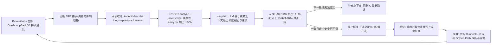

# 第 9 章 AIOps 与平台工程

> **定位**：这是 24 周课程的收官章。前面 8 章你建好了机器、写会了自动化、交付了 GitOps、点亮了可观测——本章回答两个「人如何规模化」的问题：**故障太多，人不够，AI 怎么帮（而不添乱）？开发团队被基础设施细节淹没，平台怎么把「铺好的路」（Golden Path）变成自助服务？**
>
> 你将亲手把两件真实工具接进自己的实验集群：**K8sGPT**（AI 辅助诊断，配隐私护栏）与 **Backstage**（服务目录 + 软件模板），并完成一次完整的「故障 → AI 给线索 → 人确认 → 修复」与「模板 → 新服务 → 可部署」端到端闭环。
>
> | 项 | 值 |
> |---|---|
> | 周次 | 第 22～24 周 |
> | 建议学时 | 22～28 小时（讲解 6h / 实验 16h / 复盘 6h） |
> | 核心作品 | AI 辅助诊断（K8sGPT，含隐私护栏）+ Golden Path 原型（Backstage 服务模板） |
> | 前置依赖 | 第 7 章 K8s 集群、第 8 章 GitOps 与可观测（Prometheus/Loki/Grafana）、Git 与 CI 基础 |
> | 完成标准 | ① 能对注入故障给出可核对证据链的 AI 诊断；② 能用模板自助生成一个带安全基线、可部署的新服务 |

**学习目标**
1. 说清 AIOps 的边界：AI 增强**证据链**，而不是取代人的判断与变更权；
2. 安装并用 K8sGPT 对真实故障做分析（analyzer 与 `--explain` 的关系）、开启脱敏并选择离线/本地模型；
3. 执行「AI 输出验证协议」：任何 AI 建议在动手前必须与 `describe`/日志/事件/指标交叉验证；
4. 说清平台工程要解决的认知负载问题，理解 Golden Path、服务目录、软件模板三者的关系；
5. 部署 Backstage（开发模式 + 可选容器化），注册 catalog 实体；
6. 编写一个 v1beta3 Software Template，用表单生成一个**自带安全基线、可部署**的服务脚手架；
7. 用 git 管好平台自身的配置与模板，验证「配置即代码、平台可重建」。

> [!WARNING] 本章红线（先读三遍）
> AI 辅助诊断**只把脱敏后的诊断上下文发给模型**。默认情况下 K8sGPT 只有在 `--explain` 时才把收集到的信息交给配置的 AI 后端——即便如此，**也可能包含对象名、事件消息、镜像名等敏感信息**；官方隐私指引明确：`--anonymize` 能掩码大部分名称，但**不是所有 analyzer 与事件消息都会被完全掩码**。
> 铁律：**绝不把 Secret、完整日志、用户数据、凭据、代码发给任何外部模型**；生产接入前必须做数据外发清单评审。本章所有实验都在可重置实验集群的 `demo` namespace 中进行。
>
> 版本说明：K8sGPT 迭代很快（写作时官方 README 指向 v0.4.x 系，0.3.49 亦常见，命令一致）；Backstage 已到 1.4x（模板 API `v1beta3` 自 1.2x 起稳定，内容兼容）。**所有版本可能变动，以官方发布页与兼容矩阵为准；执行前先 `k8sgpt version` / 记录 Backstage package 版本。**

---

## 1. 原理讲解 —— AIOps 与平台工程

### 1.1 AIOps 是什么：不是「AI 取代 SRE」，是「AI 增强证据链」

AIOps（Artificial Intelligence for IT Operations）这个词被厂商用滥了。请记住本课程的定义：

> **AIOps = 把 AI/ML 用在「从海量信号里缩小假设空间、把上下文翻译成人话、把诊断动作结构化」的环节，人始终握着最终判断与变更权。**

K8sGPT 就是教科书级的例子：它内置一批**确定性 analyzer**（Pod、PVC、Service、Deployment、CronJob、Node、Ingress 等），这些 analyzer 用规则化的方式扫描集群、复现 SRE 的常见检查逻辑——这一层**不需要 AI、可解释、可测试**。只有当你加上 `--explain`，它才把 analyzer 收集到的诊断上下文交给 LLM，请模型给出「用大白话解释 + 候选根因 + 建议」。

```text
确定性规则层(analyzer)         概率性解释层(LLM)              人的决策层
┌────────────────────┐    ┌───────────────────┐    ┌────────────────────┐
│ 扫描资源与事件        │───▶│ 用自然语言解释问题   │───▶│ 交叉验证证据链       │
│ 输出结构化 JSON      │    │ 给出候选根因/建议   │    │ 批准后才执行变更     │
│ 快、可复现、不花钱    │    │ 慢、会幻觉、要花钱  │    │ 负最终责任          │
└────────────────────┘    └───────────────────┘    └────────────────────┘
```

这个分层非常关键：**analyzer 的结论可以进 CI、可以断言、可以留痕；LLM 的解释只用于加速人的理解**。谁把顺序搞反了（让 AI 直接改集群），谁就在给事故加杠杆。

### 1.2 LLM 辅助排错的边界：幻觉是特性，不是 bug

LLM 是「下一个词的预测器」，不是数据库、不是计算器、更不是有权执行命令的 agent。用它排错时有三个结构性边界：

| 边界 | 含义 | 应对 |
|---|---|---|
| **幻觉** | 它可能一本正经地编造不存在的日志、命令或 API | 每条建议都要能回溯到可观察事实 |
| **知识截断** | 训练数据早于你的 K8s/CNI/云厂商版本 | 建议必须对版本做复核，别盲信 `--with-doc` 之外的自创命令 |
| **无状态** | 它看不到你的集群，只看到你喂给它的上下文 | 上下文质量 = 诊断质量；先取证再问 AI |

> [!NOTE] 心智模型
> 把 LLM 想成一个**读过很多事故报告的见习生**：他擅长「一听症状就报出三个怀疑方向」，但他没权限看监控、没摸过你的集群、有时会记错命令。你的工作 = 给他**干净的证据**，然后**验证他的猜测**。这正是第 8 章训练的证据链习惯的延伸。

### 1.3 平台工程：开发团队为什么需要「铺好的路」

先看一个没有平台的典型场景（前 8 章你学的每一样东西都变成了别人的负担）：

```text
开发: "我要上线一个新服务"
  ├─ 该问谁要命名规范?  该用哪个镜像仓库?
  ├─ CI 模板在哪?       告警阈值谁定?
  ├─ 配额谁批?          K8s 清单怎么才安全?
  └─ 文档放哪? 谁 oncall? → 全公司问一圈, 两周后: 手动抄了个不安全的副本
```

**平台工程（Platform Engineering）** 就是把「平台团队」当作一个**产品团队**，把开发者的日常操作**产品化**：提供一条**Golden Path（金色路径/铺好的路）**——默认路径安全、合规、带可观测性，且**不堵死逃生出口**（需要时可以偏离，但要有理由、有记录）。

其价值主张是 **认知负载最小化**：开发者只需回答「我的服务叫什么、归谁管」，其余（CI、镜像、部署清单、探针、告警、文档、Runbook）由平台模板生成——这正是 Backstage Software Template 做的事。

### 1.4 服务目录、软件模板、Golden Path 三者关系

Backstage（Spotify 开源，现为 CNCF 孵化项目）提供三个核心原语：

```text
┌─ 软件目录(Catalog) ────────────┐   回答: 有什么系统? 谁负责? 依赖谁?
│  catalog-info.yaml 声明实体     │   "系统、组件、API、资源、人、组"
└───────────────────────────────┘
┌─ 软件模板(Software Templates) ─┐   回答: 怎么合规地造一个新服务?
│  scaffolder 表单→流水线式步骤   │   "问几个问题 → 生成脚手架 → 建仓 → 注册"
└───────────────────────────────┘
┌─ Golden Path ─────────────────┐   回答: 默认就该这么走
│  目录条目+模板+护栏+文档的组合  │   "模板把安全基线焊死在产物里"
└───────────────────────────────┘
```

**Golden Path 不等于「一个模板」**，它是「平台承诺」：走这条路，CI 会自动跑、镜像会自动扫、部署清单默认带探针与非 root、目录里会出现你的服务、告警和 Runbook 有地方可查。模板只是把承诺变成产物的执行器。

### 1.5 本章在课程全景中的位置

```text
第 8 章 GitOps + 可观测(告警/日志/指标) ──┐
                                       ▼
第 9 章: 告警来了 → K8sGPT(AI, 隐私护栏) → 人确认修复 ─┐
                                       ▲          │ 经验固化
       开发者要新服务 → Backstage Golden Path 模板 ──┘
                                       │
第 7 章 K8s 集群 / 第 6 章 IaC / 第 5 章自动化     ← 全部成为平台的"地基能力"
```

> 参考：[K8sGPT 官方仓库（架构与示例）](https://github.com/k8sgpt-ai/k8sgpt) ｜ [Backstage 官方文档](https://backstage.io/docs/) ｜ [CNCF 平台白皮书](https://tag-app-delivery.cncf.io/whitepapers/platforms/)

---

## 2. 架构

### 2.1 本章实验总体架构（ASCII）

```text
┌────────────────────────────────────────────────────────────────────────────┐
│                           值班工程师 / 开发者(人)                             │
│             核对证据链 → 批准/否决 AI 建议 → 执行最小变更 → 复盘沉淀            │
└───────┬─────────────────────────────────┬──────────────────────────────────┘
        │ 1.告警/疑问                        │ 3.表单填写(名称/负责人/仓库)
        ▼                                   ▼
┌───────────────────┐            ┌────────────────────────────────────────┐
│  告警/可观测入口    │            │  Backstage 门户 (devbox:3000/7007)       │
│  Prometheus 告警   │            │  ├─ 服务目录 Catalog                     │
│  Grafana / Loki    │            │  │    └─ 实体: Component/System/API...  │
│  (第8章已有)        │            │  ├─ 软件模板 Scaffolder                 │
└─────────┬─────────┘            │  │    └─ 表单→fetch:template→建仓→注册   │
          │ 2.告警上下文            │  └─ TechDocs/Runbook(可选)             │
          ▼                        └──────────────┬─────────────────────────┘
┌──────────────────────────┐           4.模板生成产物(脚手架+清单)
│  K8sGPT (k8s-m1, CLI)     │                       │ git push
│  ├─ analyzers: 确定性扫描   │                       ▼
│  │   Pod/PVC/Deploy/...    │            ┌──────────────────────────┐
│  ├─ --explain 时才调 LLM   │            │  源码仓库 GitHub/GitLab  │
│  │   └─ 云端API 或本地模型 │            │  (git 即事实源)           │
│  └─ 隐私护栏: --anonymize  │            └────────────┬─────────────┘
│     脱敏 + 只读 RBAC        │       5.kubectl apply / Argo CD 拉取
└──────────┬───────────────┘                       ▼
           │ 只读: pods/events/logs(不读 Secret)  ┌──────────────────────────┐
           ▼                                      │ K8s 实验集群 (demo ns)   │
┌─────────────────────────────────────────────────│  workloads/Services/Event │
│  Kubernetes 集群: 一切状态变更的唯一执行点         └──────────────────────────┘
└────────────────────────────────────────────────────────────────────────────┘
```

**角色分工**：K8sGPT 只读集群、只产出「诊断+建议」；Backstage 只产「目录数据与脚手架」；**所有对集群的写操作只发生在最后一步，且由人（或人批准的 GitOps/CI）执行**。

### 2.2 从告警到闭环（mermaid）



### 2.3 数据流上的三道闸门（务必理解）

| # | 闸门 | 位置 | 作用 |
|---|---|---|---|
| 1 | **只读** | K8sGPT 的访问凭据 | 诊断进程不可能改集群（SA/RBAC 无写权限） |
| 2 | **脱敏** | `--anonymize` + 不外发清单 | 出网数据先掩码；敏感字段根本不进上下文 |
| 3 | **人审** | 任何变更执行前 | 命令级审核：只读/范围/可回滚才放行 |

---

## 3. 部署

### 3.1 实验拓扑与角色约定

沿用第 7/8 章资产，另起一台轻量实验机跑 Backstage：

| 机器 | 角色 | 用途 | 建议配置 |
|---|---|---|---|
| `k8s-m1`（Rocky 9） | 集群管理节点 | kubectl、K8sGPT CLI、故障注入 | 已有（第 7 章） |
| `devbox`（Rocky 9 或 Ubuntu 22.04，Multipass 亦可） | 平台开发机 | Backstage 前后端、模板仓库 | 4C/8G/20G |
| `demo` namespace | 实验区 | 所有破坏性操作都在这里 | 可整体删除重建 |

```bash
# 命令环境标记约定(全文统一):
#   [笔记本 PowerShell]  # 你的 Windows/macOS 宿主机
#   [k8s-m1 ops@rocky9]  # 集群管理节点, 普通用户+sudo
#   [devbox ops@rocky9]  # Backstage 平台开发机
```

> [!NOTE] 若你的 Backstage 也跑在 k8s-m1 上（配置紧张时的妥协），请至少给 6C/12G，且把 `yarn install`/`yarn dev` 放到低峰期——Backstage 构建很吃资源。

### 3.2 部署 K8sGPT

K8sGPT 是单个 Go 二进制，安装方式随平台变化，**优先查官方 Release 页并核对校验和**（本课程主线 Rocky 9 用 rpm）：

```bash
# [k8s-m1 ops@rocky9] 安装前先看版本: 写作时官方 README 指向 v0.4.x(0.3.49 亦常见, 命令一致)
# 以 x86_64 rpm 为例(版本号以官方 release 页为准, 别直接抄):
sudo rpm -ivh https://github.com/k8sgpt-ai/k8sgpt/releases/download/v0.4.38/k8sgpt_amd64.rpm

# 校验安装
k8sgpt version

# 确认能读到你的集群(第7章 kubeconfig)
kubectl config current-context        # 例如 kubernetes-admin@kubernetes
k8sgpt analyze                        # 先做一次不带 AI 的确定性扫描(不需要任何 key)
```

> [!NOTE] 其他安装路径：Ubuntu 用 `.deb`；macOS `brew install k8sgpt`；Windows 下载 exe 加 PATH；还能作为 kubectl 插件（krew 装 `gpt`）以 `kubectl gpt` 调用。**在 WSL/Linux 下 brew 装可能要求 build-essential，直接下载二进制最省事。**

### 3.3 配置 AI 后端（云端 / 本地离线二选一）

K8sGPT 官方支持的 AI 后端：OpenAI、Azure OpenAI、Amazon Bedrock、Google Gemini、Cohere，以及**本地/兼容 OpenAI 协议的服务**（如 Ollama、LocalAI、vLLM）。`auth add` 只把**后端凭证**写进 `~/.k8sgpt.yaml`，不会外发任何集群数据。

```bash
# [k8s-m1 ops@rocky9]
# 路线A: 云端 OpenAI(演示最顺; 需要可访问 api.openai.com)
k8sgpt auth list                       # 先看已有哪些 backend
k8sgpt auth add                        # 交互式输入 backend=openai + API key
# 生产建议: 用环境/密钥管理注入, 勿敲进 shell 历史:
#   k8sgpt auth add --backend openai --password "$(cat /run/secrets/ai-key)"

# 路线B(推荐做对照): 本地离线模型 Ollama —— 数据不出内网, 隐私最好
# 在 devbox 或另一台实验机装 ollama(下载体积大, 建议 >=8G 内存):
#   curl -fsSL https://ollama.com/install.sh | sh   # 仅限你控制的实验机
#   ollama pull qwen2.5:7b-instruct   # 或 llama3.1:8b / 国产可商用模型, 以 ollama 库为准
# 启动 OpenAI 兼容端点(默认 11434):
#   ollama serve &

# [k8s-m1 ops@rocky9] 把 K8sGPT 指向本地模型(backend 名以 k8sgpt auth add --help 为准):
k8sgpt auth add --backend localai --baseurl http://<devbox-ip>:11434/v1 --model qwen2.5:7b-instruct
k8sgpt auth list
```

> [!CAUTION] 避坑
> ① 不要把 API key 直接 `echo` 进命令行——它会进 shell history。② `auth add` 之后检查 `~/.k8sgpt.yaml` 权限：`chmod 600 ~/.k8sgpt.yaml`。③ 本地模型质量参差，先拿第 5 节故障样本跑一遍，确认它能给出有用的解释再上「日常」。

### 3.4 准备「示例服务」与目录仓库（给模板当原料）

模板的 `skeleton`（脚手架母版）需要一处可写可改的地方。课程建议：在 devbox 建一个 `platform/` git 仓库，同时装模板、示例服务和平台配置：

```bash
# [devbox ops@rocky9]
mkdir -p ~/platform && cd ~/platform
git init
mkdir -p backstage/templates/golden-service/skeleton/k8s   # 模板本体(第4节细讲)
mkdir -p backstage/examples                                # 示例服务实体
# 后面第 4 节会把 catalog-info.yaml / template.yaml 逐个写进这里
```

先注册一个「已有服务的目录条目」作为对照（示例服务 `demo-api`，模拟第 8 章已上线的服务，之后模板生成的新服务会与它同目录展示）：

```yaml
# 文件: ~/platform/backstage/examples/demo-api/catalog-info.yaml
# 说明: 软件目录实体 —— 描述"已有什么、谁负责、怎么联系", 本身不部署任何东西
apiVersion: backstage.io/v1alpha1
kind: Component
metadata:
  name: demo-api                       # 全仓唯一, 小写
  title: Demo API                      # 展示名
  description: 课程示例服务, 用于对照 Golden Path 产物
  annotations:
    backstage.io/techdocs-ref: dir:.   # 文档与代码同仓(第4节会再见到)
    # 下面这类 annotation 通常由平台自动打, 连接 k8s/告警等插件:
    # backstage.io/kubernetes-id: demo-api
spec:
  type: service
  lifecycle: production
  owner: group:platform-team           # 必须真实存在于目录, 否则显示"未知负责人"
  system: demo-commerce
  providesApis:
    - demo-api
```

> [!NOTE] 目录质量 ≠ 条目数量。一个 owner 是空壳、元数据没人维护的目录，会在事故时害你找不到人——比没有目录更糟。课程里至少让 `group:platform-team` 真实存在（见 4.4）。

### 3.5 部署 Backstage（开发模式）

Backstage 不是一个可下载的发行版，而是一个**你拥有的 Node.js 应用骨架**（create-app 生成 monorepo），这正是「平台是产品、配置即代码」的体现。

```bash
# [devbox ops@rocky9] 前置: Node.js 20 LTS(版本要求以官方文档为准) + yarn 1.x
node -v          # v20.x 左右
npm install -g yarn
yarn --version   # 1.22.x (Backstage 依赖 classic yarn)

# 生成应用骨架(生成到你控制的目录, 网络慢可配 npm 镜像)
cd ~/platform
npx @backstage/create-app@latest --skip-install   # 交互输入应用名: backstage
# 生成后目录结构要点:
#   backstage/
#   ├── app-config.yaml          # 全局配置(端口/集成/目录源)
#   ├── catalog-info.yaml        # Backstage 自己也在自己的目录里(吃自己的狗粮)
#   ├── packages/app             # 前端 (默认 :3000)
#   ├── packages/backend         # 后端 (默认 :7007)
#   └── packages/backend/src/index.ts  # 插件装配处(新后端系统)
cd backstage
yarn install          # 首次 5~15 分钟(可先 yarn config set registry 提速)
```

> [!CAUTION] 避坑（真实踩过）
> ① 不要用 root 跑 `yarn dev`。② 磁盘至少留 5G：`node_modules` + 构建产物很大。③ `better-sqlite3` 需要本机编译工具链，Rocky 先 `sudo dnf groupinstall "Development Tools"`，Ubuntu 先 `build-essential`。④ Node 版本不对会直接报 engine 错误——用 `nvm` 固定 20.x。⑤ 默认端口 3000/7007 被占时在 `app-config.yaml` 改 `app.baseUrl`/`backend.listen`（两处都要改，前后端 baseUrl 不一致是经典故障）。

### 3.6 （可选）容器化 Backstage

create-app 骨架自带 Dockerfile（多阶段构建）。适合想模拟「平台组件也是镜像化交付」的同学：

```bash
# [devbox ops@rocky9] 在 backstage/ 目录内
yarn build                                   # 先构建前端+后端产物(见第6节性能基线)
docker build -t backstage:lab-$(date +%F) .  # 骨架自带 Dockerfile
docker run -d --name backstage \
  -p 3000:3000 -p 7007:7007 \
  -e GITHUB_TOKEN="${GITHUB_TOKEN}" \        # 集成用 token, 见 4.3
  -v "$HOME/platform/backstage/app-config.yaml:/app/app-config.yaml:ro" \
  backstage:lab-$(date +%F)
```

> [!NOTE] 课程主线仍建议先走 `yarn dev`：模板迭代时需要即时重载。容器化留给「平台自身的 GitOps 化」讨论（第 9 节灾备会再提）。

---

## 4. 配置

### 4.1 K8sGPT：激活 analyzer（filters）与脱敏

K8sGPT 内置 analyzer 默认**全部启用**：pod、pvc、replicaset、service、event、ingress、statefulset、deployment、job、cronjob、node、configmap 等；HPA、PDB、NetworkPolicy、gateway、log、security 等为可选。用 `filters` 子命令管理「参与扫描的 analyzer 名单」——**名单越聚焦，扫描越快、误报越少**：

```bash
# [k8s-m1 ops@rocky9]
k8sgpt filters list          # 查看当前启用的 analyzer
k8sgpt filters add Pod       # 只想要 Pod 维度时可收窄(可多个: k8sgpt filters add Pod,Service)
# 生产建议: 保留默认全量+按 namespace 收窄, 比全局删 analyzer 更安全(见 5.1)
k8sgpt analyze               # 不带 --explain: 纯确定性扫描, 不调 LLM, 不出网
```

**隐私/脱敏配置**：把「脱敏」变成肌肉记忆而不是可选项——用 shell 函数包一层，强制带 `--anonymize`：

```bash
# [k8s-m1 ops@rocky9] 追加到 ~/.bashrc
# 日常 AI 诊断入口: 固定 namespace + 固定脱敏, 禁止裸奔
kgi() {
  local ns="${1:-demo}"                      # 第一个参数: namespace
  shift || true
  k8sgpt analyze --explain --anonymize \
    --namespace "$ns" "$@"
}
kgr() { k8sgpt analyze --namespace "${1:-demo}" "${@:2}"; }   # 纯规则版(不带AI)
source ~/.bashrc

# auth add 后检查配置文件权限(里面可能有 key)
ls -l ~/.k8sgpt.yaml && chmod 600 ~/.k8sgpt.yaml
# 文件内容示意(具体字段随版本变化, 以 k8sgpt 生成的实际内容为准):
#   ai:
#     backend: localai
#     model: qwen2.5:7b-instruct
#     baseurl: http://devbox:11434/v1
#   kubeconfig: /home/ops/.kube/config
```

> [!WARNING] 脱敏的边界（官方隐私指引原文精神）
> `--anonymize` 会掩码对象名/部分标签（替换成随机 token），但**不是所有 analyzer、事件消息、日志内容都会被完全掩码**。合规红线：任何可能含个人数据/密钥/业务机密的 namespace，先做「外发内容抽样审计」再启用 explain；最稳的姿势是 4.1 的本地模型路线 + 只对非敏感实验区开云模型。

### 4.2 K8sGPT：最小权限的只读访问（提前到部署期做对）

课程实验直接用管理机 kubeconfig 省事；但**平台组件进生产前必须专用只读身份**。这里把 RBAC 一次配对，作为模板给生产团队抄（YAML 内嵌，实验机 `kubectl apply -f` 即可）：

```yaml
# 文件: k8sgpt-rbac.yaml (实验机直接 apply; 生产按 namespace 拆分更严)
# 原则: 诊断只需要"读状态", 永远不需要写; Secret 明文对诊断没有价值 —— 不授!
apiVersion: v1
kind: ServiceAccount
metadata:
  name: k8sgpt-reader
  namespace: k8sgpt                      # 先 kubectl create ns k8sgpt
---
apiVersion: rbac.authorization.k8s.io/v1
kind: ClusterRole
metadata:
  name: k8sgpt-readonly
rules:
  - apiGroups: [""]
    resources: ["pods", "services", "events", "nodes",
                "namespaces", "persistentvolumeclaims",
                "configmaps", "resourcequotas"]
    verbs: ["get", "list", "watch"]
  - apiGroups: ["apps"]
    resources: ["deployments", "statefulsets", "replicasets", "daemonsets"]
    verbs: ["get", "list", "watch"]
  - apiGroups: ["batch"]
    resources: ["jobs", "cronjobs"]
    verbs: ["get", "list", "watch"]
  # 故意不包含: secrets, 任何写操作(create/update/delete/patch)
---
apiVersion: rbac.authorization.k8s.io/v1
kind: ClusterRoleBinding
metadata:
  name: k8sgpt-readonly-binding
subjects:
  - kind: ServiceAccount
    name: k8sgpt-reader
    namespace: k8sgpt
roleRef:
  kind: ClusterRole
  name: k8sgpt-readonly
  apiGroup: rbac.authorization.k8s.io
```

> [!NOTE] 课程实验仍用管理节点 kubeconfig（省去 SA kubeconfig 拼接步骤）；**验收时你需要在报告里说明**：生产将改用上述 SA 对应的受限 kubeconfig，或集群内以 [k8sgpt-operator](https://github.com/k8sgpt-ai/k8sgpt-operator) 方式运行并让 operator 自带 Prometheus 集成。

### 4.3 Backstage：app-config.yaml（真实可复制）

create-app 生成后，在骨架基础上做最小可用配置。**所有密钥走环境变量，不落盘、不进 git**：

```yaml
# 文件: ~/platform/backstage/app-config.yaml (摘录关键段; 保留其余默认)
app:
  title: Ops Academy Golden Path Portal   # 门户标题
  baseUrl: http://localhost:3000          # 前端地址(容器部署改成对外地址)

organization:
  name: Ops Academy

backend:
  baseUrl: http://localhost:7007          # 后端地址, 必须与前端可达
  listen:
    port: 7007
    host: 0.0.0.0                         # 允许局域网访问(实验用)
  database:
    client: better-sqlite3                # 原型用 SQLite; 生产切 PostgreSQL
    connection: ':memory:'                # 内存库: 重启丢数据, 实验够用
  # 缓存(原型默认 memory; 生产用 redis): 略

integrations:                             # scaffolder 建仓要用
  github:
    - host: github.com
      token: ${GITHUB_TOKEN}              # 从环境变量注入! 文件里不放明文
#    - host: gitlab.example.com           # 自建 GitLab 同理(第8章用过 GitLab 可对照)

auth:
  providers:
    guest: {}                             # 开发模式游客登录; 生产必换真实 IdP + 权限

catalog:
  rules:                                  # 根目录默认只收这些类型(白名单!)
    - allow: [Component, System, API, Resource, Location, Template, Group, User]
  locations:
    # 用"文件位置"注册课程实验实体 —— 改完刷新即生效, 最利于学习
    - type: file
      target: ../examples/demo-api/catalog-info.yaml
      rules:
        - allow: [Component, System, API]
    - type: file
      target: templates/golden-service/template.yaml   # 第 4.5 节
      rules:
        - allow: [Template]
    # 生产: 用 url/git 类型指向真实仓库, 走 GitOps 自动发现(第8章思路)
```

> [!WARNING] 三条避坑
> ① `auth.providers.guest` 只用于开发演示——任何人都能进来点模板建仓。上生产前至少接 GitHub/GitLab/OIDC 登录，并启用权限框架（默认 guest 关闭写类操作）。② `GITHUB_TOKEN` 在 shell 里 export，别写进 `app-config.local.yaml` 再 commit。③ 目录 `rules` 是白名单：**不写 Template 就永远看不到模板**，这是「Backstage 里找不到模板」的头号原因。

### 4.4 让目录里的人/组真实存在

模板表单里的 `owner`（OwnerPicker）需要目录里有 `Group` 实体，否则下拉为空。课程最小集：

```yaml
# 文件: ~/platform/backstage/examples/org.yaml
apiVersion: backstage.io/v1alpha1
kind: Group
metadata:
  name: platform-team
  title: 平台团队
spec:
  type: team
  children: []
---
apiVersion: backstage.io/v1alpha1
kind: User
metadata:
  name: ops-student                  # 对应登录账号(guest 模式下仅展示用)
spec:
  profile:
    displayName: Ops 学员
  memberOf: [platform-team]
```

### 4.5 Software Template：Golden Path 模板本体（本章第二个核心作品）

Backstage Scaffolder 模板 = **表单（JSONSchema） + 步骤流水线 + 输出**。下面模板做四件事：拿表单输入 → 用本地 `skeleton/` 渲染脚手架 → 推到 GitHub 新仓库 → 把新服务注册进目录。模板 API 用 `v1beta3`（1.2x 起稳定，1.4x 依旧兼容）。

```yaml
# 文件: ~/platform/backstage/templates/golden-service/template.yaml
# 这是你的第一个 Golden Path: 问 4 个问题, 产出一个"带护栏可部署"的服务
apiVersion: scaffolder.backstage.io/v1beta3
kind: Template
metadata:
  name: golden-service                       # 唯一标识(小写连字符)
  title: Golden Path 服务脚手架
  description: 生成一个带 K8s 清单/CI 占位/目录条目/安全基线的可部署服务
  tags: [golden-path, kubernetes, course]
spec:
  owner: group:platform-team
  type: service

  parameters:
    - title: 服务信息
      required: [componentId, description, owner]
      properties:
        componentId:
          title: 服务名
          type: string
          pattern: '^[a-z][a-z0-9-]{2,29}$'      # 小写字母开头, 3~30 位
          ui:autofocus: true
          description: 将用于仓库名/资源名/镜像名前缀(小写+中划线)
        description:
          title: 一句话描述
          type: string
          ui:widget: textarea
        owner:
          title: 负责团队
          type: string
          ui:field: OwnerPicker                    # 从目录选 Group(需 4.4 的 org.yaml)
          ui:options:
            allowedKinds: [Group]
    - title: 仓库位置
      required: [repoUrl]
      properties:
        repoUrl:
          title: 目标仓库
          type: string
          ui:field: RepoUrlPicker                  # 需 4.3 的 github 集成
          ui:options:
            allowedHosts: [github.com]
            allowedOwners: [ops-academy]           # 你的 GitHub 用户名/组织

  steps:
    # 步骤1: 渲染脚手架 —— url 指向 template.yaml 同目录的 ./skeleton
    - id: fetchTemplate                    # 步骤 id 用 camelCase, 见下方避坑①
      name: 渲染服务脚手架
      action: fetch:template
      input:
        url: ./skeleton
        values:
          name: ${{ parameters.componentId }}     # 注入 skeleton 里 values.name
          description: ${{ parameters.description }}
          owner: ${{ parameters.owner }}
          repoUrl: ${{ parameters.repoUrl }}

    # 步骤2: 推送 GitHub 新仓库(自动建仓+首次提交)
    - id: publish
      name: 创建并推送仓库
      action: publish:github
      input:
        repoUrl: ${{ parameters.repoUrl }}
        repoVisibility: private                    # 默认私有! 护栏之一
        defaultBranch: main
        token: ${{ secrets.GITHUB_TOKEN }}         # 未配置 OAuth 时回退到集成 token

    # 步骤3: 注册进目录 —— 新服务的 catalog-info 立即可见
    - id: register
      name: 注册到软件目录
      action: catalog:register
      input:
        repoContentsUrl: ${{ steps['publish'].output.repoContentsUrl }}
        catalogInfoPath: /catalog-info.yaml

  output:
    links:
      - title: 打开新仓库
        url: ${{ steps['publish'].output.remoteUrl }}
      - title: 在目录中打开
        url: ${{ steps['register'].output.entityRef }}
      - title: 服务端到端说明
        url: ${{ steps['fetchTemplate'].output.absolutePath }}    # 工作区路径(调试用)
```

> [!CAUTION] 步骤 id 与表达式避坑（社区高频踩坑）
> ① 步骤 `id` 统一用 camelCase（`fetchTemplate`，不要用 `fetch-template`）：带引号的 `steps['x']` 访问对连字符其实安全，但老版本渲染器把**不带引号的裸键**（如 `steps.fetch-template.output`）里的连字符解析成减法——统一 camelCase 直接绕开整类问题。② 引用某步输出必须带引号：<code v-pre>${{ steps['publish'].output.repoContentsUrl }}</code>。③ 模板改完，**先点 UI 右上角 Template Editor 里的 dry-run**（或临时去掉 publish 步骤调试），确认每一步通过再开放给团队。④ `repoUrl` 的 owner 必须是你 GitHub 账号里真实存在的组织/用户名，否则 publish 报 404。

**skeleton 目录（模板的母版，nunjucks 渲染 <span v-pre>${{ values.xxx }}</span>）**：

```text
~/platform/backstage/templates/golden-service/skeleton/
├── catalog-info.yaml          # 目录实体(渲染后注册)
├── README.md                  # 新服务的"出生证明"
├── k8s/
│   ├── configmap.yaml         # 首页文案(演示服务标识)
│   ├── deployment.yaml        # 安全基线全部焊死在这里
│   └── service.yaml
├── docs/
│   └── runbook.md             # 值班手册骨架(告警怎么查)
└── .github/
    └── workflows/ci.yaml      # CI 占位(接第8章门禁思路)
```

```yaml
# 文件: skeleton/catalog-info.yaml  (新服务注册进目录用的实体, 渲染后随仓库入库)
apiVersion: backstage.io/v1alpha1
kind: Component
metadata:
  name: ${{ values.name }}                  # ← 表单值渲染进来
  title: ${{ values.name }}
  description: ${{ values.description }}
  annotations:
    backstage.io/techdocs-ref: dir:.
spec:
  type: service
  lifecycle: experimental                    # 模板产物默认"实验", 别一出生就 production
  owner: ${{ values.owner }}
  system: demo-commerce
```

```yaml
# 文件: skeleton/k8s/deployment.yaml —— 把"安全基线"焊死在产物里(而非靠人自觉)
apiVersion: apps/v1
kind: Deployment
metadata:
  name: ${{ values.name }}
  labels:
    app: ${{ values.name }}
spec:
  replicas: 2
  selector:
    matchLabels: { app: ${{ values.name }} }
  template:
    metadata:
      labels: { app: ${{ values.name }} }
    spec:
      # 安全上下文: 非 root + 只读根文件系统 —— Golden Path 默认项
      securityContext:
        runAsNonRoot: true
        runAsUser: 101
        fsGroup: 101
      containers:
        - name: app
          # 先用免构建的 unprivileged nginx 演示端到端; 换真实代码 = 替换镜像
          image: nginxinc/nginx-unprivileged:1.27-alpine
          imagePullPolicy: IfNotPresent
          ports:
            - containerPort: 8080            # unprivileged nginx 监听 8080 而非 80
          resources:
            requests: { cpu: 50m, memory: 64Mi }
            limits:   { cpu: 200m, memory: 128Mi }
          securityContext:
            allowPrivilegeEscalation: false
            readOnlyRootFilesystem: true
            capabilities: { drop: [ALL] }
          livenessProbe:                     # 探针 = 自愈前提(第7章)
            httpGet: { path: /healthz, port: 8080 }
            initialDelaySeconds: 5
            periodSeconds: 10
          readinessProbe:
            httpGet: { path: /healthz, port: 8080 }
            initialDelaySeconds: 3
          volumeMounts:
            - name: html
              mountPath: /usr/share/nginx/html
              readOnly: true
      volumes:
        - name: html
          configMap:
            name: ${{ values.name }}-html    # 由同目录 configmap.yaml 提供
```

> [!NOTE] 为什么模板里不写 Service 的详细 YAML 了？——继续往下看，5.2 验证时直接用 `kubectl port-forward` 就够了；production 的 Ingress/Service 走第 8 章 GitOps overlay，模板只保证「最小可跑 + 安全默认」。

### 4.6 Golden Path 定义：一个合格模板必须自带的护栏清单

把第 8 章与 16.4 的内容落成**可勾选清单**（你的模板 skeleton 至少命中加粗项）：

- [x] **README + 负责人（owner）+ 归属 system**（目录实体三件套）
- [x] **K8s 清单：非 root、只读根文件系统、drop ALL capabilities、resources 上下限、liveness/readiness 探针**
- [x] **默认私有仓库 + experimental 生命周期**
- [ ] CI 骨架（接第 8 章：lint → 单测 → 镜像构建 → 安全扫描门禁 → SBOM）
- [ ] TechDocs / runbook 骨架（docs/ 下已给最小结构）
- [ ] 告警/仪表盘引用（写进 runbook：看哪个 Grafana、哪个 Prometheus 规则）
- [ ] 数据分级与保留策略（生产必备，课程先留 TODO 字段）

> [!WARNING] 平台护栏的哲学：护栏应「自动焊死 + 提供逃生口」，而不是「堆 20 个必填表单字段」——表单字段越少越好，安全默认值越多越好。**绝不允许模板默认动作是「静默建服务器并直接上生产」**；高风险动作要配额、预览、审批、幂等与可回滚（第 8 节）。

---

## 5. 验证

### 5.1 端到端演练 A：注入故障 → K8sGPT 辅助诊断（人工先取证！）

> [!IMPORTANT] 演练协议：**先人工取证，再问 AI**。顺序反了，你会被 AI 的自信带偏。全程在 `demo` namespace，出问题整体 `kubectl delete ns demo` 即可重置。

**步骤 1：注入故障（制造 → 证明故障存在）**

```bash
# [k8s-m1 ops@rocky9]
kubectl create ns demo

# 制造: 一个"缺少必需环境变量就会自杀"的服务 —— 复刻线上最常见的 CrashLoopBackOff
cat <<'EOF' | kubectl apply -f -          # 内嵌测试数据, 无需单独建文件
apiVersion: apps/v1
kind: Deployment
metadata:
  name: orders-api
  namespace: demo
spec:
  replicas: 2
  selector: { matchLabels: { app: orders-api } }
  template:
    metadata:
      labels: { app: orders-api }
    spec:
      containers:
        - name: api
          image: busybox:1.36              # 占位镜像; 真实场景是你的业务镜像
          command: ["sh", "-c"]
          args:
            - >
              echo "starting, DB_ENDPOINT=${DB_ENDPOINT:-<未设置>}" &&
              if [ -z "$DB_ENDPOINT" ]; then echo "致命: 缺少 DB_ENDPOINT"; exit 1; fi &&
              sleep 3600
          env:
            - name: DB_ENDPOINT            # ← 故意不提供值(由 Secret 注入, 部署时漏了)
              value: ""
EOF

# 证明故障存在(人先取证):
kubectl get pods -n demo                   # 观察 STATUS=CrashLoopBackOff, RESTARTS 增长
kubectl describe pod -n demo -l app=orders-api | sed -n '1,40p'   # 事件: Back-off restarting...
kubectl logs -n demo -l app=orders-api --tail=20                  # 当前日志
kubectl logs -n demo -l app=orders-api --previous --tail=20       # ← 崩溃前日志(关键!)
```

**步骤 2：K8sGPT 确定性扫描（不带 AI）**

```bash
# [k8s-m1 ops@rocky9]
k8sgpt analyze --namespace demo --output=json
# 预期看到 ProblemDetected, 命中 Pod 维度: CrashLoopBackOff
```

**步骤 3：AI 解释（脱敏 + 限定范围）**

```bash
# [k8s-m1 ops@rocky9] 用 3.2/4.1 定义的 kgi 函数(固定 --anonymize)
kgi demo --filter=Pod --with-doc
# --with-doc: 附带 Kubernetes 官方文档链接(不依赖 LLM 记忆, 压制幻觉)
# 输出示意(实际为多段英文/中文解释 + 建议):
#   Error: The pod is in a CrashLoopBackOff state
#   Explanation: 容器启动后立刻退出, 且重启次数超过阈值……
#   Suggested: 检查启动命令与依赖环境变量/配置; 查看 --previous 日志
```

**步骤 4：AI 输出验证协议（本课程最重要的 6 问）**

| # | 问 | 本案例答案 |
|---|---|---|
| 1 | 它引用了哪些**可观察事实**？ | analyzer 的 JSON：Pod/Deployment 名 + CrashLoopBackOff 状态 |
| 2 | 与 `describe`/`logs --previous`/events **一致**吗？ | 一致：`--previous` 日志有 `缺少 DB_ENDPOINT` |
| 3 | 建议命令是**只读**还是改状态？ | 建议本身只读；修复命令需人工构造 |
| 4 | 作用范围？ | 一个 Deployment（demo ns），非全集群 |
| 5 | 有**备份/回滚**路径吗？ | Deployment 有 rollout history；配置在 git |
| 6 | 适配当前 K8s 版本吗？ | 1.2x+ 均适用（`--with-doc` 给官方链接核对） |

**步骤 5：人工修复（最小变更 + 滚动 + 验证）**

```bash
# [k8s-m1 ops@rocky9] 修复: 用 ConfigMap 注入配置(第7章方法), 改的是"声明", 可回滚
kubectl -n demo create configmap orders-api-config \
  --from-literal=DB_ENDPOINT=postgres://orders-db:5432/orders --dry-run=client -o yaml | kubectl apply -f -
kubectl -n demo set env deployment/orders-api --from=configmap/orders-api-config   # 声明式修改
kubectl -n demo rollout status deployment/orders-api
kubectl get pods -n demo -l app=orders-api        # Running 且 RESTARTS 不再增长
# AI 修复建议若涉及 delete/patch/cordon/drain/scale —— 一律不得直接照抄执行!
```

**步骤 6：闭环留痕**

```bash
k8sgpt analyze --namespace demo --output=json    # 再次扫描应为 NoProblemDetected
# 把: 告警图、describe、--previous 日志、k8sgpt JSON、修复 diff、验证输出 存进实验报告
```

### 5.2 端到端演练 B：Backstage 用 Golden Path 模板生成新服务并部署

**前置检查**：devbox 上 `yarn dev` 已起（前端 :3000、后端 :7007），浏览器能开门户；模板与实体已在 app-config 注册；`GITHUB_TOKEN` 已 export。

**步骤 1：目录里应能看到 4.4/4.5 的实体**

```bash
# 浏览器访问 http://<devbox-ip>:3000 (guest 登录)
#   Catalog → 应见: demo-api(组件), platform-team(组), ops-student(用户)
#   Create → 应见: "Golden Path 服务脚手架" 模板卡片
# 缺实体/模板 → 先看后端日志: 终端跑 yarn dev 的那个窗口, 搜 catalog/scaffolder 报错
```

**步骤 2：填表生成（这就是"自助服务"的体验）**

```text
服务名:  ratings-api
描述:    订单评分服务(Golden Path 生成示例)
负责团队: platform-team
仓库:    github.com?owner=<你的用户名>&repo=ratings-api   ← RepoUrlPicker 选
→ Review → Create
```

**步骤 3：观察步骤流水线（后端任务日志）**

```text
[scaffolder] 开始执行任务
  step 1/3: 渲染服务脚手架        → fetch:template 完成
  step 2/3: 创建并推送仓库        → 已建 github.com/<you>/ratings-api (private)
  step 3/3: 注册到软件目录        → 目录里出现 Component: ratings-api
```

**步骤 4：证明「模板产物可部署」**

```bash
# [k8s-m1 ops@rocky9] 克隆新仓库(产物即代码, 一切从 git 出发)
git clone https://github.com/<you>/ratings-api.git ~/ratings-api && cd ~/ratings-api
kubectl create ns ratings 2>/dev/null || true
kubectl apply -n ratings -f k8s/           # configmap + deployment + service
kubectl -n ratings rollout status deployment/ratings-api
kubectl -n ratings get pods                # 2/2 Running, 非 root 无报错

# 端到端访问(端口转发即服务验证, 第7章方法):
kubectl -n ratings port-forward svc/ratings-api 8080:8080 &
curl -s http://127.0.0.1:8080/ | head -n 5
# 预期输出首页含 "ratings-api" —— 说明 configmap 文案按模板值正确渲染并生效
```

**步骤 5：验证目录闭环与护栏**

```bash
# 回 Backstage Catalog 搜索 ratings-api:
#   - 生命周期 experimental, 负责人 platform-team
#   - annotation 指向新仓库(点进去就是源码+README+runbook)
# 检查护栏(应该"免费"获得):
kubectl -n ratings get deploy ratings-api -o jsonpath='{.spec.template.spec.containers[0].securityContext}' 
# 预期含 runAsNonRoot / readOnlyRootFilesystem / capabilities 已焊死 —— 模板代劳, 无需人记
```

**验收清单（本章交付物检查）**

- [ ] `k8sgpt analyze` 能对注入的 CrashLoopBackOff 给出结构化诊断（JSON）
- [ ] `--explain --anonymize` 的输出与人工取证结论一致，且无真实名称外发（抽样审计过）
- [ ] 全程未向 AI 发送 Secret/完整日志/凭据；AI 建议经 6 问协议后才执行
- [ ] Backstage 门户能登录、目录含 demo-api/组/用户
- [ ] 用模板成功生成 ≥1 个新服务仓库（默认 private、含 catalog-info + k8s + runbook）
- [ ] 新服务已部署到实验集群并通过 HTTP 验证，安全上下文与探针生效
- [ ] 平台配置与模板已 git 提交、有回滚演练记录（第 8 节）

---

## 6. 性能

> 平台工程的两台机器都要「可度量」：AI 诊断的**响应与成本**、Backstage 的**构建与目录规模**。先记基线，再谈优化（第 1 章养成的习惯在这里收口）。

### 6.1 AI 诊断响应与 token 成本

```bash
# [k8s-m1 ops@rocky9] 用 time 测三种模式的耗时差异(基线采集)
time k8sgpt analyze --namespace demo                     # 纯规则: 预期 <2s(看集群大小)
time k8sgpt analyze --explain --anonymize --namespace demo --filter=Pod   # 走 LLM
```

| 模式 | 典型耗时 | 成本/资源 | 何时用 |
|---|---|---|---|
| 纯 analyze | 秒级 | 0（本地规则） | 巡检、CI、值班初筛 |
| `--explain`（云模型） | 5~30s + 网络 | 按 token 计费 | 人工接手后加速理解 |
| `--explain`（本地 Ollama） | 10s~分钟级（看 GPU/内存） | 0 现金，占算力 | 敏感环境/离线 |
| `--with-doc` | 额外 1~3s | 附官方文档链接 | 默认建议开启 |

**缓存**：K8sGPT 默认缓存分析结果——同一问题短时间内重复 `analyze` 会命中缓存（快但看不到修复后的新状态）；修复后验证记得 `--no-cache`，或在 0.4.x 用缓存管理命令清理。规则：**修前跑一次（留证据）→ 修复 → 清缓存/`--no-cache` 再跑（证恢复）**。

```bash
k8sgpt analyze --namespace demo --no-cache     # 绕过缓存, 拿"此刻"的真状态
```

> [!NOTE] 成本护栏（生产值班建议）：explain 只在「人已确认值得深挖」时开；日常告警 triage 用纯 analyze + 规则告警。给团队定一条规矩：**默认不带 --explain 跑批量巡检**，避免一次全集群 explain 烧掉一周 token 预算。

### 6.2 Backstage 构建/启动性能

首次 `yarn install`（5~15 分钟）与 `yarn build`（2~4 分钟）是**一次性投资**，后续增量快。给 devbox 记下这些基线数字：

```bash
# [devbox ops@rocky9] backstage/ 目录
time yarn dev        # 冷启动: 前后端并发编译, 典型 30~120s 到可访问(内存 2~4G)
# 第二次访问显著变快 —— 前端缓存生效; 改代码热重载通常 <5s

time yarn build      # 产物构建: 2~4 分钟(与 CPU 核数强相关), 4C 机器耐心等
du -sh packages/backend/dist  # 产物大小基线
```

**目录规模与缓存**：catalog 每次启动/定时刷新都要重新处理 location 里的实体。SQLite + 文件 location 在**数百~数千实体**规模完全够用；一旦上万或多人并发，做三件事：

1. 后端数据库切 PostgreSQL（`backend.database` 改 client + connection，重启即迁移）；
2. 目录刷新从「全量重扫」改成 git webhook/增量 provider（`GithubEntityProvider` 等，只处理变更）；
3. UI 开 catalog 分页（1.2x 起的 `pagination` 能力）避免一次渲染上万行。

```bash
# 快速自查: catalog 实体数
# [devbox] 后端日志会打印 "Refreshed X entities"; 或用 curl 数:
curl -s http://localhost:7007/api/catalog/entities | python3 -c "import sys,json;print(len(json.load(sys.stdin)))"
```

**Scaffolder 任务**：模板执行在**后端 worker** 上进行（默认并发 ~10）。大模板（拉大仓库、跑长命令）会占 worker；演示模板只有 3 个轻步骤，无需调参。若以后模板里接 CI 触发/镜像构建，记得给任务加超时并把重活交给外部 CI。

---

## 7. 故障（Troubleshooting）—— AI 给线索，人做判断

> 目标：制造两次真实故障，分别练 **AI 辅助排错** 与 **AI（模板）产物出错的证据链定位**。破坏性操作仅在可重置实验区。

### 演练 7.1：注入 CrashLoopBackOff，K8sGPT 辅助定位根因（对照 5.1，但换一个根因）

> 故障差异：这次不是缺环境变量，而是 **ConfigMap 挂载路径里塞进了非文本内容 → 容器读取配置失败自杀**。AI 会指向「配置问题」，但**具体哪个配置、哪个字段错，必须靠人读日志确认**——这正是「AI 缩小范围，人钉死根因」。

```bash
# [k8s-m1 ops@rocky9] 步骤1: 制造(已有 demo ns)
kubectl -n demo create configmap broken-config --from-literal=config.json='{这不是合法JSON' 
# 步骤2: 部署一个"读配置失败即退出"的容器
cat <<'EOF' | kubectl apply -f -
apiVersion: apps/v1
kind: Deployment
metadata: { name: config-reader, namespace: demo }
spec:
  replicas: 1
  selector: { matchLabels: { app: config-reader } }
  template:
    metadata: { labels: { app: config-reader } }
    spec:
      containers:
        - name: reader
          image: busybox:1.36
          command: ["sh", "-c"]
          args: ["cat /etc/app/config.json | grep -q 'hello' || { echo '配置解析失败'; exit 1; }; sleep 3600"]
          volumeMounts:
            - { name: cfg, mountPath: /etc/app, readOnly: true }
      volumes:
        - name: cfg
          configMap: { name: broken-config }
EOF

# 步骤3: 人先取证
kubectl get pods -n demo -l app=config-reader        # CrashLoopBackOff
kubectl logs -n demo -l app=config-reader --previous --tail=5   # "配置解析失败"

# 步骤4: AI 辅助(脱敏)
kgi demo --filter=Pod                                # 指向: CrashLoopBackOff/配置或启动参数问题
# AI 建议通常到"检查 ConfigMap 内容与挂载"为止 —— 不会、也不该替你读业务配置语义

# 步骤5: 人判断+修复(证据: --previous 日志里的失败行 => 配置内容非法)
kubectl -n demo create configmap fixed-config --from-literal=config.json='{"hello":"world"}' --dry-run=client -o yaml | kubectl apply -f -
kubectl -n demo set volume deployment/config-reader --add --name=cfg \
  --configmap=fixed-config --mount-path=/etc/app --read-only    # 更换挂载源(声明式)
kubectl -n demo rollout status deployment/config-reader
kubectl get pods -n demo -l app=config-reader                   # Running, RESTARTS 停止
k8sgpt analyze --namespace demo --no-cache                      # NoProblemDetected
```

> [!NOTE] 复盘要点：AI 把「怀疑空间」从十几个维度压到 2~3 个，节省的是**翻阅时间**；而真正下结论的证据（`--previous` 日志那一行）是**人带着 AI 的假设去找出来的**。报告里请写下：AI 哪条建议有用、哪条是噪音——这就是你未来校准工具的依据。

### 演练 7.2：模板字段错误导致生成失败（制造 → 证据链 → 修复）

> 故障设计：把模板参数与 skeleton 占位符**拼错一个名字**（表单收 `componentId`，skeleton 里却写 `values.componentid`），生成到一半失败——这是 Backstage 新手最高频事故。

**制造**：编辑 `template.yaml` 的 skeleton 里一个占位符：

```bash
# [devbox ops@rocky9]
# 在 skeleton/catalog-info.yaml 把 name 的占位符改成拼写错误的版本:
#   name: ${{ values.componentid }}     ← 错: 与表单参数 componentId 不一致
# 改完 git commit(留个能回滚的痕迹, 见第8节)
```

**步骤 2：复现并收集证据（日志/输出即证据链）**

```text
UI: Create → 填表 → Create 后任务在 1/3 步附近失败, 页面红条
证据1(任务输出): step 1 fetch:template failed
证据2(后端日志, yarn dev 窗口): 
  TemplateNotFound / Undefined variable "componentid"  ← 关键字!
证据3(模板 dry-run): UI 里 Template Editor → dry-run 同样报错
```

**步骤 3：定位**——错误关键字 `Undefined variable` 直接指向「渲染上下文里没有这个值」；对照 template.yaml 的 parameters（`componentId`）与 skeleton 占位符，差异一眼可见。**不需要 AI，证据链已经闭环**；如果你开 `kgi` 查这个问题，集群里根本没有故障——说明工具选择要对症（这也是一课）。

**步骤 4：修复 + 回归**

```bash
# 修正占位符: name: ${{ values.componentId }}  (与 parameters 完全一致)
git diff                     # 确认只改了该行
git commit -am "fix(skeleton): 占位符与表单参数名对齐"
# 回归: Template Editor dry-run → 成功; 再真实生成一个 ratings-api-v2 验证到 5.2 步骤4
```

### 演练 7.3（加餐）：AI 幻觉现场 —— 让错误的建议「被护栏拦下」

把 LLM 建议里最危险的一类练成反射：**含有写操作的命令一律不直接执行**。

```text
假设场景(演示用, 不必真造): explain 输出建议
  "kubectl delete pod orders-api-xxx 以强制重启" 
  或 "kubectl patch deployment X --type=json -p=..." 
  或 "kubectl cordon k8s-w1; kubectl drain k8s-w1"

护栏反应(背下来):
  1. 这是只读建议吗?  delete/patch/cordon/drain/scale/权限变更 → 全部禁止照抄
  2. 为什么它会建议 delete?  —— 它想触发重建; 但滚动发布 rollout restart 更安全且可回滚
  3. 正确姿势: 用 rollout restart/undo 或改声明, 保留历史与回滚能力(第7章)
```

> [!CAUTION] 红线重申（源教程原话精神）：**禁止直接复制执行 AI 给出的含 `delete`、`patch`、`cordon`、`drain`、`scale` 或权限变更的命令。** 命令级人工审核不是流程负担，是最后一道安全网。把这条写进团队 Runbook 模板。

---

## 8. 回滚（Rollback）

> 平台自身的配置也要能回滚——「平台团队不犯错」是幻想，「平台犯错 5 分钟可回退」是工程。

### 8.1 Backstage 模板/配置的版本管理（git 是唯一事实源）

模板、catalog 实体、app-config 全部在 `~/platform` 仓库里——**平台配置的每一次变更 = 一次 git 提交**：

```bash
# [devbox ops@rocky9] ~/platform 仓库
git add -A && git commit -m "chore: 初始化平台仓库"          # 建仓当天
# 之后每次改模板/配置: 先提交(留 rollback 点), 再在 UI 验证
git tag golden-service-v1                                  # 模板里程碑可打 tag

# 回滚一次"模板改坏了"的变更:
git log --oneline -5                       # 找到坏提交的前一个好提交 hash
git revert <坏提交hash>                     # 用 revert 保留历史(比 reset 适合协作)
# 或直接改回文件再提交; 回滚后 UI 需刷新/重启后端让 catalog 重新加载
```

> [!WARNING] 千万别把坏模板留在线上等人踩：改模板前先 `git status` 确认工作区干净；模板进入正式 catalog 前至少 dry-run 过一次。

### 8.2 K8sGPT 配置回退

K8sGPT 的本地状态只有两样：`~/.k8sgpt.yaml`（backend/key/过滤器设置）与结果缓存。回退 = 还原文件 + 清缓存：

```bash
# [k8s-m1 ops@rocky9]
cp ~/.k8sgpt.yaml ~/.k8sgpt.yaml.bak.$(date +%F_%H%M)    # 改前先备份(第1章反射)
k8sgpt auth add                        # 若换错 backend/key, 重新配即可(交互覆盖)
k8sgpt auth list                       # 验证当前 backend 集合
# 如果只是 analyzer 名单改乱了:
k8sgpt filters list
k8sgpt filters add Pod,Service,Deployment   # 加回默认常用集
# 缓存异常(比如一直报旧结论): 
k8sgpt analyze --namespace demo --no-cache   # 绕过缓存验证; 0.4.x 可清理缓存
# 恢复备份(极端情况):
cp ~/.k8sgpt.yaml.bak.<时间戳> ~/.k8sgpt.yaml
```

### 8.3 生成服务的标准回滚（沿用第 7 章，不发明新轮子）

模板生成的产物是**普通 K8s 应用**，回滚方法与第 7 章完全一致——这正是 Golden Path 的意义：**不引入平台专属的黑魔法**：

```bash
# [k8s-m1 ops@rocky9] 场景: ratings-api 新版本发布后出问题
kubectl -n ratings rollout history deployment/ratings-api     # 看版本历史
kubectl -n ratings rollout undo deployment/ratings-api        # 回上一个版本
kubectl -n ratings rollout status deployment/ratings-api      # 确认恢复
curl -s http://127.0.0.1:8080/ -o /dev/null -w "%{http_code}\n"   # 200 = 恢复

# 若走 GitOps(第8章): 回退 = git revert 那个应用的 manifest 提交, Argo CD 自动同步
# 若整个服务不需要了: 删仓库(先归档) + kubectl delete ns ratings; 目录实体随仓库删除后过期清理
```

> [!NOTE] 复盘模板（沿用第 1 章）：**改了哪层？**（模板/skeleton / ~/.k8sgpt.yaml / 应用 manifest）→ **证据？**（dry-run 报错/日志关键字/filters list）→ **失败留的中间态？**（git 坏提交、.bak 文件）→ **影响范围？** → **如何回滚？**

---

## 9. 灾备（Disaster Recovery）

> 灾备标准答案在这章很纯粹：**平台的一切都是代码，代码在 git，git 能重建一切。** 单机、单目录、单 key 都不该是平台的命根子。

### 9.1 平台配置纳入 git 可重建

Backstage 应用本身（create-app 产物）+ 全部自定义配置 = `~/platform` 仓库（或独立 `backstage-deploy` 仓库）：

```text
~/platform/
├── backstage/                 # create-app 生成物(commit 但排除 node_modules/dist)
│   ├── app-config.yaml        # 密钥一律 ${ENV}, 文件本身可公开
│   ├── packages/...
│   └── yarn.lock              # 锁版本 = 可复现构建
├── backstage/templates/...    # Golden Path 模板(即代码)
└── backstage/examples/...     # 目录实体
```

> [!WARNING] `.gitignore` 必含：`node_modules/`、`dist/`、`app-config.local.yaml`、任何含密钥的文件。**用 git-secrets 类钩子或 pre-commit 扫描，防止 token 误提交**——第 8 章的 Secret 管理经验原样搬过来。

**重建演练（本模块的验收动作）——把 devbox 上的 Backstage 全删了再拉回来**：

```bash
# 演练前: 确认 ~/platform 已 push 到远程(你自己的 Git 托管, 第8章 GitLab/第1章 GitHub 均可)

# [devbox ops@rocky9] 灾难模拟: 只留 git, 其余全清(在可重置实验机!)
cd ~ && mv platform platform.destroyed.$(date +%s)     # 软删除而非 rm, 先留退路
ls ~/platform.destroyed.*/backstage/node_modules >/dev/null 2>&1 && echo "确认已不在原位"

# 重建(时间盒: 30 分钟内):
git clone <你的远程仓库> platform && cd platform/backstage
yarn install                    # 依赖可复现(yarn.lock)
export GITHUB_TOKEN=...         # 环境注入, 与 9.1 清单一致
yarn dev                        # 前端:3000 / 后端:7007
# 验证: 目录里 demo-api/组/用户/模板全部回来 = 恢复成功(几分钟内)
```

**恢复验收清单**：目录实体数一致 → 模板能 dry-run → 生成一个新服务成功 → K8sGPT 配置可从备份/文档恢复（见 9.3）。

### 9.2 模板即代码：目录与模板的「重建 = 重新注册」

Backstage 目录的数据在 SQLite/Postgres 里，但**真正的源是各仓库里的 catalog-info.yaml 与 location 配置**。DB 丢了不可怕：清掉 `backend.database.connection` 指到的新库，重启后端从 locations 全量重扫即恢复（实体元数据会重建，代价只是时间）。所以：

```text
DB = 缓存(可从源重建)        git 仓库里的 YAML = 源(唯一事实)
```

> [!NOTE] 推论：谁手工在 UI 里改了实体又没同步回 YAML，谁就在制造「不可重建的漂移」——这也是第 8 章 GitOps 思想的延伸：**目录状态也尽量声明式**。

### 9.3 AI 配置不依赖单机

K8sGPT 的「配置」= `~/.k8sgpt.yaml` + 文档化的安装步骤。让它们可重建：

```bash
# [k8s-m1 ops@rocky9] 把它纳入 Runbook 仓库(第1章起就有的习惯)
mkdir -p ~/runbooks/tools && cd ~/runbooks
cat > tools/k8sgpt-setup.md <<'EOF'
# K8sGPT 重建手册
1. 安装: 官方 release rpm/deb(版本见本文件头部日期)
2. 校验: k8sgpt version
3. 后端: k8sgpt auth add --backend <localai|openai> ...   # key 从团队密钥库取
4. 权限: chmod 600 ~/.k8sgpt.yaml
5. 验证: k8sgpt analyze --namespace demo(应 NoProblemDetected)
EOF
git add tools/k8sgpt-setup.md && git commit -m "docs: k8sgpt 重建手册"
# key 不进 git: 放在团队密钥管理(或安全注入), 手册只写"从哪取"不写"值"
```

> [!CAUTION] AI 后端如果依赖外部云 key：把 key 的**轮换与备份位置**写进值班文档；key 丢了 ≠ 诊断能力丢了（本地模型路线完全免疫此类问题）。平台设计目标：**任何一台实验机被格式化，24 小时内凭 git + 手册 + 密钥库重建全部平台组件。**

---

## 10. 安全（Security）

> 本章安全 = 平台工程的安全。三句话总纲：**AI 只看该看的（隐私护栏）；平台只给够用的权（最小权限）；产物天生带护栏（安全基线）。**

### 10.1 隐私护栏总表（对照检查）

| 层 | 手段 | 落地 |
|---|---|---|
| 出网前 | 只对非敏感区开 explain；敏感区用本地模型 | 4.1 的 `kgi` 函数默认脱敏 |
| 脱敏 | `--anonymize` + 不喂 Secret/完整日志 | 官方指引：**不能假定全部内容被掩码** |
| 凭证 | key 不落 shell history、文件 chmod 600、环境注入 | 3.3/4.3 |
| 身份 | 专用只读 SA + RBAC（不授 secrets） | 4.2 YAML |
| 审计 | 每次 explain 的上下文范围可查（namespace+filter 固定） | 函数封装天然留痕 |
| 合规 | 数据外发清单 + 供应商留存评估 | 上线前安全评审 |

**外发清单模板（写进实验报告）**：本次 `--explain` 发送了什么？——答案应只有：对象类型/状态/事件摘要（已掩码名称）、镜像名（如需）、namespace 名（脱敏后）。**不含**：Secret 值、环境变量值、业务日志正文、代码。

### 10.2 最小权限：SA/RBAC（4.2 已给 YAML，这里是为什么）

- K8sGPT 的 analyzer 需要读 pods/services/events 等；**不需要 secrets**——日志与事件里的敏感字段本来就不该出现在诊断上下文里；
- 生产以 k8sgpt-operator 跑在集群内时，operator 的 ServiceAccount 用同样原则的最小 Role，别图省事绑 `cluster-admin`；
- 实验期用管理员 kubeconfig 的妥协要**写进报告**，并标注生产差异。

### 10.3 Backstage 自身访问安全

```yaml
# app-config 里 guest 只是开发默认; 生产 checklist:
# 1. auth.providers 接真实 IdP(GitHub/GitLab/OIDC), 删除 guest
# 2. 权限框架: catalog 默认 read-only 给所有人, 写操作(Template 执行)按组授权
# 3. integrations token 用最小 scope 的专用账号(不是个人主账号!)
# 4. 门户本身反代上 TLS(第6章 Nginx 知识现成可用)
# 5. 后端 7007 不对公网裸奔: 只有前端可达(同主机回环或反代)
```

> [!WARNING] 两个高频事故：① 把 `GITHUB_TOKEN` 提交进仓库（pre-commit 扫描 + 立即轮换）；② guest 模式 + 默认权限直接「上线」，任何人可点模板往你 GitHub 建仓——先关 guest 再接 IdP，顺序不能反。

### 10.4 模板生成服务的默认安全基线（护栏焊在产物里）

已在 4.5 的 deployment.yaml 体现，此处总结为**可解释清单**（向团队讲得清为什么）：

| 默认项 | 为什么 | 反例（没护栏会怎样） |
|---|---|---|
| `runAsNonRoot` + uid 101 | 容器逃逸后也不是 root | 提权横向移动 |
| `readOnlyRootFilesystem` | 攻击者无处写后门 | 落盘 payload |
| `capabilities: drop ALL` | 去掉内核特权面 | 默认 cap 过大 |
| `resources` 上下限 | 防止一个服务饿死邻居（第 7 章 QoS） | 无上限 → 节点 OOM |
| liveness/readiness | 自愈 + 流量摘除 | 坏实例继续接流量 |
| 仓库默认 private | 代码默认不公开 | 密钥/逻辑泄露 |
| 镜像 tag 非 latest（示例用固定版本） | 可复现 | 漂移不可控（生产应上 digest） |

### 10.5 密钥绝不交给 AI（红线 + 两个真实场景）

**红线**：任何情况下，不把 Secret 明文、`kubectl get secret -o yaml` 输出、云厂商密钥、数据库口令粘贴给任何 LLM（含内部模型——日志也会留痕）。

```text
场景A: 排错时怀疑 Secret 没挂上
  ✗ 错误: 把 secret yaml 贴给 AI "帮我看看哪错了"
  ✓ 正确: kubectl describe pod(看 Events 里的挂载错误) → 
           kubectl get secret <name> -o jsonpath='{.metadata.name}' 只确认存在性 → 
           人工核对 key 名与 volume 引用(第7章 Secret 章节方法)

场景B: AI 建议里出现"检查数据库密码是否泄露"
  ✗ 错误: 顺手把配置中心里的密码贴进对话
  ✓ 正确: 只看连接串的 host/port/库名等非敏感字段, 或换本地模型+脱敏后询问
```

> [!CAUTION] 幻觉陷阱：AI 可能「建议」你运行会打印密钥的命令（如 `kubectl get secret xxx -o yaml` 后让你贴回结果）。**看到这类建议直接拒绝并标记该模型输出不可信**——这也是第 7 章演练 7.3 要你背下来的护栏反射。

---

## 11. 自测题与参考答案

### 自测题

1. K8sGPT 的 analyzer 与 `--explain` 的分工是什么？为什么说「analyzer 的结论可以进 CI，LLM 的解释不能」？
2. LLM 辅助排错有哪三个结构性边界？分别怎么应对？
3. `--anonymize` 能保证所有外发内容都不含敏感信息吗？为什么？（提示：官方隐私指引怎么说）
4. 你在命令行配置 K8sGPT 的 OpenAI key，正确姿势是什么？错姿势会有什么后果？
5. AI 建议 `kubectl delete pod xxx` 强制重启，你会执行吗？更安全的等价做法是什么？
6. 平台工程解决的核心问题是什么？「Golden Path」与「软件模板」是什么关系？
7. 认知负载最小化在 Backstage 模板表单设计上如何体现（字段多好还是少好）？安全默认值应该放哪？
8. 你在 Backstage 里看不到刚注册的 Template 实体，最可能的原因是什么（按 4.3 内容至少列 2 个）？
9. skeleton 里写 <code v-pre>${{ values.componentid }}</code>，表单参数叫 `componentId`，生成时会怎样？证据链上你会先看什么日志关键字？
10. Backstage 的 SQLite 目录数据库丢了，服务目录就永久丢了吗？为什么？
11. K8sGPT 的诊断进程在生产环境应该用什么身份访问集群？给它 secrets 读权限合理吗？
12. 复盘模板的五个问题是什么？请用本章演练 7.2（模板占位符错误）套一遍。
13. 「模板生成的产物是普通 K8s 应用，不发明新轮子」——这句话在回滚与灾备上意味着什么？

### 参考答案

1. analyzer 是**确定性规则层**：用内置 SRE 逻辑扫描资源/事件，输出结构化 JSON，快、免费、可复现、可断言，因此能进 CI/巡检；`--explain` 是**概率性解释层**：把 analyzer 收集的上下文交给 LLM 生成自然语言解释，慢、花钱、可能幻觉，只用于加速人的理解。若把 LLM 解释当事实喂给 CI 或直接执行，等于把决策建立在不可控输出上。
2. ① **幻觉**：可能编造日志/命令/API → 每条建议回溯到可观察事实（describe/日志/指标/事件）；② **知识截断**：训练数据落后于你的版本 → 对版本做复核，优先 `--with-doc` 的官方链接；③ **无状态**：它看不到集群，只见你给的上下文 → 先取证、给干净上下文，再问 AI。
3. **不能**。`--anonymize` 掩码大部分对象名与标签，但官方隐私指引明确：**某些 analyzer 与事件消息可能不被完全掩码**。因此敏感 namespace 要么用本地模型，要么先做外发内容抽样审计，并始终遵守「不喂 Secret/完整日志/凭据」红线。
4. 正确：`k8sgpt auth add` 交互输入，或从安全存储读入（如 `--password "$(cat /run/secrets/...)"`），随后 `chmod 600 ~/.k8sgpt.yaml`；生产用环境/密钥管理注入。错姿势：`k8sgpt auth add --password 'sk-xxx'` 直接敲命令或 `echo` —— key 会进 shell history，等于明文泄露。
5. **不执行**。delete 是破坏性命令且无回滚语义。等价做法：`kubectl rollout restart deployment/xxx`（滚动重建、保留历史）或改声明触发新 ReplicaSet；若真需删 Pod 也应走可控流程并确认控制器会自动重建、且这是唯一手段。
6. 平台工程把「平台」当**产品**服务开发团队，核心是降低**认知负载**：让常见操作默认安全、合规、带可观测性。Golden Path 是「平台承诺的默认路径」（含目录、护栏、文档等整套保障）；软件模板只是把这条路径**产物化**的执行器——路径不等于单个模板。
7. 字段**越少越好**：只问「必须因人而异」的信息（名字/负责人/仓库），其余一律用安全默认值**焊死在模板/skeleton 里**（非 root、探针、resources、私有仓库、experimental 生命周期）。堆 20 个必填字段 = 把认知负载又还给开发者。
8. ① catalog `rules` 白名单没放行 Template（只 allow 了 Component 等）→ 在 `catalog.rules` 加 Template；② location 的 `target` 路径写错或指向的 YAML 有语法/kind 错误 → 看后端日志的 catalog 处理器报错；③ 改配置后没重启/刷新后端，location 尚未重扫。
9. 生成会在 fetch:template 步骤失败，错误信息含 **`Undefined variable`**（渲染上下文没有 `componentid` 这个键）。证据链：任务输出报错步 → 后端日志关键字 → 对照 template.yaml 的 `parameters`（componentId）与 skeleton 占位符 → 修正为一致 → dry-run 回归。
10. **不会永久丢**。目录的真正源是 git 仓库里的 catalog-info.yaml + app-config 的 locations；DB 只是可重建的缓存/索引。清空 DB 重启后端，从 locations 全量重扫即可恢复实体（花时间，不花「数据」）。
11. 应该用**专用只读 ServiceAccount + 最小 RBAC**（get/list/watch 所需资源），或在集群内以 k8sgpt-operator 方式运行并绑定同样最小权限的 SA。**给它 secrets 读权限不合理**：诊断不需要 Secret 明文，多一个读权限就多一分泄露面。
12. 五问：**改了哪层状态？**（template/skeleton 文件）→ **怎么证明生效？**（dry-run/真实生成成功）→ **失败留下什么中间态？**（git 里拼写错误的提交，可 revert）→ **影响范围？**（仅 scaffolder 生成流程，存量服务不受影响）→ **如何回滚？**（`git revert` 坏提交或改回占位符再提交）。
13. 意味着：模板产物的**运维心智与既有能力完全复用**——回滚用 `kubectl rollout undo`（第 7 章），发布用 GitOps（第 8 章），配置在 git、可重建（第 9 节）。平台不发明私有状态机，任何团队接手新服务时不需要学「平台的另一套规则」，这正是 Golden Path 可规模化的前提。

---

## 参考资料（GitHub / 官方文档外链）

- [K8sGPT 官方项目（CLI、analyzers、示例与文档入口）](https://github.com/k8sgpt-ai/k8sgpt)
- [K8sGPT 官方文档 — 隐私指引（analyze 外发数据边界，必读）](https://docs.k8sgpt.ai/reference/guidelines/privacy/)
- [k8sgpt-operator（集群内持续诊断 + Prometheus/Alertmanager 集成）](https://github.com/k8sgpt-ai/k8sgpt-operator)
- [Backstage 官方文档首页（概念、Getting Started、版本发布说明）](https://backstage.io/docs/)
- [Backstage 官方文档 — Software Templates（v1beta3 模板参考）](https://backstage.io/docs/features/software-templates/)
- [Backstage 官方文档 — Adding Templates（skeleton 与发布动作示例）](https://backstage.io/docs/features/software-templates/adding-templates/)
- [backstage/software-templates（官方示例模板集，可对照 Golden Path 写法）](https://github.com/backstage/software-templates)
- [CNCF 平台工程白皮书（Platforms — 平台定义与能力模型）](https://tag-app-delivery.cncf.io/whitepapers/platforms/)
- [Internal Developer Platform（IDP）社区与调研（平台工程指标/案例）](https://internaldeveloperplatform.org/)
- [Ollama（本地/离线模型运行，K8sGPT 隐私模式的后端选择）](https://github.com/ollama/ollama)

---

> **结语（给 24 周毕业的你）**：第 1 章我们让你学会「改之前先留退路」；这一章我们把同样的反射装进了工具链——AI 负责把海量信号压成几个假设，Backstage 负责把团队经验压成一条条 Golden Path，而你，始终握着证据链与变更权。Ops 的能力从来不是记住最多命令，而是**在压力下仍能：界定影响 → 用证据判断 → 缩小变更 → 随时回滚 → 恢复后留下更可靠的系统**。现在，带着这套反射去完成你的最终综合项目吧。
