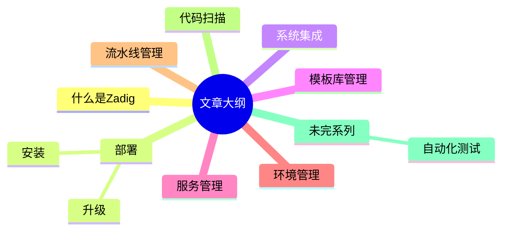

最近有朋友叫我出一个Zadig的使用教程，说实话，我并不知道该怎么来写，因为所有的东西在[官网](https://docs.koderover.com/zadig)都有，我本人也是通过学习[官网](https://docs.koderover.com/zadig)来进行落地实践的。

  

但是我这人太热情，压不住朋友的再三请求，所以就写一篇我在实际中用到的东西。

​  

本篇文章大纲如下：




  

# 什么是Zadig

相信有不少朋友已经听过Zadig，但是有更多的朋友还没有听过，或者说听过但是没仔细去了解过，这里我还是简单介绍一下什么是Zadig。

​  

Zadig是一个持续交付的平台，它集CI、CD、自动化测试于一身，致力于构建一个云原生开源的软件交付平台。

​  

使用Zadig，可以轻松的实现本地联调、微服务并行构建、集成测试与持续部署，开发可以更专注于业务开发、运维也可以更专注于稳定性维护。

  

# 部署

说了那么多，下面就进入正题，开始Zadig的使用之旅。

​  

## 安装

其实Zadig的安装参考官方文档的[安装篇](https://docs.koderover.com/zadig/v1.12.0/install/overview/)就行。但是为了保持文章的完整性，我这里简单介绍一下。

​  

下面是我的环境说明：

> Kubernetes：v1.18.8
> 
> Helm：v3.5.4
> 
> Linux：CentOS 7.9
> 
> PS：我这里是基于现有的Kubernetes，使用Helm进行安装部署。

  

### 安装MySQL

为什么要安装MySQL呢？

​  

使用Zadig默认的安装方式，安装的MySQL是8.+版本，而且有时候死活起不来（踩过坑，没找到起不来的原因），所以我不论是在生产使用还是在测试环境测试都是自己安装的MySQL 5.7的版本，当然，你们需要根据自己的实际情况进行选择。

​  

（1）添加MySQL的Helm repo

```shell
$ helm repo add stable https://charts.helm.sh/stable
```

  

（2）下载MySQL chart包到本地（我个人习惯，随君选择）

```shell
$ helm pull stable/mysql --version 1.6.9
```

  

（3）自定义value.yaml文件

```yaml
mysqlUser: root@'%'
mysqlPassword: Joker@Zadig123
persistence:
  enabled: true
  storageClass: "rbd"
  accessMode: ReadWriteOnce
  size: 50Gi
configurationFiles:
  mysql.cnf: |-
    [mysql]
    default-character-set=utf8
    [mysql.server]
    default-character-set=utf8
    [mysqld_safe]
    default-character-set=utf8
    [client]
    default-character-set=utf8
    [mysqld]
    character_set_server=utf8
    init_connect='SET NAMES utf8'
    max_connections=3000
    slow_query_log=ON
    slow_query_log_file=/tmp/mysql-slow.log
    long_query_time=1
    sql_mode=NO_UNSIGNED_SUBTRACTION,NO_ENGINE_SUBSTITUTION
    lower_case_table_names=1
```

  

（4）安装MySQL

```shell
$ kubectl create ns zadig
$ helm install mysql -n zadig -f my-vaule.yaml .
```

  

（5）安装完成过后查看MySQL安装情况

```shell
$ kubectl get all -n zadig | grep mysql
pod/mysql-6b64454fd9-nhlqd            2/2     Running   1          57d
service/mysql             LoadBalancer   10.233.7.155    192.168.100.81   3306:32703/TCP,9104:32514/TCP         57d
deployment.apps/mysql             1/1     1            1           57d
replicaset.apps/mysql-6b64454fd9             1         1         1       57d
```

  

### 安装Zadig

上面已经安装好了MySQL，下面就开始安装Zadig（其他的组件就用Zadig自带的，目前使用起来没发现任何问题）。

  

（1）添加Zadig Helm Chart

```shell
$ helm repo add koderover-chart https://koderover.tencentcloudcr.com/chartrepo/chart
```

  

（2）下载Zadig Chart包

我这里先下载v1.11.0版本，因为后续还准备了一个升级的过程。

```shell
$ helm pull koderover-chart/zadig --version 1.11.0
```

  

（3）自定义value.yaml文件，主要是修改mysql的配置

```yaml
tags:
  mysql: false
connections:
  mysql:
    host: mysql:3306
    auth:
      user: root
      password: Joker@Zadig123
dex:
  config:
    storage:
      type: mysql
      config:
        host: mysql
        port: 3306
        database: dex
        user: root
        password: Joker@Zadig123
        ssl:
          mode: "false"
```

  

（4）安装Zadig

官方指出可以使用域名或者IP访问，我这里采用的是域名。

```shell
$ export NAMESPACE=zadig
$ export DOMAIN=zadig.jokerbai.com

$ helm upgrade --install zadig . -f my-value.yaml --namespace ${NAMESPACE} --version=1.10.0 --set endpoint.FQDN=${DOMAIN}     --set global.extensions.extAuth.extauthzServerRef.namespace=${NAMESPACE}     --set "dex.config.staticClients[0].redirectURIs[0]=http://${DOMAIN}/api/v1/callback,dex.config.staticClients[0].id=zadig,dex.config.staticClients[0].name=zadig,dex.config.staticClients[0].secret=ZXhhbXBsZS1hcHAtc2VjcmV0"
```

  

（5）查看安装情况

```shell
$ kubectl get pod -n zadig 
NAME                              READY   STATUS    RESTARTS   AGE
aslan-5d6b86ccdf-st7w9            2/2     Running   0          10d
config-7d6654fb8-xcfmk            1/1     Running   0          10d
cron-67f77f54bc-fvrgp             2/2     Running   0          10d
dind-0                            1/1     Running   0          49d
discovery-68d76c5bf4-nrl5r        1/1     Running   0          57d
gateway-645958c96c-gnltp          1/1     Running   0          57d
gateway-proxy-5d6bcc677f-njvdk    1/1     Running   0          57d
gloo-7955b997b-br9m2              1/1     Running   0          57d
hub-server-7b5cc9bdb6-t6zkw       1/1     Running   0          10d
mysql-6b64454fd9-nhlqd            2/2     Running   1          57d
nsqlookup-0                       1/1     Running   0          57d
nsqlookup-1                       1/1     Running   0          57d
nsqlookup-2                       1/1     Running   0          57d
opa-69d5c669f6-s784f              1/1     Running   0          57d
picket-55685b94d9-czm7b           1/1     Running   0          10d
podexec-868c677548-mks74          1/1     Running   0          10d
policy-5c5bd995c8-pfxnp           1/1     Running   0          10d
resource-server-c87c4cddd-ptq45   1/1     Running   0          10d
user-77b5585554-n2cm4             1/1     Running   0          10d
warpdrive-55c46595d5-hvkc2        2/2     Running   0          10d
warpdrive-55c46595d5-mn9d8        2/2     Running   0          10d
zadig-dex-d9df5944f-vgdkc         1/1     Running   0          10d
zadig-minio-5c576d44c8-rnkmp      1/1     Running   0          57d
zadig-mongodb-6dfb6f676f-9v5rq    1/1     Running   0          57d
zadig-portal-69d8f946b8-wqrpz     1/1     Running   0          10d
```

  

然后可以根据域名http://zadig.jokerbai.com进行访问。


  

使用账号密码 `admin:zadig` 进行登录。

​  

## 升级

Zadig是非常活跃的项目，社区迭代是非常快的，而且功能会越来越多，体验越来越好，所以升级Zadig算是一个日常需求了。

​  

> PS：虽然Zadig每个版本的兼容性做的不错，但是在升级的时候不建议跨版本升级。

  

（1）下载新版本的zadig

```shell
$ helm pull koderover-chart/zadig --version 1.12.0
```

  

（2）自定义value.yaml

获取集群zadig配置信息

```shell
helm get values zadig -n zadig  > zadig.yaml
```

​  

修改zadig.yaml，添加自定义mysql配置

```yaml
USER-SUPPLIED VALUES:
tags:
  mysql: false
connections:
  mysql:
    host: mysql:3306
    auth:
      user: root
      password: Joker@Zadig123
dex:
  config:
    storage:
      type: mysql
      config:
        host: mysql
        port: 3306
        database: dex
        user: root
        password: Joker@Zadig123
        ssl:
          mode: "false"
    staticClients:
    - id: zadig
      name: zadig
      redirectURIs:
      - http://zadig.jokerbai.com/api/v1/callback
      secret: ZXhhbXBsZS1hcHAtc2VjcmV0
endpoint:
  FQDN: zadig.ustax.tech
global:
  extensions:
    extAuth:
      extauthzServerRef:
        namespace: zadig
```

  

（3）备份数据库

> 具体信息根据实际情况填写

1、备份mongo数据库

```shell
$ mongodump -h IP --port 端口 -u 用户名 -p 密码 -d 数据库 -o 文件存在路径
```

  

2、备份mysql数据库

```shell
$ mysqldump -h <HOST> -P <PORT> -u root -p user > user.sql
$ mysqldump -h <HOST> -P <PORT> -u root -p dex > dex.sql
```

  

（4）升级zadig

```shell
$ helm upgrade zadig -n zadig -f zadig.yaml .
```

  

升级后，查看Pod是否正常启动，然后使用浏览器登录看是否正常。

  

# 系统集成

集成的功能很丰富，可以集成代码源、账号系统、Jenkins、Jira等，但是并不是所有的都有用，选择自己需要的集成就行。


  

我这里也不会把全部的集成都写一遍，那样没有意义，不如直接看官方文档。我只写我用到的系统：代码源和账号系统。

​  

## 集成代码源

代码源的选择非常多，可以使用现成的saas平台，比如gitlab、gitee、github等，这些zadig都支持集成。由于我们公司是使用的自建的gitlab，所以这里只介绍gitlab的集成方法。

​  

（1）创建OAuth。

我这里创建的是组织类型的OAuth，也就是可以有全局的权限。


  

按图配置，如下：


> -   填写应用的名称
> -   回调地址请填写 http://[zadig.yours.com]/api/directory/codehosts/callback
> -   赋予权限 api 、read\_user 、read\_repository
> -   点击创建

  

创建完成之后，记住`Application ID`和`Secret`。

  

（2）在zadig上配置Gitlab集成


填入如下信息：

> -   代码源：此处选择 GitLab
> -   代码源标识：自定义，方便在 Zadig 系统中快速识别出该代码源，该信息在整个系统内唯一
> -   GitLab 服务 URL：GitLab 地址
> -   Application ID：步骤 3 应用创建成功后返回的 Application ID
> -   Secret：步骤 3 应用创建成功后返回的 Secret

  

待确认无误后，点击`前往授权`，会跳到Gitlab进行授权，点击`Authorize`即可。

  

到此，Gitlab集成完成。


  

## 集成账户系统

Zadig本身自带账户系统，但是在企业内部一般也会有自己的账户系统，比如LDAP，为了统一管理，这时候就需要集成这些账户系统。

​  

我这里不是集成的LDAP，而是集成的Gitlab，所以这里只介绍Gitlab的集成方法。

​  

（1）创建Gitlab OAuth


填入如下信息：

> -   填写应用的名称
> -   回调地址请填写 http://[zadig.yours.com]/api/directory/codehosts/callback
> -   赋予权限 read\_user 、openid
> -   点击创建

  

（2）在Zadig账户系统进行集成


  

Gitlab需要通过自定义的方式进行集成，相关配置需要通过YAML的方式进行自定义，如下：

```yaml
baseURL: http://gitlab.jokerbai.com    <Gitlab地址>
clientID: xxxxx    <Gitlan OAuth的Applicaton ID>
clientSecret: xxxxx  <Gitlab OAtuth的secret>
groups:
  - xxxx    <Gitlab组>
redirectURI: http://zadig.jokerbai.com/dex/callback  <Zadig回调地址>
useLoginAsID: false
```

> 自定义账户系统使用Dex实现，所以Gitlab等自定义账户系统的集成，可以参考Dex的文档（[https://dexidp.io/docs/connectors/gitlab/](https://dexidp.io/docs/connectors/gitlab/)）

  

信息填写完成过后，点击保存。

​  

（3）登录验证

退出当前账户，使用Gitlab账户进行登录。

​  

选择第三方登录，如下：


  

然后会跳到Gitlab登录界面，填写用户名密码，如果在当前浏览器已经登录了Gitlab，则会直接跳转到授权界面，如下：


  

点击`Authorize`过后，会回跳到Zadig用户界面。不过当前用户只是登录到Zadig，并没有任何权限，需要管理授权才能进行其他操作。

  

到此集成系统已经完成。

​  

# 模板库管理

Zadig提供模板管理，主要是YAML文件，Helm Chart，Dockerfile以及构建管理，这样提高了复用率，其他需要利用模板的使用直接导入即可。

​  

我主要用到了Helm Chart和构建管理。

## Helm Chart模板

Helm Chart的原始代码是保存在Gitlab的，所以在模板库这里只需要从Gitlab导入即可。

​  

按如下方式导入需要的模板即可。


  

根据需要添加模板库，比如我这里添加的有java、前端、python、go、php等模板。

  

## 构建模板

构建模板就是应用构建镜像的模板，有多少种应用，只要能复用，都能做成模板。比如我这里就做了前端，java以及go的模板。

​  

当然，`我的并不代表你能用，只能做参考`。

​  

### JAVA

我们java项目全都使用的gradle进行管理的，所以使用maven的就不适合我这套。


高级配置，定义缓存。


  

### 前端


  

### GO


  

是不是很简单？一切都那么简单。

  

### Dockerfile示例

从上面可以看到，我们所有的构建里都有Dockerfile，所以都需要自己定制自己的Dockerfile，我这里只是抛几个示例，仅供参考。

​  

#### JAVA

```dockerfile
FROM registry.cn-huhehaote.aliyuncs.com/jokerbai/openjdk8-openj9:alpine-slim

ARG NAME=gateway
ARG VERSION=0.0.1

ENV JVM_OPTS=""
ENV JVM_ARGS=""

# 设定时区
ENV TZ=Asia/Shanghai
RUN echo 'http://mirrors.aliyun.com/alpine/v3.11/main' > /etc/apk/repositories; \
    echo 'http://mirrors.aliyun.com/alpine/v3.11/community' >>/etc/apk/repositories; \
    set -eux; \
    apk add --no-cache --update fontconfig ttf-dejavu; \
    apk add --no-cache --update tzdata; \
    ln -snf /usr/share/zoneinfo/$TZ /etc/localtime; \
    echo $TZ > /etc/timezone; \

# 添加 Arthas Toolkit
COPY --from=registry.cn-huhehaote.aliyuncs.com/jokerbai/arthas:latest /opt/arthas /opt/arthas
# 添加 Skywalking Agent
COPY --from=registry.cn-huhehaote.aliyuncs.com/jokerbai/skywalking-agent-sidecar:8.1.0-es7 /usr/skywalking/agent /opt/skywalking/agent

VOLUME ["/opt"]
# ADD ${NAME}-bootstrap/build/libs/${NAME}-bootstrap-${VERSION}.jar /opt/app.jar
ADD build/libs/${NAME}-${VERSION}-SNAPSHOT.jar /opt/app.jar
ENTRYPOINT ["sh", "-c", "java $JVM_OPTS $JVM_ARGS -jar /opt/app.jar"]

EXPOSE 80

```

#### GO

```dockerfile
FROM golang:1.17.5 AS build-env
ENV GOPROXY https://goproxy.cn
ADD . /go/src/app
WORKDIR /go/src/app
RUN go mod tidy
RUN cd cmd && GOOS=linux GOARCH=amd64 go build -v -o /go/src/app/app-server /go/src/app/cmd/main.go

FROM registry.cn-zhangjiakou.aliyuncs.com/jokerbai/ubuntu:22.04
ENV TZ=Asia/Shanghai
COPY --from=build-env /go/src/app/app-server /opt/app-server
WORKDIR /opt
EXPOSE 80
CMD [ "./app-server" ]

```

#### 前端

```dockerfile
FROM nginx:alpine
ADD nginx.conf /etc/nginx/conf.d/default.conf
ADD dist/ /usr/share/nginx/html
```

  

> PS：我的不一定适合你，谨慎使用。

  

# 服务管理

该准备的都准备完了，下面就开始真正的创建应用、发布应用以及流水线等管理了。

​  

（1）首先，需要我们创建项目，如下：


  

（2）新增服务

`点击服务--> 从模板库创建`


按着需要填写信息，需要自定义的value.yaml，可以到高级部分定制。

  

（3）添加构建

服务已经添加好了，下一步就是为服务添加构建了。


  

我们选择使用模板进行创建，然后关联到对应的服务和代码即可。

  

# 环境管理

服务准备好了，构建也添加了，下一步就该把服务部署到对应的环境了。

​  

Zadig默认会创建DEV和QA环境，并且会生成对应的Namespace，如果是添加已有的Namespace，就需要自己新建环境了。

​  

## 添加集群

云原生是趋势，而以Kubernetes为代表技术的使用也是非常多的。

​  

我的应用就是部署在各种不同的Kubernetes集群中，所以首先我们要将自己需要的集群添加到Zadig上。

​  

> 提示：Zadig所添加的集群要能访问到Zadig。换句话说，如果你Zadig部署在内网，集群在外网，集群访问Zadig无法访问，那你是添加不成功的。也期待Zadig开源社区能提供Agent和Kubeconfig多种集群接入方式。

  

选择集群->新建


  

点击保存过后，会生成对应的Agent接入方式。


  

复制上面的命令，到对应的集群上执行即可。

​  

执行完成后，可以在Agent集群，看到对应的Pod是否正常。

```shell
$ kubectl get po -n koderover-agent 
NAME                                          READY   STATUS    RESTARTS   AGE
dind-0                                        1/1     Running   0          23d
koderover-agent-node-agent-54dcb7456d-dz5r9   1/1     Running   0          10d
resource-server-695d6f9454-nqtbm              1/1     Running   0          10d
```

  

待所有Pod都正常后，在Zadig上就能看到接入状态了，如下：


  

## 添加应用

环境已经准备好了，下面就来添加应用了。

​  

找到对应的环境，选择添加服务。


  

选择需要添加的应用，可以同时选择多个，然后配置value。


  

配置完成过后，点击确定，就可以再环境中看到对应的应用了。


  

我这里应用为红色的那个就是刚加入的，因为镜像问题导致应用并没有起来。

  

## 其他功能

环境管理还有其他功能，比如说重启、查看日志、进入Pod等。

​  

点击如图部分，就可以进行重启Pod操作。


  

如果需要进入Pod或者查看日志，就需要先点击对应的应用，进入之后，就可以看到对应的按钮了，如下：


  

# 流水线管理

上面添加了应用，但是应用没有起来，这就需要我们重新走流水线，然应用正常了。

​  

## 新建工作流

选择工作流，然后选择新建工作流。


-   填写工作流名称
-   制定环境，这样工作流就和环境绑定
-   是否选择并发运行看实际情况

​  

然后点击保存即可。

  

## 运行流水线

工作流创建好了过后，接下来就可以直接运行了，不需要再额外的配置流水线步骤。

​  

进入刚创建的工作流，选择执行，然后选择对应的应用，填写具体的信息，如下：


  

确定信息无误，就可以启动任务了。


  

可以看到工作流的步骤只有构建和部署，而且需要这两步骤都OK之后，整个工作流才算完成。

  

我们可以点击具体的服务看具体的构建信息，方便排错。


  

待两个步骤都完成，整个流水线也完成了。


  

而且可以进环境，看到具体的应用也OK了。


  

## 增加消息通知

有时候点击发布流水线过后，不会一直盯着发布过程，而是会转头去做别的事，比如摸鱼。

​  

这时候就需要一个流水线消息通知，以便在发布成功或失败都能及时告知我们。

​  

由于我们公司使用的钉钉作为平时工作交流的平台，所以我这里接入的是钉钉消息通知。

​  

（1）首先创建钉钉机器人

这其实没什么好说的，需要注意的是在创建的适合需要制定“`工作流`”关键字，这样才能确保正常收到消息。


然后找到工作流，进入其中并点击配置。


  

选择通知-->添加配置


  

根据需要进行配置，完成过后保存即可。


  

然后我们再进行构建的时候就能收到消息通知了。


  

# 代码扫描

上面基本完成，而且也足够用了。不过很多朋友在原有的CICD流程中都有加入代码扫描，Zadig也是集广大群众的爱好，在`1.12.0`版本中加入了代码扫描。

​  

不过使用代码扫描，需要自己安装代码扫描工具Sonarqube。

​  

我这里附一点简单的安装步骤。

## 安装Sonarqube

（1）添加Repo

```shell
$ helm repo add bitnami https://charts.bitnami.com/bitnami
```

​  

（2）下载sonarqube Helm Chart

```shell
$ helm pull bitnami/sonarqube
```

  

（3）安装sonarqube，如果需要PG持久化的，更改value.yaml即可。

```shell
$ helm install sonarqube -n zadig .
```

  

检查sonar是否安装成功。

```shell
$ kubectl get all -n zadig | grep sonar
pod/sonarqube-5c674b5db6-ndvk8        1/1     Running   0          8d
pod/sonarqube-postgresql-0            1/1     Running   0          10d
service/sonarqube                 ClusterIP      192.168.71.185    <none>          80/TCP,9001/TCP                       10d
service/sonarqube-postgresql      ClusterIP      192.168.142.35    <none>          5432/TCP                              10d
service/sonarqube-postgresql-hl   ClusterIP      None              <none>          5432/TCP                              10d
deployment.apps/sonarqube         1/1     1            1           10d
replicaset.apps/sonarqube-5c674b5db6         1         1         1       10d
statefulset.apps/sonarqube-postgresql   1/1     10d
```

  

## 集成sonarqube

（1）首先在sonarqube上创建Token


  

直接生成即可，不过要记住Token。

​  

（2）在Zadig上集成


  

在Sonar集成栏目填写具体的sonar地址和刚才生成的Token，保存即可。

​  

## 进行代码扫描

进入项目中，选择代码扫描，新增代码扫描。


  

新增代码和参数配置，如下：


  

然后点击执行，即可进行代码扫描。


  

扫描完成过后，就可以在sonarqube上查看扫描结果，进行代码质量管理。


  

# 最后

上面是我现在所使用的Zadig的所有功能，其中还有自动化测试是一个比较不错的功能，但是还需要测试同学配合才能完成最终的轮转，目前还没有这个精力来做这些事情，不过，我们的愿景是希望通过Zadig来完成开发、测试、运维闭环。

​  

除此之外，Zadig还提供了一些能效面板，方便我们查看和审查。


  

# 参考

-   [https://docs.koderover.com/zadig](https://docs.koderover.com/zadig)
-   [https://dexidp.io/docs/connectors/gitlab/](https://dexidp.io/docs/connectors/gitlab/)